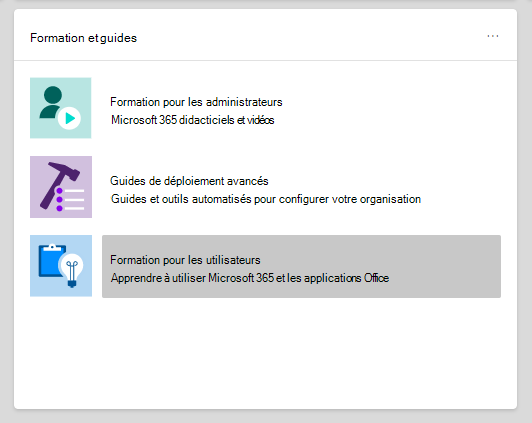
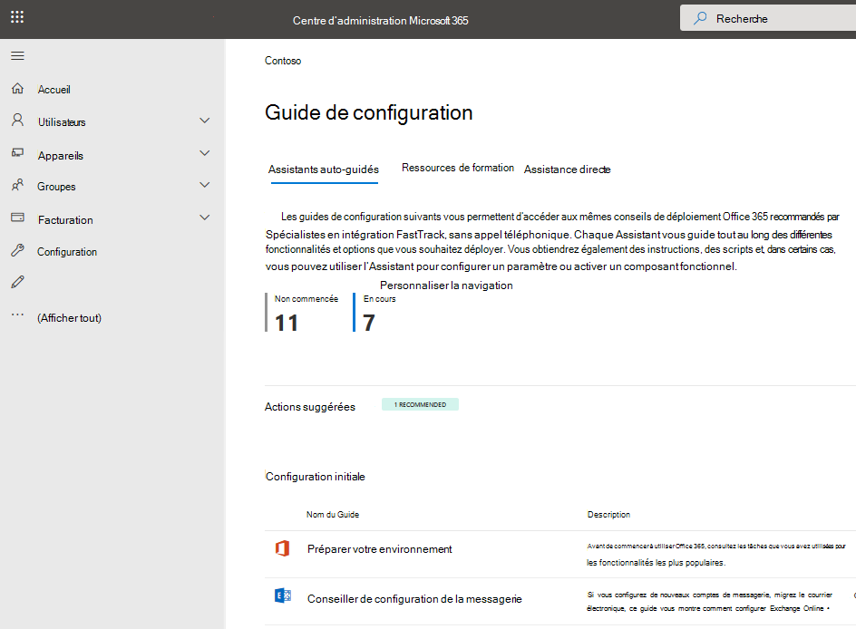

# Guides de configuration pour les services Microsoft 365 et Office 365

Microsoft 365 guides Office 365 d’installation vous donnent des conseils et des ressources personnalisés pour la planification et le déploiement de votre client, de vos applications et de vos services. Ces guides sont créés à l’aide des mêmes meilleures pratiques que les spécialistes de l’intégration [Microsoft 365 FastTrack](https://www.microsoft.com/fasttrack/microsoft-365) partagent dans des interactions individuelles et ils sont disponibles pour tous les administrateurs au sein du Centre d'administration Microsoft 365. Ils fournissent des informations sur la configuration du produit, l’activation des fonctionnalités de sécurité, le déploiement d’outils de collaboration et la mise à disposition de scripts pour accélérer les déploiements avancés.

> [!NOTE]
> Vous devez avoir un rôle d’administrateur tel que Lecteur global pour accéder aux guides Microsoft 365 configuration. Seuls les administrateurs ayant le rôle Administrateur général peuvent utiliser les guides pour modifier les paramètres dans le client.

## Comment accéder aux guides d’installation dans le Centre d'administration Microsoft 365

Les guides d’installation sont accessibles à partir [de](https://aka.ms/setupguidance) la page d’aide à l’installation du Centre d'administration Microsoft 365. Vous pouvez suivre l’état de votre progression et revenir à tout moment pour effectuer un guide. Pour accéder à la page **de conseils d’installation** :

1. Dans la [Centre d'administration Microsoft 365,](https://admin.microsoft.com/)allez à la page **d’accueil.**

2. Recherchez la **carte de & de formation.**

   

3. Sélectionnez **des guides pas à pas.**

   

## Guides pour la configuration initiale

### Préparer votre environnement

Le [guide Préparer votre environnement](https://aka.ms/prepareyourenvironment) vous aide à préparer l’environnement de votre organisation pour Microsoft 365 et Office 365 services. Quels que soient vos objectifs, vous devez effectuer certaines tâches pour garantir un déploiement réussi. Pour éviter les erreurs lors de la préparation de votre environnement, des instructions détaillées vous permettent de connecter votre domaine, d’ajouter des utilisateurs, d’attribuer des licences, de configurer le courrier électronique avec Exchange Online et d’installer ou de déployer des applications Office.

### Guide de configuration de la messagerie

Le [guide de configuration de](https://aka.ms/office365setup) la messagerie vous fournit les instructions pas à pas nécessaires pour configurer Exchange Online pour votre organisation. Ces conseils incluent la configuration de nouveaux comptes de messagerie, la migration du courrier électronique et la configuration de la protection de la messagerie. Pour une configuration réussie de la messagerie, utilisez ce conseiller et vous recevrez la méthode de migration recommandée en fonction du système de messagerie actuel de votre organisation, du nombre de boîtes aux lettres migrées et de la façon dont vous souhaitez gérer les utilisateurs et leur accès.

### Migrer des contacts gmail et des éléments de calendrier

Lorsque vous migrez la boîte aux lettres d’un utilisateur Gmail vers Microsoft 365, les messages électroniques sont migrés, mais pas les contacts et les éléments de calendrier. Le conseiller de calendrier et [les contacts Gmail](https://aka.ms/gmailcontactscalendar) fournissent des étapes pour importer des contacts Google et des éléments de calendrier Google dans Microsoft 365 à l’aide de méthodes d’importation et d’exportation avec Outlook.com, le client Outlook ou PowerShell.

### Microsoft 365 de déploiement

Le [conseiller Microsoft 365 déploiement](https://aka.ms/microsoft365setupguide) vous fournit des conseils lors de la configuration des outils de productivité, des stratégies de sécurité et des fonctionnalités de gestion des appareils. Avec un Microsoft 365 Business Premium ou Microsoft 365 abonnement entreprise, vous pouvez utiliser ce conseiller pour configurer et configurer les appareils de votre organisation.

Vous recevrez des conseils et un accès aux ressources pour activer vos services cloud, mettre à jour les appareils vers la dernière version prise en charge de Windows 10 et joindre des appareils à Azure Active Directory (Azure AD), le tout dans un emplacement central.

### Guide de configuration du travail à distance

Le [guide de](https://aka.ms/remoteworksetup) configuration du travail à distance fournit aux organisations les conseils et les ressources nécessaires pour s’assurer que vos utilisateurs peuvent travailler à distance, que vos données sont sécurisées et que les informations d’identification des utilisateurs sont sécurisées.

Vous recevrez des conseils pour optimiser le trafic des appareils des travailleurs à distance vers les ressources Microsoft 365 dans le cloud et le réseau de votre organisation, ce qui réduit la contrainte sur votre infrastructure VPN d’accès à distance.

### guide Windows configuration de virtual desktop

Windows Virtual Desktop est un service complet de virtualisation de bureau et d’application en cours d’exécution dans le cloud. Il s’agit de la seule infrastructure VDI (Virtual Desktop Infrastructure) qui offre une gestion simplifiée, des Windows 10 multisesses, des optimisations pour Microsoft 365 Apps et la prise en charge des environnements des services Bureau à distance (RDS). Déployez et faites passer vos Windows et applications à Azure en minutes et obtenez des fonctionnalités intégrées de sécurité et de conformité.

Le [guide Windows virtual desktop](https://aka.ms/wvdsetupguide) fournit aux administrateurs des ressources de planification, ainsi que les conditions préalables au déploiement, aux instructions de configuration et à d’autres ressources.

### Microsoft Edge de configuration

Microsoft Edge a été entièrement reconstruit pour vous apporter des performances et des compatibilités de premier niveau, la sécurité et la confidentialité que vous méritez, ainsi que de nouvelles fonctionnalités conçues pour vous donner le meilleur du web.

Le guide d’installation de [Microsoft Edge](https://aka.ms/edgeadvisor) vous aidera à configurer la découverte de sites Enterprise pour voir quels sites accédés dans votre organisation devront peut-être utiliser le mode IE, examiner et configurer des fonctionnalités de sécurité importantes, configurer des stratégies de confidentialité et des stratégies de conformité pour répondre aux besoins de votre organisation et gérer l’accès web sur vos appareils. Vous pouvez télécharger des Microsoft Edge sur des appareils individuels, ou nous allons vous montrer comment déployer plusieurs utilisateurs dans votre organisation avec la stratégie de groupe, Configuration Manager ou Microsoft Intune.

### Configurer le mode IE pour Microsoft Edge

Si vous avez déjà déployé Microsoft Edge et que vous souhaitez uniquement configurer le mode [IE,](https://aka.ms/configureiemode) le guide Configurer le mode IE pour Microsoft Edge vous donne des scripts pour automatiser la configuration de la découverte de sites Enterprise. Vous recevrez également des recommandations en mode IE à partir d’un outil basé sur le cloud qui vous aidera à créer une liste des sites en mode Enterprise à déployer pour vos utilisateurs.

### Recherche Microsoft de configuration

Recherche Microsoft aide votre organisation à trouver ce dont elle a besoin pour effectuer ce sur quoi elle travaille. Qu’il s’agit de rechercher des personnes, des fichiers, des organigrammes, des sites ou des réponses à des questions courantes, votre organisation peut utiliser Recherche Microsoft tout au long de leur journée de travail pour obtenir des réponses.

Le [guide Recherche Microsoft](https://aka.ms/MicrosoftSearchSetup) de configuration vous permet de configurer Recherche Microsoft si vous souhaitez le piloter pour un groupe d’utilisateurs ou le déployer à tous les membres de votre organisation. Vous allez affecter des administrateurs de recherche et des éditeurs de recherche, puis personnaliser l’expérience de recherche pour vos utilisateurs avec des réponses et d’autres options, comme l’ajout de l’extension Bing à Chrome ou la définition de Bing comme moteur de recherche par défaut.

### Guide de configuration de la cogestion d’Intune Configuration Manager

Utilisez le guide de configuration de [la cogestion d’Intune Configuration Manager](https://aka.ms/comanagementsetup) pour les périphériques clients Configuration Manager existants et les nouveaux appareils basés sur Internet que votre organisation souhaite co-gérer avec Microsoft Intune et Configuration Manager. Ce guide de déploiement de cogestion vous permet de gérer les appareils Windows 10 et d’ajouter de nouvelles fonctionnalités aux appareils de votre organisation, tout en profitant des avantages des deux solutions.

## Guides d’authentification et d’accès

### Azure AD de configuration

Le [guide Azure AD de configuration](https://aka.ms/aadpguidance) fournit des informations pour vous assurer que votre organisation dispose d’une base de sécurité solide. Dans ce guide, vous allez configurer les fonctionnalités initiales, telles que le contrôle d’accès basé sur un rôle Azure (Azure RBAC) pour les administrateurs, les Azure AD Connecter pour votre annuaire local et Azure AD Connecter Health, afin de pouvoir surveiller l’état de votre identité hybride lors de synchronisations automatisées.

Il inclut également des informations essentielles sur l’activation des réinitialisations de mot de passe en libre-service, l’accès conditionnel et l' sign-on tiers intégré, y compris la protection avancée des identités facultative et l’automatisation de la mise en service des utilisateurs.

### Synchronisez les utilisateurs à partir de votre Windows Server Active Directory

Le [guide Synchroniser les utilisateurs de Windows Server Active Directory](https://aka.ms/directorysyncsetup) vous guide tout au long de l’personnalisation de la synchronisation d’annuaires. La synchronisation d’annuaires réunit vos identités locales et cloud pour faciliter l’accès et la gestion. Déverrouillez les nouvelles fonctionnalités, telles que l’personnalisation unique, les options en libre-service, la mise en service automatique des comptes, les contrôles d’accès conditionnel et les stratégies de conformité. Ces fonctionnalités garantissent que vos utilisateurs ont accès aux ressources dont ils ont besoin de n’importe où.

### Planifier votre déploiement sans mot de passe

Mise à niveau vers une autre approche de la sign-in qui permet aux utilisateurs d’accéder à leurs appareils en toute sécurité avec l’une des méthodes d’authentification sans mot de passe suivantes :

- Windows Hello Entreprise
- L’application Microsoft Authenticator
- Clés de sécurité

Utilisez le [guide de déploiement sans](https://aka.ms/passwordlesssetup) mot de passe pour découvrir les meilleures méthodes d’authentification sans mot de passe à utiliser et recevoir des conseils sur la façon de les déployer.

### Planifier votre déploiement de réinitialisation de mot de passe en libre-service (SSPR)

Donnez aux utilisateurs la possibilité de modifier ou de réinitialiser leur mot de passe indépendamment, si leur compte est verrouillé ou qu’ils oublient leur mot de passe sans avoir à contacter un ingénieur du helpdesk.

Utilisez le guide de déploiement de la réinitialisation de mot de passe en [libre-service](https://aka.ms/SSPRSetupGuide) pour recevoir des articles et instructions pertinents pour configurer les options de portail Azure appropriées pour vous aider à déployer SSPR dans votre environnement.

### Conseiller en déploiement des services AD FS (Active Directory Federation Services)

Le conseiller de déploiement [AD FS](https://aka.ms/adfsguidance) vous fournit des instructions pas à pas sur le déploiement d’une infrastructure AD FS locale qui authentifiera les utilisateurs pour les services Microsoft 365 et Office 365. Grâce à ce guide, votre organisation peut passer en revue les composants et les exigences AD FS, acquérir et installer les certificats SSL nécessaires au déploiement et installer un serveur proxy d’application web requis.

## Guides pour la sécurité et la conformité

### Microsoft Intune de configuration

Configurer Microsoft Intune pour gérer les appareils de votre organisation. Pour un contrôle total des appareils d’entreprise, vous utiliserez les fonctionnalités de gestion des périphériques mobiles (MDM) d’Intune. Pour gérer les données de votre organisation sur des appareils partagés et personnels, vous pouvez utiliser les fonctionnalités de gestion des applications mobiles (MAM) d’Intune.

Avec le [guide Microsoft Intune](https://aka.ms/intunesetupguide)configuration, vous allez configurer des stratégies de conformité des appareils et des applications, affecter des stratégies de protection des applications et surveiller l’état de la protection des appareils et des applications.

### Guide de configuration de Microsoft Defender for Endpoint

Le [guide d’installation](https://aka.ms/mdatpsetup) de Microsoft Defender for Endpoint fournit des instructions qui aideront votre réseau d’entreprise à prévenir, détecter, examiner et répondre aux menaces avancées. Faites une évaluation éclairée de la vulnérabilité de votre organisation et déterminez le package de déploiement et les méthodes de configuration les plus pratiques.

> [!NOTE]
> Une licence en volume Microsoft est requise pour Microsoft Defender pour le point de terminaison.

### Exchange Online Protection de configuration

Microsoft Exchange Online Protection (EOP) est un service de filtrage du courrier électronique basé sur le cloud pour la protection contre le courrier indésirable et les programmes malveillants, avec des fonctionnalités pour protéger votre organisation contre les violations de stratégie de messagerie.

Utilisez le [guide](https://aka.ms/EOPguidance) de configuration Exchange Online Protection pour configurer EOP en sélectionnant lequel des trois scénarios de déploiement de boîtes aux lettres sur &mdash; site, hybrides (mélange de boîtes aux lettres sur site et cloud) ou toutes les boîtes aux lettres cloud adaptées à votre &mdash; organisation. Le guide fournit des informations et des ressources pour configurer et examiner les licences de vos utilisateurs, attribuer des autorisations dans le Centre d'administration Microsoft 365 et configurer les stratégies anti-programme malveillant et de courrier indésirable de votre organisation dans le Centre de sécurité & conformité.

### Guide de configuration Microsoft Defender pour Office 365

Le guide de configuration de [Microsoft Defender pour Office 365](https://aka.ms/oatpsetup) protège votre organisation contre les menaces malveillantes que votre environnement peut traverser par le biais de messages électroniques, de liens et d’outils de collaboration tiers. Ce guide vous fournit les ressources et les informations nécessaires pour vous aider à préparer et identifier defender pour Office 365 pour répondre aux besoins de votre organisation.

### Guide de configuration de Microsoft Defender for Identity

Le [guide de configuration de Microsoft Defender pour l’identité](https://aka.ms/DefenderforIdentitysetup) fournit des conseils de configuration de solution de sécurité pour identifier, détecter et examiner les menaces avancées qui peuvent compromettre les identités des utilisateurs. Il s’agit notamment de la détection d’activités suspectes d’utilisateurs et d’actions internes malveillantes dirigées vers votre organisation. Vous allez créer une instance de Defender pour l’identité, vous connecter à Active Directory de votre organisation, puis configurer des capteurs, des alertes, des notifications et configurer vos préférences de portail uniques.

### Protection des données Microsoft de configuration

Obtenez une vue d’ensemble des fonctionnalités que vous pouvez appliquer à votre stratégie de protection des informations afin de vous assurer que vos informations sensibles sont protégées. Utilisez une approche de cycle de vie à quatre étapes consistant à découvrir, à classer, à protéger, puis à contrôler les informations sensibles. Le guide de [Configuration de la protection des données Microsoft](https://aka.ms/mipsetupguide) fournit des conseils sur l’exécution de chacune de ces étapes.

### Guide de configuration de la gouvernance des informations Microsoft

Le guide de configuration de la gouvernance des informations [Microsoft](https://aka.ms/migsetupguide) vous fournit les informations dont vous aurez besoin pour configurer et gérer la stratégie de gouvernance de votre organisation, afin de vous assurer que vos données sont classées et gérées conformément aux instructions de cycle de vie spécifiques que vous avez définies. Grâce à ce guide, vous allez découvrir comment créer, appliquer automatiquement ou publier des étiquettes, des stratégies d’étiquette et des stratégies de rétention qui sont appliquées au contenu réutilisable et aux enregistrements de conformité de votre organisation. Vous obtenez également des informations sur l’importation de fichiers CSV avec un plan de fichiers pour les scénarios en bloc ou pour les appliquer manuellement à des documents individuels.

### Guide de configuration de Microsoft Defender pour les applications cloud

Le guide de configuration de Microsoft Defender pour les applications cloud fournit des [instructions](https://aka.ms/cloudappsecuritysetup) de déploiement et de gestion faciles à suivre pour configurer votre solution de découverte cloud. Avec la découverte cloud, vous intégrerez vos applications de sécurité pris en charge, puis vous utiliserez les journaux de trafic pour découvrir et analyser dynamiquement les applications cloud utilisées par votre organisation. Vous allez également configurer des fonctionnalités disponibles par le biais de la solution Defender for Cloud Apps, notamment des stratégies de détection des menaces pour identifier l’utilisation à risque élevé, des stratégies de protection des informations pour définir l’accès et des contrôles de session en temps réel pour surveiller l’activité. Grâce à ces fonctionnalités, votre environnement obtient une meilleure visibilité, un contrôle accru sur le déplacement des données et des analyses pour identifier et lutter contre les cybermenaces dans tous vos services cloud Microsoft et tiers.

## Guides de collaboration

### Créer l’expérience de vos employés

Transformer le fonctionnement de vos employés avec le tableau [de bord Expérience des employés.](https://aka.ms/EmployeeExperienceDashboard) Pour un travail d’équipe transparent, utilisez Microsoft 365 pour créer des équipes productives et alignées, et maintenir les employés impliqués dans la direction et le reste de l’organisation. Aidez vos employés à être efficaces dans toutes les activités professionnelles. Ces guides fournissent des instructions sur la façon d’utiliser SharePoint, Teams et Yammer pour créer une collaboration au sein de votre organisation afin d’améliorer la productivité.

### Microsoft 365 Apps de déploiement

Le [conseiller](https://aka.ms/OPPquickstartguide) de déploiement Microsoft 365 Apps vous permet d’obtenir les appareils de vos utilisateurs exécutant la dernière version des produits Office tels que Word, Excel, PowerPoint et OneNote. Vous recevrez des conseils sur les différentes méthodes de déploiement qui incluent des options d’installation autonome faciles pour les déploiements d’entreprise à l’aide d’outils de gestion. Les instructions vous aideront à évaluer votre environnement, à déterminer vos besoins de déploiement spécifiques et à implémenter les outils de support nécessaires pour garantir une installation réussie.

### Guide de configuration des applications mobiles

Le [guide de](https://aka.ms/officeappguidance) configuration des applications mobiles fournit des instructions pour le téléchargement et l’installation d’applications Office sur vos appareils mobiles Windows, iOS et Android. Ce guide vous fournit des informations pas à pas pour télécharger et installer des applications Microsoft 365 et Office 365 sur votre téléphone et tablette.

### Microsoft Teams de configuration

Le [guide](https://aka.ms/teamsguidance) de configuration Microsoft Teams fournit à votre organisation des conseils pour configurer des espaces de travail d’équipe qui hébergent des conversations en temps réel par messagerie, appels et réunions audio ou vidéo pour les communications d’équipe et privées. Utilisez les outils de ce guide pour configurer l’accès invité, définir qui peut créer des équipes et ajouter des membres d’équipe à partir d’un fichier .csv, sans avoir à ouvrir une session PowerShell. Vous obtenez également les meilleures pratiques pour déterminer les exigences réseau de votre organisation et garantir un déploiement Teams réussi.

### Microsoft Teams pour l'éducation de configuration

Le [guide Microsoft Teams pour l'éducation](https://aka.ms/teamsedusetup) de configuration fournit à votre établissement scolaire des conseils qui rassemblent des salles de classe, des conversations, des réunions, des fichiers et des applications collaboratives au même endroit. Le guide fournit également des instructions pour préparer, planifier et configurer Teams pour votre établissement scolaire. Une fois votre déploiement terminé, utilisez les outils intégrés pour configurer les personnes qui peuvent créer des équipes, et éventuellement créer des équipes vous-même tout en complétant les membres avec un fichier .csv.

### Intégrer des applications Microsoft LTI à votre système de gestion des formations

Pour que les enseignants fonctionnent efficacement et que les étudiants restent organisés, ils ont besoin d’une sign-on unique pour collaborer avec tous leurs supports d’apprentissage, devoirs et applications à portée de main. Les applications Microsoft Learning Tools Interoperability (LTI) apportent les meilleurs outils Microsoft directement dans votre système de gestion de l’apprentissage (LMS), afin que les étudiants et les enseignants peuvent se concentrer sur l’étude, sans trouver de fichiers ni créer d’outils.

Si vous êtes un administrateur d’un LMS et que vous souhaitez accéder aux outils Microsoft directement à partir de votre LMS, utilisez nos applications Intégrer des applications Microsoft LTI avec vos applications [LMS](https://aka.ms/lmsintegrationguide) Intégrer les applications Microsoft LTI à votre guide LMS pour commencer. Ces outils incluent actuellement Microsoft Teams classes et Microsoft Teams réunions.

### SharePoint de configuration

Le guide d’installation de [SharePoint](https://aka.ms/spoguidance) vous aide à configurer votre stockage de documents SharePoint et la gestion de contenu, à créer des sites, à configurer le partage externe, à migrer des données et à configurer des paramètres avancés, et à susciter l’engagement des utilisateurs et la communication au sein de votre organisation. Vous allez suivre les étapes de configuration de vos stratégies d’autorisation de partage de contenu, choisir vos outils de synchronisation de migration et activer les paramètres de sécurité pour votre environnement SharePoint de migration.

### OneDrive de configuration

Utilisez le [guide OneDrive de configuration](https://aka.ms/ODfBquickstartguide) pour commencer à utiliser OneDrive de stockage de fichiers, de partage, de collaboration et de synchronisation. OneDrive fournit un emplacement central où les utilisateurs peuvent synchroniser leurs fichiers Microsoft 365 Apps, configurer le partage externe, migrer des données utilisateur et configurer des paramètres avancés de sécurité et d’accès aux appareils. Le guide OneDrive de configuration peut être déployé à l’aide d’un abonnement OneDrive ou d’un plan OneDrive autonome.

### Yammer de déploiement

Connecter et impliquer au sein de votre organisation avec Yammer. Le [Yammer de déploiement](https://aka.ms/yammerdeploymentguide) local prépare votre réseau Yammer en ajoutant des domaines, en définissant des administrateurs et en combinant Yammer réseaux. Vous recevrez des conseils pour déployer Yammer, personnaliser l’apparence, configurer la sécurité et la conformité, et affiner les paramètres.

## Guides avancés

### Mise à niveau sur place avec Configuration Manager

Utilisez le [guide de mise](https://aka.ms/win10upgradedemo) à niveau sur place avec Configuration Manager lors de la mise à niveau Windows 7 et Windows 8.1 vers la dernière version de Windows 10. Vous utiliserez le script fourni pour vérifier les conditions préalables et configurer automatiquement une mise à niveau sur place.

### Déployer des Office à vos utilisateurs

Déployez Office applications à partir du cloud avec la possibilité de personnaliser votre installation à l’aide de Office Deployment Tool. Le [guide Déployer Office](https://aka.ms/proplusodt) à vos utilisateurs vous aide à créer une configuration Office personnalisée avec des paramètres avancés, ou vous pouvez utiliser une configuration recommandée pré-conçue. Que vos utilisateurs effectuent une installation autonome ou que vous déployiez vos utilisateurs individuellement ou en bloc, ce guide avancé vous fournit des instructions pas à pas pour fournir aux utilisateurs une installation Office adaptée à votre organisation.

### Déployer des Office aux utilisateurs distants

Maintenant que travailler à distance est la norme, les utilisateurs doivent recevoir les paramètres Office de votre organisation lorsqu’ils ne sont pas connectés à votre réseau interne ou lorsqu’ils utilisent leurs propres appareils.

Utilisez le guide déployer [Office](https://aka.ms/officeremoteinstall) pour les utilisateurs distants pour créer une installation Office personnalisée, puis envoyez aux utilisateurs un script PowerShell généré qui installera les Office de façon transparente avec votre configuration.

### Déployer et mettre à jour des Microsoft 365 Apps avec Configuration Manager

Pour les organisations qui utilisent Configuration Manager, vous pouvez utiliser la Microsoft 365 Apps Déployer et mettre à jour avec [Configuration Manager Advisor](https://aka.ms/oppinstall) pour générer un script qui configurera automatiquement votre déploiement Microsoft 365 Apps à l’aide des meilleures pratiques recommandées par les ingénieurs FastTrack. Utilisez ce guide pour créer vos groupes de déploiement, personnaliser vos applications et fonctionnalités Office, configurer des installations dynamiques ou légères, puis exécuter le script pour créer les applications, les règles de déploiement automatique et les collections d’appareils dont vous avez besoin pour cibler votre déploiement.

### Guide de configuration de la cogestion d’Intune Configuration Manager

Utilisez le guide de configuration de [la cogestion d’Intune Configuration Manager](https://aka.ms/comanagementsetup) pour configurer les périphériques clients Configuration Manager existants et les nouveaux appareils basés sur Internet que votre organisation souhaite co-gérer à la fois avec Microsoft Intune et Configuration Manager. La cogestion vous permet de gérer les appareils Windows 10 et d’ajouter de nouvelles fonctionnalités aux appareils de votre organisation, tout en profitant des avantages des deux solutions.
