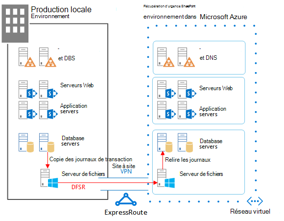

# <a name="sharepoint-server-2013-disaster-recovery-in-microsoft-azure"></a>Récupération d'urgence SharePoint Server 2013 dans Microsoft Azure

 À l’aide d’Azure, vous pouvez créer un environnement de récupération d’urgence pour votre batterie de serveurs SharePoint locale. Cet article décrit comment concevoir et implémenter cette solution.

 **Regardez la vidéo de présentation de la récupération d’urgence SharePoint Server 2013**
> [!VIDEO https://www.microsoft.com/videoplayer/embed/1b73ec8f-29bd-44eb-aa3a-f7932784bfd9?autoplay=false]

 En cas d’incident dans votre environnement local SharePoint, votre priorité est de remettre rapidement le système en route. La récupération d’urgence avec SharePoint est plus rapide et plus facile lorsque vous disposez d’un environnement de sauvegarde déjà en cours d’exécution dans Microsoft Azure. Cette vidéo décrit les principaux concepts d’un environnement de basculement semi-automatique SharePoint et complète toutes les explications contenues dans cet article.

Utilisez cet article avec le modèle de solution suivant : **Récupération d'urgence SharePoint dans Microsoft Azure**.

[](https://go.microsoft.com/fwlink/p/?LinkId=392555)

 [PDF](https://go.microsoft.com/fwlink/p/?LinkId=392555) | [Visio](https://go.microsoft.com/fwlink/p/?LinkId=392554)

## <a name="use-azure-infrastructure-services-for-disaster-recovery"></a>Utilisation des services d’infrastructure Azure pour la récupération d’urgence

De nombreuses organisations n'ont pas d'environnement de récupération d'urgence pour SharePoint, dont la création et la gestion locales peuvent s'avérer coûteuses. La solution Services d'infrastructure Azure propose des options intéressantes d'environnements de récupération d'urgence plus flexibles et moins chères que les solutions locales.

Avantages de la solution Services d'infrastructure Azure :

- **Moins de ressources coûteuses**: gérez et payez moins de ressources que pour les environnements de récupération d'urgence locaux. Le nombre de ressources dépend de l'environnement de récupération d'urgence choisi : à reprise progressive, semi-automatique ou automatique.

- **Flexibilité accrue des ressources**: en cas d'incident, augmentez facilement la taille des instances de votre batterie SharePoint de récupération pour répondre aux exigences de charge. Diminuez la taille des instances lorsque vous n'avez plus besoin des ressources.

- **Réduction du nombre de centres de données nécessaires**: utilisez la solution Services d'infrastructure Azure au lieu d'investir dans un centre de données secondaire dans une autre région.

Il existe des options moins complexes pour les organisations qui débutent tout juste en matière de récupération d'urgence et des options avancées pour les organisations dont les exigences en matière de résilience sont élevées. Les définitions des environnements à reprise progressive, de secours semi-automatique ou de secours automatique sont quelque peu différentes lorsque l'environnement est hébergé sur une plateforme cloud. Le tableau suivant décrit ces environnements pour la création d'une batterie de serveurs de récupération SharePoint dans Azure.

**Tableau : Environnements de récupération**

|Type d'environnement de récupération|Description|
|---|---|
|Automatique|Une batterie de secours entièrement à l’échelle est configurée, mise à jour et exécutée.|
|Semi-automatique|La batterie de serveurs est créée et des machines virtuelles sont en cours d’exécution et mises à jour. <br/> La récupération inclut l’attachement de bases de données de contenu, la configuration des applications de service et l’analyse de contenu. <br/> La batterie de serveurs peut être une version réduite de la batterie de serveurs de production avant que la taille de ses instances soit augmentée pour prendre en charge l’intégralité de la base d’utilisateurs.|
|À reprise progressive|La batterie de serveurs est entièrement créée, mais les machines virtuelles sont arrêtées. <br/> La gestion de l’environnement consiste à démarrer les machines virtuelles de temps en temps, à appliquer des mises à jour correctives, à procéder à des mises à jour et à vérifier l’environnement. <br/> Démarrez l’environnement complet en cas d’incident.|

Il est important d'évaluer les objectifs de temps de récupération (RTO) et les objectifs de point de récupération (RPO) de votre organisation. Ces exigences déterminent l'environnement le plus approprié pour votre organisation.

Les instructions figurant dans cet article décrivent comment mettre en œuvre un environnement de secours semi-automatique. Vous pouvez également l’adapter à un environnement de reprise progressive malgré les procédures supplémentaires nécessaires pour la prise en charge de ce type d’environnement. Cet article ne décrit pas l’implémentation d’un environnement de secours automatique.

Pour plus d’informations sur les solutions de récupération d’urgence, voir [High availability and disaster recovery concepts in SharePoint 2013](/SharePoint/administration/high-availability-and-disaster-recovery-concepts) et [Choose a disaster recovery strategy for SharePoint 2013](/SharePoint/administration/plan-for-disaster-recovery).

## <a name="solution-description"></a>Description de la solution

La solution de récupération d’urgence de secours semi-automatique requiert l’environnement suivant :

- Une batterie de serveurs de production SharePoint locale

- Une batterie de serveurs de récupération SharePoint dans Azure

- Une connexion VPN de site à site entre les deux environnements

Le schéma suivant illustre ces trois éléments.

**Schéma : Éléments d'une solution de secours semi-automatique dans Azure**



La copie des journaux de transaction SQL Server avec la réplication du système de fichiers DFS permet de copier les sauvegardes de base de données et les journaux de transaction vers la batterie de serveurs de récupération dans Azure :

- La réplication du système de fichiers DFS transfère les journaux depuis l'environnement de production vers l'environnement de récupération. Dans un scénario WAN, la réplication DFS est plus efficace que la copie directe des journaux vers le serveur secondaire dans Azure.

- Les journaux sont relus vers SQL Server dans l'environnement de récupération dans Azure.

- N'attachez pas les bases de données de contenu SharePoint dont les journaux de transaction ont été copiés à l'environnement de récupération tant qu'aucun exercice de récupération n'a été effectué.

Exécutez les étapes suivantes pour procéder à la récupération de la batterie de serveurs :

1. Arrêtez la copie des journaux de transaction.

2. Arrêtez d’accepter du trafic vers la batterie principale.

3. Relisez les journaux de transaction finaux.

4. Attachez les bases de données de contenu à la batterie de serveurs.

5. Restaurez les applications de service à partir de bases de données de services répliquées.

6. Mettez à jour les enregistrements du système DNS pour qu’ils pointent vers la batterie de serveurs de récupération.

7. Démarrez une analyse complète.

Il est recommandé de reproduire ces étapes régulièrement et de les consigner pour vous assurer que votre restauration se déroulera sans accroc. L’attachement des bases de données de contenu et la restauration des applications de service sont des actions qui peuvent prendre du temps et qui impliquent généralement une configuration manuelle.

Après l’exécution d’une récupération, cette solution fournit les éléments répertoriés dans le tableau suivant.

**Tableau : Objectifs de récupération de la solution**

|Élément|Description|
|---|---|
|Sites et contenu|Les sites et le contenu sont disponibles dans l’environnement de récupération.|
|Nouvelle instance de recherche|Dans cette solution de secours semi-automatique, la recherche n’est pas restaurée à partir des bases de données de recherche. Les composants de recherche de la batterie de serveurs de récupération sont configurés de la même façon que dans la batterie de serveurs de production, dans la mesure du possible. Une fois les sites et le contenu restaurés, une analyse complète est exécutée pour recréer l’index de recherche. Il est inutile d’attendre que l’analyse soit terminée pour rendre les sites et le contenu disponibles.|
|Services|Les services qui stockent des données dans des bases de données sont restaurés à partir des bases de données dont les journaux de transaction ont été copiés. Les services qui ne stockent pas les données dans des bases de données sont simplement démarrés. <br/> Il n’est pas nécessaire de restaurer tous les services dotés de bases de données. Par exemple, il n’est pas nécessaire de restaurer les services suivants à partir des bases de données, qui peuvent simplement être démarrés après le basculement : <br/> Collecte de données relatives à l’utilisation et à l’état <br/> Service d’états temporaires <br/> Word Automation <br/> Tous les autres services qui n'utilisent pas de base de données|

Vous pouvez recourir aux services de conseil Microsoft (MCS) ou un partenaire pour répondre à des objectifs de récupération plus complexes. Ces derniers sont indiqués dans le tableau suivant.

**Tableau : Autres éléments pouvant être traités par MCS ou un partenaire**

|Élément|Description|
|---|---|
|Synchronisation des solutions de batterie de serveurs personnalisée|Idéalement, la configuration de la batterie de serveurs de récupération est identique à celle de la batterie de serveurs de production. Vous pouvez faire appel à un consultant ou un partenaire afin d’évaluer si les solutions de batterie de serveurs personnalisées sont répliquées ou non et si le processus de synchronisation des deux environnements est en place.|
|Connexions aux données sources locales|Il peut s’avérer peu pratique de répliquer les connexions aux systèmes de données de serveurs principaux, telles que les connexions du contrôleur secondaire de domaine et les sources de contenu de recherche.|
|Scénarios de restauration de recherche|Étant donné que les déploiements de recherche d’entreprise ont tendance à être relativement complexes et uniques, la restauration de la recherche à partir de bases de données nécessite un plus grand investissement. Vous pouvez faire appel à un consultant ou un partenaire pour identifier et implémenter les scénarios de restauration de recherche dont votre organisation peut avoir besoin.|

Les instructions fournies dans cet article partent du principe que la batterie de serveurs locale est déjà conçue et déployée.

## <a name="detailed-architecture"></a>Architecture détaillée

Idéalement, la configuration de la batterie de serveurs de récupération dans Azure est identique à celle de la batterie de serveurs de production locale. Elle doit avoir :

- La même représentation des rôles serveur

- La même configuration des personnalisations

- La même configuration des composants de recherche

L'environnement dans Azure peut être une version réduite de la batterie de serveurs de production. Si vous envisagez d'augmenter la taille des instances de la batterie de serveurs de récupération après un basculement, il est important que chaque type de rôle serveur initial soit représenté.

Il se peut que la réplication de certaines configurations ne se prête pas à l’environnement de basculement. Veillez à tester les procédures et l’environnement de basculement pour vous assurer que la batterie de basculement fournit le niveau de service attendu.

Cette solution ne préconise aucune topologie spécifique pour une batterie de serveurs SharePoint. Cette solution utilise Azure pour la batterie de basculement et implémente la copie des journaux de transaction et la réplication DFS entre les deux environnements.

### <a name="warm-standby-environments"></a>Environnements de secours semi-automatique

Dans un environnement de secours semi-automatique, toutes les machines virtuelles dans l'environnement Azure sont en cours d'exécution. L'environnement est prêt pour un exercice ou un événement de basculement.

Le schéma suivant illustre une solution de récupération d'urgence à partir d'une batterie de serveurs SharePoint locale vers une batterie de serveurs SharePoint basée dans Azure et configurée comme un environnement de secours semi-automatique.

**Schéma : Topologie et principaux éléments d'une batterie de production et d'une batterie de récupération de secours semi-automatique.**


Dans ce schéma :

- Deux environnements sont illustrés côte à côte : la batterie de serveurs SharePoint locale et la batterie de serveurs de récupération de secours semi-automatique dans Azure.

- Chaque environnement inclut un partage de fichiers.

- Chaque batterie de serveurs comprend quatre niveaux. Pour obtenir une haute disponibilité, chaque niveau comprend deux serveurs ou machines virtuelles configurés de manière identique pour un rôle spécifique, comme les services frontaux, le cache distribué, les services de serveur principal et les bases de données. Dans ce schéma, il n’est pas important de désigner des composants spécifiques. Les deux batteries de serveurs sont configurées de manière identique.

- Le quatrième niveau est le niveau de la base de données. La copie des journaux de transaction permet de copier les journaux depuis le serveur de base de données secondaire situé dans l’environnement local vers le partage de fichiers situé dans le même environnement.

- La réplication DFS copie les fichiers du partage de fichiers situé dans l'environnement local vers le partage de fichiers situé dans l'environnement Azure.

- La copie des journaux de transaction relit les journaux de transaction depuis le partage de fichiers situé dans l'environnement Azure vers le réplica principal situé dans le groupe de disponibilité AlwaysOn SQL Server dans l'environnement de récupération.

### <a name="cold-standby-environments"></a>Environnements à reprise progressive

Dans un environnement à reprise progressive, la plupart des machines virtuelles de batterie de serveurs SharePoint peuvent être arrêtées. (Il est recommandé de démarrer les machines virtuelles de temps en temps, par exemple toutes les deux semaines ou une fois par mois, afin que chacune d'elles puisse être synchronisée avec le domaine.) Les machines virtuelles suivantes situées dans l'environnement de récupération Azure doivent rester en cours d'exécution pour garantir la continuité des opérations de copie des journaux et de réplication DFS :

- Le partage de fichiers

- Le serveur de la base de données principale

- Au moins une machine virtuelle exécutant les services de domaine Windows Server Active Directory et les services DNS

Le schéma suivant illustre un environnement de basculement Azure dans lequel la machine virtuelle de partage de fichiers et la machine virtuelle de base de données SharePoint principale sont en cours d'exécution. Toutes les autres machines virtuelles SharePoint sont arrêtées. La machine virtuelle qui exécute Windows Server Active Directory et les services DNS n'est pas représentée.

**Schéma : Batterie de récupération à reprise progressive avec machines virtuelles exécutées**


Après le basculement vers un environnement à reprise progressive, toutes les machines virtuelles sont démarrées et la méthode pour obtenir une haute disponibilité des serveurs de base de données doit être configurée, par exemple les groupes de disponibilité AlwaysOn SQL Server.

Si plusieurs groupes de stockage sont implémentés (les bases de données sont réparties sur plusieurs groupes à haute disponibilité SQL Server), la base de données principale pour chaque groupe de stockage doit être en cours d'exécution pour accepter les journaux associés à son groupe de stockage.

### <a name="skills-and-experience"></a>Compétences et expérience

Plusieurs technologies sont utilisées dans cette solution de récupération d'urgence. Pour garantir que ces technologies interagissent de manière appropriée, chaque composant dans l'environnement local et Azure doit être installé et configuré correctement. Il est recommandé que la personne ou l'équipe qui configure cette solution détienne des connaissances et des compétences solides des technologies décrites dans les articles suivants :

- [Services de réplication de système de fichiers DFS](/previous-versions/windows/it-pro/windows-server-2012-R2-and-2012/jj127250(v=ws.11))

- [Clustering de basculement Windows Server (WSFC) avec SQL Server](/sql/sql-server/failover-clusters/windows/windows-server-failover-clustering-wsfc-with-sql-server)

- [Groupes de disponibilité AlwaysOn (SQL Server)](/sql/database-engine/availability-groups/windows/always-on-availability-groups-sql-server)

- [Sauvegarde et restauration des bases de données SQL Server ](/sql/relational-databases/backup-restore/back-up-and-restore-of-sql-server-databases)

- [Déploiement de batterie de serveurs et installation de SharePoint Server 2013](/SharePoint/install/installation-and-configuration-overview)

- [Microsoft Azure](/azure/)

Enfin, il est recommandé de posséder des compétences en matière d'écriture de scripts, car il peut être utile d'utiliser des scripts pour automatiser des tâches associées à ces technologies. Il est possible d'utiliser les interfaces utilisateur disponibles pour effectuer toutes les tâches décrites dans cette solution. Toutefois, l'approche manuelle, longue, est source d'erreurs et fournit des résultats incohérents.

Outre Windows PowerShell, il existe également des bibliothèques Windows PowerShell pour SQL Server, SharePoint Server et Azure. N'oubliez pas T-SQL qui peut également permettre de réduire le temps de configuration et de gestion de votre environnement de récupération d'urgence.

## <a name="disaster-recovery-roadmap"></a>Feuille de route de récupération d’urgence


Cette feuille de route part du principe que vous disposez déjà d'une batterie de serveurs SharePoint Server 2013 déployée en production.

**Tableau : Feuille de route de récupération d'urgence**

|Phase|Description|
|---|---|
|Étape 1|Conception de l’environnement de récupération d’urgence.|
|Étape 2|Création du réseau virtuel Azure et de la connexion VPN.|
|Étape 3|Déploiement d’Active Directory et des services de nom de domaine sur le réseau Azure Virtual Network.|
|Étape 4|Déploiement de la batterie de serveurs de récupération SharePoint dans Azure.|
|Étape 5|Configuration de DFSR entre les batteries de serveurs.|
|Étape 6|Configuration de la copie des journaux de transaction vers la batterie de récupération.|
|Étape 7|Validation des solutions de récupération et de basculement. Cela inclut les procédures et les technologies suivantes : <br/> Arrêt de la copie des journaux de transaction <br/> Restauration des sauvegardes <br/> Analyse du contenu <br/> Récupération des services <br/> Gestion des enregistrements DNS|

## <a name="phase-1-design-the-disaster-recovery-environment"></a>Étape 1 : Conception de l’environnement de récupération d’urgence

Utilisez les instructions figurant dans la rubrique [Architectures Microsoft Azure pour SharePoint 2013](microsoft-azure-architectures-for-sharepoint-2013.md) pour concevoir l'environnement de récupération d'urgence, y compris la batterie de serveurs de récupération SharePoint. Vous pouvez utiliser les graphiques du fichier [SharePoint Solution de récupération d’urgence dans Azure](https://go.microsoft.com/fwlink/p/?LinkId=392554) Visio pour démarrer le processus de conception. Il est recommandé de concevoir l'intégralité de l'environnement avant de commencer à travailler dans l'environnement Azure.

Outre les instructions fournies dans la rubrique [Architectures Microsoft Azure pour SharePoint 2013](microsoft-azure-architectures-for-sharepoint-2013.md) pour la conception du réseau virtuel, de la connexion VPN, d'Active Directory et de la batterie SharePoint, veillez à ajouter un rôle de partage de fichiers à l'environnement Azure.

Pour prendre en charge la copie des journaux de transaction dans une solution de récupération d’urgence, une machine virtuelle de partage de fichiers est ajoutée au sous-réseau dans lequel les rôles de base de données se trouvent. Le partage de fichiers sert également de troisième nœud d’un nœud majoritaire pour le groupe de disponibilité AlwaysOn SQL Server. Il s’agit de la configuration recommandée pour une batterie de serveurs SharePoint standard qui utilise des groupes de disponibilité AlwaysOn SQL Server.

> [!NOTE]
> Il est important de consulter la configuration requise pour qu'une base de données puisse participer à un groupe de disponibilité AlwaysOn SQL Server. Pour plus d'informations, voir [Conditions préalables requises, restrictions et recommandations pour les groupes de disponibilité AlwaysOn](/sql/database-engine/availability-groups/windows/prereqs-restrictions-recommendations-always-on-availability).

**Schéma : Placement d'un serveur de fichiers utilisé pour une solution de récupération d'urgence**


Dans ce schéma, une machine virtuelle de partage de fichiers est ajoutée au même sous-réseau dans Azure qui contient les rôles serveur de base de données. N’ajoutez pas la machine virtuelle de partage de fichiers à un groupe à haute disponibilité présentant d’autres rôles serveur, tels que les rôles SQL Server.

Si vous êtes préoccupé par la haute disponibilité des journaux, employez une approche différente en vous aidant de la rubrique [Sauvegarde et restauration SQL Server avec le service de stockage d'objets blob Azure](/sql/relational-databases/backup-restore/sql-server-backup-and-restore-with-microsoft-azure-blob-storage-service). Il s'agit d'une nouvelle fonctionnalité d'Azure qui enregistre les journaux directement dans une URL de stockage BLOB. Cette solution ne donne pas d'instructions sur l'utilisation de cette fonctionnalité.

Lorsque vous concevez la batterie de serveurs de récupération, n'oubliez pas qu'un environnement de récupération d'urgence réussi reflète précisément la batterie de serveurs de production que vous souhaitez récupérer. La taille de la batterie de serveurs de récupération n'est pas l'aspect le plus important de la conception, du déploiement et du test de la batterie de récupération. La taille de la batterie de serveurs varie selon les organisations, en fonction des besoins de l'entreprise. Il est possible d'utiliser une batterie de serveurs réduite pour les interruptions de courte durée ou jusqu'à ce que les besoins en performances et en capacité exigent l'augmentation de la taille de la batterie de serveurs.

Configurez la batterie de serveurs de récupération de façon aussi identique que possible à la batterie de serveurs de production, afin qu’elle réponde aux exigences de votre contrat de niveau de service et remplisse son rôle au sein de votre entreprise. Lorsque vous concevez l’environnement de récupération d’urgence, consultez également le processus de gestion des modifications de votre environnement de production. Il est recommandé d’étendre le processus de gestion des modifications à l’environnement de récupération en définissant l’intervalle de l’environnement de récupération sur la même valeur que celui de l’environnement de production. Dans le cadre du processus de gestion des modifications, il est recommandé de conserver les détails de la configuration, des applications et des utilisateurs de votre batterie de serveurs.

## <a name="phase-2-create-the-azure-virtual-network-and-vpn-connection"></a>Étape 2 : Création du réseau virtuel Azure et de la connexion VPN

La rubrique [Connecter un réseau local à Microsoft Azure Virtual Network](connect-an-on-premises-network-to-a-microsoft-azure-virtual-network.md) vous explique comment planifier et déployer le réseau virtuel dans Azure et comment créer la connexion VPN. Suivez les instructions de la rubrique pour exécuter les procédures suivantes :

- Planification de l'espace d'adressage IP privé du réseau Virtual Network.

- Planification des modifications d'infrastructure de routage pour le réseau Virtual Network.

- Planification des règles de pare-feu pour le trafic vers et depuis le périphérique VPN local.

- Création du réseau virtuel entre différents locaux dans Azure.

- Configuration du routage entre votre réseau local et le réseau Virtual Network.

## <a name="phase-3-deploy-active-directory-and-domain-name-services-to-the-azure-virtual-network"></a>Étape 3 : Déploiement d’Active Directory et des services de nom de domaine sur le réseau Azure Virtual Network.

Cette étape comprend le déploiement de Windows Server Active Directory et de DNS pour le réseau Virtual Network dans un scénario hybride comme décrit dans [Architectures Microsoft Azure pour SharePoint 2013](microsoft-azure-architectures-for-sharepoint-2013.md) et comme l'illustre le schéma suivant.

**Schéma : Configuration du domaine Active Directory hybride**


Dans l’illustration, deux machines virtuelles sont déployées vers le même sous-réseau. Ces machines virtuelles hébergent chacune deux rôles : Active Directory et DNS.

Avant de déployer Active Directory dans Azure, lisez les [Recommandations en matière de déploiement de Windows Server Active Directory sur des machines virtuelles Windows Azure](/windows-server/identity/ad-ds/introduction-to-active-directory-domain-services-ad-ds-virtualization-level-100). Elles vous aideront à déterminer si une architecture différente ou des paramètres de configuration différents sont nécessaires pour votre solution.

Pour obtenir des instructions détaillées sur la configuration d'un contrôleur de domaine dans Azure, voir [Installation d'un contrôleur de domaine Active Directory de réplication dans un réseau virtuel Azure](/windows-server/identity/ad-ds/introduction-to-active-directory-domain-services-ad-ds-virtualization-level-100).

Avant cette étape, vous n'avez pas déployé de machines virtuelles sur le réseau Virtual Network. Les machines virtuelles pour l'hébergement d'Active Directory et des services DNS ne sont probablement pas assez grandes pour la solution. Avant de déployer ces machines virtuelles, créez d'abord la plus grande machine virtuelle que vous avez prévu d'utiliser dans votre réseau Virtual Network. Cela garantit le renvoi de votre solution vers une balise dans Azure qui permet d'obtenir la plus grande taille dont vous avez besoin. Il est inutile de configurer cette machine virtuelle pour le moment. Créez-la et mettez-la simplement de côté. Si vous ne procédez pas ainsi, vous risquez d'être limité lors de la création ultérieure de machines virtuelles plus importantes, ce qui constituait un problème au moment de la rédaction de cet article.

## <a name="phase-4-deploy-the-sharepoint-recovery-farm-in-azure"></a>Étape 4 : Déploiement de la batterie de serveurs de récupération SharePoint dans Azure

Déployez la batterie de serveurs SharePoint dans votre réseau Virtual Network en fonction de vos plans de conception. Vous aurez peut-être besoin de vous référer à la rubrique [Planification de SharePoint 2013 dans les services d'infrastructure Azure](/previous-versions/azure/dn275958(v=azure.100)) avant de déployer les rôles SharePoint dans Azure.

Tenez compte des pratiques suivantes, que nous avons apprises en créant notre environnement de preuve de concept :

- Créez des machines virtuelles à l’aide du portail Azure ou de PowerShell.

- Azure et Hyper-V ne prennent pas en charge la mémoire dynamique. Veillez à ce que cela soit pris en compte dans vos plans de capacité et de performances.

- Redémarrez les machines virtuelles via l’interface Azure et non à partir de la connexion de la machine virtuelle. Ce processus fonctionne mieux et est plus prévisible.

- Si vous souhaitez arrêter une machine virtuelle pour réduire les coûts, utilisez l’interface Azure. Si vous arrêtez la machine à partir de la connexion de la machine virtuelle, les frais continuent à augmenter.

- Utilisez une convention d’attribution de noms pour les machines virtuelles.

- Soyez vigilant quant à l’emplacement de centre de données où les machines virtuelles sont déployées.

- La fonctionnalité de mise à l’échelle automatique dans Azure n’est pas prise en charge pour les rôles SharePoint.

- Ne configurez pas d’éléments dans la batterie de serveurs qui sera restaurée, comme des collections de sites.

## <a name="phase-5-set-up-dfsr-between-the-farms"></a>Étape 5 : Configuration de DFSR entre les batteries de serveurs

Pour configurer la réplication de fichiers à l'aide de la réplication DFS, utilisez le composant logiciel enfichable Gestion du service DNS. Toutefois, avant la configuration de la réplication DFS, connectez-vous à votre serveur de fichiers local et au serveur de fichiers Azure et activez le service dans Windows.

Sur le tableau de bord du gestionnaire de serveur, procédez comme suit :

- Configurez le serveur local.

- Démarrez l' **Assistant Ajout de rôles et de fonctionnalités**.

- Ouvrez le nœud **Services de fichiers et de stockage**.

- Sélectionnez **Espaces de noms DFS** et **Réplication DFS**.

- Cliquez sur **Suivant** pour terminer l'Assistant.

Le tableau suivant fournit des liens vers des articles de référence sur la réplication DFS et des billets de blog.

**Tableau : Articles de référence pour la réplication DFS**

|Titre|Description|
|---|---|
|[Réplication](/previous-versions/windows/it-pro/windows-server-2008-R2-and-2008/cc770278(v=ws.11))|Rubrique TechNet sur la gestion du service DFS avec des liens pour la réplication|
|[Réplication DFS : guide de survie](https://go.microsoft.com/fwlink/p/?LinkId=392737)|Wiki avec des liens vers des informations DFS|
|[Réplication DFS : forum aux questions (FAQ)](/previous-versions/windows/it-pro/windows-server-2003/cc773238(v=ws.10))|Rubrique TechNet sur la réplication DFS|
|[Blog de Jose Barreto](/archive/blogs/josebda/)|Article de blog rédigé par un responsable de programme principal sur l’équipe de serveur de fichiers de Microsoft|
|[L'équipe de stockage de Microsoft : blog sur le fichier CAB](https://go.microsoft.com/fwlink/p/?LinkId=392740)|Blog sur les services de fichiers et les fonctionnalités de stockage dans Windows Server|

## <a name="phase-6-set-up-log-shipping-to-the-recovery-farm"></a>Étape 6 : Configuration de la copie des journaux de transaction vers la batterie de récupération

La copie des journaux de transaction est le composant essentiel de la configuration de la récupération d'urgence dans cet environnement. Vous pouvez utiliser la copie des journaux de transaction pour envoyer automatiquement les fichiers journaux de transaction pour les bases de données d'une instance de serveur de la base de données principale vers une instance de serveur de base de données secondaire. Pour configurer la copie des journaux de transaction, voir [Configure log shipping in SharePoint 2013](/sharepoint/administration/configure-log-shipping).

> [!IMPORTANT]
> La prise en charge de la copie des journaux de transaction dans SharePoint Server est limitée à certaines bases de données. Pour plus d'informations, voir [Options de haute disponibilité et de récupération d'urgence prises en charge pour les bases de données SharePoint (SharePoint 2013)](/SharePoint/administration/supported-high-availability-and-disaster-recovery-options-for-sharepoint-databas).

## <a name="phase-7-validate-failover-and-recovery"></a>Étape 7 : Validation du basculement et de la récupération

L’objectif de cette phase finale consiste à vérifier que la solution de récupération d’urgence fonctionne comme prévu. Pour ce faire, créez un événement de basculement qui arrête la batterie de serveurs de production et démarre la batterie de serveurs de récupération en remplacement. Vous pouvez démarrer un scénario de basculement manuellement ou à l’aide de scripts.

La première étape consiste à arrêter les requêtes utilisateur entrantes concernant les services ou le contenu de batterie. Pour ce faire, désactivez les entrées DNS ou arrêtez les serveurs web frontaux. Une fois la batterie de serveurs arrêtée, vous pouvez basculer sur la batterie de serveurs de récupération.

### <a name="stop-log-shipping"></a>Arrêt de la copie des journaux de transaction

Vous devez arrêter la copie des journaux de transaction avant la récupération de la batterie de serveurs. Arrêtez la copie des journaux de transaction d’abord sur le serveur secondaire dans Azure, puis arrêtez-la sur le serveur principal local. Utilisez le script suivant pour arrêter la copie des journaux de transaction sur le serveur secondaire en premier, puis sur le serveur principal. Les noms de base de données dans le script peuvent différer selon votre environnement.

```
-- This script removes log shipping from the server.
-- Commands must be executed on the secondary server first and then on the primary server.

SET NOCOUNT ON
DECLARE  @PriDB nvarchar(max)
,@SecDB nvarchar(250)
,@PriSrv nvarchar(250)
,@SecSrv nvarchar(250)

Set @PriDB= ''
SET @PriDB = UPPER(@PriDB)
SET @PriDB = REPLACE(@PriDB, ' ', '')
SET @PriDB = '''' + REPLACE(@PriDB, ',', ''', ''') + ''''

Set @SecDB = @PriDB

Exec ( 'Select  ''exec master..sp_delete_log_shipping_secondary_database '' + '''''''' + prm.primary_database +  ''''''''
from msdb.dbo.log_shipping_monitor_primary prm INNER JOIN msdb.dbo.log_shipping_primary_secondaries sec  ON  prm.primary_database=sec.secondary_database
where prm.primary_database in ( ' + @PriDB + ' )')

Exec ( 'Select  ''exec master..sp_delete_log_shipping_primary_secondary '' + '''''''' + prm.Primary_Database + '''''', '''''' + sec.Secondary_Server + '''''', '''''' + sec.Secondary_database + ''''''''
from msdb.dbo.log_shipping_monitor_primary prm INNER JOIN msdb.dbo.log_shipping_primary_secondaries sec  ON  prm.primary_database=sec.secondary_database
where prm.primary_database in ( ' + @PriDB + ' )')

Exec ( 'Select  ''exec master..sp_delete_log_shipping_primary_database '' + '''''''' + prm.primary_database +  ''''''''
from msdb.dbo.log_shipping_monitor_primary prm INNER JOIN msdb.dbo.log_shipping_primary_secondaries sec  ON  prm.primary_database=sec.secondary_database
where prm.primary_database in ( ' + @PriDB + ' )')

Exec ( 'Select  ''exec master..sp_delete_log_shipping_secondary_primary '' + '''''''' + prm.primary_server + '''''', '''''' + prm.primary_database +  ''''''''
from msdb.dbo.log_shipping_monitor_primary prm INNER JOIN msdb.dbo.log_shipping_primary_secondaries sec  ON  prm.primary_database=sec.secondary_database
where prm.primary_database in ( ' + @PriDB + ' )')
```

### <a name="restore-the-backups"></a>Restauration des sauvegardes

Les sauvegardes doivent être restaurées dans l'ordre dans lequel elles ont été créées. Pour pouvoir restaurer une sauvegarde de journal des transactions en particulier, vous devez d'abord restaurer les sauvegardes précédentes ci-après sans restaurer les transactions non validées (c'est-à-dire, en utilisant  `WITH NORECOVERY`) :

- La sauvegarde complète de la base de données et la dernière sauvegarde différentielle : restaurez ces sauvegardes, le cas échéant, si elles ont été effectuées avant la sauvegarde du journal des transactions en particulier. Avant la création de la dernière sauvegarde complète ou différentielle de la base de données, la base de données utilisait le mode de récupération complète ou le mode de récupération utilisant les journaux de transactions.

- Toutes les sauvegardes du journal des transactions : restaurez les sauvegardes du journal des transactions effectuées après la sauvegarde complète de la base de données ou la sauvegarde différentielle (si vous en restaurez une) et avant la sauvegarde du journal des transactions en particulier. Les sauvegardes de journaux doivent être appliquées dans l'ordre dans lequel elles ont été créées, sans interruption de la chaîne de journaux.

Pour récupérer la base de données de contenu sur le serveur secondaire de façon à afficher les sites, supprimez toutes les connexions de base de données avant la restauration. Pour restaurer la base de données, exécutez l’instruction SQL suivante.

```SQL
restore database WSS_Content with recovery
```

> [!IMPORTANT]
> Lorsque vous utilisez explicitement T-SQL, spécifiez **WITH NORECOVERY** ou **WITH RECOVERY** dans chaque instruction RESTORE pour éliminer toute ambiguïté, ce qui est très important lors de l'écriture de scripts. Une fois les sauvegardes complètes et différentielles restaurées, les journaux des transactions peuvent être restaurés dans SQL Server Management Studio. Par ailleurs, puisque la copie des journaux de transaction est déjà arrêtée, la base de données de contenu est en attente, vous devez donc modifier cet état sur Accès total.

Dans SQL Server Management Studio, cliquez avec le bouton droit de la souris sur la base de données **WSS_Content**, pointez sur **Tâches** > **Restaurer**, puis cliquez sur **Journal des transactions** (si vous n'avez pas restauré la sauvegarde complète, cette option n'est pas disponible). Pour plus d'informations, voir [Restaurer une sauvegarde de journal des transactions (SQL Server)](/sql/relational-databases/backup-restore/restore-a-transaction-log-backup-sql-server).

### <a name="crawl-the-content-source"></a>Analyse de la source de contenu

Vous devez démarrer une analyse complète pour chaque source de contenu afin de restaurer le service de recherche. Vous perdrez des informations d'analyse de la batterie de serveurs locale, par exemple les recommandations de recherche. Avant de commencer les analyses complètes, utilisez la cmdlet Windows PowerShell **Restore-SPEnterpriseSearchServiceApplication** et spécifiez la base de données des paramètres de recherche répliquée et dont les journaux de transaction ont été copiés, **Search_Service__DB_\<GUID\>**. Cette cmdlet fournit la configuration, le schéma, les propriétés gérées, les règles et les sources de recherche et crée un ensemble par défaut des autres composants.

Pour démarrer une analyse complète, procédez comme suit :

1. Dans l'Administration centrale de SharePoint 2013, accédez à **Gestion des applications** > **Applications de service** > **Gérer les applications de service**, puis cliquez sur l'application de service de recherche que vous souhaitez analyser.

2. Sur la page **Administration de la recherche**, cliquez sur **Sources de contenu**, pointez sur la source de contenu que vous voulez analyser, cliquez sur la flèche, puis sur **Démarrer l'analyse complète**.

### <a name="recover-farm-services"></a>Récupération des services de batterie de serveurs

Le tableau suivant montre comment récupérer les services dotés de bases de données dont les journaux de transaction ont été copiés, les services dotés de bases de données mais dont la restauration à l’aide des journaux des transactions n’est pas recommandée et les services qui n’ont pas de bases de données.

> [!IMPORTANT]
> La restauration d’une base de données SharePoint locale dans l’environnement Azure ne permet pas de récupérer les services SharePoint que vous n’avez pas déjà installés dans Azure manuellement.

**Tableau : Référence de base de données d'application de service**

|Restaurer ces services à partir des bases de données dont les journaux de transaction ont été copiés|Les services suivants ont des bases de données, mais il est recommandé de démarrer ces services sans restaurer leurs bases de données|Les services suivants ne stockent pas de données dans des bases de données ; démarrez ces services après le basculement|
|---|---|---|
|Service de traduction automatique <br/> Service de métadonnées gérées <br/> Service Banque d’informations sécurisé <br/> Profil utilisateur. (Seules les bases de données de profil et de liens de mise en réseau sont prises en charge. La base de données de synchronisation n’est pas prise en charge.) <br/> Service de paramètres d’abonnement Microsoft SharePoint Foundation|Collecte de données relatives à l’utilisation et à l’état <br/> Service d’états temporaires <br/> Word Automation|Excel Services <br/> PerformancePoint Services <br/> Conversion PowerPoint <br/> Service Graphiques Visio <br/> Gestion du travail|

L’exemple suivant montre comment restaurer le service de métadonnées gérées à partir d’une base de données.

Cet exemple utilise la base de donnéesManaged_Metadata_DBexistante. Les journaux de transaction de cette base de données sont copiés, mais comme aucune application de service n'est active sur la batterie de serveurs secondaire, la base de données doit être connectée après la mise en place de l'application de service.

Tout d'abord, utilisez  `New-SPMetadataServiceApplication` et spécifiez le commutateur `DatabaseName` avec le nom de la base de données restaurée.

Configurez ensuite la nouvelle application de service de métadonnées gérées sur le serveur secondaire, comme suit :

- Nom : service de métadonnées gérées

- Serveur de base de données : nom de la base de données du journal des transactions copié

- Nom de la base de donnéesManaged_Metadata_DB

- Pool d'applications : applications de service SharePoint

### <a name="manage-dns-records"></a>Gestion des enregistrements DNS

Vous devez créer manuellement des enregistrements DNS pour qu’ils pointent vers votre batterie de serveurs SharePoint.

Dans la plupart des cas où vous avez plusieurs serveurs web frontaux, il est logique de tirer parti de la fonctionnalité d'équilibrage de la charge réseau dans Windows Server 2012 ou d'un équilibrage de la charge matérielle pour répartir les demandes entre les serveurs web frontaux dans votre batterie de serveurs. L'équilibrage de la charge réseau peut également permettre de réduire les risques en envoyant les requêtes vers les autres serveurs en cas de panne d'un de vos serveurs web frontaux.

En règle générale, lorsque vous configurez l'équilibrage de la charge réseau, une adresse IP unique est attribuée à votre cluster. Vous créez ensuite un enregistrement d'hôte DNS dans le fournisseur DNS de votre réseau qui pointe vers le cluster. (Pour ce projet, nous mettons un serveur DNS dans Azure pour la résilience en cas de panne d'un centre de données local.) Par exemple, vous pouvez créer un enregistrement DNS, dans le gestionnaire DNS dans Active Directory, appelé  `https://sharepoint.contoso.com` et qui pointe vers l'adresse IP de votre cluster dont la charge est équilibrée.

Pour l’accès externe à votre batterie de serveurs SharePoint, vous pouvez créer un enregistrement hôte sur un serveur DNS externe avec la même URL que celle utilisée par les clients sur votre intranet (par exemple, `https://sharepoint.contoso.com`) qui pointe vers une adresse IP externe dans votre pare-feu. (Une bonne pratique, à l’aide de cet exemple, consiste à configurer le DNS fractionné afin `contoso.com` que le serveur DNS interne fasse autorité et achemine les requêtes directement vers le cluster de batterie de serveurs SharePoint, plutôt que de routage des requêtes DNS vers votre serveur DNS externe.) Vous pouvez ensuite mapper l’adresse IP externe à l’adresse IP interne de votre cluster local afin que les clients trouvent les ressources qu’ils recherchent.

À ce stade, vous pouvez rencontrer deux scénarios de récupération d’urgence :

 **Exemple de scénario : la batterie de serveurs SharePoint locale n'est pas disponible en raison d'une panne matérielle dans la batterie de serveurs SharePoint locale.** Dans ce cas, après avoir terminé la procédure de basculement vers la batterie de serveurs SharePoint Azure, vous pouvez configurer un équilibrage de la charge réseau sur les serveurs web frontaux de la batterie de serveurs SharePoint de récupération, comme vous l'aviez fait avec la batterie de serveurs locale. Vous pouvez ensuite rediriger l'enregistrement d'hôte de votre fournisseur DNS interne afin qu'il pointe vers l'adresse IP de cluster de la batterie de récupération. Le processus visant à actualiser les enregistrements DNS mis en cache sur les clients et à les faire pointer vers la batterie de serveurs de récupération peut prendre un certain temps.

 **Exemple de scénario : le centre de données local est entièrement perdu.** Ce scénario peut se produire suite à une catastrophe naturelle, par exemple un incendie ou une inondation. Dans ce cas, une entreprise aura probablement un centre de données secondaire hébergé dans une autre région, ainsi qu'un sous-réseau Azure possédant ses propres services d'annuaire et DNS. Comme dans le scénario d'urgence précédent, vous pouvez rediriger vos enregistrements DNS internes et externes afin qu'ils pointent vers la batterie de serveurs SharePoint Azure. Là encore, la propagation des enregistrements DNS peut prendre un certain temps.

Si vous utilisez des collections de sites nommées par l’hôte, comme recommandé dans [l’architecture et le déploiement de collections de sites nommés par l’hôte (SharePoint 2013),](/SharePoint/administration/host-named-site-collection-architecture-and-deployment) vous pouvez avoir plusieurs collections de sites hébergées par la même application web dans votre batterie de SharePoint, avec des noms DNS uniques (par exemple, `https://sales.contoso.com` et `https://marketing.contoso.com`). Dans ce cas, vous pouvez créer des enregistrements DNS pour chaque collection de sites qui pointe vers l'adresse IP de votre cluster. Lorsqu'une requête atteint vos serveurs web frontaux SharePoint, ces derniers acheminent chaque requête vers la collection de sites appropriée.

## <a name="microsoft-proof-of-concept-environment"></a>Environnement de preuve de concept Microsoft

Nous avons conçu et testé un environnement de preuve de concept pour cette solution. L’objectif de conception pour notre environnement de test était de déployer et de récupérer une batterie de serveurs SharePoint qui pourrait se trouver dans un environnement client. Nous avons émis plusieurs hypothèses, mais nous savions que la batterie de serveurs devait fournir toutes les fonctionnalités prêtes à l’emploi sans aucune personnalisation. La topologie a été conçue pour une haute disponibilité à l’aide des meilleures pratiques du terrain et du groupe de produits.

Le tableau suivant décrit les machines virtuelles Hyper-V que nous avons créées et configurées pour l'environnement de test local.

**Tableau : Machines virtuelles pour le test local**

|Nom du serveur|Rôle|Configuration|
|---|---|---|
|DC1|Contrôleur de domaine avec Active Directory.|Deux processeurs <br/> De 512 Mo à 4 Go de RAM <br/> 1 disque dur de 127 Go|
|RRAS|Serveur configuré avec le rôle Service Routage et accès distant (RRAS).|Deux processeurs <br/> De 2 à 8 Go de RAM <br/> 1 disque dur de 127 Go|
|FS1|Serveur de fichiers avec des partages pour les sauvegardes et un point de terminaison pour la réplication DFS.|Quatre processeurs <br/> De 2 à 12 Go de RAM <br/> 1 disque dur de 127 Go <br/> 1 disque dur de 1 To (SAN) <br/> 1 disque dur de 750 Go|
|SP-WFE1, SP-WFE2|Serveurs web frontaux.|Quatre processeurs <br/> 16 Go de RAM|
|SP-APP1, SP-APP2, SP-APP3|Serveurs d’applications.|Quatre processeurs <br/> De 2 à 16 Go de RAM|
|SP-SQL-HA1, SP-SQL-HA2|Serveurs de base de données configurés avec les groupes de disponibilité AlwaysOn SQL Server 2012 pour fournir une haute disponibilité. Cette configuration utilise SP-SQL-HA1 et SP-SQL-HA2 comme réplicas principal et secondaire.|Quatre processeurs <br/> De 2 à 16 Go de RAM|

Le tableau suivant décrit les configurations des lecteurs pour les machines virtuelles Hyper-V que nous avons créées et configurées pour les serveurs web frontaux et les serveurs d'applications pour l'environnement de test local.

**Tableau : Configurations requises des lecteurs des machines virtuelles pour les serveurs web frontaux et les serveurs d'applications pour le test local**

|Lettre du lecteur|Size|Nom de répertoire|Path|
|---|---|---|---|
|C|80|Lecteur système|\<DriveLetter\>:\\Program Files\\Microsoft SQL Server\\|
|E|80|Lecteur de journaux (40 Go)|\<DriveLetter\>:\\Program Files\\Microsoft SQL Server\\MSSQL10_50.MSSQLSERVER\\MSSQL\\DATA|
|F|80|Page (36 Go)|\<DriveLetter\>:\\Program Files\\Microsoft SQL Server\\MSSQL\\DATA|

Le tableau suivant décrit les configurations des lecteurs pour les machines virtuelles Hyper-V créées et configurées en tant que serveurs de base de données locaux. Sur la page **Configuration du moteur de base de données**, accédez à l'onglet **Répertoires de données** pour définir et confirmer les paramètres indiqués dans le tableau suivant.

**Tableau : Configurations requises des lecteurs des machines virtuelles pour le serveur de base de données pour le test local**

|Lettre du lecteur|Size|Nom de répertoire|Path|
|---|---|---|---|
|C|80|Répertoire racine de données|\<DriveLetter\>:\\Program Files\\Microsoft SQL Server\\|
|E|500|Répertoire de base de données utilisateur|\<DriveLetter\>:\\Program Files\\Microsoft SQL Server\\MSSQL10_50.MSSQLSERVER\\MSSQL\\DATA|
|F|500|Répertoire de journal de base de données utilisateur|\<DriveLetter\>:\\Program Files\\Microsoft SQL Server\\MSSQL10_50.MSSQLSERVER\\MSSQL\\DATA|
|G|500|Répertoire de base de données temporaire|\<DriveLetter\>:\\Program Files\\Microsoft SQL Server\\MSSQL10_50.MSSQLSERVER\\MSSQL\\DATA|
|H|500|Répertoire de journal de base de données temporaire|\<DriveLetter\>:\\Program Files\\Microsoft SQL Server\\MSSQL10_50.MSSQLSERVER\\MSSQL\\DATA|

### <a name="setting-up-the-test-environment"></a>Configuration de l’environnement de test

Au cours des différentes étapes du déploiement, l'équipe de test a d'abord travaillé sur l'architecture locale, puis sur l'environnement Azure correspondant. Cette approche reflète les situations réelles générales dans lesquelles les batteries de serveurs de production internes sont déjà exécutées. Il est encore plus important de connaître la charge de travail, la capacité et les performances types actuelles en production. Outre la création d'un modèle de récupération d'urgence satisfaisant aux besoins de l'entreprise, vous devez décider de la taille des serveurs de la batterie de récupération de façon à fournir un niveau de service minimal. Dans un environnement à reprise progressive ou semi-automatique, la taille de la batterie de serveurs de récupération est généralement plus petite que celle d'une batterie de serveurs de production. Une fois la batterie de serveurs de récupération exécutée en production, la taille des instances de la batterie peut être augmentée pour répondre aux exigences de charge de travail.

Nous avons déployé notre environnement de test en trois étapes :

- Configuration de l’infrastructure hybride

- Configuration de serveurs

- Déploiement des batteries de serveurs SharePoint

#### <a name="set-up-the-hybrid-infrastructure"></a>Configuration de l’infrastructure hybride

Cette étape implique la configuration d'un environnement de domaine pour la batterie de serveurs locale et pour la batterie de serveurs de récupération dans Azure. Outre les tâches normales associées à la configuration d'Active Directory, l'équipe de test a implémenté une solution de routage et une connexion VPN entre les deux environnements.

#### <a name="provision-the-servers"></a>Configuration de serveurs

Outre les serveurs de la batterie, il était nécessaire de configurer des serveurs pour les contrôleurs de domaine, ainsi qu’un serveur pour gérer RRAS et la connexion VPN de site à site. Deux serveurs de fichiers ont été configurés pour le service DFSR et plusieurs ordinateurs clients ont été configurés pour les testeurs.

#### <a name="deploy-the-sharepoint-farms"></a>Déploiement des batteries de serveurs SharePoint

Les batteries de serveurs SharePoint ont été déployées en deux étapes afin de simplifier la stabilisation de l’environnement et la résolution des problèmes, le cas échéant. Pendant la première étape, chaque batterie de serveurs a été déployée sur le nombre minimal de serveurs pour chaque niveau de la topologie afin de prendre en charge les fonctionnalités requises.

Nous avons créé les serveurs de base de données alors que SQL Server avait été installé avant la création des serveurs SharePoint 2013. Puisqu'il s'agissait d'un nouveau déploiement, nous avons constitué les groupes de disponibilité avant de déployer SharePoint. Nous avons créé trois groupes selon les meilleures pratiques MCS.

> [!NOTE]
> Créez des bases de données d'espaces réservés afin de pouvoir constituer des groupes de disponibilité avant l'installation de SharePoint. Pour plus d'informations, voir [Configurer des groupes de disponibilité AlwaysOn SQL Server 2012 pour SharePoint 2013](/SharePoint/administration/configure-an-alwayson-availability-group)

Nous avons créé la batterie de serveurs et ajouté des serveurs supplémentaires dans l’ordre suivant :

- Configuration de SP-SQL-HA1 et SP-SQL-HA2.

- Configuration d’AlwaysOn et création des trois groupes de disponibilité pour la batterie de serveurs.

- Configuration de SP-APP1 pour héberger l’Administration centrale.

- Configuration de SP-WFE1 et SP-WFE2 pour héberger le cache distribué.

Nous avons utilisé le paramètre  _skipRegisterAsDistributedCachehost_ lorsque nous avons exécuté **psconfig.exe** sur la ligne de commande. Pour plus d'informations, voir [Planifier les flux et le service de cache distribué dans SharePoint Server 2013](/sharepoint/administration/plan-for-feeds-and-the-distributed-cache-service).

Nous avons répété les étapes suivantes dans l’environnement de récupération :

- Configuration d’AZ-SQL-HA1 et AZ-SQL-HA2.

- Configuration d’AlwaysOn et création des trois groupes de disponibilité pour la batterie de serveurs.

- Configuration d’AZ-APP1 pour héberger l’Administration centrale.

- Configuration d’AZ-WFE1 et d’AZ-WFE2 pour héberger le cache distribué.

Après avoir configuré le cache distribué et ajouté les utilisateurs test et le contenu de test, nous avons commencé la deuxième étape du déploiement. Cette opération nécessitait d’augmenter la taille des niveaux et de configurer les serveurs de la batterie pour qu’ils prennent en charge la topologie à haute disponibilité décrite dans l’architecture de la batterie de serveurs.

Le tableau suivant décrit les machines virtuelles, les sous-réseaux et les groupes à haute disponibilité que nous avons configurés pour notre batterie de serveurs de récupération.

**Tableau : Infrastructure de la batterie de serveurs de récupération**

|Nom du serveur|Rôle|Configuration|Sous-réseau|Groupes à haute disponibilité|
|---|---|---|---|---|
|spDRAD|Contrôleur de domaine Active Directory|Deux processeurs <br/> De 512 Mo à 4 Go de RAM <br/> 1 disque dur de 127 Go|sp-ADservers||
|AZ-SP-FS|Serveur de fichiers avec des partages pour les sauvegardes et un point de terminaison pour la réplication DFS|Configuration A5 : <br/> Deux processeurs <br/> 14 Go de RAM <br/> 1 disque dur de 127 Go <br/> 1 disque dur de 135 Go <br/> 1 disque dur de 127 Go <br/> 1 disque dur de 150 Go|sp-databaseservers|DATA_SET|
|AZ-WFE1, AZ -WFE2|Serveurs web frontaux|Configuration A5 : <br/> Deux processeurs <br/> 14 Go de RAM <br/> 1 disque dur de 127 Go|sp-webservers|WFE_SET|
|AZ -APP1, AZ -APP2, AZ -APP3|Serveurs d’applications|Configuration A5 : <br/> Deux processeurs <br/> 14 Go de RAM <br/> 1 disque dur de 127 Go|sp-applicationservers|APP_SET|
|AZ -SQL-HA1, AZ -SQL-HA2|Serveurs de base de données et réplicas principal et secondaire pour les groupes de disponibilité AlwaysOn|Configuration A5 : <br/> Deux processeurs <br/> 14 Go de RAM|sp-databaseservers|DATA_SET|

### <a name="operations"></a>Opérations

Après avoir stabilisé les environnements de batterie de serveurs et terminé les tests fonctionnels, l’équipe de test a démarré les tâches d’opérations suivantes, requises pour configurer l’environnement de récupération local :

- Configuration des sauvegardes complètes et différentielles

- Configuration de la réplication DFS sur les serveurs de fichiers qui transfèrent les journaux des transactions entre l'environnement local et l'environnement Azure

- Configuration des journaux des transactions sur le serveur de la base de données principale

- Stabilisation, validation et résolution des problèmes de copie des journaux de transaction, le cas échéant, y compris l’identification et la consignation de tout comportement pouvant engendrer des problèmes, tel que la latence du réseau, susceptibles de provoquer l’échec de la copie des journaux de transaction ou de la synchronisation des fichiers de réplication DFS

### <a name="databases"></a>Bases de données

Nos tests de basculement ont été effectués avec les bases de données suivantes :

- WSS_Content

- ManagedMetadata

- Base de données de profils

- Base de données de synchronisation

- Base de données sociale

- Concentrateur de type de contenu (base de données pour concentrateur de syndication de type de contenu dédié)

## <a name="troubleshooting-tips"></a>Conseils de dépannage

Cette section décrit les problèmes rencontrés lors de nos tests et leurs solutions.

### <a name="using-the-term-store-management-tool-caused-the-error-the-managed-metadata-store-or-connection-is-currently-not-available"></a>L'utilisation de l'outil de gestion du magasin de termes a provoqué une erreur. Le message d'erreur indique que le magasin de métadonnées gérées ou la connexion n'est pas disponible actuellement.

Vérifiez que le compte de pool d’applications utilisé par l’application web dispose de l’autorisation Magasin de termes avec accès en lecture.

### <a name="custom-term-sets-are-not-available-in-the-site-collection"></a>Les ensembles de termes personnalisés ne sont pas disponibles dans la collection de sites

Recherchez une association d'application de service manquante entre votre collection de sites de contenu et votre concentrateur de type de contenu. En outre, dans l'écran de propriétés **Métadonnées gérées - Connexion à \<site collection name\>**, vérifiez que l'option suivante est activée : **Cette application de service est l'emplacement de stockage par défaut des ensembles de termes spécifiques des colonnes.**

### <a name="the-get-adforest-windows-powershell-command-generates-the-error-the-term-get-adforest-is-not-recognized-as-the-name-of-a-cmdlet-function-script-file-or-operable-program"></a>La commande Windows PowerShell Get-ADForest génère une erreur indiquant que le terme Get-ADForest n'est pas reconnu comme le nom de la cmdlet, de la fonction, du fichier de script ou d'un programme exécutable.

Lorsque vous configurez les profils utilisateur, vous avez besoin du nom de la forêt Active Directory. Dans l'Assistant Ajout de rôles et de fonctionnalités, vérifiez que vous avez activé le module Active Directory pour Windows PowerShell (dans la section **Outils d'administration de serveur distant > Outils d'administration de rôles > Outils AD DS et AD LDS**). En outre, exécutez les commandes suivantes avant d'utiliser **Get-ADForest** pour vous assurer que vos dépendances logicielles sont chargées.

```powershell
Import-Module ServerManager
Import-Module ActiveDirectory
```

### <a name="availability-group-creation-fails-at-starting-the-alwayson_health-xevent-session-on-server-name"></a>Échec de la création du groupe de disponibilité au démarrage de la session XEvent « AlwaysOn_health » sur « \<server name\> »

Veillez à ce que l'état des deux nœuds de votre cluster de basculement soit « En cours » et non « En pause » ou « Arrêté ».

### <a name="sql-server-log-shipping-job-fails-with-access-denied-error-trying-to-connect-to-the-file-share"></a>Échec du travail de copie des journaux SQL Server et accès refusé lors de la tentative de connexion au partage de fichiers

Assurez-vous que votre agent SQL Server est exécuté avec les informations d’identification réseau, et non les informations d’identification par défaut.

### <a name="sql-server-log-shipping-job-indicates-success-but-no-files-are-copied"></a>Travail de copie des journaux SQL Server réussi, mais aucun fichier n’a été copié

Ce problème survient lorsque les préférences de sauvegarde par défaut pour un groupe de disponibilité sont définies sur **Préférer le réplica secondaire**. Veillez à exécuter la copie des journaux à partir du serveur secondaire pour le groupe de disponibilité et non à partir du serveur principal, sous peine d'échec silencieux du travail.

### <a name="managed-metadata-service-or-other-sharepoint-service-fails-to-start-automatically-after-installation"></a>Le service de métadonnées gérées (ou un autre service SharePoint) ne démarre pas automatiquement après l’installation

Les services peuvent mettre plusieurs minutes à démarrer, selon les performances et la charge actuelle de votre serveur SharePoint. Cliquez sur le bouton **Démarrer** pour le service concerné et accordez suffisamment de temps au démarrage, tout en actualisant de temps à autre les services sur l'écran du serveur pour contrôler son état. Si le service est encore arrêté, activez la journalisation des diagnostics SharePoint, essayez de redémarrer le service et vérifiez si le journal contient des erreurs. Pour plus d’informations, consultez [Configurer la journalisation des diagnostics dans SharePoint 2013](/sharepoint/administration/configure-diagnostic-logging)

### <a name="after-changing-dns-to-the-azure-failover-environment-client-browsers-continue-to-use-the-old-ip-address-for-the-sharepoint-site"></a>Après avoir modifié le service DNS sur l’environnement de basculement Azure, les navigateurs clients continuent à utiliser l’ancienne adresse IP pour le site SharePoint

Il se peut que la modification de votre DNS ne soit pas immédiatement visible pour tous les clients. Sur un client test, exécutez la commande suivante dans une invite de commandes avec élévation de privilèges et tentez d’accéder de nouveau au site.

```DOS
Ipconfig /flushdns
```

## <a name="additional-resources"></a>Ressources supplémentaires

[Options de haute disponibilité et de récupération d’urgence prises en charge pour les bases de données SharePoint](/sharepoint/administration/supported-high-availability-and-disaster-recovery-options-for-sharepoint-databas)

[Configurer des groupes de disponibilité AlwaysOn SQL Server 2012 pour SharePoint 2013](/SharePoint/administration/configure-an-alwayson-availability-group)

## <a name="see-also"></a>Voir aussi

[Centre de solutions et d'architecture Microsoft 365](../solutions/index.yml)
