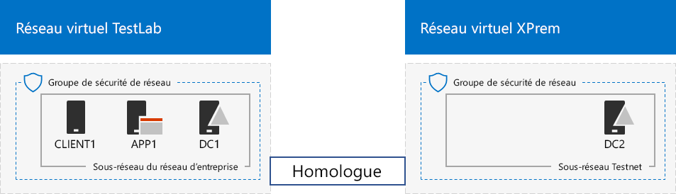
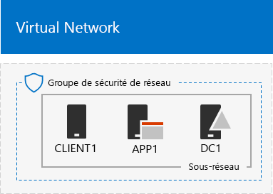

# <a name="simulated-cross-premises-virtual-network-in-a-microsoft-365-test-environment"></a>Réseau virtuel entre différents locaux simulé dans un environnement de test Microsoft 365

*Ce Guide de Laboratoire Test peut être utilisé pour les environnements de test Microsoft 365 Entreprise et Office 365 Entreprise*.

This article steps you through creating a simulated hybrid cloud environment with Microsoft Azure using two Azure virtual networks. Here is the resulting configuration. 
  

  
Cette configuration simule un environnement de production cloud hybride Azure IaaS et comprend les éléments suivants :
  
- Un réseau local simulé et simplifié hébergé dans un réseau virtuel Azure (réseau virtuel TestLab).
    
- Un réseau virtuel intersites simulé hébergé dans Azure (XPrem).
    
- Une relation d’homologation VNet entre les deux réseaux virtuels.
    
- Un contrôleur de domaine secondaire dans le réseau virtuel XPrem.
    
Ces éléments offrent une base commune à partir de laquelle vous pouvez : 
  
- Développer et tester des applications dans un environnement cloud hybride Azure IaaS simulé.
    
- Créer des configurations de test d’ordinateurs, certains au sein du réseau virtuel TestLab et d’autres au sein du réseau virtuel XPrem, afin de simuler les charges de travail informatiques dans un environnement cloud hybride.
    
Les trois phases principales pour configurer cet environnement de test sont les suivantes :
  
1. Configurer le réseau virtuel TestLab.
    
2. Créer le réseau virtuel intersites.
    
3. Configurer DC2
    
> [!NOTE]
> Cette configuration nécessite un abonnement payant à Azure. 

Vous pouvez utiliser l’environnement obtenu pour tester les fonctions et le bon fonctionnement de[Microsoft 365 Enterprise](https://www.microsoft.com/microsoft-365/enterprise), par vous-même ou en suivant les conseils des [guides de laboratoire de test](m365-enterprise-test-lab-guides.md).


> [!TIP]
> Accédez au [Guide de laboratoire de laboratoire de test Microsoft 365 Entreprise](../media/m365-enterprise-test-lab-guides/Microsoft365EnterpriseTLGStack.pdf) d’une carte visuelle à tous les Articles de la pile de guides de laboratoires de test Microsoft 365 Enterprise.

## <a name="phase-1-configure-the-testlab-virtual-network"></a>Phase 1 : configurer le réseau virtuel TestLab

Suivez les instructions de la **phase 1**de la [configuration entreprise de base simulée](simulated-ent-base-configuration-microsoft-365-enterprise.md) pour configurer les ordinateurs DC1, APP1 et CLIENT1 du réseau virtuel Azure appelé TestLab.
  
Il s’agit de votre configuration actuelle. 
  

  
## <a name="phase-2-create-the-xprem-virtual-network"></a>Phase 2 : Créer le réseau virtuel XPrem

Dans cette phase, vous devez créer et configurer le nouveau réseau virtuel XPrem et le connecter au réseau virtuel TestLab avec l’homologation VNet.
  
Tout d’abord, démarrez une invite PowerShell Azure sur votre ordinateur local.
  
> [!NOTE]
> The following command sets use the latest version of Azure PowerShell. See [Get started with Azure PowerShell cmdlets](https://docs.microsoft.com/powershell/azureps-cmdlets-docs/). 
  
Connectez-vous à votre compte Azure avec cette commande.
  
```powershell
Connect-AzAccount
```

Obtenez le nom de votre abonnement à l’aide de la commande suivante.
  
```powershell
Get-AzSubscription | Sort Name | Select Name
```

Set your Azure subscription. Replace everything within the quotes, including the \< and > characters, with the correct names.
  
```powershell
$subscrName="<subscription name>"
Select-AzSubscription -SubscriptionName $subscrName
```

Créez ensuite le réseau virtuel XPrem et protégez-le avec un groupe de sécurité réseau, à l’aide des commandes suivantes.
  
```powershell
$rgName="<name of the resource group that you used for your TestLab virtual network>"
$locName=(Get-AzResourceGroup -Name $rgName).Location
$Testnet=New-AzVirtualNetworkSubnetConfig -Name "Testnet" -AddressPrefix 192.168.0.0/24
New-AzVirtualNetwork -Name "XPrem" -ResourceGroupName $rgName -Location $locName -AddressPrefix 192.168.0.0/16 -Subnet $Testnet -DNSServer 10.0.0.4
$rule1=New-AzNetworkSecurityRuleConfig -Name "RDPTraffic" -Description "Allow RDP to all VMs on the subnet" -Access Allow -Protocol Tcp -Direction Inbound -Priority 100 -SourceAddressPrefix Internet -SourcePortRange * -DestinationAddressPrefix * -DestinationPortRange 3389
New-AzNetworkSecurityGroup -Name "Testnet" -ResourceGroupName $rgName -Location $locName -SecurityRules $rule1
$vnet=Get-AzVirtualNetwork -ResourceGroupName $rgName -Name XPrem
$nsg=Get-AzNetworkSecurityGroup -Name "Testnet" -ResourceGroupName $rgName
Set-AzVirtualNetworkSubnetConfig -VirtualNetwork $vnet -Name "Testnet" -AddressPrefix 192.168.0.0/24 -NetworkSecurityGroup $nsg
$vnet | Set-AzVirtualNetwork
```

Vous devez ensuite créer la relation d’homologation VNet entre les réseaux virtuels TestLab et XPrem, à l’aide des commandes suivantes.
  
```powershell
$rgName="<name of the resource group that you used for your TestLab virtual network>"
$vnet1=Get-AzVirtualNetwork -ResourceGroupName $rgName -Name TestLab
$vnet2=Get-AzVirtualNetwork -ResourceGroupName $rgName -Name XPrem
Add-AzVirtualNetworkPeering -Name TestLab2XPrem -VirtualNetwork $vnet1 -RemoteVirtualNetworkId $vnet2.Id
Add-AzVirtualNetworkPeering -Name XPrem2TestLab -VirtualNetwork $vnet2 -RemoteVirtualNetworkId $vnet1.Id
```

Il s’agit de votre configuration actuelle. 
  

  
## <a name="phase-3-configure-dc2"></a>Phase 3 : Configurer DC2

Dans cette phase, vous devez créer la machine virtuelle DC2 dans le réseau virtuel XPrem, puis la configurer comme un contrôleur de domaine répliqué.
  
First, create a virtual machine for DC2. Run these commands at the Azure PowerShell command prompt on your local computer.
  
```powershell
$rgName="<your resource group name>"
$locName=(Get-AzResourceGroup -Name $rgName).Location
$vnet=Get-AzVirtualNetwork -Name XPrem -ResourceGroupName $rgName
$pip=New-AzPublicIpAddress -Name DC2-PIP -ResourceGroupName $rgName -Location $locName -AllocationMethod Dynamic
$nic=New-AzNetworkInterface -Name DC2-NIC -ResourceGroupName $rgName -Location $locName -SubnetId $vnet.Subnets[0].Id -PublicIpAddressId $pip.Id -PrivateIpAddress 192.168.0.4
$vm=New-AzVMConfig -VMName DC2 -VMSize Standard_A2_V2
$cred=Get-Credential -Message "Type the name and password of the local administrator account for DC2."
$vm=Set-AzVMOperatingSystem -VM $vm -Windows -ComputerName DC2 -Credential $cred -ProvisionVMAgent -EnableAutoUpdate
$vm=Set-AzVMSourceImage -VM $vm -PublisherName MicrosoftWindowsServer -Offer WindowsServer -Skus 2016-Datacenter -Version "latest"
$vm=Add-AzVMNetworkInterface -VM $vm -Id $nic.Id
$vm=Set-AzVMOSDisk -VM $vm -Name "DC2-OS" -DiskSizeInGB 128 -CreateOption FromImage -StorageAccountType "Standard_LRS"
$diskConfig=New-AzDiskConfig -AccountType "Standard_LRS" -Location $locName -CreateOption Empty -DiskSizeGB 20
$dataDisk1=New-AzDisk -DiskName "DC2-DataDisk1" -Disk $diskConfig -ResourceGroupName $rgName
$vm=Add-AzVMDataDisk -VM $vm -Name "DC2-DataDisk1" -CreateOption Attach -ManagedDiskId $dataDisk1.Id -Lun 1
New-AzVM -ResourceGroupName $rgName -Location $locName -VM $vm
```

Ensuite, connectez-vous à la nouvelle machine virtuelle DC2 à partir du [portail Azure](https://portal.azure.com) à l’aide du nom de compte et du mot de passe de l’administrateur local.
  
Next, configure a Windows Firewall rule to allow traffic for basic connectivity testing. From an administrator-level Windows PowerShell command prompt on DC2, run these commands. 
  
```powershell
Set-NetFirewallRule -DisplayName "File and Printer Sharing (Echo Request - ICMPv4-In)" -enabled True
ping dc1.corp.contoso.com
```

The ping command should result in four successful replies from IP address 10.0.0.4. This is a test of traffic across the VNet peering relationship. 
  
Ensuite, ajoutez le disque de données supplémentaire en tant que nouveau volume avec la lettre de lecteur F: avec cette commande de l’invite de commande Windows PowerShell sur DC2.
  
```powershell
Get-Disk | Where PartitionStyle -eq "RAW" | Initialize-Disk -PartitionStyle MBR -PassThru | New-Partition -AssignDriveLetter -UseMaximumSize | Format-Volume -FileSystem NTFS -NewFileSystemLabel "WSAD Data"
```

Next, configure DC2 as a replica domain controller for the corp.contoso.com domain. Run these commands from the Windows PowerShell command prompt on DC2.
  
```powershell
Install-WindowsFeature AD-Domain-Services -IncludeManagementTools
Install-ADDSDomainController -Credential (Get-Credential CORP\User1) -DomainName "corp.contoso.com" -InstallDns:$true -DatabasePath "F:\NTDS" -LogPath "F:\Logs" -SysvolPath "F:\SYSVOL"
```

Notez que vous devez fournir à la fois le mot de passe CORP\\User1 et le mot de passe du mode restauration des services d’annuaire, puis redémarrer DC2. 
  
Now that the XPrem virtual network has its own DNS server (DC2), you must configure the XPrem virtual network to use this DNS server. Run these commands from the Azure PowerShell command prompt on your local computer.
  
```powershell
$vnet=Get-AzVirtualNetwork -ResourceGroupName $rgName -name "XPrem"
$vnet.DhcpOptions.DnsServers="192.168.0.4" 
Set-AzVirtualNetwork -VirtualNetwork $vnet
Restart-AzVM -ResourceGroupName $rgName -Name "DC2"
```

From the Azure portal on your local computer, connect to DC1 with the CORP\\User1 credentials. To configure the CORP domain so that computers and users use their local domain controller for authentication, run these commands from an administrator-level Windows PowerShell command prompt on DC1.
  
```powershell
New-ADReplicationSite -Name "TestLab" 
New-ADReplicationSite -Name "XPrem"
New-ADReplicationSubnet -Name "10.0.0.0/8" -Site "TestLab"
New-ADReplicationSubnet -Name "192.168.0.0/16" -Site "XPrem"
```

Il s’agit de votre configuration actuelle. 
  

  
Votre environnement cloud hybride Azure simulé est prêt pour le test.
  
Vous êtes désormais prêt à profiter des fonctionnalités supplémentaires de [Microsoft 365 Entreprise](https://www.microsoft.com/microsoft-365/enterprise).
  
## <a name="next-steps"></a>Étapes suivantes

Découvrez les nouveaux ensembles de guides pour les tests de laboratoire :
  
- [Identité](m365-enterprise-test-lab-guides.md#identity)
- [Gestion des appareils mobiles](m365-enterprise-test-lab-guides.md#mobile-device-management)
- [Protection des informations](m365-enterprise-test-lab-guides.md#information-protection)

## <a name="see-also"></a>Voir aussi

[Guides de laboratoire de test Microsoft 365 Entreprise](m365-enterprise-test-lab-guides.md)

[Déployer Microsoft 365 Entreprise](deploy-microsoft-365-enterprise.md)

[Documentation Microsoft 365 Entreprise](https://docs.microsoft.com/microsoft-365-enterprise/)
