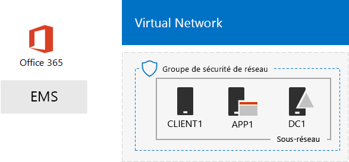
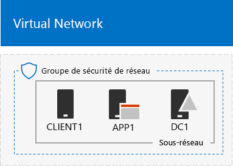
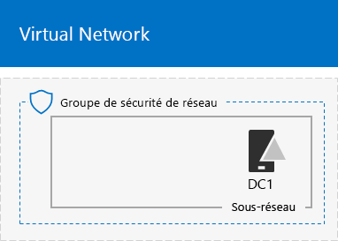
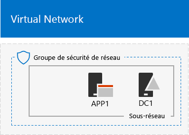

# <a name="the-simulated-enterprise-base-configuration"></a>Configuration de base d’une entreprise simulée

Vous trouverez dans cet article des instructions détaillées pour créer un environnement simplifié pour Microsoft 365 Entreprise qui comprend :

- Les abonnements à la version permanente ou d’évaluation Office 365 E5 et EMS E5.
- Un intranet simplifié d’une organisation connecté à Internet, composé de trois machines virtuelles sur un réseau virtuel Azure (DC1, APP1 et CLIENT1).
 


Vous pouvez utiliser l’environnement obtenu pour tester les fonctions et le bon fonctionnement de[Microsoft 365 Enterprise](https://www.microsoft.com/microsoft-365/enterprise), par vous-même ou en suivant les conseils des [guides de laboratoire de test](m365-enterprise-test-lab-guides.md).


> [!TIP]
> Cliquez [ici](https://aka.ms/m365etlgstack) pour afficher le plan de tous les articles de l’ensemble de guides de laboratoire de test de Microsoft 365 Entreprise.

## <a name="phase-1-create-a-simulated-intranet"></a>Phase 1: Créer un intranet simulé

Dans cette phase, vous allez créer un intranet simulé dans les services d’infrastructure Azure comprenant un contrôleur de domaine Windows Server Active Directory, un serveur d’application et un ordinateur client. 

Vous utiliserez ces ordinateurs dans des[Guides de laboratoire de Test Microsoft 365 Enterprise](m365-enterprise-test-lab-guides.md)supplémentaires afin de configurer et montrer l’identité hybride et les autres fonctionnalités.

### <a name="method-1-build-your-simulated-intranet-with-an-azure-resource-manager-template"></a>Méthode 1: Créer votre intranet simulé avec un Modèle de Gestion de Ressources Azure 

En utilisant cette méthode, vous utilisez un modèle de Gestion des Ressources Azure(GRA) pour assembler intranet simulé. PROCESSEUR modèles contiennent toutes les instructions pour créer l’infrastructure réseau Azure, machines virtuelles et leur configuration.

Avant de déployer le modèle, parcourez le[modèle de la page Lisez-moi](https://github.com/maxskunkworks/TLG/tree/master/tlg-base-config_3-vm.m365-ems) et obtenez les informations suivantes prêtes :

- Le nom de domaine DNS public de votre environnement de test (testlab.\< votre domaine public >). Vous devez entrer ce nom dans le**champ Nom de Domaine** de la page**déploiement Personnalisé**.
- Un préfixe d’étiquette DNS pour les URL d’adresses IP publiques de vos machines virtuelles. Vous devez entrer cette étiquette dans le**préfixe d’étiquette Dns** champ de la page**déploiement Personnalisé**.

Après avoir lu via les instructions, cliquez sur **déployer vers Azure** sur la [page modèle LISEZMOI](https://github.com/maxskunkworks/TLG/tree/master/tlg-base-config_3-vm.m365-ems) pour commencer.

>[!Note]
>L’Intranet simulé créé par le modèle GRA nécessite un abonnement payant à Azure.
>

Voici votre configuration une fois le modèle terminé.



### <a name="method-2-build-your-simulated-intranet-with-azure-powershell"></a>Méthode 2 : Créer votre intranet simulé avec Azure PowerShell

En utilisant cette méthode, vous utilisez Windows PowerShell et le module Azure PowerShell afin de créer l’infrastructure de réseau, les machines virtuelles et leur configuration.

Utilisez cette méthode si vous souhaitez acquérir de l’expérience en créant des éléments d’infrastructure Azure, une étape après l’autre, avec PowerShell. Vous pouvez alors personnaliser les blocs de commande PowerShell pour votre propre déploiement d’autres machines virtuelles dans Azure.

#### <a name="step-1-create-dc1"></a>Phase 1: création de DC1

Durant cette phase, nous allons créer un réseau virtuel Azure et ajouter la machine virtuelle DC1 qui est un contrôleur de domaine pour un domaine Windows Server Active Directory (AD).

Tout d’abord, démarrez une invite de commandes Windows PowerShell sur votre ordinateur local.
  
> [!NOTE]
> Les ensembles de commandes suivants utilisent la dernière version d’Azure PowerShell. Reportez-vous à la rubrique relative à la [prise en main des cmdlets Azure PowerShell](https://docs.microsoft.com/powershell/azureps-cmdlets-docs/). 
  
Connectez-vous à votre compte Azure avec la commande suivante.
  
```
Login-AzureRMAccount
```

Obtenez le nom de votre abonnement à l’aide de la commande suivante.
  
```
Get-AzureRMSubscription | Sort Name | Select Name
```

Définissez votre abonnement Azure. Remplacez tout le texte entre guillemets, y compris les caractères < et >, avec le nom correct.
  
```
$subscr="<subscription name>"
Get-AzureRmSubscription -SubscriptionName $subscr | Select-AzureRmSubscription
```

Ensuite, créez un nouveau groupe de ressources pour le laboratoire de test de votre entreprise simulée. Pour choisir un nom de groupe de ressources unique, utilisez cette commande pour répertorier les groupes de ressources existants.
  
```
Get-AzureRMResourceGroup | Sort ResourceGroupName | Select ResourceGroupName
```

Créez votre nouveau groupe de ressources avec ces commandes. Remplacez tout le texte entre guillemets, y compris les caractères < et >, par les noms corrects.
  
```
$rgName="<resource group name>"
$locName="<location name, such as West US>"
New-AzureRMResourceGroup -Name $rgName -Location $locName
```

Ensuite, créez le réseau virtuel TestLab qui hébergera le sous-réseau du réseau de l’environnement de l’entreprise simulée et protégez-le avec un groupe de sécurité de réseau. Indiquez le nom de votre groupe de ressources et exécutez les commandes suivantes à l’invite de commandes PowerShell sur votre ordinateur local.
  
```
$rgName="<name of your new resource group>"
$locName=(Get-AzureRmResourceGroup -Name $rgName).Location
$corpnetSubnet=New-AzureRMVirtualNetworkSubnetConfig -Name Corpnet -AddressPrefix 10.0.0.0/24
New-AzureRMVirtualNetwork -Name TestLab -ResourceGroupName $rgName -Location $locName -AddressPrefix 10.0.0.0/8 -Subnet $corpnetSubnet -DNSServer 10.0.0.4
$rule1=New-AzureRMNetworkSecurityRuleConfig -Name "RDPTraffic" -Description "Allow RDP to all VMs on the subnet" -Access Allow -Protocol Tcp -Direction Inbound -Priority 100 -SourceAddressPrefix Internet -SourcePortRange * -DestinationAddressPrefix * -DestinationPortRange 3389
New-AzureRMNetworkSecurityGroup -Name Corpnet -ResourceGroupName $rgName -Location $locName -SecurityRules $rule1
$vnet=Get-AzureRMVirtualNetwork -ResourceGroupName $rgName -Name TestLab
$nsg=Get-AzureRMNetworkSecurityGroup -Name Corpnet -ResourceGroupName $rgName
Set-AzureRMVirtualNetworkSubnetConfig -VirtualNetwork $vnet -Name Corpnet -AddressPrefix "10.0.0.0/24" -NetworkSecurityGroup $nsg
```

Maintenant, créez la machine virtuelle DC1 et configurez-la comme un contrôleur de domaine pour le domaine Windows Server AD **testlab.**\<votre domaine public>, et comme un serveur DNS pour les machines virtuelles du réseau virtuel TestLab. Par exemple, si votre nom de domaine public est **<span>contoso</span>.com**, la machine virtuelle DC1 sera un contrôleur de domaine pour le domaine **<span>testlab</span>.contoso.com**.
  
Pour créer une machine virtuelle Azure pour DC1, indiquez d’abord le nom de votre groupe de ressources, puis exécutez ces commandes à l’invite de commandes PowerShell sur votre ordinateur local.
  
```
$rgName="<resource group name>"
$locName=(Get-AzureRmResourceGroup -Name $rgName).Location
$vnet=Get-AzureRMVirtualNetwork -Name TestLab -ResourceGroupName $rgName
$pip=New-AzureRMPublicIpAddress -Name DC1-PIP -ResourceGroupName $rgName -Location $locName -AllocationMethod Dynamic
$nic=New-AzureRMNetworkInterface -Name DC1-NIC -ResourceGroupName $rgName -Location $locName -SubnetId $vnet.Subnets[0].Id -PublicIpAddressId $pip.Id -PrivateIpAddress 10.0.0.4
$vm=New-AzureRMVMConfig -VMName DC1 -VMSize Standard_A1
$cred=Get-Credential -Message "Type the name and password of the local administrator account for DC1."
$vm=Set-AzureRMVMOperatingSystem -VM $vm -Windows -ComputerName DC1 -Credential $cred -ProvisionVMAgent -EnableAutoUpdate
$vm=Set-AzureRMVMSourceImage -VM $vm -PublisherName MicrosoftWindowsServer -Offer WindowsServer -Skus 2016-Datacenter -Version "latest"
$vm=Add-AzureRMVMNetworkInterface -VM $vm -Id $nic.Id
$vm=Set-AzureRmVMOSDisk -VM $vm -Name "DC1-OS" -DiskSizeInGB 128 -CreateOption FromImage -StorageAccountType "Standard_LRS"
$diskConfig=New-AzureRmDiskConfig -AccountType "Standard_LRS" -Location $locName -CreateOption Empty -DiskSizeGB 20
$dataDisk1=New-AzureRmDisk -DiskName "DC1-DataDisk1" -Disk $diskConfig -ResourceGroupName $rgName
$vm=Add-AzureRmVMDataDisk -VM $vm -Name "DC1-DataDisk1" -CreateOption Attach -ManagedDiskId $dataDisk1.Id -Lun 1
New-AzureRMVM -ResourceGroupName $rgName -Location $locName -VM $vm
```

Vous serez invité à indiquer un nom d’utilisateur et un mot de passe pour le compte d’administrateur local sur DC1. Utilisez un mot de passe et enregistrez le nom et le mot de passe dans un endroit sûr.
  
Ensuite, connectez-vous à la machine virtuelle DC1.
  
1. Dans le [Portail Azure](https://portal.azure.com), cliquez sur **Groupes de Ressources >** [nom de votre nouveau groupe de ressources] **> DC1 > Se connecter**.
    
2. Dans le volet ouvert, cliquez sur **Télécharger le fichier RDP**. Ouvrez le fichier DC1.rdp qui est téléchargé, puis cliquez sur **Se connecter**.
    
3. Spécifiez le nom du compte Administrateur local DC1 :
    
   - Pour Windows 7 :
    
     Dans la boîte de dialogue **Sécurité Windows**, cliquez sur **Utiliser un autre compte**. Dans **Nom d’utilisateur**, tapez **DC1\\**[nom du compte Administrateur local].
    
   - Pour Windows 8 ou Windows 10 :
    
     Dans la boîte de dialogue **Sécurité Windows**, cliquez sur **Autres choix**, puis cliquez sur **Utiliser un autre compte**. Dans **Nom d’utilisateur**, tapez **DC1\\**[nom de compte Administrateur local].
    
4. Dans **Mot de passe**, tapez le mot de passe du compte Administrateur local, puis cliquez sur **OK**.
    
5. Quand vous y êtes invité, cliquez sur **Oui**.
    
Ensuite, ajoutez un disque de données supplémentaire en tant que nouveau volume avec la lettre de lecteur F:, à l’aide de la commande suivante, dans l’invite de commande Windows PowerShell au niveau administrateur sur DC1.
  
```
Get-Disk | Where PartitionStyle -eq "RAW" | Initialize-Disk -PartitionStyle MBR -PassThru | New-Partition -AssignDriveLetter -UseMaximumSize | Format-Volume -FileSystem NTFS -NewFileSystemLabel "WSAD Data"
```

Maintenant, configurez DC1 comme un contrôleur de domaine et un serveur DNS pour le domaine **testlab.**\<votre domaine public>. Indiquez le nom de votre domaine public, supprimez les caractères \< et >, puis exécutez ces commandes à l’invite de commandes Windows PowerShell de niveau administrateur sur DC1.
  
```
$yourDomain="<your public domain>"
Install-WindowsFeature AD-Domain-Services -IncludeManagementTools
Install-ADDSForest -DomainName testlab.$yourDomain -DatabasePath "F:\NTDS" -SysvolPath "F:\SYSVOL" -LogPath "F:\Logs"
```
Vous devez spécifier un mot de passe administrateur en mode sans échec. Conservez ce mot de passe dans un endroit sûr.
  
Notez que l’exécution de ces commandes peut prendre quelques minutes.
  
Après le redémarrage de DC1, reconnectez-vous à la machine virtuelle DC1.
  
1. Dans le [Portail Azure](https://portal.azure.com), cliquez sur **Groupes de Ressources >** [nom de votre groupe de ressources] **> DC1 > Se connecter**.
    
2. Exécutez le fichier DC1.rdp qui est téléchargé, puis cliquez sur **Se connecter**.
    
3. Dans **Sécurité Windows**, cliquez sur **Utiliser un autre compte**. Dans **Nom d’utilisateur**, tapez **TESTLAB\\**[nom du compte Administrateur local].
    
4. Dans **Mot de passe**, tapez le mot de passe du compte Administrateur local, puis cliquez sur **OK**.
    
5. Quand vous y êtes invité, cliquez sur **Oui**.
    
Ensuite, dans Active Directory, créez un compte d’utilisateur qui sera utilisé pour la connexion aux ordinateurs membres du domaine TESTLAB. Exécutez cette commande à l’invite de commandes Windows PowerShell de niveau administrateur.
  
```
New-ADUser -SamAccountName User1 -AccountPassword (read-host "Set user password" -assecurestring) -name "User1" -enabled $true -PasswordNeverExpires $true -ChangePasswordAtLogon $false
```

Notez que cette commande vous invite à renseigner le mot de passe du compte Utilisateur1 (User1). Étant donné que ce compte est utilisé pour les connexions de bureau à distance pour tous les ordinateurs membres du domaine TESTLAB, choisissez un mot de passe fort. Enregistrez le mot de passe du compte Utilisateur1 et stockez-le dans un endroit sûr.
  
Maintenant, configurez le nouveau compte Utilisateur1 comme un administrateur de schéma, d’entreprise et de domaine. Exécutez cette commande à l’invite de commandes Windows PowerShell de niveau administrateur.
  
```
$yourDomain="<your public domain>"
$domainName = "testlab"+$yourDomain
$userName="user1@" + $domainName
$userSID=(New-Object System.Security.Principal.NTAccount($userName)).Translate([System.Security.Principal.SecurityIdentifier]).Value
$groupNames=@("Domain Admins","Enterprise Admins","Schema Admins")
ForEach ($name in $groupNames) {Add-ADPrincipalGroupMembership -Identity $userSID -MemberOf (Get-ADGroup -Identity $name).SID.Value}
```

Fermez la session Bureau à distance avec DC1 et reconnectez-vous à l’aide du compte TESTLAB\\Utilisateur1.
  
Ensuite, pour autoriser le trafic pour l’outil Ping, exécutez cette commande à l’invite de commandes Windows PowerShell de niveau administrateur.
  
```
Set-NetFirewallRule -DisplayName "File and Printer Sharing (Echo Request - ICMPv4-In)" -enabled True
```

Il s’agit de votre configuration actuelle.
  

  
#### <a name="step-2-configure-app1"></a>Phase 2:Configurer APP1

Durant cette phase, vous allez créer et configurer APP1, qui est un serveur d’applications qui fournit initial des services web et de partage de fichiers.

Pour créer une machine virtuelle Azure pour APP1, renseignez d’abord le nom de votre groupe de ressources, puis exécutez ces commandes à l’invite de commandes sur votre ordinateur local.
  
```
$rgName="<resource group name>"
$locName=(Get-AzureRmResourceGroup -Name $rgName).Location
$vnet=Get-AzureRMVirtualNetwork -Name TestLab -ResourceGroupName $rgName
$pip=New-AzureRMPublicIpAddress -Name APP1-PIP -ResourceGroupName $rgName -Location $locName -AllocationMethod Dynamic
$nic=New-AzureRMNetworkInterface -Name APP1-NIC -ResourceGroupName $rgName -Location $locName -SubnetId $vnet.Subnets[0].Id -PublicIpAddressId $pip.Id
$vm=New-AzureRMVMConfig -VMName APP1 -VMSize Standard_A1
$cred=Get-Credential -Message "Type the name and password of the local administrator account for APP1."
$vm=Set-AzureRMVMOperatingSystem -VM $vm -Windows -ComputerName APP1 -Credential $cred -ProvisionVMAgent -EnableAutoUpdate
$vm=Set-AzureRMVMSourceImage -VM $vm -PublisherName MicrosoftWindowsServer -Offer WindowsServer -Skus 2016-Datacenter -Version "latest"
$vm=Add-AzureRMVMNetworkInterface -VM $vm -Id $nic.Id
$vm=Set-AzureRmVMOSDisk -VM $vm -Name "APP1-OS" -DiskSizeInGB 128 -CreateOption FromImage -StorageAccountType "Standard_LRS"
New-AzureRMVM -ResourceGroupName $rgName -Location $locName -VM $vm
```

Ensuite, connectez-vous à la machine virtuelle APP1 en utilisant le nom du compte Administrateur local APP1 et le mot de passe, et ouvrez une invite de commande Windows PowerShell.
  
Pour vérifier la résolution du nom et la communication réseau entre APP1 et DC1, exécutez la commande **ping dc1.testlab.**\<votre nom de domaine public> et vérifiez que quatre réponses apparaissent.
  
Maintenant, associez la machine virtuelle APP1 au domaine TESTLAB avec ces commandes à l’invite Windows PowerShell.
  
```
$yourDomain="<your public domain name>"
Add-Computer -DomainName ("testlab" + $yourDomain)
Restart-Computer
```

Les informations d’identification du compte de domaine TESTLAB\\Utilisateur1 doivent être fournies après l’exécution de la commande **Add-Computer**.
  
Après le redémarrage d’APP1, connectez-vous en utilisant le compte TESTLAB\\Utilisateur1 et ouvrez une invite de commandes Windows PowerShell de niveau administrateur.
  
Transformez APP1 en serveur web en exécutant cette commande à l’invite de commandes Windows PowerShell de niveau supérieur sur APP1.
  
```
Install-WindowsFeature Web-WebServer -IncludeManagementTools
```

Ensuite, créez un dossier partagé et un fichier de texte dans le dossier sur APP1 avec ces commandes PowerShell.
  
```
New-Item -path c:\files -type directory
Write-Output "This is a shared file." | out-file c:\files\example.txt
New-SmbShare -name files -path c:\files -changeaccess TESTLAB\User1
```

Il s’agit de votre configuration actuelle.
  

  
#### <a name="step-3-configure-client1"></a>Phase 3:Configurer CLIENT1

Durant cette phase, vous allez créer et configurer CLIENT1, qui se comporte comme un ordinateur portable, une tablette ou un ordinateur de bureau classique sur l’intranet.

> [!NOTE]  
> Le jeu de commandes suivant crée CLIENT1 en exécutant Windows Server 2016 Datacenter, pour tous les types d’abonnements Azure. Si vous avez un abonnement Azure basé sur Visual Studio, vous pouvez créer CLIENT1 en exécutant Windows 10, avec le [portail Azure](https://portal.azure.com). 
  
Pour créer une machine virtuelle Azure pour CLIENT1, renseignez d’abord le nom de votre groupe de ressources, puis exécutez ces commandes à l’invite de commandes sur votre ordinateur local.
  
```
$rgName="<resource group name>"
$locName=(Get-AzureRmResourceGroup -Name $rgName).Location
$vnet=Get-AzureRMVirtualNetwork -Name TestLab -ResourceGroupName $rgName
$pip=New-AzureRMPublicIpAddress -Name CLIENT1-PIP -ResourceGroupName $rgName -Location $locName -AllocationMethod Dynamic
$nic=New-AzureRMNetworkInterface -Name CLIENT1-NIC -ResourceGroupName $rgName -Location $locName -SubnetId $vnet.Subnets[0].Id -PublicIpAddressId $pip.Id
$vm=New-AzureRMVMConfig -VMName CLIENT1 -VMSize Standard_A1
$cred=Get-Credential -Message "Type the name and password of the local administrator account for CLIENT1."
$vm=Set-AzureRMVMOperatingSystem -VM $vm -Windows -ComputerName CLIENT1 -Credential $cred -ProvisionVMAgent -EnableAutoUpdate
$vm=Set-AzureRMVMSourceImage -VM $vm -PublisherName MicrosoftWindowsServer -Offer WindowsServer -Skus 2016-Datacenter -Version "latest"
$vm=Add-AzureRMVMNetworkInterface -VM $vm -Id $nic.Id
$vm=Set-AzureRmVMOSDisk -VM $vm -Name "CLIENT1-OS" -DiskSizeInGB 128 -CreateOption FromImage -StorageAccountType "Standard_LRS"
New-AzureRMVM -ResourceGroupName $rgName -Location $locName -VM $vm
```

Ensuite, connectez-vous à la machine virtuelle CLIENT1 en utilisant le nom du compte Administrateur local CLIENT1 et le mot de passe, et ouvrez une invite de commande Windows PowerShell de niveau administrateur.
  
Pour vérifier la résolution du nom et la communication réseau entre CLIENT1 et DC1, exécutez la commande **ping dc1.testlab.**\<votre nom de domaine public> à l’invite de commandes Windows PowerShell et vérifiez que quatre réponses apparaissent.
  
Maintenant, associez la machine virtuelle CLIENT1 au domaine TESTLAB avec ces commandes à l’invite Windows PowerShell.
  
```
$yourDomain="<your public domain name>"
Add-Computer -DomainName ("testlab" + $yourDomain)
Restart-Computer
```

Les informations d’identification de votre compte de domaine TESTLAB\\Utilisateur1 doivent être fournies après l’exécution de la commande **Add-Computer**.
  
Après le redémarrage de CLIENT1, connectez-vous en utilisant le mot de passe et le nom du compte TESTLAB\\Utilisateur1 et ouvrez une invite de commandes Windows PowerShell de niveau administrateur.
  
Ensuite, vérifiez que vous pouvez accéder aux ressources web et de partage de fichiers sur APP1 de CLIENT1.
  
1. Dans le Gestionnaire de Serveur, dans le volet de l’arborescence, cliquez sur **Serveur Local**.
    
2. Dans **Propriétés pour CLIENT1**, cliquez sur **Activer** à côté de **Configuration de sécurité renforcée d’Internet Explorer**.
    
3. Dans **Configuration de sécurité renforcée d’Internet Explorer**, cliquez sur **Désactiver** pour **Administrateurs** et **Utilisateurs**, puis cliquez sur **OK**.
    
4. Sur l’écran d’accueil, cliquez sur **Internet Explorer**, puis sur **OK**.
    
5. Dans la barre d’adresses, tapez **http<span>://</span>app1.testab.**\<votre nom de domaine public>**/**, puis appuyez sur ENTRÉE. La page web Internet Information Services par défaut pour APP1 s’affiche.
    
6. Dans la barre des tâches du bureau, cliquez sur l’icône de l’Explorateur de fichiers.
    
7. Dans la barre d’adresses, tapez **\\\\app1\\Files**, puis appuyez sur ENTRÉE. Une fenêtre de dossiers avec le contenu du dossier partagé Fichiers apparaît.
    
8. Dans la fenêtre du dossier partagé **Fichiers**, double-cliquez sur le fichier **Exemple.txt**. Le contenu du fichier Exemple.txt s’affiche.
    
9. Fermez les fenêtres de dossiers partagés **Exemple.txt - Bloc-notes** et **Fichiers**.
    
Il s’agit de votre configuration actuelle.
  


## <a name="phase-2-create-your-office-365-e5-and-ems-e5-subscriptions"></a>Phase 2 : création de vos abonnements Office 365 E5 et EMS E5

Durant cette phase, vous allez créer de nouveaux abonnements Office 365 E5 et EMS E5 qui utilisent un nouveau client Azure AD commun, différent de votre abonnement de production. Vous pouvez procéder de deux façons :

- Utiliser les abonnements à la version d’évaluation Office 365 E5 et EMS E5. 

  L’abonnement à la version d’évaluation Office 365 E5 est valable 30 jours et peut être porté facilement à 60 jours. L’abonnement à la version d’évaluation EMS E5 est valable 90 jours. Quand les abonnements à la version d’évaluation expirent, soit vous les convertissez en abonnements payants, soit vous créez de nouveaux abonnements à la version d’évaluation. Si vous choisissez cette dernière option, vous ne pourrez pas conserver votre configuration et les scénarios complexes qu’elle peut contenir.  
- Utiliser un abonnement de production de Microsoft 365 Entreprise distinct avec un nombre réduit de licences.

  Cette solution a un coût supplémentaire, mais elle vous permet de bénéficier d’un environnement de test opérationnel pour essayer des fonctionnalités, des configurations et des scénarios sans contrainte de temps. Vous pouvez utiliser le même environnement de test sur le long terme pour valider la faisabilité des concepts, réaliser des démonstrations auprès de vos pairs et de votre direction, et développer et tester des applications. Nous vous recommandons d’utiliser cette méthode.

### <a name="use-trial-subscriptions"></a>Utilisation des abonnements à la version d’évaluation

Si vous devez utiliser les abonnements à la version d’évaluation, suivez les étapes de la phase 2 et de la phase 3 de l’[environnement de développement/test Office 365](https://docs.microsoft.com/office365/enterprise/office-365-dev-test-environment).
  
Ensuite, abonnez-vous à la version d’évaluation EMS E5 et ajoutez-la à la même organisation que votre abonnement Office 365 E5.
  
Tout d’abord, ajoutez l’abonnement d’évaluation EMS E5 et attribuez une licence EMS à votre compte Administrateur général.
  
1. Utilisez une instance privée d’un navigateur Internet pour vous connecter au portail Office 365 à l’aide de vos informations d’identification de compte Administrateur général. Pour obtenir de l’aide, reportez-vous à [Se connecter à Office ou à Office 365](https://support.office.com/Article/Where-to-sign-in-to-Office-365-e9eb7d51-5430-4929-91ab-6157c5a050b4).
    
2. Cliquez sur la vignette **Administration**.
    
3. Sous l’onglet **Centre d’administration Office** de votre navigateur, dans le volet de navigation gauche, cliquez sur **Facturation > Acheter des services**.
    
4. Dans la page **Acheter des services**, recherchez l’élément **Enterprise Mobility + Security E5**. Pointez votre souris dessus et cliquez sur **Démarrer l’essai gratuit**.
    
5. Dans la page **Confirmer votre commande**, cliquez sur **Essayer maintenant**.
    
6. Dans la page **Réception de la commande**, cliquez sur **Continuer**.
    
7. Sous l’onglet **Centre d’administration Office 365** de votre navigateur, dans le volet de navigation gauche, cliquez sur **Utilisateurs > Utilisateurs actifs**.
    
8. Cliquez sur votre compte Administrateur général, puis cliquez sur **Modifier** pour les **licences de produit**.
    
9. Dans le volet **Licences de produit**, activez la licence de produit pour **Enterprise Mobility + Security E5** en sélectionnant **Activer**, cliquez sur **Enregistrer**, cliquez deux fois sur **Fermer**.
    
> [!NOTE]
>  Pour bénéficier d’un environnement de développement/test permanent, créez un nouvel abonnement payant avec un nombre réduit de licences. 
  
Ensuite, répétez les étapes 8 et 9 de la procédure précédente pour tous vos autres comptes (Utilisateur2, Utilisateur3, Utilisateur4 et Utilisateur5).
  
### <a name="results"></a>Résultats

Votre environnement de test comporte maintenant :
  
- Des abonnements d’évaluation Office 365 E5 Entreprise et EMS E5 qui partagent le même client Azure AD avec votre liste des comptes d’utilisateur.
- Tous vos comptes d’utilisateur appropriés (l’administrateur général ou tous les cinq comptes d’utilisateur) sont activés pour utiliser Office 365 E5 et EMS E5.
    
Il s’agit de votre configuration finale.
  

  
Vous êtes désormais prêt à profiter des fonctionnalités supplémentaires de [Microsoft 365 Entreprise](https://www.microsoft.com/microsoft-365/enterprise).
  
## <a name="next-steps"></a>Étapes suivantes

Découvrez les nouveaux ensembles de guides pour les tests de laboratoire :
  
- [Identité](m365-enterprise-test-lab-guides.md#identity)
- [Gestion des appareils mobiles](m365-enterprise-test-lab-guides.md#mobile-device-management)
- [Protection des informations](m365-enterprise-test-lab-guides.md#information-protection)

## <a name="see-also"></a>Voir aussi

[Guides de laboratoire de test Microsoft 365 Entreprise](m365-enterprise-test-lab-guides.md)

[Déployer Microsoft 365 Entreprise](deploy-microsoft-365-enterprise.md)

[Documentation Microsoft 365 Entreprise](https://docs.microsoft.com/microsoft-365-enterprise/)
