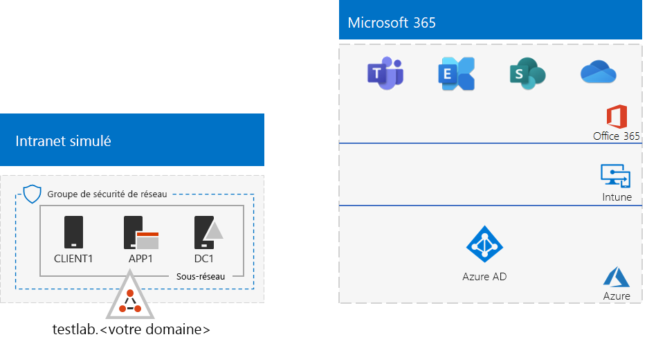
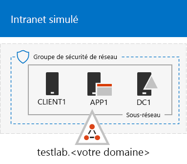
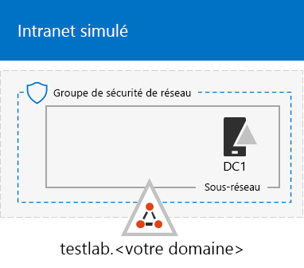
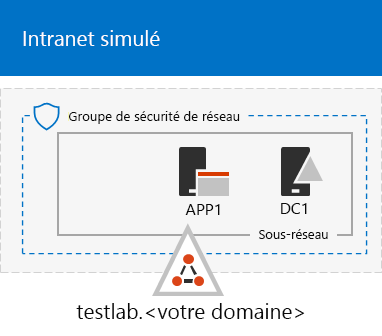

# <a name="the-simulated-enterprise-base-configuration"></a>Configuration de base d’une entreprise simulée

*Ce guide de laboratoire de test peut être utilisé pour les environnements de test Microsoft 365 pour les environnements de test d’entreprise et Office 365.*

Cet article explique comment créer un environnement simplifié pour Microsoft 365 pour les entreprises qui inclut :

- Un abonnement d’évaluation ou payant Microsoft 365 E5.
- Un intranet d’organisation simplifié connecté à Internet, composé de trois machines virtuelles sur un réseau virtuel Azure (DC1, APP1 et CLIENT1).
 


La création d’un environnement de test simplifié implique deux phases :
- [Phase 1: Créer un intranet simulé](#phase-1-create-a-simulated-intranet)
- [Phase 2 : Création de votre abonnement Microsoft 365 E5](#phase-2-create-your-microsoft-365-e5-subscription)

Vous pouvez utiliser l’environnement obtenu pour tester les fonctionnalités de [Microsoft 365 pour Enterprise](https://www.microsoft.com/microsoft-365/enterprise) avec des guides de [laboratoire de test](m365-enterprise-test-lab-guides.md) supplémentaires ou vous-même.


> [!TIP]
> Pour obtenir un plan de tous les Articles de la pile de guide de laboratoire de test Microsoft 365 pour Enterprise, accédez à [Microsoft 365 pour la pile de guide de laboratoire de test d’entreprise](../downloads/Microsoft365EnterpriseTLGStack.pdf).

## <a name="phase-1-create-a-simulated-intranet"></a>Phase 1: Créer un intranet simulé

Dans cette phase, vous créez un intranet simulé dans les services d’infrastructure Azure qui inclut un contrôleur de domaine AD DS (services de domaine Active Directory), un serveur d’applications et un ordinateur client.

Vous utiliserez ces ordinateurs dans des [guides de laboratoire de test Microsoft 365](m365-enterprise-test-lab-guides.md) supplémentaires pour configurer et illustrer les fonctionnalités de l’identité hybride et d’autres fonctionnalités.

### <a name="method-1-build-your-simulated-intranet-with-an-azure-resource-manager-template"></a>Méthode 1: Créer votre intranet simulé avec un Modèle de Gestion de Ressources Azure 

Dans cette méthode, vous utilisez un modèle Azure Resource Manager pour créer l’intranet simulé. Les modèles Azure Resource Manager contiennent toutes les instructions pour créer l’infrastructure réseau Azure, les machines virtuelles et leur configuration.

Avant de déployer le modèle, lisez la [page du fichier Lisez-moi du modèle](https://github.com/maxskunkworks/TLG/tree/master/tlg-base-config_3-vm.m365-ems) et préparez les informations suivantes :

- Le nom de domaine DNS public de votre environnement de test (testlab. \<*your public domain*> ). Vous entrerez ce nom dans le champ **Domain Name (nom de domaine** ) de la page de **déploiement personnalisée** .
- Un préfixe d’étiquette DNS pour les URL d’adresses IP publiques de vos machines virtuelles. Vous devez entrer cette étiquette dans le**préfixe d’étiquette Dns** champ de la page**déploiement Personnalisé**.

Une fois que vous avez lu les instructions, sélectionnez **Deploy to Azure** sur la [page du fichier Lisez-moi du modèle](https://github.com/maxskunkworks/TLG/tree/master/tlg-base-config_3-vm.m365-ems) pour commencer.

>[!Note]
>L’intranet simulé créé par le modèle Azure Resource Manager nécessite un abonnement Azure payant.

Une fois le modèle terminé, votre configuration se présente comme suit :



### <a name="method-2-build-your-simulated-intranet-with-azure-powershell"></a>Méthode 2 : Créer votre intranet simulé avec Azure PowerShell

En utilisant cette méthode, vous utilisez Windows PowerShell et le module Azure PowerShell afin de créer l’infrastructure de réseau, les machines virtuelles et leur configuration.

Utilisez cette méthode si vous souhaitez acquérir de l’expérience en créant des éléments d’infrastructure Azure, une étape après l’autre, avec PowerShell. Vous pouvez alors personnaliser les blocs de commande PowerShell pour votre propre déploiement d’autres machines virtuelles dans Azure.

#### <a name="step-1-create-dc1"></a>Phase 1: création de DC1

Dans cette étape, vous allez créer un réseau virtuel Azure et ajouter DC1, un ordinateur virtuel qui est un contrôleur de domaine pour un domaine AD DS.

Tout d’abord, démarrez une invite de commandes Windows PowerShell sur votre ordinateur local.
  
> [!NOTE]
> Les ensembles de commandes suivants utilisent la dernière version d’Azure PowerShell. Reportez-vous à la rubrique relative à la [prise en main des cmdlets Azure PowerShell](https://docs.microsoft.com/powershell/azureps-cmdlets-docs/). 
  
Connectez-vous à votre compte Azure avec la commande suivante.
  
```powershell
Connect-AzAccount
```

Obtenez le nom de votre abonnement à l’aide de la commande suivante.
  
```powershell
Get-AzSubscription | Sort Name | Select Name
```

Définissez votre abonnement Azure. Remplacez tout le contenu entre guillemets, y compris les chevrons (« < » et « > »), par le nom correct.
  
```powershell
$subscr="<subscription name>"
Get-AzSubscription -SubscriptionName $subscr | Select-AzSubscription
```

Ensuite, créez un nouveau groupe de ressources pour le laboratoire de test de votre entreprise simulée. Pour choisir un nom de groupe de ressources unique, utilisez cette commande pour répertorier les groupes de ressources existants.
  
```powershell
Get-AzResourceGroup | Sort ResourceGroupName | Select ResourceGroupName
```

Créez votre nouveau groupe de ressources avec ces commandes. Remplacer tout ce qui se trouve entre guillemets, y compris les chevrons, par les noms corrects.
  
```powershell
$rgName="<resource group name>"
$locName="<location name, such as West US>"
New-AzResourceGroup -Name $rgName -Location $locName
```

Ensuite, créez le réseau virtuel TestLab qui hébergera le sous-réseau du réseau d’entreprise de l’environnement d’entreprise simulé et protégez-le avec un groupe de sécurité réseau. Renseignez le nom de votre groupe de ressources et exécutez ces commandes à l’invite de commandes PowerShell sur votre ordinateur local.
  
```powershell
$rgName="<name of your new resource group>"
$locName=(Get-AzResourceGroup -Name $rgName).Location
$corpnetSubnet=New-AzVirtualNetworkSubnetConfig -Name Corpnet -AddressPrefix 10.0.0.0/24
New-AzVirtualNetwork -Name TestLab -ResourceGroupName $rgName -Location $locName -AddressPrefix 10.0.0.0/8 -Subnet $corpnetSubnet -DNSServer 10.0.0.4
$rule1=New-AzNetworkSecurityRuleConfig -Name "RDPTraffic" -Description "Allow RDP to all VMs on the subnet" -Access Allow -Protocol Tcp -Direction Inbound -Priority 100 -SourceAddressPrefix Internet -SourcePortRange * -DestinationAddressPrefix * -DestinationPortRange 3389
New-AzNetworkSecurityGroup -Name Corpnet -ResourceGroupName $rgName -Location $locName -SecurityRules $rule1
$vnet=Get-AzVirtualNetwork -ResourceGroupName $rgName -Name TestLab
$nsg=Get-AzNetworkSecurityGroup -Name Corpnet -ResourceGroupName $rgName
Set-AzVirtualNetworkSubnetConfig -VirtualNetwork $vnet -Name Corpnet -AddressPrefix "10.0.0.0/24" -NetworkSecurityGroup $nsg
$vnet | Set-AzVirtualNetwork
```

Ensuite, vous créez la machine virtuelle DC1 et le configurez comme contrôleur de domaine pour le **testlab.**\<your public domain> Domaine AD DS et serveur DNS pour les machines virtuelles du réseau virtuel TestLab. Par exemple, si votre nom de domaine public est ** <span>contoso</span>.com**, la machine virtuelle DC1 sera un contrôleur de domaine pour le **<span>testlab</span>. contoso.com** domaine.
  
Pour créer une machine virtuelle Azure pour DC1, indiquez d’abord le nom de votre groupe de ressources, puis exécutez ces commandes à l’invite de commandes PowerShell sur votre ordinateur local.
  
```powershell
$rgName="<resource group name>"
$locName=(Get-AzResourceGroup -Name $rgName).Location
$vnet=Get-AzVirtualNetwork -Name TestLab -ResourceGroupName $rgName
$pip=New-AzPublicIpAddress -Name DC1-PIP -ResourceGroupName $rgName -Location $locName -AllocationMethod Dynamic
$nic=New-AzNetworkInterface -Name DC1-NIC -ResourceGroupName $rgName -Location $locName -SubnetId $vnet.Subnets[0].Id -PublicIpAddressId $pip.Id -PrivateIpAddress 10.0.0.4
$vm=New-AzVMConfig -VMName DC1 -VMSize Standard_A2_V2
$cred=Get-Credential -Message "Type the name and password of the local administrator account for DC1."
$vm=Set-AzVMOperatingSystem -VM $vm -Windows -ComputerName DC1 -Credential $cred -ProvisionVMAgent -EnableAutoUpdate
$vm=Set-AzVMSourceImage -VM $vm -PublisherName MicrosoftWindowsServer -Offer WindowsServer -Skus 2016-Datacenter -Version "latest"
$vm=Add-AzVMNetworkInterface -VM $vm -Id $nic.Id
$vm=Set-AzVMOSDisk -VM $vm -Name "DC1-OS" -DiskSizeInGB 128 -CreateOption FromImage
$diskConfig=New-AzDiskConfig -AccountType "Standard_LRS" -Location $locName -CreateOption Empty -DiskSizeGB 20
$dataDisk1=New-AzDisk -DiskName "DC1-DataDisk1" -Disk $diskConfig -ResourceGroupName $rgName
$vm=Add-AzVMDataDisk -VM $vm -Name "DC1-DataDisk1" -CreateOption Attach -ManagedDiskId $dataDisk1.Id -Lun 1
New-AzVM -ResourceGroupName $rgName -Location $locName -VM $vm
```

Vous serez invité à indiquer un nom d’utilisateur et un mot de passe pour le compte d’administrateur local sur DC1. Utilisez un mot de passe et enregistrez le nom et le mot de passe dans un endroit sûr.
  
Ensuite, connectez-vous à la machine virtuelle DC1 :
  
1. Dans le [portail Azure](https://portal.azure.com), sélectionnez **groupes de ressources** > <***le nom de votre nouveau groupe de ressources***> > **DC1**  >  **Connect**.
    
2. Dans le volet ouvert, sélectionnez **Télécharger le fichier RDP**. Ouvrez le fichier DC1. RDP qui est téléchargé, puis sélectionnez **se connecter**.
    
3. Spécifiez le nom du compte Administrateur local DC1 :
    
   - Pour Windows 7 :
    
     Dans la boîte de dialogue **sécurité Windows** , sélectionnez **utiliser un autre compte**. Dans **nom d’utilisateur**, entrez nom de compte d' ** \\ ** < *administrateur local* DC1>.
    
   - Pour Windows 8 ou Windows 10 :
    
     Dans la boîte de dialogue **sécurité Windows** , sélectionnez **autres choix**, puis **utiliser un autre compte**. Dans **nom d’utilisateur**, entrez nom de compte d' ** \\ ** < *administrateur local* DC1>.
    
4. Dans **mot de passe**, entrez le mot de passe du compte administrateur local, puis sélectionnez **OK**.
    
5. Lorsque vous y êtes invité, sélectionnez **Oui**.
    
Ensuite, ajoutez un disque de données supplémentaire en tant que nouveau volume avec la lettre de lecteur F:, à l’aide de la commande suivante, dans l’invite de commande Windows PowerShell au niveau administrateur sur DC1.
  
```powershell
Get-Disk | Where PartitionStyle -eq "RAW" | Initialize-Disk -PartitionStyle MBR -PassThru | New-Partition -AssignDriveLetter -UseMaximumSize | Format-Volume -FileSystem NTFS -NewFileSystemLabel "WSAD Data"
```

Ensuite, configurez DC1 comme un contrôleur de domaine et un serveur DNS pour le domaine **testlab.**\<*your public domain*> . Spécifiez votre nom de domaine public, supprimez les chevrons, puis exécutez ces commandes à l’invite de commandes Windows PowerShell de niveau administrateur sur DC1.
  
```powershell
$yourDomain="<your public domain>"
Install-WindowsFeature AD-Domain-Services -IncludeManagementTools
Install-ADDSForest -DomainName testlab.$yourDomain -DatabasePath "F:\NTDS" -SysvolPath "F:\SYSVOL" -LogPath "F:\Logs"
```
Vous devez spécifier un mot de passe administrateur en mode sans échec. Conservez ce mot de passe dans un endroit sûr.
  
Notez que l’exécution de ces commandes peut prendre quelques minutes.
  
Après le redémarrage de DC1, reconnectez-vous à la machine virtuelle DC1.
  
1. Dans le [portail Azure](https://portal.azure.com), sélectionnez **groupes de ressources** > <*le nom de votre groupe de ressources*> > **DC1**  >  **Connect**.
    
2. Exécutez le fichier DC1. RDP qui est téléchargé, puis sélectionnez **se connecter**.
    
3. Dans **sécurité Windows**, sélectionnez **utiliser un autre compte**. Dans **nom d’utilisateur**, entrez le nom du compte d' ** \\ ** < *administrateur local* testlab>.
    
4. Dans la zone **mot de passe** , entrez le mot de passe du compte administrateur local, puis sélectionnez **OK**.
    
5. Lorsque vous y êtes invité, sélectionnez **Oui**.
    
Ensuite, créez un compte d’utilisateur dans Active Directory qui sera utilisé lors de la connexion aux ordinateurs membres du domaine TESTLAB. Exécutez cette commande à l’invite de commande Windows PowerShell de niveau administrateur.
  
```powershell
New-ADUser -SamAccountName User1 -AccountPassword (read-host "Set user password" -assecurestring) -name "User1" -enabled $true -PasswordNeverExpires $true -ChangePasswordAtLogon $false
```

Notez que cette commande vous invite à indiquer le mot de passe du compte Utilisateur 1. Ce compte sera utilisé pour les connexions Bureau à distance pour tous les ordinateurs membres du domaine TESTLAB, donc choisissez un mot de passe fort. Enregistrez le mot de passe du compte Utilisateur 1 et stockez-le dans un endroit sûr.
  
Maintenant, configurez le nouveau compte Utilisateur1 comme un administrateur de schéma, d’entreprise et de domaine. Exécutez cette commande à l’invite de commandes Windows PowerShell de niveau administrateur.
  
```powershell
$yourDomain="<your public domain>"
$domainName = "testlab."+$yourDomain
$userName="user1@" + $domainName
$userSID=(New-Object System.Security.Principal.NTAccount($userName)).Translate([System.Security.Principal.SecurityIdentifier]).Value
$groupNames=@("Domain Admins","Enterprise Admins","Schema Admins")
ForEach ($name in $groupNames) {Add-ADPrincipalGroupMembership -Identity $userSID -MemberOf (Get-ADGroup -Identity $name).SID.Value}
```

Fermez la session Bureau à distance avec DC1 et reconnectez-vous à l’aide du compte TESTLAB\\Utilisateur1.
  
Ensuite, pour autoriser le trafic pour l’outil Ping, exécutez cette commande à l’invite de commandes Windows PowerShell de niveau administrateur.
  
```powershell
Set-NetFirewallRule -DisplayName "File and Printer Sharing (Echo Request - ICMPv4-In)" -enabled True
```

La configuration actuelle se présente comme suit :
  

  
#### <a name="step-2-configure-app1"></a>Phase 2:Configurer APP1

Durant cette phase, vous allez créer et configurer APP1, qui est un serveur d’applications qui fournit initial des services web et de partage de fichiers.

Pour créer une machine virtuelle Azure pour APP1, renseignez d’abord le nom de votre groupe de ressources, puis exécutez ces commandes à l’invite de commandes sur votre ordinateur local.
  
```powershell
$rgName="<resource group name>"
$locName=(Get-AzResourceGroup -Name $rgName).Location
$vnet=Get-AzVirtualNetwork -Name TestLab -ResourceGroupName $rgName
$pip=New-AzPublicIpAddress -Name APP1-PIP -ResourceGroupName $rgName -Location $locName -AllocationMethod Dynamic
$nic=New-AzNetworkInterface -Name APP1-NIC -ResourceGroupName $rgName -Location $locName -SubnetId $vnet.Subnets[0].Id -PublicIpAddressId $pip.Id
$vm=New-AzVMConfig -VMName APP1 -VMSize Standard_A2_V2
$cred=Get-Credential -Message "Type the name and password of the local administrator account for APP1."
$vm=Set-AzVMOperatingSystem -VM $vm -Windows -ComputerName APP1 -Credential $cred -ProvisionVMAgent -EnableAutoUpdate
$vm=Set-AzVMSourceImage -VM $vm -PublisherName MicrosoftWindowsServer -Offer WindowsServer -Skus 2016-Datacenter -Version "latest"
$vm=Add-AzVMNetworkInterface -VM $vm -Id $nic.Id
$vm=Set-AzVMOSDisk -VM $vm -Name "APP1-OS" -DiskSizeInGB 128 -CreateOption FromImage
New-AzVM -ResourceGroupName $rgName -Location $locName -VM $vm
```

Ensuite, connectez-vous à la machine virtuelle APP1 en utilisant le nom du compte Administrateur local APP1 et le mot de passe, et ouvrez une invite de commande Windows PowerShell.
  
Pour vérifier la résolution de noms et les communications réseau entre APP1 et DC1, exécutez la commande **ping dc1.testlab.**\<*your public domain name*> et vérifiez qu’il y a quatre réponses.
  
Maintenant, associez la machine virtuelle APP1 au domaine TESTLAB avec ces commandes à l’invite Windows PowerShell.
  
```powershell
$yourDomain="<your public domain name>"
Add-Computer -DomainName ("testlab." + $yourDomain)
Restart-Computer
```

Notez que vous devez fournir les informations d’identification du compte de domaine TESTLAB utilisateur1 après avoir exécuté la commande **Add-Computer** \\ .
  
Après le redémarrage d’APP1, connectez-vous en utilisant le compte TESTLAB\\Utilisateur1 et ouvrez une invite de commandes Windows PowerShell de niveau administrateur.
  
Transformez APP1 en serveur web en exécutant cette commande à l’invite de commandes Windows PowerShell de niveau supérieur sur APP1.
  
```powershell
Install-WindowsFeature Web-WebServer -IncludeManagementTools
```

Ensuite, créez un dossier partagé et un fichier de texte dans le dossier sur APP1 avec ces commandes PowerShell.
  
```powershell
New-Item -path c:\files -type directory
Write-Output "This is a shared file." | out-file c:\files\example.txt
New-SmbShare -name files -path c:\files -changeaccess TESTLAB\User1
```

La configuration actuelle se présente comme suit :
  

  
#### <a name="step-3-configure-client1"></a>Phase 3:Configurer CLIENT1

Durant cette phase, vous allez créer et configurer CLIENT1, qui se comporte comme un ordinateur portable, une tablette ou un ordinateur de bureau classique sur l’intranet.

> [!NOTE]  
> Le jeu de commandes suivant crée CLIENT1 en exécutant Windows Server 2016 Datacenter, pour tous les types d’abonnements Azure. Si vous avez un abonnement Azure basé sur Visual Studio, vous pouvez créer CLIENT1 en exécutant Windows 10, avec le [portail Azure](https://portal.azure.com).
  
Pour créer une machine virtuelle Azure pour CLIENT1, renseignez le nom de votre groupe de ressources et exécutez ces commandes à l’invite de commandes sur votre ordinateur local.
  
```powershell
$rgName="<resource group name>"
$locName=(Get-AzResourceGroup -Name $rgName).Location
$vnet=Get-AzVirtualNetwork -Name TestLab -ResourceGroupName $rgName
$pip=New-AzPublicIpAddress -Name CLIENT1-PIP -ResourceGroupName $rgName -Location $locName -AllocationMethod Dynamic
$nic=New-AzNetworkInterface -Name CLIENT1-NIC -ResourceGroupName $rgName -Location $locName -SubnetId $vnet.Subnets[0].Id -PublicIpAddressId $pip.Id
$vm=New-AzVMConfig -VMName CLIENT1 -VMSize Standard_A2_V2
$cred=Get-Credential -Message "Type the name and password of the local administrator account for CLIENT1."
$vm=Set-AzVMOperatingSystem -VM $vm -Windows -ComputerName CLIENT1 -Credential $cred -ProvisionVMAgent -EnableAutoUpdate
$vm=Set-AzVMSourceImage -VM $vm -PublisherName MicrosoftWindowsServer -Offer WindowsServer -Skus 2016-Datacenter -Version "latest"
$vm=Add-AzVMNetworkInterface -VM $vm -Id $nic.Id
$vm=Set-AzVMOSDisk -VM $vm -Name "CLIENT1-OS" -DiskSizeInGB 128 -CreateOption FromImage
New-AzVM -ResourceGroupName $rgName -Location $locName -VM $vm
```

Ensuite, connectez-vous à la machine virtuelle CLIENT1 en utilisant le nom du compte Administrateur local CLIENT1 et le mot de passe, et ouvrez une invite de commande Windows PowerShell de niveau administrateur.
  
Pour vérifier la résolution de noms et les communications réseau entre CLIENT1 et DC1, exécutez la commande **ping dc1.testlab.**\<*your public domain name*> dans une invite de commandes Windows PowerShell et vérifiez qu’il y a quatre réponses.
  
Maintenant, associez la machine virtuelle CLIENT1 au domaine TESTLAB avec ces commandes à l’invite Windows PowerShell.
  
```powershell
$yourDomain="<your public domain name>"
Add-Computer -DomainName ("testlab." + $yourDomain)
Restart-Computer
```

Les informations d’identification de votre compte de domaine TESTLAB\\Utilisateur1 doivent être fournies après l’exécution de la commande **Add-Computer**.
  
Après le redémarrage de CLIENT1, connectez-vous en utilisant le mot de passe et le nom du compte TESTLAB\\Utilisateur1 et ouvrez une invite de commandes Windows PowerShell de niveau administrateur.
  
Ensuite, vérifiez que vous pouvez accéder aux ressources web et de partage de fichiers sur APP1 de CLIENT1.
  
1. Dans le gestionnaire de serveur, dans le volet de l’arborescence, sélectionnez **serveur local**.
    
2. Dans **Propriétés pour client1**, sélectionnez **activé** en regard de **configuration de sécurité renforcée d’Internet Explorer**.
    
3. Dans **configuration de sécurité renforcée d’Internet Explorer**, sélectionnez **désactivé** pour **les administrateurs** et **les utilisateurs**, puis cliquez sur **OK**.
    
4. Dans l’écran d’accueil, sélectionnez **Internet Explorer**, puis cliquez sur **OK**.
    
5. Dans la barre d’adresses, entrez **http<span>://</span>App1. testab.** \<*your public domain name*> **/** , puis appuyez sur **entrée**. La page web Internet Information Services par défaut pour APP1 s’affiche.
    
6. Dans la barre des tâches du bureau, sélectionnez l’icône Explorateur de fichiers.
    
7. Dans la barre d’adresses, entrez les ** \\ \\ \\ fichiers App1**, puis appuyez sur **entrée**. Une fenêtre de dossiers avec le contenu du dossier partagé Fichiers apparaît.
    
8. Dans la fenêtre du dossier partagé **Fichiers**, double-cliquez sur le fichier **Exemple.txt**. Le contenu du fichier Exemple.txt s’affiche.
    
9. Fermez les fenêtres de dossiers partagés **Exemple.txt - Bloc-notes** et **Fichiers**.
    
La configuration actuelle se présente comme suit :
  


## <a name="phase-2-create-your-microsoft-365-e5-subscription"></a>Phase 2 : Création de votre abonnement Microsoft 365 E5

Durant cette phase, vous allez créer un nouvel abonnement Microsoft 365 E5 qui utilise un nouveau client Azure AD commun, différent de votre abonnement de production. Vous pouvez procéder de deux façons :

- Utiliser un abonnement d’évaluation de Microsoft 365 E5.

  L’abonnement à la version d’évaluation Microsoft 365 E5 est valable 30 jours et peut être porté facilement à 60 jours. Quand l’abonnement à la version d’évaluation expire, soit vous le convertissez en abonnement payant, soit vous créez un nouvel abonnement à la version d’évaluation. Si vous choisissez cette dernière option, vous ne pourrez pas conserver votre configuration et les scénarios complexes qu’elle peut contenir.  

- Utiliser un abonnement de production de Microsoft 365 E5 distinct avec un nombre réduit de licences.

  Il s’agit d’un coût supplémentaire, mais garantit que vous disposez d’un environnement de test qui n’expire pas ; dans ce cas, vous pouvez essayer les fonctionnalités, les configurations et les scénarios. Vous pouvez utiliser le même environnement de test sur le long terme pour les preuves de concept, la démonstration de la gestion et le développement d’applications et les tests. Il s’agit de la méthode recommandée.

### <a name="sign-up-for-an-office-365-e5-trial-subscription"></a>Inscription à un abonnement d’évaluation Office 365 E5

À partir du portail Azure, connectez-vous à CLIENT1 avec le compte CORP\User1.

Pour créer un abonnement d’évaluation Office 365 E5, suivez les instructions de [phase 1](lightweight-base-configuration-microsoft-365-enterprise.md#phase-1-create-your-microsoft-365-e5-subscription) du Guide de laboratoire de test de la configuration de base légère.

Pour configurer un abonnement d’évaluation Office 365 E5, suivez les instructions de [phase 2](lightweight-base-configuration-microsoft-365-enterprise.md#phase-2-configure-your-office-365-trial-subscription) du Guide de laboratoire de test de la configuration de base légère.

#### <a name="using-an-office-365-e5-test-environment"></a>Utilisation d’un environnement de test Office 365 E5

Si vous n’avez besoin que d’un environnement de test Office 365, vous n’avez pas besoin de lire le reste de cet article.

Pour obtenir des guides de laboratoire de test supplémentaires qui s’appliquent à Microsoft 365 et Office 365, consultez la rubrique [microsoft 365 pour les guides de laboratoire de test d’entreprise](m365-enterprise-test-lab-guides.md).

### <a name="add-a-microsoft-365-e5-trial-subscription"></a>Ajouter un abonnement d’évaluation de Microsoft 365 E5.

Pour ajouter un abonnement à la version d’évaluation de Microsoft 365 E5 et configurer vos comptes d’utilisateurs avec des licences, suivez les instructions de la [phase 3](lightweight-base-configuration-microsoft-365-enterprise.md#phase-3-add-a-microsoft-365-e5-trial-subscription) du Guide de laboratoire de test de la configuration de base.

  
## <a name="results"></a>Résultats

Votre environnement de test comporte maintenant :
  
- Abonnement d’évaluation de Microsoft 365 E5.
- Tous vos comptes d’utilisateurs appropriés sont configurés pour utiliser Microsoft 365 E5.
- Un intranet simulé et simplifié.
    
La configuration finale se présente comme suit :
  

  
Vous êtes maintenant prêt à tester les fonctionnalités supplémentaires de [Microsoft 365 pour entreprises](https://www.microsoft.com/microsoft-365/enterprise).
  
## <a name="next-steps"></a>Étapes suivantes

Découvrez les nouveaux ensembles de guides pour les tests de laboratoire :
  
- [Identité](m365-enterprise-test-lab-guides.md#identity)
- [Gestion des appareils mobiles](m365-enterprise-test-lab-guides.md#mobile-device-management)
- [Protection des informations](m365-enterprise-test-lab-guides.md#information-protection)

## <a name="see-also"></a>Voir aussi

[Microsoft 365 pour les entreprises Guides de laboratoire d'essai](m365-enterprise-test-lab-guides.md)

[Vue d’ensemble de Microsoft 365 pour entreprise](microsoft-365-overview.md)

[Documentation Microsoft 365 pour entreprise](https://docs.microsoft.com/microsoft-365-enterprise/)
