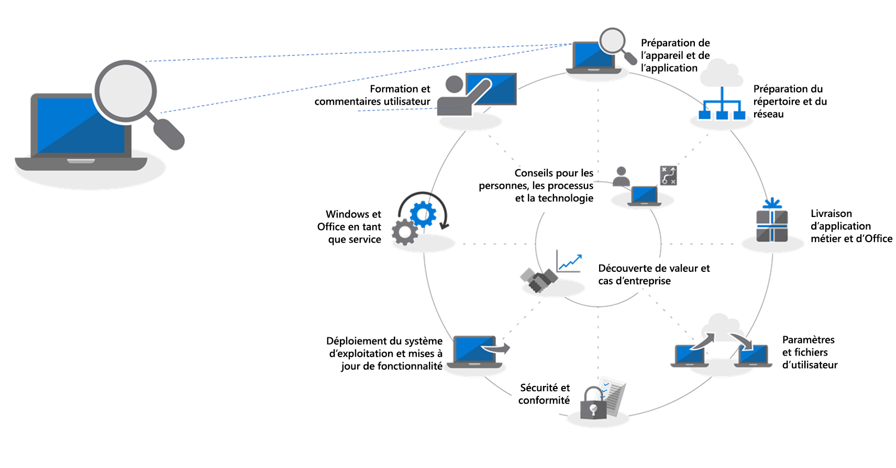
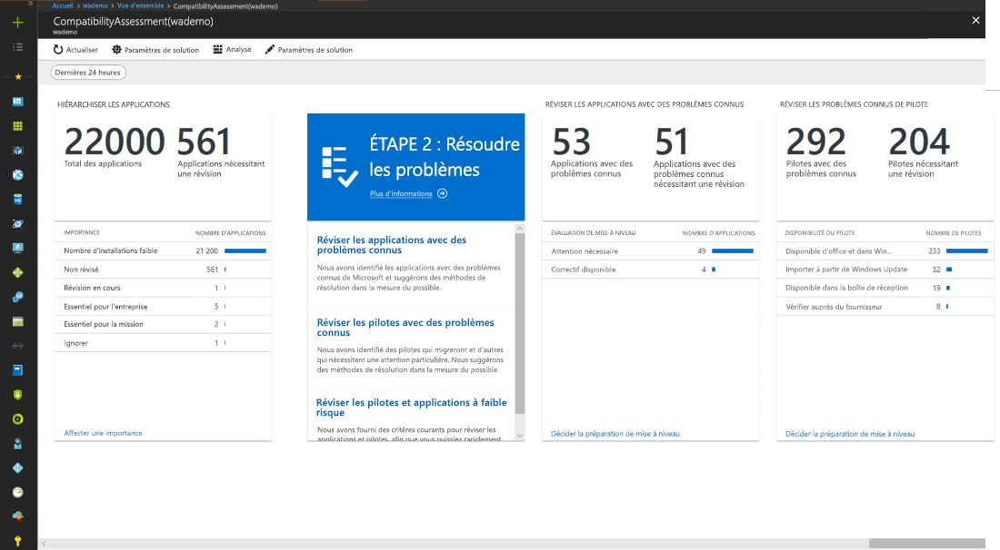
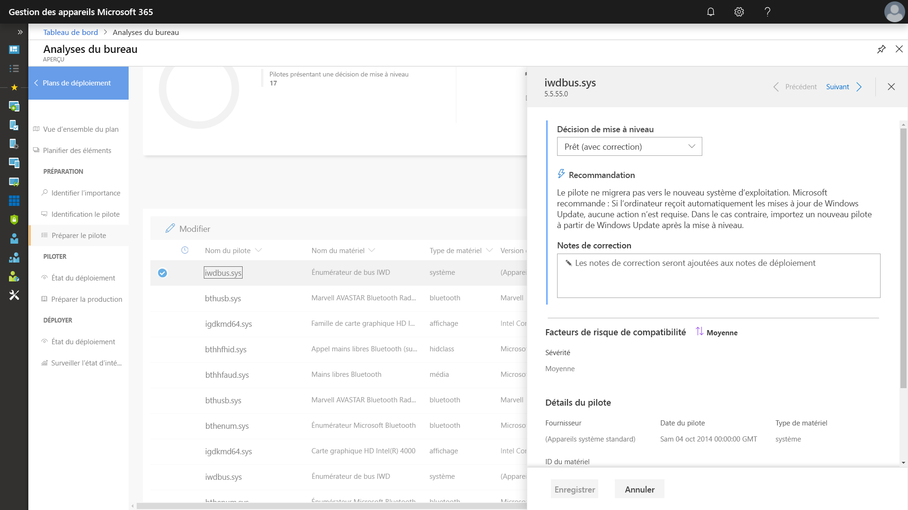
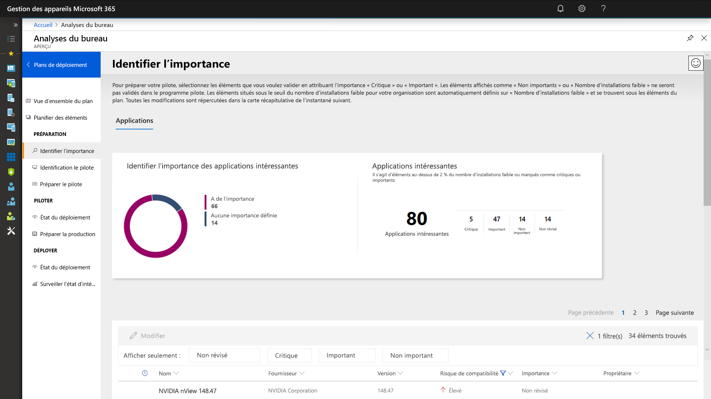
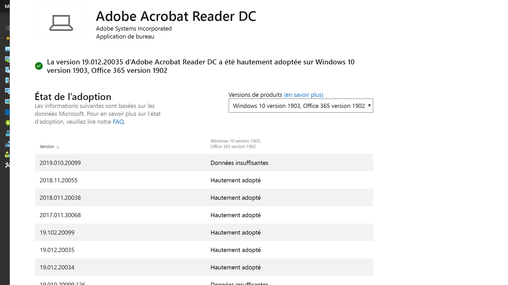
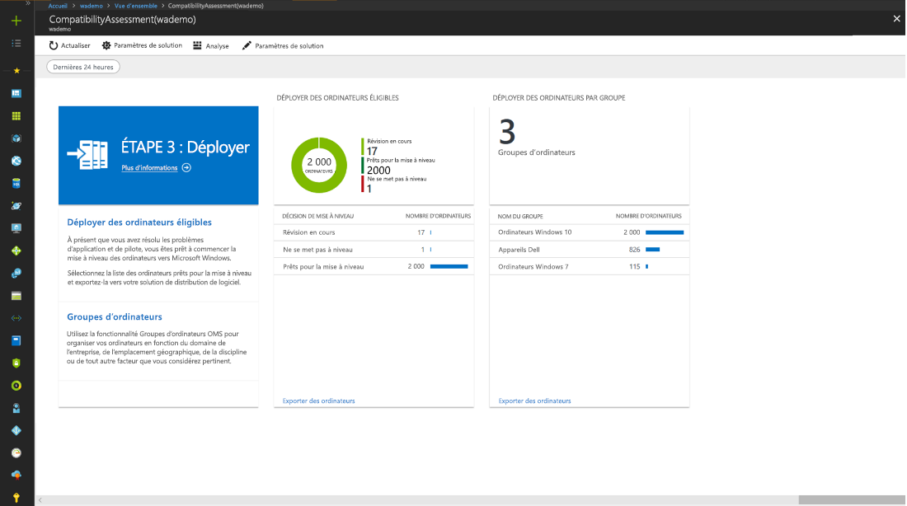

# Étape 1 : disponibilité des applications et des périphériques

<table>
<thead>
<td></td>
<td>
<strong>Étape 1 : préparation des applications et des appareils</strong>

Commencez votre projet de déploiement d’ordinateurs de bureau par un inventaire de vos périphériques et applications, classez-les par ordre de priorité, testez les périphériques et les applications privilégiés, puis faites les corrections nécessaires en vue du déploiement.
</td>
<td></td>
</thead>
</table>

>[!NOTE]
>La disponibilité des applications et des périphériques est la première étape de notre processus de déploiement recommandé en couvrant les aspects holistiques de la compatibilité du matériel et des applications.  Pour voir le processus complet de déploiement du bureau, visitez le [Centre de déploiement de bureau](https://aka.ms/HowToShift).
>

La compatibilité du matériel et des applications était autrefois un obstacle majeur à la mise à niveau des ordinateurs de bureau des utilisateurs. La bonne nouvelle lorsque vous planifiez votre déploiement vers Windows 10 et Office 365 ProPlus est que la grande majorité des applications créées au cours des 10 dernières années s’exécute sur Windows 10, et les compléments COM et les macros VBA utilisés par votre organisation sur les versions d’Office remontant jusqu’à Office 2010 continueront de fonctionner avec les dernières versions d’Office, sans modification.

Cela étant dit, selon la taille et l’âge de votre organisation, vérifier la compatibilité du matériel et des applications est probablement toujours une étape essentielle initiale de notre processus de déploiement de 8 étapes recommandé.

Dans cet article, nous vous présentons cette première phase (disponibilité des applications et des périphériques) utilisant les outils d’évaluation de la préparation Microsoft incluant Desktop Analytics, une solution informatique intelligente basée sur le cloud livrée avec votre licence Windows.

## Analyse de compatibilité Windows 10  

Avant de déployer Windows 10, Microsoft recommande la vérification de la préparation de vos appareils existants exécutant Windows 7 ou 8/8.1. Le média d’installation de Windows 10 prend en charge un commutateur de ligne de commande pour setup.exe pour exécuter la mise à niveau, mais qui vérifie uniquement la compatibilité, et n’effectue pas réellement la mise à niveau. ScanOnly peut être exécuté en tant que fichier de commandes scripté ou intégré dans une séquence de tâches System Center Configuration Manager, notamment la possibilité d’exécuter ScanOnly directement à partir du réseau afin que le support d’installation de Windows 10 ne soit pas diffusé en continu vers l’appareil local. Lorsque ScanOnly se termine, les résultats sont affichés via les codes de retour dans les fichiers journaux générés par Setup.EXE.   

Un exemple de ligne de commande ScanOnly qui termine l’analyse de compatibilité en mode silencieux doit ressembler à l’exemple ci-dessous :

    Setup.EXE /Auto Upgrade /Quiet /NoReboot /Compat ScanOnly

Pour plus d’informations sur ScanOnly et les autres commutateurs de commande de configuration Windows, voir [Options de ligne de commande de configuration Windows](https://aka.ms/setupswitches).

## Outil recommandé : Desktop Analytics

Desktop Analytics offre plusieurs avantages par rapport aux systèmes de gestion de bureau traditionnels et est notre outil recommandé. Il est sans agent et vous guide à travers les activités devant être effectuées en utilisant les informations de compatibilité d’application et de pilote recueillies via la mise à niveau de centaines de millions de PC de consommateurs. Cette information vous donne une évaluation détaillée identifiant les problèmes de compatibilité qui peuvent empêcher la mise à niveau, avec des liens vers des correctifs suggérées connus par Microsoft.

Pour configurer Desktop Analytics, vous devez tout d’abord configurer un abonnement Azure et inclure un espace de travail Azure Log Analytics à celui-ci. Une fois le service Desktop Analytics en cours d’exécution, vous pouvez inscrire n’importe quel appareil Windows 7 SP1 ou plus récent connecté à Internet via les paramètres de stratégie de groupe ; c’est aussi simple que cela. Il n’y a aucune agent à déployer et le flux de travail visuel de Desktop Analytics vous guide à partir du pilote au déploiement en production. Si vous le souhaitez, vous pouvez exporter des données de Desktop Analytics à des outils de déploiement de logiciels tels que System Center Configuration Manager (Current Branch), pour cibler des PC directement et créer des collections de sites dès que celles-ci sont prêtes pour le déploiement.

Si Desktop Analytics n’est actuellement pas configuré pour votre environnement ou si vous souhaitez télécharger une version d’évaluation, accédez à la page Desktop Analyticshttp://www.aka.ms/desktopanalytics) et lancez-vous.

## Processus de disponibilité des applications et des périphériques

Disponibilité des applications et des périphériques comprend quatre étapes : 1. Inventaire, 2. Hiérarchisation, 3. Test, 4. Correction. Regardons chacune de ces étapes plus en détail.

### 1\. Inventaire

Desktop Analytics utilise un processus sans agent pour faire l’inventaire des ordinateurs et des applications au sein de votre parc d’ordinateurs de bureau. Il fournit également des rapports sur les applications et les sites Internet très régulièrement consultés, et les emplacements intranet pour vous aider avec les tests de compatibilité ultérieurement.

### 2\. Hiérarchisation

Avec l’inventaire, Desktop Analytics vous aide à identifier et à hiérarchiser les applications et le matériel les plus fréquemment utilisés dans votre organisation et les tâches à prioriser pour débloquer autant de PC que possible pour le déploiement.

Il fournit également des conseils pour vous aider à évaluer les mises à jour nécessaires pour résoudre les problèmes lors de l’étape suivante : test.

### 3\. Tests

Vous constaterez que la plupart des applications, pilotes et compléments de l’inventaire fonctionnent tels quels. Pour les éléments que Desktop Analytics évalue comme ayant un problème, l’outil vous fournit des informations incluant où trouver des mises à jour de version pour résoudre les problèmes de compatibilité. Au lieu de consacrer du temps et des ressources pour résoudre des problèmes complexes dans des applications non critiques, faiblement déployées et appareils plus anciens, vous pouvez choisir à la place de travailler avec des utilisateurs pour retirer et remplacer ces éléments.

Vous pouvez utiliser Desktop Analytics pour également évaluer les problèmes de compatibilité avec le navigateur, en identifiant les sites et applications web auxquels les utilisateurs accèdent en utilisant toujours des contrôles ActiveX, des objets d’assistance du navigateur, le langage de script VBScript ou d’autres technologies héritées non prises en charge par le navigateur Microsoft Edge. Ces sites nécessitent toujours d’utiliser Internet Explorer 11, et vous pouvez les ajouter à la [liste des sites en mode Entreprise](https://docs.microsoft.com/fr-FR/microsoft-edge/deploy/emie-to-improve-compatibility) à l’aide d’Enterprise Mode Site List Manager.

En outre, pour vous aider dans votre migration vers Office 365 ProPlus, vous pouvez utiliser le [Kit de ressources de préparation pour Office](https://docs.microsoft.com/fr-FR/deployoffice/use-the-readiness-toolkit-to-assess-application-compatibility-for-office-365-pro) pour tester la compatibilité de vos compléments et des macros Microsoft Visual Basic pour Applications (VBA).

### 4\. Mesures correctives

La phase finale de la disponibilité des applications et des périphériques consiste à « corriger ».  Ici, vous allez collecter les packages de pilotes et de logiciels requis et vous allez les utiliser pour remplacer ou mettre à jour les versions antérieures dans le cadre du processus de déploiement.

À mesure que vous avancez dans la liste et que vous corrigez les problèmes, vous observez que de plus en plus de PC deviennent « Prêt pour le déploiement ». Cela signifie que les pilotes et les applications sur les PC sont indiqués comme étant compatibles avec la version de Windows 10 que vous ciblez pour le déploiement.

### Inventaire logiciel Configuration Manager pour Hiérarchisation d’Application 

Inventaire logiciel Configuration Manager est une alternative à l’utilisation des solutions analytiques basées sur le cloud pour la préparation des applications et des périphériques. Vous pouvez utiliser le nombre d’installations et explorer des ordinateurs spécifiques pour permettre de hiérarchiser des tests de compatibilité et de validation et définir des packages d’application comme compatibles avec Windows 10 via les paramètres de package. Même si cette option ne propose pas la possibilité de comparer des informations de compatibilité connues par les services de Microsoft Analytics, cela peut être une solution efficace pour cibler un ensemble réduit d’applications par ordre de priorité pour les tests manuels. 

Pour plus d’informations, voir [Introduction à l’inventaire de logiciel dans System Center Configuration Manager](https://docs.microsoft.com/fr-FR/sccm/core/clients/manage/inventory/introduction-to-software-inventory) et définir les exigences de la plateforme de packages d’application dans [Packages et programmes dans System Center Configuration Manager](https://docs.microsoft.com/fr-FR/sccm/apps/deploy-use/packages-and-programs).

## Desktop App Assure

Un autre outil pour vous aider avec la compatibilité entre les applications Windows 10 et Office 365 ProPlus est le programme [Desktop App Assure](https://aka.ms/desktopappassure) disponible via le centre FastTrack. Via Desktop App Assure en cas de problèmes de validité de l’application, un ingénieur Microsoft travaillera avec vous sans frais supplémentaires pour vous aider à solutionner l’incompatibilité des applications.

## Utilisation des outils de données de diagnostic continu

Desktop Analytics n’est pas un outil qui vous permet de basculer vers Windows 10 et Office 365 ProPlus. Une fois que vos ordinateurs de bureau exécutent Windows 10 et Office 365, vous pouvez l’utiliser pour vous aider à maintenir votre déploiement et à gérer les mises à jour de fonctionnalités semi-annuelles afin de rester à jour.

## Étape suivante 

## [Étape 2 : disponibilité des répertoires et des réseaux](https://aka.ms/mdd2)