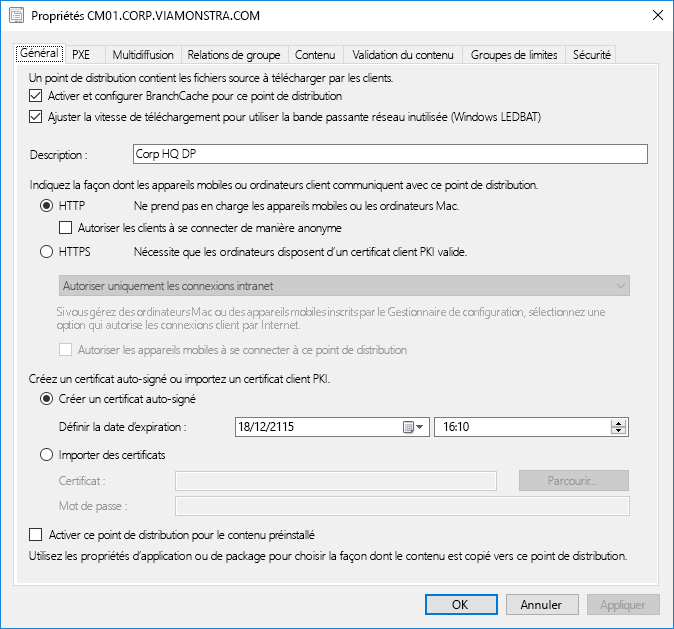
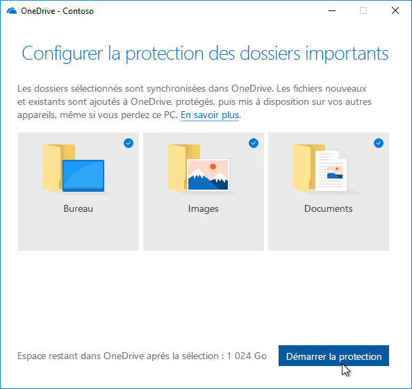

# Étape 2 : préparation des répertoires et du réseau

Ensure your directory and the network are configured and ready to support to your shift to Windows 10 and Microsoft 365 Apps for enterprise. This will require Azure Active Directory Services to be in place for users, and your network must have the capacity to handle both its regular traffic and the movement of potentially vast amounts of data as PCs are upgraded, and users’ files, settings and applications are restored.

<table>
<thead>
<td></td>
<td>
<strong>Étape 2 : disponibilité des répertoires et des réseaux</strong>

Cloud connected services in Microsoft 365 Apps for enterprise and new deployment options like Windows Autopilot require Azure Active Directory. Your network and connectivity are also important areas to plan when moving Windows images, apps, drivers and related files to your PCs. Learn how new tools and deployment options reduce and streamline network traffic.
</td>
<td></td>
</thead>
</table>

>[!NOTE]
>La préparation des répertoires et du réseau est la deuxième étape de notre processus de déploiement recommandé. Elle s’articule autour d’Azure Active Directory et l’optimisation du réseau.  Pour voir le processus complet de déploiement du bureau, visitez le [Centre de déploiement de bureau](https://aka.ms/HowToShift).
>

Directory and Network readiness is fundamental to ensuring a smooth OS and desktop deployment. As with any automated deployment, it is important to ensure your file shares can be reached, and your network will need to be able to support the transfer of very large files, possibly to hundreds or even thousands of PCs at a time.

With your shift to Windows 10 and Microsoft 365 Apps for enterprise you also now need to make sure that cloud-based identity is set up with Azure Active Directory. This is key not only to activating Microsoft 365 Apps for enterprise, it also allows you to take advantage of modern provisioning solutions like Windows Autopilot.

Dans cet article, nous allons explorer les outils et les options pour préparer vos services d’annuaire, et les autorisations des appareils et des utilisateurs nécessaires pour déployer Windows 10 et Microsoft 365 Apps pour entreprise.

## Ajout d’Azure Active Directory

Si votre organisation utilise déjà Office 365, Exchange Online, Microsoft Intune ou les autres services Microsoft Online, la bonne nouvelle est que vous utilisez déjà Azure Active Directory. Si c’est le cas, vous devez vous assurer que les utilisateurs que vous ciblez pour le déploiement Bureau soient dans votre Azure Active Directory et disposent de licences.

Si vous n’utilisez pas actuellement Azure Active Directory, il existe des[nombreux ressources ](https://docs.microsoft.com/azure/active-directory/) pour vous aider à le configurer. Vous pouvez également bénéficier d’une assistance personnalisée via Microsoft FastTrack, dans le cadre de votre licence. Vous pouvez extraire plus d’informations sur Microsoft FastTrack [ici](https://fasttrack.microsoft.com).

Une fois Azure Active Directory configuré, vos utilisateurs peuvent se connecter aux applications Microsoft 365 Apps pour entreprise et les activer. Vous pouvez aussi utiliser le déploiement Microsoft Intune ou Windows Autopilot pour déployer automatiquement des applications et des stratégies.

## Préparation du réseau

Vous devez envisager les besoins en bande passante lorsque vous planifiez vos déploiements. Il existe trois composants principaux dans un déploiement qui a également un impact sur votre réseau – IMAGERIE PC, les mises à jour logicielles et la personnalisation de l’utilisateur. Entre eux, cela peut signifier plus 20 Go par PC pour la migration initiale et souvent 1 Go ou plus, le paiement mensuel par PC pour rester informé.

Penchons-nous quelques instants sur la configuration requise pour chacun de ces trois composants :

### Imagerie PC

Pour les Images Windows sans personnalisation, vous devez planifier généralement pour 3 Go par PC, tandis que pour les images avec des applications personnalisées, vous devez autoriser 6 Go ou plus. Vous devrez peut-être également prendre en considération les packages de pilote ; Il peuvent être quelques centaines mégaoctets par PC, parfois jusqu'à 1 Go.

### Mises à jour logicielles

Vous devez planifier la bande passante de réseau pour les mises à jour de logiciel. Windows 10 et Microsoft 365 Apps pour entreprise utilisent un nouveau modèle de service fournissant des mises à jour mensuelles et semestrielles. Si vous utilisez ce modèle, vous pouvez en apprendre davantage sur le fonctionnement [ici](https://docs.microsoft.com/windows/deployment/update/waas-overview).

The new servicing model includes Feature Updates for Windows twice a year, Office Semi-Annual Enterprise Channel Updates, and monthly Quality Updates. Feature Updates are typically 2 – 4GB in size, and Office Semi-Annual Enterprise Channel updates are 300 – 400 MB per update. Then there are the monthly Quality Updates. These may range from a few hundred megabytes to over a gigabyte. This is because monthly updates are cumulative, so these increase in size over the servicing lifetime for each Windows 10 version. That said, there are tools that can help reduce the amount of data that must pass over the network to implement updates. We will cover this in more detail below.

### Personnalisation utilisateur

The third component to consider is user personalization. Here you need to plan network bandwidth to accommodate the restoring of user files, their settings, and their applications as part of the PC refresh or replacement process. Together, these items often exceed 20 GB per PC; for some users these may exceed 100 GB.

## Limitation de la bande passante

One way to limit the impact of deployment-related traffic on the network is to throttle it using the BITS (Background Intelligent Transfer Service) setting on clients. BITS uses an Adaptive Bit Rate (ABR) to adjust bandwidth available for deployment purposes; it can be configured on clients using Group Policy.

[À propos de BITS](https://docs.microsoft.com/windows/desktop/bits/about-bits)

Si vous utilisez Microsoft Endpoint Configuration Manager (Current Branch), vous pouvez également configurer les Points de distribution BITS ou activer la multidiffusion avec WDS.

Throttling specific traffic means that normal network traffic is less impacted by PCs downloading updates and applications. But carving out a certain percentage of bandwidth for these tasks helps ensure productivity isn’t impacted by Windows or Office deployment and processes continue to run as needed, it can worsen deployment-related downtime, with users locked out of their PCs while a deployment runs.

Heureusement, il existe de nouveaux outils pour vous aider à gérer facilement l’impact d’un déploiement de bureau de grande échelle sur le réseau, tels que LEDBAT pour optimiser l’utilisation de la bande passante disponible, et les options pair à pair pour déplacer le trafic de déploiement du centre du réseau vers le réseau de périmètre.

## Nettoyage de la bande passante

L’option LEDBAT (Low Extra Delay Background Transport), pris en charge dans Windows Server 2019 et Microsoft Endpoint Configuration Manager (Current Branch), est conçue pour optimiser le trafic réseau vers les clients Windows.

[10 fonctionnalités de mise en réseau dans Windows Server 2019 : \#9 LEDBAT](https://blogs.technet.microsoft.com/networking/2018/07/25/ledbat/)

Unlike traditional throttling, LEDBAT can use all available network bandwidth as a background task, instantly yielding bandwidth when other traffic requests it. Unlike BITS there is no delay; everything is automated – no manual tuning or scheduling required, and everything is setup server side. This affords potentially massive performance gains.

## Options pair à pair

Peer-to-Peer options are increasingly being used in Windows 10 migrations, for PC imaging, software updates and user personalization. They are also valuable in facilitating build-to-build upgrades after your initial Windows 10 deployment. Here we will cover several examples to help move Windows 10 and Office-related traffic away from the center of the network, reducing the need for classic throttling approaches, and allowing PCs to find the update files they need on peers in their local network rather than downloading them from a distribution point or the internet.

**BranchCache** can help you download content in distributed environments without saturating the network. It comes in two options: Hosted Cache Mode, which lets you use local servers to cache content, and Distributed Cache Mode (a mode supported in Configuration Manager), which lets clients share already downloaded content with each other.

**Cache de l’homologue**les clients pris en charge par Configuration Manager peuvent également établir l’utilisation de Cache homologue. Cela permet aux PC fiable disponibles sur le réseau pour un source hôte pour la distribution de contenu. Vous ne voulez pas activer ceci à tous vos PC : ciblez uniquement les appareils avec des connexions de réseau fiable comme hôtes (par exemple, ordinateur de bureau, mini tour ou tour PC). Le Cache homologue peut travailler même pour les tâches de déploiement en cours d’exécution en phases de l’environnement de pré-installation Windows (WinPE) pendant l’installation.

Remarque : BranchCache et le cache d’homologue sont complémentaires et peuvent travailler ensemble dans le même environnement.

[BranchCache et cache d’homologue](https://blogs.technet.microsoft.com/swisspfe/2018/01/25/branch-cache-vs-peer-cache/)

**Optimisation de la remise** l’optimisation de remise est une autre technologie paire à paire de mise en cache, en fournissant les contrôles de réseau pour les déploiements. Optimisation de remise Windows 10 pour mettre à jour les applications intégrées UWP, également pour installer les applications sur le Microsoft Store et les mises à jour du logiciel à l’aide des mises à jour Express. Il a été disponible depuis les versions antérieures de Windows 10, même si elle a récemment intégré avec Microsoft Endpoint Configuration Manager (Current Branch). Étant donné que les nouvelles options de configuration Windows 10 version 1803 signifie que vous pouvez désormais séparément des limites de bande passante pour les mises à jour en arrière-plan et les travaux de premier plan par exemple, une installation d’application à partir du Store. Désormais, l’optimisation de la distribution Windows prend aussi en charge Microsoft 365 Apps pour entreprise lors des mises à jour client, disponibles dans l’ensemble des canaux de mise à jour client pris en charge. La prise en charge pour l’optimisation de la distribution Windows pendant l’installation initiale du client sera bientôt disponible.  

**Considérations supplémentaires pour Microsoft 365 Apps pour entreprise**

En plus de tirer parti de l’optimisation de la distribution, voici trois éléments qui vous aideront à réduire la charge de votre réseau en raison des déploiements de Microsoft 365 Apps pour entreprise.

**Binary Delta Compression** Microsoft 365 Apps for enterprise uses Binary Delta Compression to reduce bandwidth consumed by software updates when updating from the most recent release of Microsoft 365 Apps for enterprise to the next release. By only pulling the binary level changes from the previous release, the impact from month-over-month growth of cumulative updates is minimized. This has the potential of saving several hundred megabytes of data, per PC, each month. In order to use this capability though, you cannot skip releases. If you do, then the full cumulative update must be downloaded.

[Téléchargement des mises à jour des Applications Microsoft 365](https://docs.microsoft.com/deployoffice/overview-update-process-microsoft-365-apps#download-the-updates-for-microsoft-365-apps)

**Fichiers de données Outlook** Outlook est souvent configuré pour la boîte aux lettres entière des utilisateurs en locale pour une utilisation en mode hors connexion. Dans tout déploiement de Windows, à l’exception d’une mise à niveau inaltérable, il nécessite des fichiers de données Outlook que les utilisateurs reconstruisent eux-mêmes après la mise à niveau. Il s’agit d’un processus automatisé, mais avec des limites de boîtes aux lettres Outlook généralement attribuées à 100 Go, la nouvelle mise en cache de boîte aux lettres entièrement en local pour tous les utilisateurs signifie un grand nombre de transfert de données. À réduire la charge de réseau, vous souhaiterez peut-être prendre en considération l’utilisation d’une stratégie de groupe pour réduire le paramètre « Courrier à conserver hors connexion ». Dans Microsoft 365 Apps pour entreprise ou Office 2016, la valeur par défaut pour Outlook est définie sur 12 mois. Afin de réduire l’impact sur réseau, envisagez de définir la durée du cache en mode hors connexion entre 1 à 6 mois. La modification de ce paramètre n’affecte pas la taille de la boîte aux lettres en ligne et la boîte aux lettres entière peut toujours être recherchée via Outlook lorsqu’il en ligne.

**Fichiers OneDrive à la demande et déplacement des dossiers connus** OneDrive est un excellent moyen pour synchroniser et protéger les fichiers d’utilisateur depuis un ordinateur et d’autres appareils dans le cloud. Avec le déplacement des dossiers connus, vous pouvez également appliquer la synchronisation de fichiers à partir du bureau d’un utilisateur, les Documents, et les dossiers des images sur OneDrive rendant les fichiers disponibles lors de votre connexion à un nouvel appareil ou d’une reconfiguration PC. N’oubliez pas que, en raison de la taille des parois et le nombre de fichiers stockés dans des emplacements de bureau, des documents et des images, vous souhaiterez être organisé avec le déploiement des stratégies de l’activation et l’application OneDrive sur vos PCs. Une option consiste à utiliser les contrôles de réseau de stratégie de groupe pour limiter la bande passante utilisée par le service de synchronisation OneDrive.

[Configuration de la fonctionnalité « Known Folder Move »](https://techcommunity.microsoft.com/t5/Microsoft-OneDrive-Blog/Migrate-Your-Files-to-OneDrive-Easily-with-Known-Folder-Move/ba-p/207076)

[Fichiers à la demande OneDrive](https://www.microsoft.com/microsoft-365/blog/2017/05/11/introducing-onedrive-files-on-demand-and-additional-features-making-it-easier-to-access-and-share-files/)

Si vous n’avez pas déjà déployé OneDrive, la mission de Windows 7 vers Windows 10 est une opportunité idéale pour activer OneDrive et que celui-ci intègre parfaitement Microsoft 365 Apps pour entreprise. Envisagez de commencer ce déploiement tandis que vous travaillez via votre disponibilité d’application et d’appareil. Cela donne ne longueur d’avance à la synchronisation de fichiers avant de commencer le déplacement des images de Windows et du déploiement d’applications sur votre réseau.

## Étape suivante 

## [Étape 3 : livraison d’Office et d’applications métier](https://aka.ms/mdd3)

## Étape précédente :

## [Étape 1 : préparation des applications et des appareils](https://aka.ms/mdd1)

## Commentaires

We'd love to hear your thoughts. Choose the type you'd like to provide:

Commentaire sur un produit Se connecter pour envoyer un commentaire sur la documentation

Our new feedback system is built on GitHub Issues. Read about this change in our blog post.
