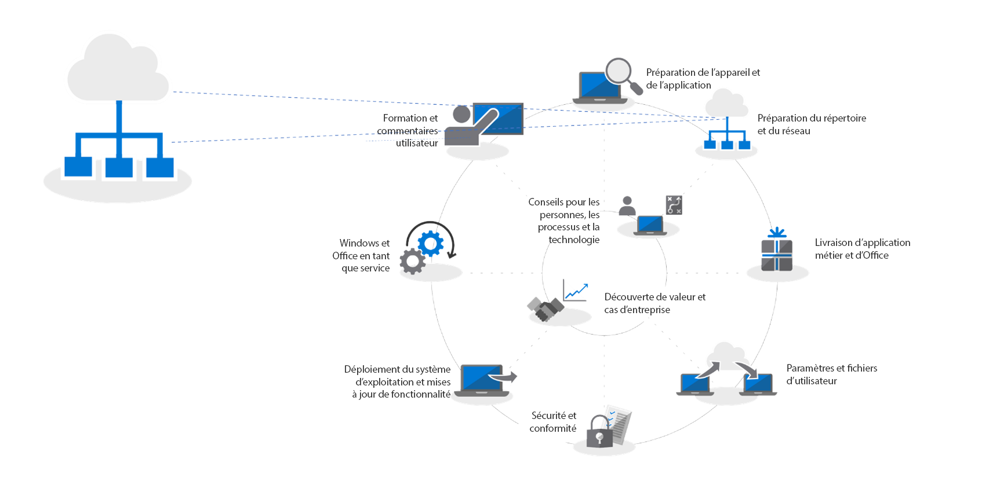
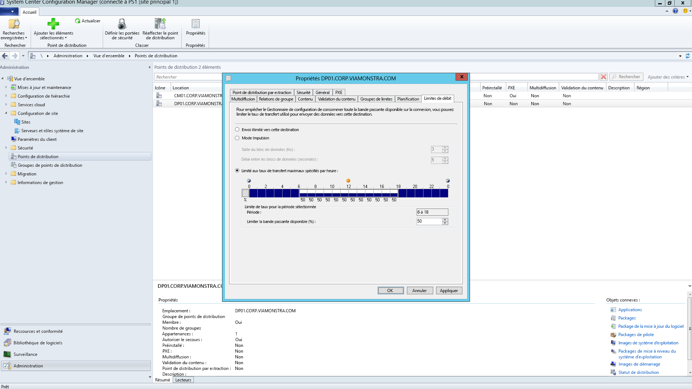
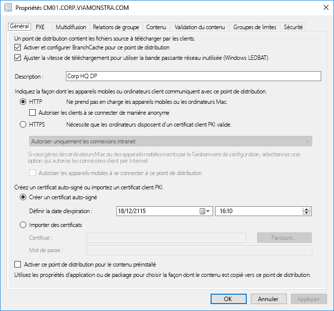
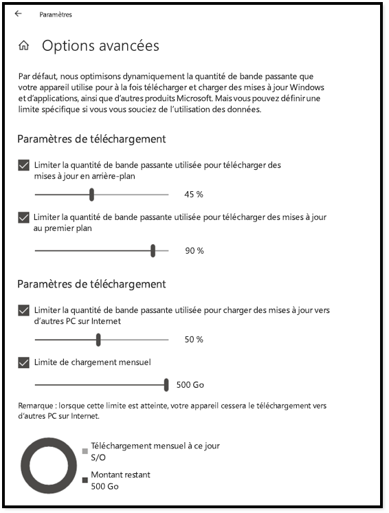
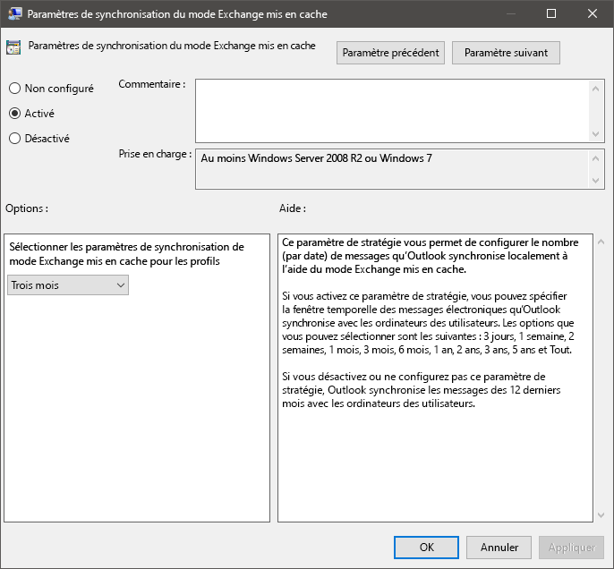
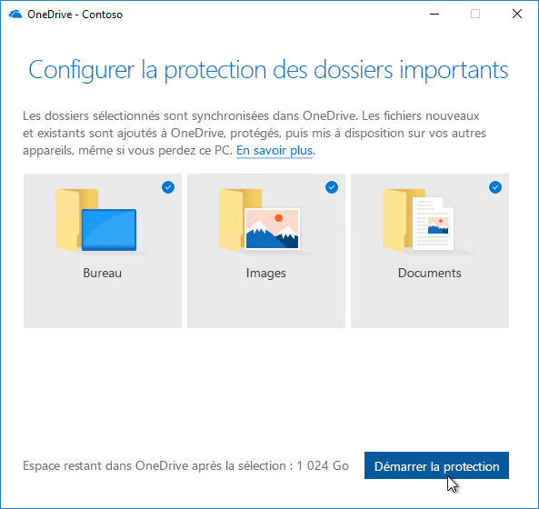

# Étape 2 : préparation des répertoires et du réseau

Vérifiez que votre répertoire et le réseau sont configurés et prêts pour la migration vers Windows 10 et Office 365 ProPlus. Les services Azure Active Directory devront être mis à disposition des utilisateurs et votre réseau doit être capable de gérer ses trafics réguliers et le déplacement éventuel d’importants volumes de données pendant la mise à niveau des PC et de la restauration des fichiers, des paramètres et des applications des utilisateurs.

<table>
<thead>
<td></td>
<td>
<strong>Étape 2 : préparation des répertoires et du réseau</strong>

Les services connectés au cloud dans Office 365 ProPlus et les nouvelles options de déploiement, telles que Windows Autopilot, nécessitent Azure Active Directory. Votre réseau et votre connectivité sont également des aspects importants pour planifier le déplacement des images, des applications, des pilotes Windows et des fichiers connexes sur votre PC. Découvrez comment les nouveaux outils et les nouvelles options de déploiement réduisent et rationalisent le trafic réseau.
</td>
<td></td>
</thead>
</table>

>[!NOTE]
>La préparation des répertoires et du réseau est la deuxième étape de notre processus de déploiement recommandé. Elle s’articule autour d’Azure Active Directory et l’optimisation du réseau.  Pour voir le processus complet de déploiement du bureau, visitez le [Centre de déploiement de bureau](https://aka.ms/HowToShift).
>

La préparation des répertoires et du réseau est fondamentale pour garantir un déploiement fluide du système d’exploitation et du bureau. Comme dans tout déploiement automatisé, il est important de vérifier que vos partages de fichiers sont accessibles et que votre réseau pourra supporter le transfert de fichiers très volumineux vers des centaines voire des milliers de PC en même temps.

Après la migration vers Windows 10 et Office 365 ProPlus, assurez-vous également que l’identité basée sur le cloud est configurée avec Azure Active Directory. En plus d’activer Office 365 ProPlus, il vous permet de tirer parti des solutions de mise en service modernes, telles que Windows Autopilot.

Dans cet article, nous allons explorer les outils et les options pour préparer vos services d’annuaire, et les autorisations des appareils et des utilisateurs nécessaires pour déployer Windows 10 et Office 365 ProPlus.

## Ajout d’Azure Active Directory

Si votre organisation utilise déjà Office 365, Exchange Online, Microsoft Intune ou les autres services Microsoft Online, la bonne nouvelle est que vous utilisez déjà Azure Active Directory. Si c’est le cas, vous devez vous assurer que les utilisateurs que vous ciblez pour le déploiement Bureau soient dans votre Azure Active Directory et disposent de licences.

Si vous n’utilisez pas actuellement Azure Active Directory, il existe des[nombreux ressources ](https://docs.microsoft.com/azure/active-directory/) pour vous aider à le configurer. Vous pouvez également bénéficier d’une assistance personnalisée via Microsoft FastTrack, dans le cadre de votre licence Office 365. Vous pouvez vérifier plus d’informations sur Microsoft Fastrack [ici](https://fasttrack.microsoft.com).

Une fois Azure Active Directory configuré, vos utilisateurs peuvent se connecter aux applications Office 365 ProPlus et les activer. Vous pouvez aussi utiliser le déploiement Microsoft Intune ou Windows Autopilot pour déployer automatiquement des applications et des stratégies.

## Préparation du réseau

Vous devez envisager les besoins en bande passante lorsque vous planifiez vos déploiements. Il existe trois composants principaux dans un déploiement qui a également un impact sur votre réseau – IMAGERIE PC, les mises à jour logicielles et la personnalisation de l’utilisateur. Entre eux, cela peut signifier plus 20 Go par PC pour la migration initiale et souvent 1 Go ou plus, le paiement mensuel par PC pour rester informé.

Penchons-nous quelques instants sur la configuration requise pour chacun de ces trois composants :

### Imagerie PC

Pour les Images Windows sans personnalisation, vous devez planifier généralement pour 3 Go par PC, tandis que pour les images avec des applications personnalisées, vous devez autoriser 6 Go ou plus. Vous devrez peut-être également prendre en considération les packages de pilote ; Il peuvent être quelques centaines mégaoctets par PC, parfois jusqu'à 1 Go.

### Mises à jour logicielles

Vous devez planifier la bande passante de réseau pour les mises à jour de logiciel. Windows 10 et Office 365 ProPlus utilisent un nouveau modèle de service fournissant des mises à jour mensuelles et semestrielles. Si vous utilisez ce modèle, vous pouvez en apprendre davantage sur le fonctionnement [ici](https://docs.microsoft.com/windows/deployment/update/waas-overview).

Le nouveau modèle de service propose des mises à jour de fonctionnalité semestrielles pour Windows, des mises à jour de canal semestrielles et des mises à jour de qualité mensuelles. Les mises à jour de fonctionnalité représentent généralement 2-4 Go et les mises à jour de canal Office semestrielles correspondent à 300-400 Mo par mise à jour. Quant aux mises à jour de qualité mensuelles, elles peuvent représenter entre quelques centaines de mégaoctets et un gigaoctet ou plus. Comme ces mises à jour mensuelles sont cumulatives, leur taille augmente pendant toute la durée de service de chaque version de Windows 10. Des outils peuvent vous aider à réduire le volume de données qui transitent sur le réseau pour implémenter les mises à jour. Nous aborderons ce sujet plus en détail plus loin dans cet article.

### Personnalisation utilisateur

Le troisième composant à prendre en compte est la personnalisation utilisateur. La bande passante réseau doit pouvoir supporter la restauration des fichiers utilisateur, de leurs paramètres et de leurs applications dans le cadre du processus d’actualisation ou de remplacement des PC. Au total, ces éléments représentent souvent plus de 20 Go par PC. Pour certains utilisateurs, ils peuvent correspondre à plus de 100 Go.

## Limitation de la bande passante

Pour limiter l’impact du trafic lié au déploiement sur le réseau, vous pouvez limiter la bande passante réseau à l’aide du paramètre BITS (Background Intelligent Transfer Service) disponible sur les clients. BITS utilise un débit binaire adaptatif (Adaptive Bit Rate, ABR) pour ajuster la bande passante nécessaire au déploiement. Il peut être configuré sur les clients à l’aide d’une stratégie de groupe.

[À propos de BITS](https://docs.microsoft.com/windows/desktop/bits/about-bits)

Si vous utilisez le System Center Configuration Manager (Current Branch), vous pouvez également configurer les Points de distribution BITS ou activer la multidiffusion avec WDS.

En limitant un trafic spécifique, vous pouvez réduire l’impact du téléchargement des mises à jour et des applications des PC sur le trafic réseau normal. Le fait de dissocier un certain pourcentage de bande passante pour ces tâches vous permet d’éviter que le déploiement de Windows ou d’Office affecte la productivité et de veiller à ce que les processus continuent d’être exécutés au besoin. Le temps d’arrêt lié au déploiement peut être plus long et les utilisateurs ne peuvent pas accéder à leur ordinateur pendant l’exécution d’un déploiement.

Heureusement, il existe de nouveaux outils pour vous aider à gérer facilement l’impact d’un déploiement de bureau de grande échelle sur le réseau, tels que LEDBAT pour optimiser l’utilisation de la bande passante disponible, et les options pair à pair pour déplacer le trafic de déploiement du centre du réseau vers le réseau de périmètre.

## Nettoyage de la bande passante

L’option LEDBAT (Low Extra Delay Background Transport), pris en charge dans Windows Server 2019 et System Center Configuration Manager (Current Branch), est conçue pour optimiser le trafic réseau vers les clients Windows.

[10 fonctionnalités de mise en réseau dans Windows Server 2019 : \#9 LEDBAT](https://blogs.technet.microsoft.com/networking/2018/07/25/ledbat/)

Contrairement aux options de limitation traditionnelles, LEDBAT peut utiliser toute la bande passante réseau disponible comme tâche en arrière-plan, produisant instantanément de la bande passante quand un autre trafic en demande. Contrairement à BITS, LEDBAT agit sans délai. Tout est automatisé (pas de planification ou de réglage manuel) et tout est configuré côté serveur. Cela peut générer des gains de performances considérables.

## Options pair à pair

Les options pair à pair sont progressivement utilisées dans les migrations de Windows 10 (imagerie PC, mises à jour logicielles et personnalisation utilisateur). Elles sont également utiles pour faciliter les mises à niveau build à build après le déploiement initial de Windows 10. Ici, nous allons vous présenter plusieurs exemples pour vous aider à éloigner le trafic lié à Windows 10 et Office du centre de réseau, en évitant de limiter la bande passante tout en aidant les PC à trouver les fichiers de mise à jour nécessaires sur des PC homologues de leur réseau local, au lieu de les télécharger à partir d’un point de distribution ou d’Internet.

**BranchCache** peut vous aider à télécharger du contenu dans des environnements distribués sans saturer le réseau. Il propose deux options : le mode Cache hébergé, qui vous permet d’utiliser des serveurs locaux pour mettre en cache du contenu, et le mode Cache distribué (mode pris en charge dans le System Center Configuration Manager), qui permet aux clients de partager du contenu déjà téléchargé entre eux.

**Cache de l’homologue**les clients pris en charge par System Center Configuration Manager peuvent également établir l’utilisation de Cache homologue. Cela permet aux PC fiable disponibles sur le réseau pour un source hôte pour la distribution de contenu. Vous ne voulez pas activer ceci à tous vos PC : ciblez uniquement les appareils avec des connexions de réseau fiable comme hôtes (par exemple, ordinateur de bureau, mini tour ou tour PC). Le Cache homologue peut travailler même pour les tâches de déploiement en cours d’exécution en phases de l’environnement de pré-installation Windows (WinPE) pendant l’installation.

Remarque : BranchCache et le cache d’homologue sont complémentaires et peuvent travailler ensemble dans le même environnement.

[BranchCache et cache d’homologue](https://blogs.technet.microsoft.com/swisspfe/2018/01/25/branch-cache-vs-peer-cache/)

**Optimisation de la remise** l’optimisation de remise est une autre technologie paire à paire de mise en cache, en fournissant les contrôles de réseau pour les déploiements. Optimisation de remise Windows 10 pour mettre à jour les applications intégrées UWP, également pour installer les applications sur le Microsoft Store et les mises à jour du logiciel à l’aide des mises à jour Express. Il a été disponible depuis les versions antérieures de Windows 10, même si elle a récemment intégré avec System Center Configuration Manager (Current Branch). Étant donné que les nouvelles options de configuration Windows 10 version 1803 signifie que vous pouvez désormais séparément des limites de bande passante pour les mises à jour en arrière-plan et les travaux de premier plan par exemple, une installation d’application à partir du Store. Désormais, l’optimisation de la remise Windows prend en charge également Office 365 ProPlus pendant client mises à jour, disponibles dans l’ensemble des canaux de mise à jour pris en charge du client Office 365. La prise en charge pour l’optimisation de remise Windows pendant l’installation initiale du client Office 365 sera prochainement disponible.  

**Autres considérations liées à Office 365 ProPlus**

Outre l’optimisation de la remise en exploitant, Voici trois éléments qui vous aideront à réduire la charge votre réseau en raison de déploiements d’Office 365 ProPlus.

**Compression Delta binaire** Office 365 ProPlus utilise la Compression Delta binaire pour réduire la bande passante consommée par les mises à jour logicielles de la version la plus récente d’Office 365 ProPlus vers la version suivante. En chargeant uniquement les modifications au niveau binaire à partir de la version précédente, vous réduisez l’impact des mises à jour cumulatives qui s’enrichissent de mois en mois. Ainsi, vous économisez plusieurs centaines de mégaoctets de données par PC tous les mois. Cependant, pour utiliser cette fonctionnalité, vous ne pouvez pas sauter une version sinon la mise à jour cumulative complète doit être téléchargée.

[Téléchargement des mises à jour pour Office 365](https://docs.microsoft.com/deployoffice/overview-of-the-update-process-for-office-365-proplus#download-the-updates-for-office-365-proplus)

**Fichiers de données Outlook** Outlook est souvent configuré pour la boîte aux lettres entière des utilisateurs en locale pour une utilisation en mode hors connexion. Dans tout déploiement de Windows, à l’exception d’une mise à niveau inaltérable, il nécessite des fichiers de données Outlook que les utilisateurs reconstruisent eux-mêmes après la mise à niveau. Il s’agit d’un processus automatisé, mais avec des limites de boîtes aux lettres Outlook généralement attribuées à 100 Go, la nouvelle mise en cache de boîte aux lettres entièrement en local pour tous les utilisateurs signifie un grand nombre de transfert de données. À réduire la charge de réseau, vous souhaiterez peut-être prendre en considération l’utilisation d’une stratégie de groupe pour réduire le paramètre « Courrier à conserver hors connexion ». Dans Office 365 ProPlus ou Office 2016, la valeur par défaut pour Outlook est définie sur 12 mois. Afin de réduire l’impact sur réseau, envisagez de définir la durée du cache en mode hors connexion entre 1 à 6 mois. La modification de ce paramètre n’affecte pas la taille de la boîte aux lettres en ligne et la boîte aux lettres entière peut toujours être recherchée via Outlook lorsqu’il en ligne.

**Fichiers OneDrive à la demande et déplacement des dossiers connus** OneDrive est un excellent moyen pour synchroniser et protéger les fichiers d’utilisateur depuis un ordinateur et d’autres appareils dans le cloud. Avec le déplacement des dossiers connus, vous pouvez également appliquer la synchronisation de fichiers à partir du bureau d’un utilisateur, les Documents, et les dossiers des images sur OneDrive rendant les fichiers disponibles lors de votre connexion à un nouvel appareil ou d’une reconfiguration PC. N’oubliez pas que, en raison de la taille des parois et le nombre de fichiers stockés dans des emplacements de bureau, des documents et des images, vous souhaiterez être organisé avec le déploiement des stratégies de l’activation et l’application OneDrive sur vos PCs. Une option consiste à utiliser les contrôles de réseau de stratégie de groupe pour limiter la bande passante utilisée par le service de synchronisation OneDrive.

[Configuration de la fonctionnalité « Known Folder Move »](https://techcommunity.microsoft.com/t5/Microsoft-OneDrive-Blog/Migrate-Your-Files-to-OneDrive-Easily-with-Known-Folder-Move/ba-p/207076)

[Fichiers à la demande OneDrive](https://www.microsoft.com/microsoft-365/blog/2017/05/11/introducing-onedrive-files-on-demand-and-additional-features-making-it-easier-to-access-and-share-files/)

Si vous n’avez pas déjà déployé OneDrive, la mission de Windows 7 vers Windows 10 est une opportunité idéale pour activer OneDrive et que celui-ci intègre parfaitement Office 365 ProPlus. Envisagez de commencer ce déploiement tandis que vous travaillez via votre disponibilité d’application et d’appareil. Cela donne ne longueur d’avance à la synchronisation de fichiers avant de commencer le déplacement des images de Windows et du déploiement d’applications sur votre réseau.

## Étape suivante 

## [Étape 3 : livraison d’Office et d’applications métier](https://aka.ms/mdd3)

## Étape précédente :

## [Étape 1 : préparation des applications et des appareils](https://aka.ms/mdd1)

## Commentaires

Votre avis nous intéresse. Choisissez le type de commentaire dont vous aimeriez nous faire part :

Commentaire sur un produit Se connecter pour envoyer un commentaire sur la documentation

Notre nouveau système de commentaires repose sur les Problèmes GitHub. Lisez notre billet de blog pour en savoir plus sur cette nouveauté.
