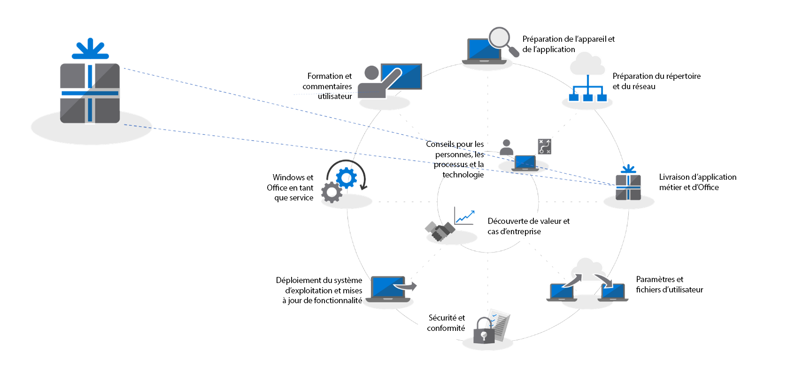
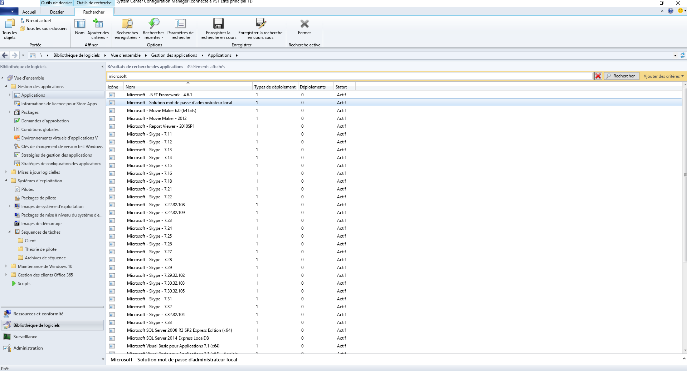
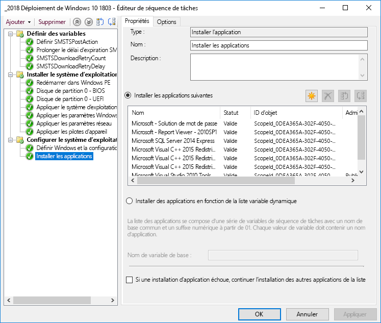
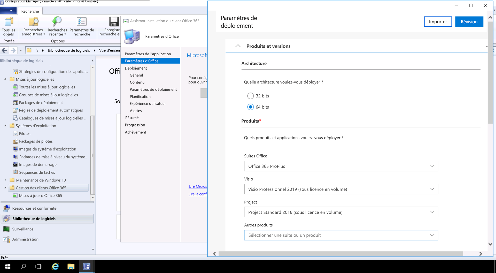

# Étape 3 : livraison d’Office et d’applications métier

<table>
<thead>
<td></td>
<td>
<strong>Étape 3 : livraison d’Office et d’applications métier</strong>

Vérifiez que vos applications sont empaquetées et prêtes pour l’installation automatisée. Découvrez comment l’empaquetage Démarrer en un clic avec Office 365 ProPlus vous offre de nouvelles options pour configurer, livrer et actualiser vos applications Office.
</td>
<td></td>
</thead>
</table>

>[!NOTE]
>Office et LOB App Delivery constituent la troisième étape dans notre roue du processus de déploiement recommandés couvrant les options pour installer et gérer Office et LOB. Pour un déploiement réussi, n’ignorez pas les deux premières étapes.  Pour afficher le processus de déploiement de bureau complet, visitez le [Centre de déploiement de Bureau](https://aka.ms/HowToShift).
>

Vous êtes désormais prêt à livrer Office et votre ligne d’applications métier. Pour ce faire, il existe plusieurs méthodes, y compris de nouvelles options intéressantes. Tandis que certaines applications sont uniquement disponibles en tant que deux versions compilées 32 bits ou 64 bits, d’autres personnes par exemple, Office 365 ProPlus proposent les deux en tant que code compilé natif 32 bits et 64 bits et une des principales décisions que vous ne devez pas effectuer est la version à déployer. Pour tirer parti de la puissance de calcul supplémentaire et RAM sur les nouveaux appareils, Microsoft recommande l’utilisation de la version 64 bits lorsqu’il n’existe aucune dépendances 32 bits. Pour déterminer les compléments ou les défis de compatibilité liés aux fichiers, vous devrez le recommander pour revisiter l’étape 1 appareil et la disponibilité de l’application avant de poursuivre.

Si rien ne vous en empêche, nous vous recommandons de déployer les versions 64 bits de toutes les applications, y compris Microsoft Office. Les applications natives compilées 64 bits offrent les meilleures performances et constituent le choix le plus fiable.

Il existe beaucoup de méthodes et de modèles permettant l’installation d’applications sur Windows. Examinons vos options de livraison.

[Gestion des applications Windows 10](https://docs.microsoft.com/windows/application-management/)

## Déploiements basés sur MSI

Pour votre ligne d’applications métier, vous allez probablement utiliser des packages basés sur MSI ou des fichiers exécutables et installer des applications dans le cadre d’une séquence de tâches de déploiement de systèmes d’exploitation OS. Windows 10 continue de fonctionner avec ces packages.

Les outils de déploiement de logiciels tels que Microsoft Endpoint Configuration Manager et Microsoft Intune sont également optimisés pour livrer des applications empaquetées par MSI. Une fois que vous avez validé vos applications sur Windows 10, vous pouvez utiliser Microsoft Endpoint Configuration Manager (branche actuelle) pour la livraison des applications. Si vous utilisez le portail d’entreprise dans Microsoft Intune, vous pouvez étendre le choix des applications informatiques sanctionnées disponibles à votre organisation pour inclure les applications les plus récentes et permettre aux utilisateurs de sélectionner eux-mêmes ce dont ils ont besoin.

## Imagerie PC

Une autre méthode populaire de remise application est IMAGERIE PC. Dans ce cas, les applications sont soit installées via la séquence des tâches ou manuellement sur un échantillon PC, une image de système est capturée avec les applications requises déjà installées. L’approche d’images pour concevoir et capturer peut faire gagner du temps lors de la mise en service de nouveaux PC mais n’oubliez pas que les systèmes d’exploitation et les applications au sein de l’image peuvent devenir obsolètes rapidement. Le modèle de mise à jour Cumulative dans Windows 10 et Office 365 ProPlus vous aider avec ce problème, mais ne l’éliminez pas complètement. C’est pourquoi nous vous recommandons une approche d’images fines, où vos applications sont installées à partir de l’extérieur de l’image au moment du déploiement.

Si vous ne voulez pas inclure Office 365 ProPlus dans votre image, n’oubliez pas que cette approche utilise une activation utilisateur ; elle ne peut pas être activée au préalable par l’administrateur système. Utilisez l’outil Déploiement d’Office pour installer préalablement Office sur le périphérique dont vous présentez l’imagerie et ignorer la connexion utilisateur.  Une fois l’image déployée, les utilisateurs finaux peuvent se connecter à l’aide de leurs informations d’identification Office 365 et activer Office 365 ProPlus.

[Créer une séquence de tâches pour installer un système d’exploitation](https://docs.microsoft.com/configmgr/osd/deploy-use/create-a-task-sequence-to-install-an-operating-system)

[Déploiement d’Office 365 ProPlus dans le cadre d’une image du système d’exploitation](https://docs.microsoft.com/deployoffice/deploy-office-365-proplus-as-part-of-an-operating-system-image)

## Office « Démarrer en un clic »  

Office 365 ProPlus est installé à l’aide d’un clic et en un clic remplace le package basé sur MSI dans toutes les versions de la prochaine publication 2019 Office pour Windows. Il affiche un nombre d’avantages, y compris des installations plus rapides, une mise à jour rapide et plus efficace et une désinstallation plus nette. 

Les programmes remis via Click-to-Run réalisent des tâches dans un environnement virtuel application sur votre ordinateur et donc coexistent avec d’autres applications sans conflit ; ils prennent également environ la moitié de l’espace du disque qu’ils prendraient en tant que package MSI. Les applications Office sont remises et gérées via l’[Outil de Déploiement d’Office](https://www.microsoft.com/download/details.aspx?id=49117) qui est le moteur d’installation Office nécessaire pour télécharger, configurer et personnaliser vos applications Office. L’outil de Déploiement d’Office lit un fichier XML de configuration qui fournit les métadonnées des instructions sur la configuration et la personnalisation de votre installation d’Office.

Microsoft recommande l’utilisation de l’[outil de personnalisation Office](https://config.office.com/) pour personnaliser les paramètres de déploiement et de créer votre fichier XML de configuration. Via l’Outil de Personnalisation Office, vous pouvez définir les applications et les langues seront installées, comment les applications seront mis à jour, les préférences d’applications et les paramètres d’expérience d’installation.

Si vous utilisez l’outil Microsoft Endpoint Configuration Manager, vous pouvez toujours l’utiliser pour le déploiement large d’Office 365 ProPlus. Microsoft Endpoint Configuration Manager (branche actuelle) assure la prise en charge native de l’outil de personnalisation Office mis à jour, la personnalisation de package pour Démarrer en un clic au moment de l’installation et la prise en charge native pour la gestion des mises à jour logicielles après l’installation.

[Guide de déploiement pour Office 365 ProPlus](https://docs.microsoft.com/deployoffice/deployment-guide-for-office-365-proplus)

[Suppression des versions MSI existantes d’Office lors de la mise à niveau vers Office 365 ProPlus](https://docs.microsoft.com/deployoffice/upgrade-from-msi-version)

[Gérer Office 365 ProPlus avec le gestionnaire de configuration](https://docs.microsoft.com/configmgr/sum/deploy-use/manage-office-365-proplus-updates)

[Affecter des applications Office 365 à des périphériques Windows 10 avec Microsoft Intune](https://docs.microsoft.com/intune/apps-add-office365)

## Applications basées sur navigateur

Voici quelques points à prendre en compte pour vous assurer que vos applications sur navigateur continuent de fonctionner comme prévu. Si vous avez des applications et des sites web spécifiques ayant des problèmes de compatibilité avec Microsoft Edge, vous pouvez utiliser la liste de sites du mode Entreprise afin que les sites web s’ouvrent automatiquement à l’aide d’Internet Explorer 11.

De plus, si vous savez que vos sites intranet ne vont pas fonctionner correctement avec Microsoft Edge, vous pouvez configurer tous les sites intranet de façon à ce qu’ils s’ouvrent automatiquement avec Internet Explorer 11. Ce processus utilise un fichier XML pour déterminer si Internet Explorer 11 est utilisé pour chaque site et une stratégie de groupe pour appliquer les paramètres.

[Présentation du mode Entreprise](https://docs.microsoft.com/internet-explorer/ie11-deploy-guide/what-is-enterprise-mode#what-is-enterprise-mode)

Nous avons abordés jusqu'à présent, les méthodes de déploiement connues. Mais il existe deux nouvelles approches de déploiement pour les applications que vous pouvez prendre en considération.

## Microsoft Store pour Entreprises 

Microsoft Store pour Entreprises fournit une grande souplesse afin de découvrir, d’acquérir, de gérer et de distribuer les applications gratuites et payantes pour les appareils Windows 10 à l’échelle. En tant qu’un administrateur informatique, vous pouvez publier les applications Microsoft Store sélectionnées, ainsi que vos propres applications personnalisées, sur votre propre magasin privé tout en appliquant et nouveau à l’aide de licences selon vos besoins. Vos utilisateurs sont dirigés vers cette banque uniquement et donc peuvent uniquement rechercher et installer les applications approuvées.

Les applications Store peuvent être créées de manière native en tant qu’applications UWP ou vous pouvez utiliser le Pont du bureau pour empaqueter à nouveau vos applications existantes pour le Store et ajouter des expériences modernes pour Windows 10. Excepté le code que vous utilisez pour égayer vos expériences Windows 10, votre application reste inchangée et continue de s’exécuter en mode utilisateur de confiance totale.

## Mise en conteneur MSIX

Une nouvelle option de package de l’application est MSIX. MSIX utilise la technologie de conteneurs disponibles dans Windows, en combinant les meilleures aspects de package en un clic, UWP et MSI. Grâce à des outils des programmes d’installation de migration existants comme EXE, MSI, APPV et APPX directement à MSIX nous observons que CONTENEURISATION MSIX fournit un chemin d’accès unifié pour de nombreuses technologies d’installation utilisées aujourd'hui. La prise en charge MSIX est inclus dans les versions actuelles de Windows : n’importe quel appareil exécutant Windows 10 RS5 ou plus récentes inclut tout ce dont vous avez besoin pour installer et exécuter des applications incluses dans un package MSIX. Windows 10 intègre dynamiquement les conteneurs MSIX qu’il reçoit, tout en conservant les applications distinct à partir du système d’exploitation.

La mise en conteneur suppose la désinstallation et la suppression nettes de packages, contrairement à un grand nombre de packages basés sur MSI et EXE pouvant laisser des éléments sur le système. Cela signifie également que seules les informations d’identification d’utilisateur standard sont nécessaires pour installer les applications : vous n’avez pas besoin d’avoir des informations d’identification d’administrateur pour installer les conteneurs MSIX. Les conteneurs MSIX sont aussi plus efficaces à mettre à jour. Lorsqu’une mise à jour est publiée, l’utilisation des écarts de niveau de bloc signifie que seuls de nouveaux fichiers binaires sont appliqués, réduisant ainsi la charge de mise à jour pour assurer des déploiements plus rapides et la réduction de la consommation de la bande passante du réseau.

Vous trouverez plus d’informations sur MSIX via le [site MSIX Tech Community](https://techcommunity.microsoft.com/t5/MSIX/ct-p/MSIX)

## Étape suivante

## [Étape 4 : fichiers et paramètres utilisateur](https://aka.ms/mdd4)

## Étape précédente

## [Étape 2 : disponibilité des répertoires et des réseaux](https://aka.ms/mdd2) 