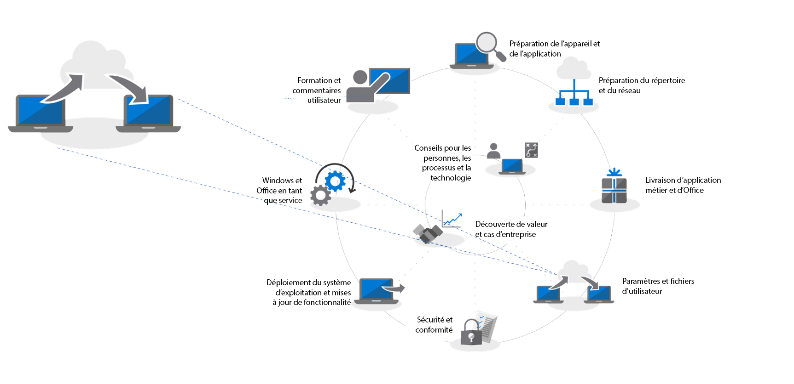

# Étape 4 : migration des paramètres et des fichiers utilisateur

Le déplacement de fichiers et paramètres d’utilisateurs vers des ordinateurs nouveaux ou actualisés est un processus critique. Tout échec est exclu. Vous pouvez migrer chaque PC manuellement ou choisir l’un des modes d’automatisation du processus. Quelle que soit la méthode de migration choisie, vous devez prendre en compte trois grands aspects : le transfert des fichiers et paramètres des utilisateurs, la gestion du démarrage de Windows 10 et la disposition de la barre des tâches.

<table>
<thead>
<td></td>
<td>
<strong>Étape 4 : paramètres et fichiers utilisateur</strong>

Lorsque vous actualisez ou remplacez des PC, gagnez du temps en automatisant la sauvegarde et la restauration de l’état utilisateur. De nouvelles options dédiées à la synchronisation des fichiers cloud vous permettent d’appliquer, par utilisateur, la synchronisation des dossiers Bureau, Documents et Images avec OneDrive afin d’assurer un accès transparent aux fichiers à partir de nouvelles installations de Windows.
</td>
<td></td>
</thead>
</table>

>[!NOTE]
>Même si vous pouvez continuer à utiliser le processus de migration que vous avez utilisé dans le passé, en raison de votre migration vers Office 365 ProPlus, nous vous recommandons d’utiliser la fonction « Known Folder Move » de OneDrive (voir ci-après). Pour voir le processus complet de déploiement du bureau, visitez le [Centre de déploiement du bureau moderne](https://aka.ms/HowToShift).
>

L’une des tâches les plus délicates et souvent les plus manuelles d’un déploiement à grande échelle est le transfert des fichiers et des paramètres de vos utilisateurs. Dans cet article, nous allons aborder les options disponibles pour migrer les utilisateurs vers de nouveaux PC, des PC actualisés et remis en image.

## Migration manuelle

Pour décider ce qu’il faut conserver lors du transfert vers un nouveau PC ou une nouvelle version de Windows, certains utilisateurs souhaitent parfois tout garder, alors que d’autres personnes saisissent cette opportunité pour nettoyer leurs lecteurs. Par conséquent, certains services informatiques choisissent de gérer la migration de fichiers utilisateur manuellement, parfois en envoyant des équipes de support rendre visite aux utilisateurs, parfois en configurant des centres de support où les utilisateurs peuvent amener leurs PC à l’équipe de support. Quoi qu’il en soit, les utilisateurs peuvent choisir les éléments à transférer ou à supprimer.

La disponibilité ou non-disponibilité de cette option dans votre organisation dépend de l’échelle de la migration planifiée. Elle est clairement limitée par le temps et les raisons physiques impliquées dans le travail direct avec les utilisateurs pour comprendre leurs besoins, copier les fichiers vers leur nouveau PC ou leur PC mis à jour récemment.

Si vous optez pour une migration manuelle, vous devez évaluer si vous pourrez terminer la tâche d’ici janvier 2020, lorsque la prise en charge de Windows 7 prendra fin. Si vous en doutez, envisagez d’utiliser l’une des options automatisées ci-après ou demandez de l’aide à d’autres personnes.

## Migration automatisée à l’aide d’USMT 

Pour les déploiements à grande échelle, vous pouvez automatiser une grande partie du processus en utilisant des outils d’automatisation de déploiement basée sur une séquence de tâches tels que System Center Configuration Manager ou Microsoft Deployment Toolkit (MDT). Ces deux solutions utilisent l’outil de migration de l’état utilisateur (USMT) dans le cadre de leur processus de déploiement de bout en bout. USMT fait partie du [Kit de déploiement et d’évaluation Windows (Windows ADK)](https://docs.microsoft.com/fr-FR/windows-hardware/get-started/adk-install).

USMT capture les comptes d’utilisateurs, les fichiers utilisateur, les paramètres du système d’exploitation et les paramètres des applications, puis les migre vers une nouvelle installation de Windows. Il vous offre aussi, en tant qu’administrateur informatique, le contrôle des éléments réellement migrés et il peut, si vous le souhaitez, exclure des types de fichiers indésirables (par exemple, des fichiers audio et vidéo ou ses fichiers exécutables).

Pendant le processus de migration, vous devrez avoir suffisamment de capacité de stockage serveur disponible pour que ce dernier agisse en tant que votre magasin de migration temporaire. USMT propose ici deux fonctionnalités importantes. Tout d’abord, il peut estimer, par PC, le volume d’espace de stockage dont vous avez besoin. Ensuite, il permet de chiffrer les magasins de migration, réduisant ainsi le risque d’être compromis lors de leur stockage sur des serveurs de fichiers.

Si vous effectuez une actualisation de PC et ne formatez pas la partition principale de Windows, vous avez également la possibilité d’utiliser un magasin de migration de lien physique avec USMT. Ce processus conserve l’état utilisateur sur le PC alors que l’ancien système d’exploitation et les anciennes applications sont supprimés et actualisés. Grâce au processus de restauration provenant de la même partition locale, cette option comprend des améliorations importantes en matière de performances et réduit le trafic réseau.

[Vue d’ensemble de l’outil de migration de l’état utilisateur (USMT)](https://docs.microsoft.com/fr-FR/windows/deployment/usmt/usmt-overview)

## Fonctionnalité Known Folder Move de OneDrive

Si vos utilisateurs sont sur OneDrive ou si vous ajoutez OneDrive dans le cadre de ce déploiement, une nouvelle option est mise à votre disposition. En utilisant le cloud pour synchroniser des fichiers utilisateur, la fonctionnalité « Known Folder Move » de OneDrive fournit un niveau de flexibilité qu’il est impossible d’atteindre avec les options de migration de fichier basé sur le réseau local. Si elle est activée avant la migration, elle fournit un accès sécurisé aux nouveaux PC ou aux PC actualisés et permet d’éliminer le besoin de créer des magasins de migration temporaire sur vos propres serveurs. Elle peut également être complètement transparente à l’utilisateur.

[Rediriger et déplacer les dossiers connus de Windows vers OneDrive](https://docs.microsoft.com/fr-FR/onedrive/redirect-known-folders)

Si vous utilisez déjà OneDrive, vous saurez que les utilisateurs peuvent sélectionner les dossiers et les emplacements qu’ils souhaitent synchroniser à partir de OneDrive ou SharePoint avec leur appareil, mais, dans ce cas, c’est à l’utilisateur final que revient la lourde tâche de la configuration. Avec la fonctionnalité Known Folder Move, vous pouvez cibler les dossiers Documents, Bureau et Images dans un profil utilisateur et tous les protéger sur OneDrive. Un utilisateur peut le faire lui-même ou vous pouvez [le faire à l’aide des paramètres de stratégie de groupe](https://docs.microsoft.com/fr-FR/onedrive/use-group-policy?redirectSourcePath=%252fen-us%252farticle%252fUse-Group-Policy-to-control-OneDrive-sync-client-settings-0ecb2cf5-8882-42b3-a6e9-be6bda30899c), ce qui est particulièrement important dans ce scénario.

Avec la fonctionnalité Known Folder Move, les utilisateurs ne changent pas leur flux de travail : tout est identique avant, pendant et après la synchronisation avec OneDrive. Grâce à la stratégie de groupe, vous pouvez même choisir ou non d’informer les utilisateurs que leurs documents, leurs images et leur bureau sont protégés dans OneDrive. Si vous choisissez de ne pas les informer, cela se produit en mode silencieux en arrière-plan. Les utilisateurs ne s’en rendent compte qu’à la remise d’un nouveau PC ou de leur PC actualisé. Dès qu’ils se connectent à leur compte OneDrive, ces fichiers seront à nouveau disponibles et seront restaurés sur leur nouveau PC. Bien entendu, OneDrive leur permet également de consulter leurs fichiers en toute sécurité et à tout moment à partir de leurs téléphones et d’autres appareils.

L’authentification pour OneDrive est assurée par Azure Active Directory. Pour obtenir une sécurité supplémentaire, vous pouvez facilement activer l’authentification multifacteur et définir des stratégies pour contrôler la bande passante de chargement et de téléchargement utilisée par OneDrive pour limiter l’activité réseau.

Vous ne devez pas migrer tous les éléments utilisés en même temps. Vous devrez peut-être effectuer le déploiement des paramètres de stratégie de groupe progressivement ou [limiter la synchronisation des fichiers aux PC joints au domaine](https://docs.microsoft.com/fr-FR/powershell/module/sharepoint-online/Set-SPOTenantSyncClientRestriction?view=sharepoint-ps).

## Personnalisation du menu Démarrer et de la barre des tâches

OneDrive est conçu pour synchroniser et protéger les fichiers et dossiers ; il ne synchronise pas les applications ou les paramètres de Windows. Pour ce faire, vous avez peut-être utilisé dans le passé la méthode de profil Copy pour configurer les mises en page standard des paramètres des menus Démarrer et des barres des tâches des utilisateurs. Dans Windows 10 Professionnel, Entreprise et Éducation, vous pouvez utiliser la stratégie de groupe, MDM, PowerShell ou l’approvisionnement en packages pour déployer les [mises en page personnalisées des menus Démarrer et des barres des tâches](https://docs.microsoft.com/fr-FR/windows/configuration/windows-10-start-layout-options-and-policies). Aucune recréation de l’image n’est requise et la mise en page peut être mise à jour en écrasant simplement le fichier .xml contenant la mise en page.

Pour créer une nouvelle mise en page, il vous suffit de configurer un système exemple et d’utiliser la cmdlet PowerShell [Export-StartLayout](https://docs.microsoft.com/fr-FR/powershell/module/startlayout/export-startlayout?view=win10-ps) pour générer un fichier XML, puis de placer ce fichier sur un partage réseau ou de le mettre en cache localement dans le cadre de votre séquence de déploiement ; il doit juste être accessible en tant que fichier en lecture seule lorsque l’utilisateur se connecte. Vous pouvez ensuite utiliser la stratégie ou la cmdlet [Import-StartLayout](https://docs.microsoft.com/fr-FR/powershell/module/startlayout/import-startlayout?view=win10-ps) pour faire référence à ce fichier.

## Suppression des applications fournies indésirables

Windows 10 inclut de nombreuses applications intégrées utiles dans le cadre de l’installation standard, mais vous pouvez supprimer certaines de ces applications de vos PC gérés et même configurer votre installation afin d’empêcher le renvoi de ces applications, par exemple XBOX ou Zune Music. Vous pouvez récupérer la liste de ces applications à l’aide des commandes [PowerShell Get-AppxPackage](https://technet.microsoft.com/fr-FR/library/hh856044.aspx) et supprimer celles que vous ne souhaitez pas utiliser à l’aide de la commande [Remove-AppxPackage](https://technet.microsoft.com/fr-FR/library/hh856038.aspx). Vous pouvez également monter le fichier image Windows (.img) en mode hors connexion avant le déploiement et extraire les packages que vous ne souhaitez pas à l’aide de l’outil de ligne de commande [Deployment Image Servicing and Management (DISM)](https://docs.microsoft.com/fr-FR/windows-hardware/manufacture/desktop/what-is-dism) et la commande [Remove-AppxProvisionedPackage](https://docs.microsoft.com/fr-FR/powershell/module/dism/remove-appxprovisionedpackage?view=win10-ps).

## Étape suivante

## [Étape 5 : considérations relatives à la sécurité et à la conformité](https://aka.ms/mdd5)

## Étape précédente

## [Étape 3 : livraison d’Office et d’applications métier](https://aka.ms/mdd3)