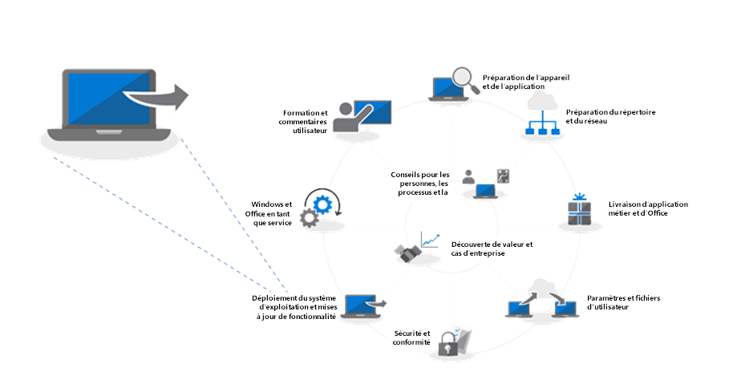
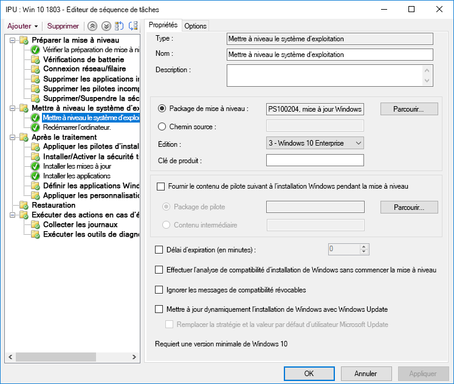
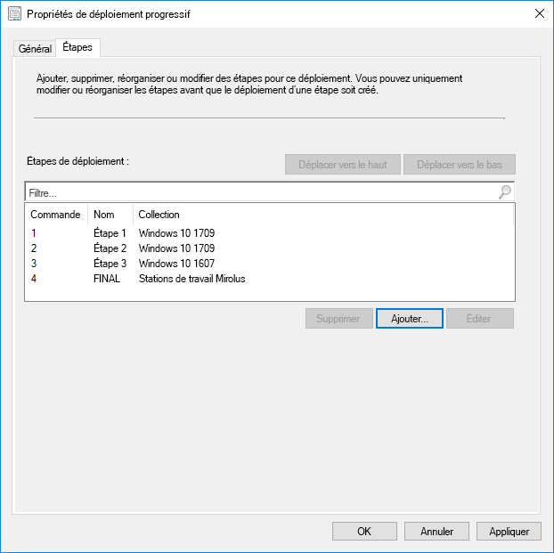
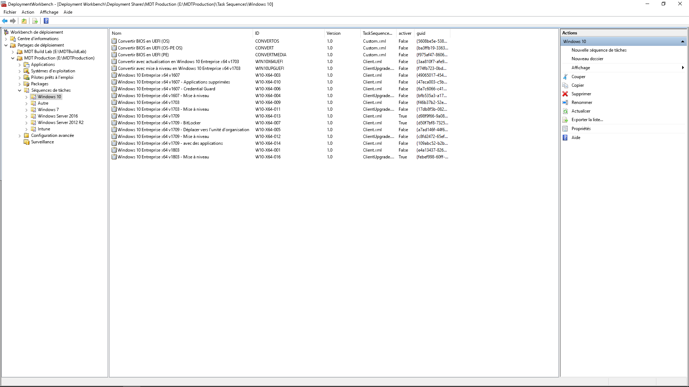

# Étape 6 : déploiement de système d’exploitation et mises à jour des fonctionnalités

<table>
<thead>
<td></td>
<td>
<strong>Étape 6 : déploiement du système d’exploitation et mises à jour des fonctionnalités</strong>

Le déploiement basé sur une séquence de tâches sert à automatiser un déploiement progressif à grande échelle pour les installations complètes, l’actualisation et le remplacement de PC. Les séquences de tâches de mise à niveau vous permettront également d’installer les principales mises à jour semi-annuelles. Windows Autopilot est un ajout récent qui modernise le processus d’acquisition d’un nouveau PC.
</td>
<td></td>
</thead>
</table>

>[!NOTE]
>Le déploiement de système d’exploitation et les mises à jour des fonctionnalités sont la sixième étape de notre processus de déploiement recommandé couvrant le déploiement de système d’exploitation Windows 10, les mises à niveau et les mises à jour de fonctionnalités. Pour afficher le processus de déploiement de bureau complet, visitez le [Centre de déploiement de Bureau](https://aka.ms/HowToShift).
>

Si vous avez suivi le processus de déploiement jusqu’ici, vous avez effectué (au moins en partie) la procédure relative à la disponibilité des applications et des périphériques, vous avez préparé votre infrastructure, configuré et collecté les packages d’application, mis en place un plan pour migrer les fichiers utilisateur et configurer les paramètres par défaut et mis en place des plans pour conserver vos contrôles de sécurité existants et, éventuellement, en déployer d’autres.

Il est désormais temps d’assembler toutes les pièces du puzzle pour automatiser autant que possible le processus d’installation de Windows 10 et d’Office 365 ProPlus, ainsi que les pilotes, les applications et tous les éléments nécessaires.

Enfin, lors d’un déploiement de système d’exploitation, le meilleur indice de réussite est de répondre aux attentes des utilisateurs et d’éviter toute perturbation dans leur travail. Dans cette étape, vous allez commencer les tests et le déploiement pour les utilisateurs pilotes dans le cadre d’un déploiement progressif. Avant d’étendre le déploiement, nous vous conseillons de passer directement à l’étape 8 de notre processus de déploiement [Communications et formation des utilisateurs](https://aka.ms/mdd8) pour vous assurer que les utilisateurs sont informés et préparés aux changements à venir et que le rythme de votre déploiement est validé en permanence à l’aide du déploiement progressif.

## Processus d’imagerie Windows

La plupart des organisations utilisent le processus d’imagerie PC pour configurer et capturer un clone de Windows, notamment un ensemble de base de quelques applications standard installées, ou une image plus fine contenant uniquement les mises à jour et les exécutions d’application. La meilleure façon de réaliser ce processus est d’utiliser une machine virtuelle à des fins d’automatisation et pour éviter les problèmes de compatibilité inattendus liés au pilote.

Si vous décidez de capturer l’image, il est préférable d’automatiser le processus autant que possible afin de garantir la meilleure qualité d’image et d’obtenir un processus renouvelable. Pour la plupart des déploiements, il est également recommandé d’intégrer aussi peu de personnalisation et d’applications préinstallées que possible dans l’image Windows avant de la capturer. Cette approche est appelée « image fine » et permet d’économiser la bande passante globale sur le réseau en éliminant de nombreuses applications au sein de l’image. En commençant par une image de base fine, vous pouvez superposer des applications, des langues et des configurations requises et dynamiquement adaptées aux utilisateurs.

Lors du processus de création et de capture, les outils tels que System Center Configuration Manager (Current Branch) et Microsoft Deployment Toolkit utilisent l’outil de préparation du système (ou Sysprep), ainsi que la commande « Généraliser » pour resceller votre image avant de capturer l’installation de Windows 10 sous forme d’image.

L’image capturée sera au format d’image Windows (ou WIM), comme les supports d’installation Windows standard. Une fois que vous avez votre fichier WIM personnalisé, vous pouvez utiliser une autre séquence de tâches dans le cadre de votre déploiement de système d’exploitation dans System Center Configuration Manager ou Microsoft Deployment Toolkit pour effectuer des tâches liées au déploiement, pour appliquer l’image et exécuter les tâches avant et après l’application de votre image système Windows.

[Créer une image de référence Windows 10](https://docs.microsoft.com/fr-FR/windows/deployment/deploy-windows-mdt/create-a-windows-10-reference-image)

[Créer une séquence de tâches pour installer un système d’exploitation](https://docs.microsoft.com/fr-FR/sccm/osd/deploy-use/create-a-task-sequence-to-install-an-operating-system)

### Types de déploiement

Lorsque votre image personnalisée est prête, le type d’installation ou de migration relève des catégories suivantes :

  - Le premier type est **Déploiement complet**. Il s’agit du scénario utilisé pour déployer une image sur un disque nettoyé ou pour créer une nouvelle image d’un ordinateur sur lequel vous n’avez pas l’intention de conserver de données.

  - Le deuxième type, similaire au déploiement complet, est **Actualisation de l’ordinateur**, à cette différence essentielle près que l’état utilisateur reste sur le disque\* ou est restauré une fois l’installation terminée.

  - Le dernier type est **Remplacement d’ordinateur**. Comme son nom l’indique, il s’agit de remplacer un PC par un autre PC. Dans ce cas, il y a souvent une sauvegarde des fichiers utilisateur du premier PC vers un emplacement central, puis une restauration de ces fichiers sur le deuxième PC.

Ces trois scénarios ont un point commun : ils utilisent une séquence de tâches pour exécuter le processus, et une image personnalisée peut être appliquée à chaque fois.

[En savoir plus sur les scénarios de déploiement de Windows 10](https://docs.microsoft.com/fr-FR/windows/deployment/windows-10-deployment-scenarios)

### Mise à niveau sur place à l’aide de l’automatisation de la séquence de tâches

En plus de ces types de déploiement, une nouvelle option est désormais disponible sous la forme d’une séquence de tâches du System Center Configuration Manager (Current Branch) avec Windows 10 et d’une mise à niveau sur place à l’aide de la séquence de tâches de mise à niveau.

Les mises à niveau sur place d’une version précédente de Windows ne nécessitent pas de séquence de tâches, mais c’est une approche recommandée lors d’un déploiement à l’échelle de l’entreprise. Une mise à niveau sur place ne vous permet pas d’appliquer une image personnalisée avec les applications, mais vous pouvez mettre à jour le fichier Install.wim par défaut à l’aide de la maintenance en mode hors connexion. Par exemple, vous pouvez vérifier s’il comporte les dernières mises à jour Windows avant d’effectuer les mises à niveau.

La mise à niveau sur place utilise l’installation de Windows. Le moteur de configuration exécute plusieurs petites vérifications avant l’installation pour rechercher des problèmes de compatibilité connus. Cela permet également de conserver les applications et l’état utilisateur, en ne supprimant que les éléments non compatibles avec la version de Windows 10 en cours d’installation. Avec cette option, les applications installées précédemment et l’état utilisateur sont conservés. La mise à niveau sur place vous permet aussi de revenir au système d’exploitation précédent installé à des fins de dépannage, le cas échéant.

[Validation de la pré-mise à niveau de Windows 10 à l’aide de setup.exe](https://blogs.technet.microsoft.com/mniehaus/2015/08/23/windows-10-pre-upgrade-validation-using-setup-exe/)

Le scénario de mise à niveau sur place peut être utilisé pour migrer vers Windows 10 à partir d’anciennes versions de Windows, ainsi que pour mettre à niveau des versions précédentes de Windows 10. Une fois que l’installation de Windows a terminé la mise à niveau, votre séquence de tâches peut continuer à s’exécuter et à mettre à niveau des applications comme Office, à remplacer des pilotes et à appliquer les paramètres de personnalisation. De même, vous pouvez utiliser la séquence de tâches de mise à niveau pour effectuer des tâches préalables à l’installation ou des vérifications avant de procéder à la mise à niveau.

[Effectuer une mise à niveau sur place vers Windows 10 à l’aide du gestionnaire de configuration](https://docs.microsoft.com/fr-FR/windows/deployment/upgrade/upgrade-to-windows-10-with-system-center-configuraton-manager)

[Créer une séquence de tâches pour mettre à niveau un système d’exploitation dans le gestionnaire de configuration](https://docs.microsoft.com/fr-FR/sccm/osd/deploy-use/create-a-task-sequence-to-upgrade-an-operating-system)

### Déploiement progressif

À mesure de préparer votre déploiement, vous allez cibler des ordinateurs pour un déploiement complet, une actualisation, un remplacement et une mise à niveau. Dans ce cas, nous vous conseillons d’effectuer un déploiement progressif sur un ensemble d’ordinateurs similaires. Vous pourrez ainsi valider la compatibilité, la livraison et l’automatisation, l’acceptation des utilisateurs, la consommation de bande passante réseau et d’autres facteurs avant d’augmenter l’échelle de votre déploiement.

### Outils recommandés : System Center Configuration Manager (Current Branch) et Microsoft Deployment Toolkit

Quel que soit le type de déploiement que vous choisissez, il est préférable qu’il soit autant automatisé que possible en matière de prévisibilité et de répétabilité. Microsoft propose deux solutions pour automatiser le déploiement de système d’exploitation à l’aide des séquences de tâches automatisées :

  - **[System Center Configuration Manager](https://docs.microsoft.com/fr-FR/sccm/core/understand/introduction) ** (ConfigMgr) offre des fonctionnalités de déploiement de système d’exploitation intégrées afin de compléter ses fonctionnalités pour la distribution de logiciels et la gestion des mises à jour logicielles. ConfigMgr est largement utilisé par les organisations de toutes tailles et prend en charge les quatre types de déploiement Windows. Si vous le souhaitez, vous pouvez intégrer ConfigMgr à Microsoft Intune pour ajouter des fonctionnalités supplémentaires pour le déploiement et la gestion des appareils.

  - L’autre option de déploiement populaire est l’application gratuite ** [Microsoft Deployment Toolkit](https://docs.microsoft.com/fr-FR/windows/deployment/deploy-windows-mdt/get-started-with-the-microsoft-deployment-toolkit) ** (MDT) qui est généralement utilisée par de petites et moyennes organisations pour le déploiement de système d’exploitation. Cette approche ne nécessite que très peu d’infrastructure. MDT s’intègre aux Services de déploiement Windows (WDS) pour le démarrage réseau. L’application prend en charge les quatre types de déploiement ainsi que l’installation d’applications, les pilotes et les paramètres. MDT peut même s’intégrer au gestionnaire de configuration.

### Windows Autopilot

Une nouvelle option avec Windows 10 consiste à configurer de nouveaux PC dans le cadre de votre cycle d’actualisation de matériel à l’aide de Windows Autopilot. Ici, vous pouvez travailler avec des fournisseurs de matériel pour personnaliser l’expérience de configuration Windows par défaut-par exemple en éliminant les options présentées aux utilisateurs, par exemple, le cadre de contrats de licence ou les paramètres de données de diagnostic de prise en charge.

Ensuite, lorsqu’un utilisateur se connecte au PC lors de l’installation à l’aide de ses informations d’identification Azure AD, l’appareil s’inscrit dans Microsoft Intune, qui peut ensuite prendre le pas sur le processus de déploiement et appliquer des applications, des configurations de mises à jour logicielles et des stratégies de conformité. Windows Autopilot peut également empêcher l’utilisateur d’accéder à la première session jusqu’à ce que la configuration soit terminée (facultatif).

[Vue d’ensemble de Windows Autopilot](https://docs.microsoft.com/fr-FR/windows/deployment/windows-autopilot/windows-10-autopilot)

[Conditions requises pour Windows Autopilot](https://docs.microsoft.com/fr-FR/windows/deployment/windows-autopilot/windows-10-autopilot#prerequisites)

## Windows Update pour Entreprise -Mises à jour de fonctionnalité

Windows Update pour Entreprise est un service gratuit qui permet aux professionnels informatiques de laisser les appareils Windows 10 toujours à jour en connectant directement les périphériques au service Windows Update. Windows Update pour Entreprise peut être configuré via une stratégie de groupe ou par le biais des solutions de gestion des appareils mobiles telles que Microsoft Intune et permet aux professionnels informatiques de créer les[anneaux de déploiement](https://docs.microsoft.com/fr-FR/windows/deployment/update/waas-deployment-rings-windows-10-updates) pour valider les nouvelles builds. Il est intégré dans les outils de gestion existants tels que Windows Server Update Services (WSUS), System Center Configuration Manager (Current Branch) et Microsoft Intune. Par ailleurs, Windows Update pour Entreprise prend en charge la remise paire à paire pour vous aider à optimiser l’efficacité de la bande passante et de réduire l’encombrement du réseau.

Pour plus d’informations sur Windows Update pour Entreprise, veuillez consulter les documents suivants :

- [Déployer les Mises à Jour utilisant Windows Update pour Entreprise](https://docs.microsoft.com/fr-FR/windows/deployment/update/waas-manage-updates-wufb)
- [ Configurer Windows Update pour Entreprise](https://docs.microsoft.com/fr-FR/windows/deployment/update/waas-configure-wufb)
- [Intégrer Windows Update pour Entreprise avec des outils de gestion existants](https://docs.microsoft.com/fr-FR/windows/deployment/update/waas-integrate-wufb)
- [ Utiliser la Stratégie de Groupe afin de configurer Windows Update pour Entreprise](https://docs.microsoft.com/fr-FR/windows/deployment/update/waas-wufb-group-policy)
- [ Utiliser Microsoft Intune afin de configurer Windows Update pour Entreprise](https://docs.microsoft.com/fr-FR/intune/windows-update-for-business-configure)

## Étape suivante 

## [Étape 7 : Windows et Office Servicing](https://aka.ms/mdd7)

## Étape précédente

## [Étape 5 : considérations relatives à la sécurité et à la conformité](https://aka.ms/mdd5)