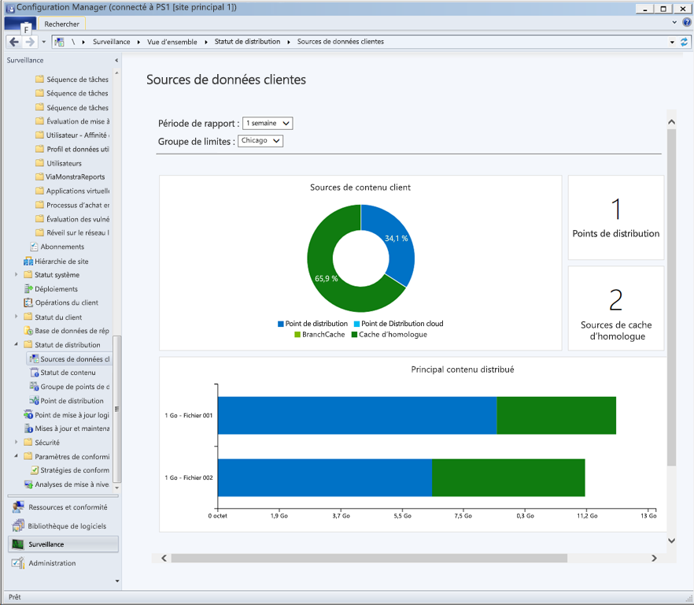
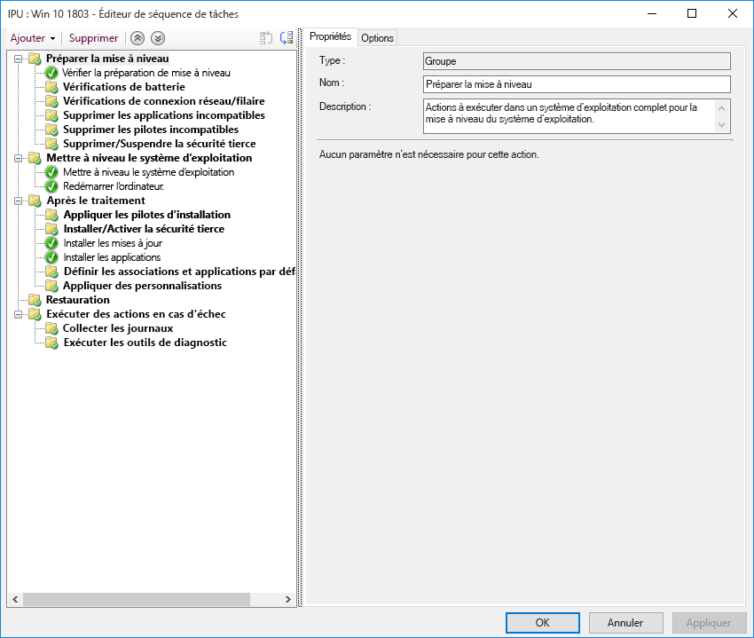

# Étape 7 : maintenance de Windows et d’Office

<table>
<thead>
<td></td>
<td>
<strong>Étape 7 : maintenance de Windows et d’Office</strong>

Windows 10 et Microsoft 365 Apps pour entreprise étoffent continuellement leurs fonctionnalités en proposant de nouvelles expériences utilisateur, de nouvelles options de sécurité et les toutes dernières innovations. Découvrez comment rester informé des mises à jour semestrielles et mensuelles, explorez le fonctionnement du nouveau modèle de maintenance, et comparez les outils et les options de votre environnement.
</td>
<td></td>
</thead>
</table>

>[!NOTE]
>La maintenance de Windows et d’Office est la septième étape de notre processus de déploiement recommandé. Elle couvre le volet planification de la préparation du déploiement des mises à jours semi-annuelles des fonctionnalités. Pour voir le processus complet de déploiement du bureau, visitez le [Centre de déploiement du bureau moderne](https://aka.ms/HowToShift).
>

Windows 10 et Microsoft 365 Apps pour entreprise introduisent de nouveaux modèles de support, options de maintenance et chronologies de mise à jour. Ces modifications simplifient le processus de mise à jour des fonctionnalités. Ces mises à jour sont accompagnées de nouvelles options de configuration permettant de mettre en œuvre des plans de maintenance conformes à vos besoins. Apprenons à préparer les mises à jour du canal semestriel de façon à bénéficier des nouvelles fonctionnalités et fonctionnalités de Windows 10 et de Microsoft 365 Apps pour entreprise, tout en tirant parti des nouvelles fonctionnalités dans Microsoft Endpoint Configuration Manager (Current Branch).

[Aider les clients à passer à Windows 10 et Microsoft 365 Apps pour entreprise](https://www.microsoft.com/microsoft-365/blog/2018/09/06/helping-customers-shift-to-a-modern-desktop/)

## Types de mise à jour

Les mises à jour se répartissent en deux grandes catégories : les mises à jour de fonctionnalités, et les mises à jour de qualité et de sécurité contenant des correctifs cumulatifs de sécurité, de fiabilité et de bogues. En termes de fréquence, Windows et Office proposent un canal semi-annuel qui fournit de nouvelles fonctionnalités deux fois par an, aux alentours de mars et de septembre, tandis que les mises à jour de qualité et de sécurité sont publiées mensuellement. De plus, pour les applications Office 365, nous proposons un canal mensuel entièrement pris en charge fournissant des mises à jour de fonctionnalités et de qualité.

Si vous avez l’habitude d’un cycle lent entre le système d’exploitation du bureau et les mises à jour de l’application, vous vous posez sûrement des questions :

  - Les mises à jour seront-elles compatibles ?

  - Devrai-je continuer de former mes utilisateurs ?

  - Quels sont les risques ?

Pour répondre à ces questions et vous expliquer pourquoi nous avons décidé de vous proposer de nouvelles fonctionnalités plus régulièrement, nous vous présentons quelques-uns des avantages de cette approche.

### Avantages des mises à jour de fonctionnalité

Premièrement, nous avons abandonné l’ancien modèle qui consistait à envoyer des modifications importantes par vague tous les trois ans. Dorénavant, nous vous proposons des modifications plus petites et des mises à jour de fonctionnalité deux fois par an. Pourquoi ? Face à l’évolution rapide des technologies et des menaces à la sécurité, ce nouveau modèle vous permet de profiter d’expériences et de protections à jour. Certaines des mises à jour de sécurité, par exemple, ne peuvent pas simplement être distribuées via des mises à jour de sécurité mensuelles ou des fichiers de signature antivirus. Elles peuvent se trouver sur une plateforme de modifications faibles, comme la sécurité basée sur la virtualisation.

[Guide rapide sur Windows as a Service](https://docs.microsoft.com/windows/deployment/update/waas-quick-start)

[Atténuation des menaces à l’aide des fonctionnalités de sécurité Windows 10](https://docs.microsoft.com/windows/security/threat-protection/overview-of-threat-mitigations-in-windows-10%20%20)

### Avantages du modèle des mises à jour cumulatives

Deuxièmement, la distribution des mises à jour de qualité et de sécurité sous forme de package de mises à jour cumulatives corrige bon nombre des problèmes rencontrés par le passé. Avant, vous pouviez choisir tous les mois parmi une dizaine de mises à jour pour Windows et Office. Comme vous pouvez l’imaginer, cela génère des ensembles de matrices de test quasi impossibles à prendre en charge. Par ailleurs, si vous installez une version de Windows ou d’Office qui date d’un an ou plus, cela peut prendre des heures voire des jours pour appliquer toutes les mises à jour distribuées depuis la publication de cette version.

Avec le modèle cumulatif, vous utilisez toujours la dernière expérience, à une mise à jour près. Ainsi, le nombre de mises à jour mensuelles à déployer est moins important. Chaque mise à jour s’appuie sur les mises à jour des mois précédents et contient tous les correctifs nécessaires pour être à jour. Les mises à jour cumulatives sont particulièrement utiles quand des PC ont été entreposés pendant plusieurs mois avant d’être réaffectés à un autre utilisateur.

### Validation étendue des mises à jour

Un autre avantage est qu’avant de déployer des mises à jour pour un déploiement de grande ampleur, nous publions des builds via les programmes Insider pour [Office](https://products.office.com/office-insider?tab=Windows-Desktop) et [Windows](https://insider.windows.com/) de façon à recueillir des données de diagnostic et des commentaires avant de publier les mises à jour à grande échelle. Les programmes Insider étant désormais ouverts à tous les utilisateurs, vous pouvez prendre une longueur d’avance dans la compréhension des mises à jour. Avant de publier les mises à jour, nous récoltons des données de diagnostic de millions de configurations de sorte que, lors du déploiement, la qualité est plus prévisible.

De plus, dans la mesure où les builds Insider de Microsoft 365 Apps pour entreprise reflètent les mises à jour du canal mensuel, si vous utilisez le canal semestriel d’Office pour distribuer deux fois par an des mises à jour de fonctionnalité compatibles avec Windows, vous pouvez rapidement valider les builds à l’aide des versions ciblées du canal semestriel.

### Prise en charge des outils de gestion

Nous avons également réfléchi à une méthode pour simplifier le déploiement des mises à jour. Le gestionnaire de configuration (Current Branch) est régulièrement mis à jour pour prendre en charge le déploiement de ces mises à jour pour Windows et Office et de nouvelles fonctionnalités.

[Déployer les mises à jour de Windows 10 avec le gestionnaire de configuration](https://docs.microsoft.com/windows/deployment/update/waas-manage-updates-configuration-manager)

[Gérer les applications Microsoft 365 Apps pour entreprise avec le Gestionnaire de configuration](https://docs.microsoft.com/mem/configmgr/sum/deploy-use/manage-office-365-proplus-updates)

## Vue d’ensemble des canaux Windows et Office

Windows 10 offre trois canaux de maintenance :

- [**Programme Windows Insider**](https://docs.microsoft.com/windows/deployment/update/waas-overview#windows-insider) permettant aux organisations de tester et commenter les fonctionnalités de la prochaine mise à jour fonctionnelle
- **Canal semi-annuel** délivrant de nouvelles fonctionnalités au travers deux publications annuelles de mises à jour de fonctionnalités
- **Canal de maintenance à long terme** destiné uniquement à des appareils spécialisés nécessitant une option de maintenance plus longue

Microsoft 365 propose quatre canaux de maintenance :

- [**Programme Office Insider** ](https://products.office.com/office-insider) permettant aux organisations de tester et commenter les nouvelles fonctions et fonctionnalités d’Office en cours de développement
- **Canal mensuel** fournissant aux utilisateurs les fonctionnalités Office les plus récentes dès qu’elles sont disponibles
- **Canal semi-annuel** fournissant de nouvelles fonctionnalités deux fois par an
- **Canal semi-annuel (ciblé)** version d’Office bénéficiant d’un support intégral, qui permet à des utilisateurs pilotes ainsi qu’à des testeurs de compatibilité de tester et valider le canal semi-annuel suivant

Pour plus d’informations sur les canaux de maintenance de Windows et d’Office, voir la documentation ci-dessous :

- [Vue d’ensemble de Windows as a service](https://docs.microsoft.com/windows/deployment/update/waas-overview#servicing-channels)
- [Présentation des canaux de mise à jour des Applications Microsoft 365](https://docs.microsoft.com/DeployOffice/overview-update-channels#BKMK_SAC)

## Déploiement progressif des mises à jour

Penchons-nous maintenant sur la méthode à adopter pour déployer ces mises à jour. Pour toutes les versions, nous vous recommandons de réaliser au moins trois phases de déploiement : la validation, le pilotage et le déploiement de production à grande échelle. Dès que vous êtes opérationnel sur Windows 10 et Microsoft 365 Apps pour entreprise, utilisez la maintenance mensuelle pour recevoir les mises à jour de qualité et de sécurité, puis passez à la maintenance semestrielle pour les nouvelles fonctionnalités.

### Mise à jour mensuelle

Le modèle de service vous permet de limiter, si vous le souhaitez, le déploiement des nouvelles fonctionnalités à deux fois par an, et le cas échéant, vous pouvez même ignorer une mise à jour semi-annuelle tout en continuant de recevoir des mises à jour de sécurité et de qualité. Le fait que les mises à jour mensuelles soient cumulatives signifie que leur taille augmente mois après mois.

#### Mises à jour rapides

Grâce à la technologie « Mises à jour rapides » de Windows (appelée Compression Delta binaire dans Office), nous pouvons considérablement réduire la taille du téléchargement. Dans les deux approches, les moteurs de mise à jour comparent les fonctionnalités trouvées sur le PC et recherchent uniquement les éléments manquants nécessaires pour mettre à jour le contenu existant.

[Explication des mises à jour de qualité Windows 10 et fin des mises à jour delta](https://techcommunity.microsoft.com/t5/Windows-IT-Pro-Blog/Windows-10-quality-updates-explained-amp-the-end-of-delta/ba-p/214426)

Windows Update pour Entreprise et Windows Server Update Services ont pris en charge les mises à jour rapides pendant un certain temps. Désormais, les mises à jour rapides sont aussi prises en charge dans le gestionnaire de configuration Microsoft Endpoint (Current Branch).

#### Compression Delta binaire

Dans Office, la Compression Delta binaire est utilisée seulement si vous mettez à jour la version la plus récente de Microsoft 365 Apps pour entreprise. Ainsi, pour utiliser cette approche, mettez à jour le build précédent et installez toutes les mises à jour sans exception.

Les canaux de mise à jour de Windows et d’Office peuvent être gérés via System Center Configuration Manager à l’aide du processus standard d’approbation et de ciblage. Par ailleurs, vous pouvez utiliser des paramètres de stratégie dans Office et Windows pour appliquer les canaux de mise à jour utilisés et les paramètres associés.

### Mises à jour semi-annuelles

Vous savez tout sur les mises à jour mensuelles. Maintenant, nous allons nous pencher sur les mises à jour semi-annuelles.

Comme nous l’avons abordé dans l’article sur la préparation des applications et des appareils, nous vous recommandons de commencer à préparer le déploiement de ces mises à jour volumineuses en utilisant les mêmes outils de préparation configurés à l’étape 1 du processus de déploiement.

Concernant les outils, vous pouvez utiliser les paramètres de stratégie avec Windows Update pour Entreprise, la gestion des mises à jour logicielles via le gestionnaire de configuration Microsoft Endpoint (Current Branch), Windows Server Update Services (WSUS), ou les stratégies de mise à jour définies par Microsoft Intune. Si l’utilisation de la bande passante réseau vous préoccupe, reportez-vous à l’étape 2 sur la préparation des répertoires et du réseau pour savoir comment vous pouvez réduire le trafic réseau via l’Optimisation de la distribution et d’autres technologies de mise en cache pair à pair.

[Canal semi-annuel Windows](https://docs.microsoft.com/windows/deployment/update/waas-overview#semi-annual-channel)

[Canal semi-annuel pour les Applications Microsoft 365](https://docs.microsoft.com/DeployOffice/overview-update-channels#BKMK_SAC)

#### Séquences de tâches de mise à niveau

L’installation des mises à jour de fonctionnalité volumineuses en utilisant des méthodes de gestion de mise à jour logicielle standard est prise en charge, mais bon nombre d’organisations choisiront d’utiliser une séquence de tâches de mise à niveau avec le gestionnaire de configuration Microsoft Endpoint (Current Branch) ou Microsoft Deployment Toolkit.

Une séquence de tâches vous permet de créer des vérifications ou des tâches personnalisées AVANT d’installer la mise à jour de fonctionnalité et d’exécuter des tâches personnalisées APRÈS l’installation de la mise à jour. Les tâches postérieures à la mise à jour peuvent inclure des services de suspension temporaire si besoin pendant la mise à jour, l’installation et le remplacement du pilote, les mises à niveau ou la barre des tâches de l’application, et les paramètres de personnalisation du démarrage de Windows 10.

Si vous utilisez déjà des séquences de tâches pour migrer vos ordinateurs Windows 7 vers Windows 10 et que vous connaissez déjà ces outils, il s’agit d’un excellent point de départ pour maîtriser votre mise à niveau. Même si vous pouvez utiliser une séquence de tâches unique pour l’ensemble de la mise à niveau, il est assez courant que les organisations utilisent deux séquences de tâches : une séquence pour vérifier que les ordinateurs sont prêts pour la mise à niveau (elle pré-configure silencieusement tous les fichiers d’installation requis sur les ordinateurs cibles) et une autre séquence pour exécuter la mise à niveau. En utilisant cette approche, la productivité des utilisateurs est moins affectée.

[Créer une séquence de tâches pour mettre à niveau un système d’exploitation dans le gestionnaire de configuration](https://docs.microsoft.com/mem/configmgr/osd/deploy-use/create-a-task-sequence-to-upgrade-an-operating-system)

#### Prise en charge du canal semi-annuel pour les mises à jour de fonctionnalité

[Comme annoncé en septembre 2018](https://www.microsoft.com/microsoft-365/blog/2018/09/06/helping-customers-shift-to-a-modern-desktop/), le calendrier de prise en charge des mises à jour du canal semi-annuel suivra le modèle suivant.

  - Toutes les mises à jour de fonctionnalité de Windows 10 Entreprise et Éducation actuellement prises en charge, dès la version 1607, seront prises en charge pendant 30 mois à compter de la date de publication de leur version originale.

  - Toutes les futures mises à jour de fonctionnalité, dès la version 1809, prévue en septembre, seront prises en charge pendant 30 mois à compter de la date de leur publication.

  - Les mises à jour de fonctionnalité prévues en mars, dès la version 1903, continueront d’être prises en charge pendant 18 mois à compter de la date de leur publication.

  - Les mises à jour semestrielles de Microsoft 365 Apps pour entreprise continuent d’être prises en charge pendant 18 mois.

#### Autres options d’installation automatisée en dehors des séquences de tâches

Si vous n’utilisez pas les séquences de tâches de mise à niveau, vous pouvez désormais exécuter des actions personnalisées ou appliquer des fichiers du pilote pendant les mises à jour de fonctionnalité durant la phase préalable à l’installation (avant que le programme d’installation exécute ses vérifications de compatibilité), ou durant la phase préalable à la validation (avant l’application de la mise à niveau).

[Nouveautés concernant l’installation de la version 1803 de Windows 10](https://docs.microsoft.com/windows/whats-new/whats-new-windows-10-version-1803%23windows-setup)

## Étape suivante 

## [Étape 8 : formation et communications des utilisateurs](https://aka.ms/mdd8)

## Étape précédente 

## [Étape 6 : déploiement du système d’exploitation et mises à jour des fonctionnalités](https://aka.ms/mdd6)
