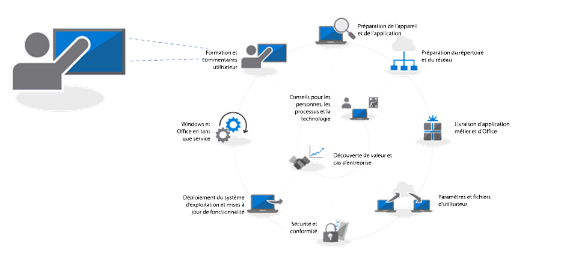
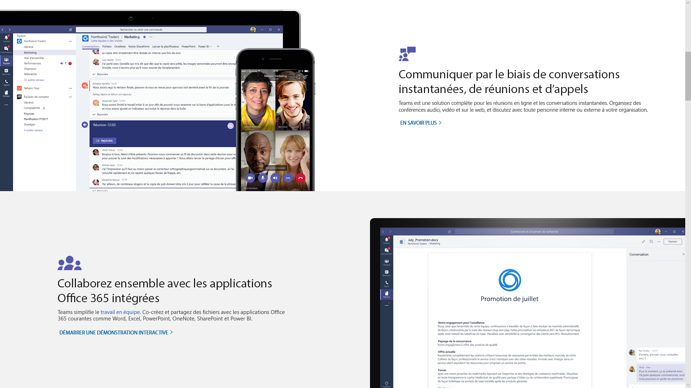
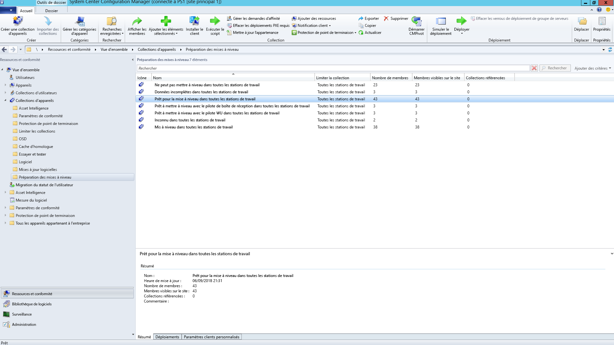
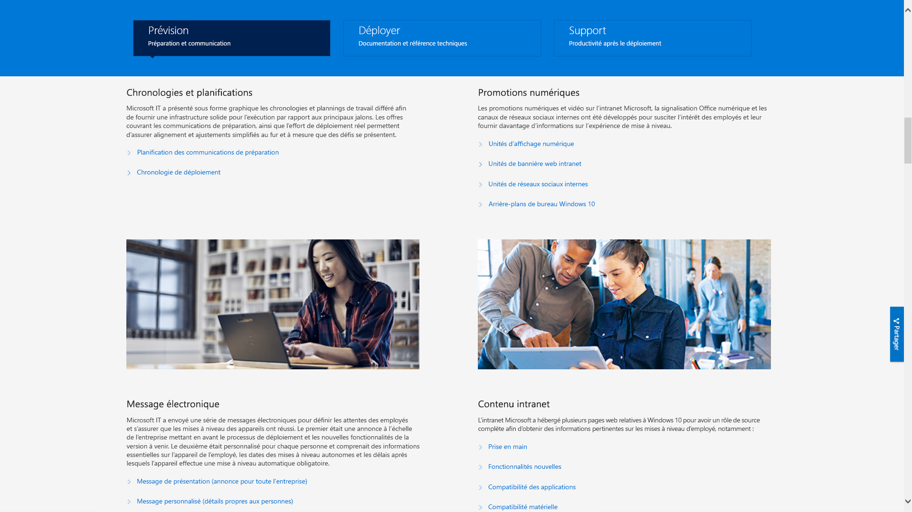

# Étape 8 : formation et communications des utilisateurs

<table>
<thead>
<td></td>
<td>
<strong>Étape 8 : formation et communication des utilisateurs</strong>

Pensez à informer vos utilisateurs des nouvelles expériences et nouveaux modes de travail avant de migrer vos PC vers Windows 10 et Office 365 ProPlus. Découvrez comment tirer parti de l’assistance à l’adoption utilisateur avec Microsoft FastTrack, des supports de formation et des modèles de communication, ainsi que des nouveaux moyens pour surveiller l’usage et l’acceptation des utilisateurs.
</td>
<td></td>
</thead>
</table>

>[!NOTE]
>La formation et la communication des utilisateurs est la huitième étape de notre processus de déploiement recommandé. Elle propose des conseils pour informer et préparer les utilisateurs. Pour voir le processus complet de déploiement du bureau, visitez le [Centre de déploiement du bureau moderne](https://aka.ms/HowToShift).
>

Pour faciliter l’adoption, il est essentiel d’informer vos utilisateurs et de les préparer aux expériences proposées par l’espace de travail moderne sur Office 365 et Windows 10, ainsi qu’aux nouveaux contrôles de sécurité et de conformité avec Azure Active Directory. Tout l’art est de déterminer comment introduire des mises à jour quand certains utilisateurs peuvent se demander si elles affecteront leur productivité, si elles changeront leur flux de travail ou s’ils devront se former.

La bonne nouvelle, c’est que si vous migrez de Windows 7 et d’Office 2010 ou 2013, un grand nombre de personnes seront déjà familiarisées avec Windows 10 et les versions plus récentes d’Office sur leurs appareils personnels. Les effets de ce changement seront ainsi moins importants.

## Préparation aux nouvelles expériences

Commençons par Office : si vous déployez Office 365 ProPlus pour la première fois, nous vous conseillons de communiquer les avantages dont peuvent profiter les utilisateurs en se connectant aux applications Office et en enregistrant des fichiers sur des emplacements OneDrive ou SharePoint, au niveau du partage et de la co-édition en temps réel, ainsi que de la création de branche pour les fichiers.

Des modèles de communication et de formation détaillés sont disponibles pour ces applications locales ou basées sur navigateur, à l’instar de Teams et du Planificateur.

Nous proposons également des conseils sur les nouvelles fonctionnalités des applications, comme l’insertion en pièce jointe des fichiers liés à OneDrive dans Outlook ou l’utilisation des nouvelles transitions de diapositives Morph et des fonctionnalités Designer dans PowerPoint.

Concernant Windows 10, nous vous aidons à familiariser vos utilisateurs avec les fonctionnalités par défaut et facultatives, comme Windows Hello pour se connecter en toute sécurité à l’aide de l’authentification biométrique, les mises à jour de démarrage pour personnaliser votre expérience Windows, Chronologie pour reprendre facilement là où vous en étiez, Cortana et bien d’autres.

Il existe également des contrôles de sécurité et de conformité visibles auxquels vos utilisateurs peuvent être soumis, comme Enterprise Mobility + Security qui comprend Azure AD et Microsoft Intune, et intègre des fonctionnalités supplémentaires avec Windows 10 et Office 365 que vous pouvez cibler pour la mise à niveau de votre bureau.

[Microsoft Enterprise Mobility + Security](https://www.microsoft.com/fr-FR/cloud-platform/enterprise-mobility-security)

Par exemple, l’authentification multifacteur utilise Azure AD et protège la connexion des utilisateurs aux ressources à l’aide d’une application mobile ou d’un code confidentiel pour accéder aux services en toute sécurité. Azure Information Protection, quant à elle, permet aux utilisateurs de classer et d’étiqueter facilement les documents.

[Configurer l’authentification multifacteur pour les utilisateurs d’Office 365](https://support.office.com/fr-FR/article/set-up-multi-factor-authentication-for-office-365-users-8f0454b2-f51a-4d9c-bcde-2c48e41621c6)

Ce sont quelques exemples des nouvelles fonctionnalités que pourront utiliser vos utilisateurs. Certaines d’entre elles pourront même les surprendre, de manière positive ou non. Il est possible que ces surprises entraînent un plus grand nombre d’appels et de tickets reçus par votre support technique, en particulier si elles modifient le flux de travail normal des utilisateurs.

## Préparation proactive et déploiements mesurés

Pour vous aider à réduire les risques liés au changement de l’expérience utilisateur, nous vous recommandons deux approches complémentaires :

  - Une communication proactive destinée aux utilisateurs pour qu’ils sachent à quoi s’attendre

  - L’utilisation d’anneaux de déploiement pour contrôler la vitesse du déploiement

### Déploiement progressif

Le déploiement progressif à l’aide d’anneaux de déploiement vous permet de réaliser le déploiement auprès de petits groupes puis d’élargir progressivement l’échelle du déploiement au fil du temps. Normalement, d’ici la rédaction du plan de communication et de formation, ces anneaux et leurs membres doivent être constitués. Ainsi, vous pouvez réduire tout risque éventuel et valider votre approche pendant l’élargissement du déploiement, ou pendant la suspension des activités, par exemple, si le support technique reçoit plus d’appels que prévu.

Il est préférable de créer les anneaux de déploiement en collaboration avec les divisions et leurs responsables. Nous vous recommandons de prendre connaissance des dates et des périodes critiques à éviter pour déployer ou effectuer des changements. Sans une planification rigoureuse et le soutien de toutes les parties prenantes, il sera difficile de convaincre les utilisateurs et de les familiariser aux changements prévus.

### Phase 1 : l’équipe informatique et les utilisateurs internes enthousiastes 

En général, il est préférable de commencer votre déploiement avec l’équipe informatique et les utilisateurs enthousiastes qui se sont portés volontaires pour accéder en avant-première à la nouvelle expérience. Avec ces personnes, vous pouvez tester vos communications, l’impact des changements et l’efficacité de vos communications et de votre formation. Au cours de cette phase, l’équipe informatique exécute des petits pilotes, apprend des techniques de résolution des problèmes et d’automatisation pour aider les utilisateurs pendant les phases de déploiement à grande échelle.

Pendant la phase pilote initiale, il est important de pouvoir compter sur des membres engagés pour recueillir leurs observations et leurs commentaires sur le processus. Par ailleurs, il est intéressant de compter sur des spécialistes en dehors de l’équipe informatique qui vous permettent de renforcer la communication organique et le bouche-à-oreille sur les nouvelles fonctionnalités. Ils pourront aussi aider les utilisateurs le cas échéant pendant les phases ultérieures du déploiement.

### Phase 2 : pilote 

Quand le déroulement de la première phase devient satisfaisant, vous pouvez cibler un groupe d’utilisateurs plus important pour lancer votre deuxième phase pilote. Ce groupe devrait être composé de différents rôles utilisateurs, types d’appareils, applications Windows et compléments Office. Les données collectées auprès de ces groupes serviront à Analytics pour cibler les changements initiaux de la phase 3 du déploiement à grande échelle.

Pendant cette phase et les phases futures, n’oubliez pas que tous les PC doivent être connectés au service Analytics pour collecter des données de diagnostic sur l’état des applications et des appareils, ainsi que sur les économies de bande passante obtenues grâce à l’Optimisation de la distribution et à l’utilisation de la connexion Windows Hello.

Pendant cette phase, il est particulièrement important de communiquer les changements et d’aider les utilisateurs à tirer parti des nouvelles fonctionnalités. Les utilisateurs peuvent souvent accorder une priorité moins importante aux e-mails ou aux autres communications provenant de l’équipe informatique, voire les ignorer. Il peut être utile de rencontrer les responsables d’équipe pour qu’ils vous aident à communiquer les changements et à encourager l’utilisation des nouveaux outils et technologies auprès des utilisateurs.

Vous aurez également besoin de leur avis concernant les périodes à éviter, pour perturber au minimum le travail des utilisateurs. Par exemple, l’équipe des finances pourrait être particulièrement gênée par les changements à la fin de chaque trimestre fiscal. Il en est de même pour les équipes de développement produit pendant un lancement produit.

Parallèlement à la planification des appareils, des utilisateurs, des départements et des calendriers, vous pouvez commencer à établir vos plans de communication et de formation, et à compiler du contenu ou à retenir les services d’intervenants extérieurs pour vous aider à former les utilisateurs.

#### Microsoft FastTrack 

Pour vous aider à rassembler de la matière pour préparer vos formations, vous pouvez accéder à un ensemble complet de courtes formations vidéo dans la Bibliothèque de productivité Microsoft FastTrack.

[Bibliothèque de productivité Microsoft FastTrack](https://www.microsoft.com/en-us/microsoft-365/success/?rtc=2)

Des centaines de sujets sont abordés, comme la création d’un contenu convaincant, le partage de sites et de contenu, la transformation du travail d’équipe et les gains de productivité grâce à l’utilisation d’appareils modernes.

De plus, si vous utilisez Microsoft 365 ou Office 365, il est fort probable que vous puissiez obtenir de l’aide pour encourager l’adoption des nouvelles expériences utilisateur via le service FastTrack de Microsoft. Vous obtiendrez des conseils sur les pratiques d’adoption que vous pourrez utiliser pendant le processus de déploiement de Microsoft 365 (Windows, Office et EMS).

#### Microsoft IT Showcase 

La série IT Showcase de Microsoft est une autre ressource à utiliser pour tout ce qui concerne le contenu lié au déploiement de Windows 10. Elle comprend des calendriers et des plannings, des modèles de promotion numérique, des modèles d’e-mail et du contenu Intranet. Ces ressources s’inspirent des supports utilisés par Microsoft pendant son déploiement de Windows 10 et ont été adaptées à l’usage des organisations.

[Préparation de votre organisation pour un déploiement en douceur de Windows 10](https://www.microsoft.com/itshowcase/windows10deployment)

Ces services et composants peuvent être peaufinés pendant la phase pilote. Quand vous commencerez à comprendre ce que les utilisateurs apprécient dans les formations, les appareils à cibler via Analytics et les appareils ou les groupes d’utilisateurs à éviter ou à reporter, vous pouvez commencer à élargir votre déploiement pendant les prochaines phases en vous appuyant sur les données et l’expérience.

À mesure que votre phase pilote s’élargit, nous vous conseillons de documenter et de publier les questions fréquemment posées et du contenu en libre-service pour réduire de façon proactive le nombre de tickets envoyés au support technique.

### Phase 3 et plus : déploiement de production à grande échelle 

Avant d’atteindre les phases de déploiement à grande échelle, vous aurez affiné vos processus, votre communication, votre formation et vos outils en libre-service. Vous pourrez ensuite utiliser les données de diagnostic collectées pour cibler de plus en plus de PC.

Nous vous recommandons d’adopter un rythme de déploiement gérable par votre service informatique, votre support technique, vos utilisateurs et votre capacité réseau. Vous pouvez toujours revenir à l’étape 2 du processus de déploiement pour mieux optimiser votre réseau à l’aide du cache d’homologue, de LEDBAT et d’autres techniques pour transférer plus rapidement les données liées au déploiement.

En plus des données de diagnostic que vous surveillez via les outils d’analyse, vous pouvez surveiller l’utilisation des services Office 365 et Microsoft 365 de manière granulaire, avec les rapports d’utilisation détaillés par charge de travail du centre d’administration et à l’aide des tableaux de bord d’administration accessibles via Power BI. Ces excellents outils vous aident à définir et à suivre vos objectifs lorsque vous déployez de nouveaux outils de collaboration, tels que Microsoft Teams, ou de nouvelles méthodes de partage de fichiers, telles que OneDrive.

L’acceptation et l’adoption de la nouvelle technologie prendra du temps, une fois que Windows 10 et Office 365 ProPlus seront installés sur tous les PC de votre organisation. De plus, les utilisateurs ne changeront pas forcément leurs habitudes de travail si vous ne prenez pas le temps de les informer et de les former à l’utilisation des nouvelles fonctionnalités. Enfin, la communication devra être continue dans la mesure où les nouveaux modèles de service fournissent des nouvelles fonctionnalités deux fois par an pour Windows et, facultativement, tous les mois pour Office.

## Étape précédente 

## [Étape 7 : maintenance de Windows et d’Office](https://aka.ms/mdd7)