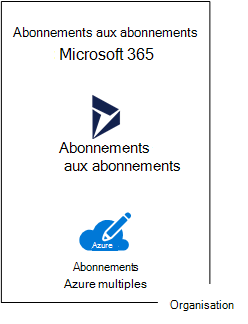

# Abonnements, licences, comptes et clients des offres de cloud de Microsoft

Microsoft fournit une hiérarchie d’organisations, d’abonnements, de licences et de comptes d’utilisateur pour une utilisation cohérente des identités et de la facturation dans ses offres cloud :
  
- Microsoft 365 et Microsoft Office 365
- Microsoft Azure
- Microsoft Dynamics 365

## Éléments de la hiérarchie

Voici les éléments de la hiérarchie :
  
### Organisation

An organization represents a business entity that is using Microsoft cloud offerings, typically identified by one or more public Domain Name System (DNS) domain names, such as contoso.com. The organization is a container for subscriptions.
  
### Abonnements

Un abonnement est un accord conclu avec Microsoft sur l’utilisation d’une ou de plusieurs plateformes ou services de cloud Microsoft, dont les frais applicables sont calculés sur la base de frais de licence par utilisateur ou selon la consommation des ressources de cloud. 

- Les offres SaaS (Software as a Service) basées sur le cloud de Microsoft (Microsoft 365 et Dynamics 365) facturent des frais de licence par utilisateur. 
- Les offres de cloud Microsoft Platform as a Service (PaaS) et Infrastructure as a Service (IaaS) (Azure) facturent des frais en fonction de la consommation des ressources de cloud.
 
You can also use a trial subscription, but the subscription expires after a specific amount of time or consumption charges. You can convert a trial subscription to a paid subscription.
  
Organizations can have multiple subscriptions for Microsoft's cloud offerings. Figure 1 shows a single organization that has multiple Microsoft 365 subscriptions, a Dynamics 365 subscription, and multiple Azure subscriptions.

**Figure 1 : Exemple de plusieurs abonnements pour une organisation**

  
### Licences

For Microsoft's SaaS cloud offerings, a license allows a specific user account to use the services of the cloud offering. You are charged a fixed monthly fee as part of your subscription. Administrators assign licenses to individual user accounts in the subscription. For the example in Figure 2, the Contoso Corporation has a Microsoft 365 E5 subscription with 100 licenses, which allows to up to 100 individual user accounts to use Microsoft 365 E5 features and services.
  
**Figure 2 : Licences liées aux abonnements SaaS d’une organisation**

>[!Note]
>L’une des meilleures pratiques en matière de sécurité consiste à utiliser des comptes d’utilisateurs distincts qui ont des rôles spécifiques pour des fonctions d’administration. Il n’est pas nécessaire d’attribuer une licence à ces comptes d’administrateur dédiés pour les services cloud qu’ils gèrent. Par exemple, il n’est pas nécessaire d’attribuer une licence Microsoft 365 à un compte d’administrateur SharePoint.
>

Pour les services de cloud PaaS Azure, les licences logicielles sont intégrées dans la tarification du service.  
  
For Azure IaaS-based virtual machines, additional licenses to use the software or application installed on a virtual machine image might be required. Some virtual machine images have licensed versions of software installed and the cost is included in the per-minute rate for the server. Examples are the virtual machine images for SQL Server 2014 and SQL Server 2016. 
  
Some virtual machine images have trial versions of applications installed and need additional software application licenses for use beyond the trial period. For example, the SharePoint Server 2016 Trial virtual machine image includes a trial version of SharePoint Server 2016 pre-installed. To continue using SharePoint Server 2016 after the trial expiration date, you must purchase a SharePoint Server 2016 license and client licenses from Microsoft. These charges are separate from the Azure subscription and the per-minute rate to run the virtual machine still applies.
  
### Comptes d’utilisateur

User accounts for all of Microsoft's cloud offerings are stored in an Azure Active Directory (Azure AD) tenant, which contains user accounts and groups. An Azure AD tenant can be synchronized with your existing Active Directory Domain Services (AD DS) accounts using Azure AD Connect, a Windows server-based service. This is known as directory synchronization.
  
La Figure 3 illustre un exemple de plusieurs abonnements d’une organisation à l’aide d’un client Azure Active Directory commun qui contient les comptes de l’organisation.
  
**Figure 3 : Plusieurs abonnements d’une organisation qui utilisent le même client Azure AD**

  
### Clients

For SaaS cloud offerings, the tenant is the regional location that houses the servers providing cloud services. For example, the Contoso Corporation chose the European region to host its Microsoft 365, EMS, and Dynamics 365 subscriptions for the 15,000 workers in their Paris headquarters.
  
Azure PaaS services and virtual machine-based workloads hosted in Azure IaaS can have tenancy in any Azure datacenter across the world. You specify the Azure datacenter, known as the location, when you create the Azure PaaS app or service or element of an IaaS workload.
  
An Azure AD tenant is a specific instance of Azure AD containing accounts and groups. Paid or trial subscriptions of Microsoft 365 or Dynamics 365 include a free Azure AD tenant. This Azure AD tenant does not include other Azure services and is not the same as an Azure trial or paid subscription.
  
### Résumé de la hiérarchie

Voici un récapitulatif rapide :
  
- Une organisation peut avoir plusieurs abonnements
    
  - Un abonnement peut avoir plusieurs licences
    
  - Des licences peuvent être affectées à des comptes d’utilisateur individuels
    
  - Les comptes d’utilisateur sont stockés dans un client Azure AD
    
Voici un exemple de relation des organisations, des abonnements, des licences et des comptes d’utilisateur :
  
- Une organisation identifiée par son nom de domaine public.
    
  - Un abonnement Microsoft 365 E3 avec licences utilisateur.
    
    Un abonnement Microsoft 365 E5 avec licences utilisateur.
    
    Un abonnement Dynamics 365 avec licences utilisateur.
    
    Abonnements Azure multiples
    
  - Les comptes d’utilisateurs de l’organisation dans un client Azure AD commun.
    
Multiple Microsoft cloud offering subscriptions can use the same Azure AD tenant that acts as a common identity provider. A central Azure AD tenant that contains the synchronized accounts of your on-premises AD DS provides cloud-based Identity as a Service (IDaaS) for your organization. 
  
**Figure 4 : Comptes en local synchronisés et IDaaS pour une organisation**

  
Figure 4 shows how a common Azure AD tenant is used by Microsoft's SaaS cloud offerings, Azure PaaS apps, and virtual machines in Azure IaaS that use Azure AD Domain Services. Azure AD Connect synchronizes the on-premises AD DS forest with the Azure AD tenant.
  
## Combiner les abonnements de plusieurs offres de cloud Microsoft

Le tableau suivant décrit la manière dont vous pouvez combiner plusieurs offres de cloud Microsoft en disposant déjà d’un abonnement pour un type d’offre de cloud (étiquettes actives vers le bas de la première colonne) et en ajoutant un abonnement pour une offre de cloud différente (à travers les colonnes).
  
||**Microsoft 365**|**Azure**|**Dynamics 365**|
|:-----|:-----|:-----|:-----|:-----|
|**Microsoft 365**   |N/A    |Vous ajoutez un abonnement Azure à votre organisation à partir du portail Azure.    |Vous ajoutez un abonnement Dynamics 365 à votre organisation à partir du Centre d’administration Microsoft 365.    |
|**Azure**   |Vous ajoutez un abonnement Microsoft 365 à votre organisation.    |N/A    |Vous ajoutez un abonnement Dynamics 365 à votre organisation.    |
|**Dynamics 365**   |Vous ajoutez un abonnement Microsoft 365 à votre organisation.    |Vous ajoutez un abonnement Azure à votre organisation à partir du portail Azure.    |N/A    |
   
Une solution simple pour ajouter des abonnements à votre organisation pour les services SaaS Microsoft consiste à utiliser le centre d’administration :
  
1. Connectez-vous au Centre d’administration Microsoft 365 ( ) avec votre compte [https://admin.microsoft.com](https://admin.microsoft.com) **d’administrateur** utilisateur ou **d’administrateur** global.
    
2. À partir du volet de navigation gauche de la page d’accueil du **centre d’administration**, cliquez sur **Facturation**, puis **Acheter des services**.
    
3. Dans la page **Acheter des services**, achetez vos nouveaux abonnements.
    
Le centre d’administration affecte l’organisation et le client Azure AD de votre abonnement à Microsoft 365 aux nouveaux abonnements pour les offres cloud SaaS.
  
Pour ajouter un abonnement Azure disposant de la même organisation et du même client Azure Active Directory que votre abonnement Microsoft 365, procédez comme suit :
  
1. Connectez-vous au portail Azure ( ) à l’Microsoft 365 [https://portal.azure.com](https://portal.azure.com) **administrateur Azure AD DC** ou à votre compte **d’administrateur** global.
    
2. Dans le volet de navigation gauche, cliquez sur **Abonnements**, puis sur **Ajouter**.
    
3. Dans la page **Ajouter un abonnement**, sélectionnez une offre et complétez l’accord et les informations de paiement.
    
Si vous avez obtenu séparément des abonnements Azure et Microsoft 365, et que vous souhaitez accéder au client Microsoft 365 Azure AD à partir de votre abonnement Azure, reportez-vous aux instructions décrites de l’article [Ajouter un abonnement Azure à votre locataire Azure Active Directory](/azure/active-directory/fundamentals/active-directory-how-subscriptions-associated-directory).
 
## Voir aussi

[Illustrations de documents sur le cloud Microsoft pour les architectes d’entreprise](../solutions/cloud-architecture-models.md)
  
[Modèles architecturaux pour SharePoint, Exchange, Skype Entreprise et Lync](architectural-models-for-sharepoint-exchange-skype-for-business-and-lync.md)
  
[Solutions hybrides](hybrid-solutions.md)

## Étape suivante

[Évaluation de la connectivité réseau Microsoft 365](assessing-network-connectivity.md)
