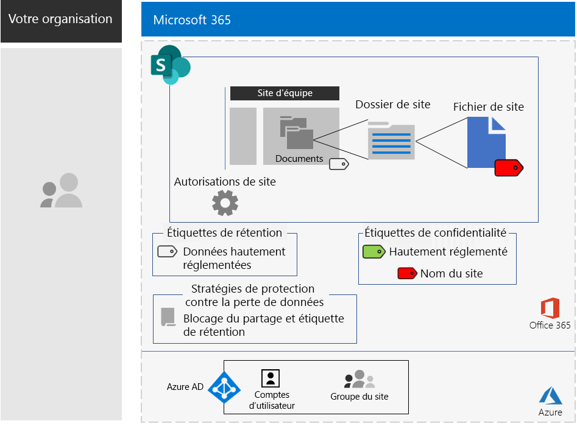

# Sites SharePoint pour les données hautement réglementées

*Ce scénario s’applique à la fois aux versions E3 et E5 de Microsoft 365 Entreprise*

Microsoft 365 Entreprise comprend une suite complète de services basés sur le cloud afin que vous puissiez créer, stocker, sécuriser et gérer vos données hautement réglementées, notamment les données qui sont :

- sujettes à des réglementations régionales ;
- les plus précieuses de votre organisation comme les secrets commerciaux, les informations sur les ressources humaines ou financières et la stratégie de l’organisation.

>[!Note]
> Un scénario similaire utilisant Microsoft Teams se trouve [ici](secure-teams-highly-regulated-data-scenario.md).
>

Dans le cadre d’un scénario Microsoft 365 Entreprise basé sur le cloud qui répond à ce besoin métier, vous êtes tenu de suivre les instructions suivantes :

- Stockez des fichiers (documents, diapositives, feuilles de calcul, etc.) dans un site d’équipe SharePoint.
- Verrouillez le site pour empêcher :
  - L’accès aux utilisateurs qui ne sont pas membres du groupe Office 365 pour le site.
  - les membres du site d’octroyer l’accès à d’autres personnes ;
  - l’accès au site par les personnes non membres.
- Configurez une étiquette de rétention Office 365 pour vos sites SharePoint comme moyen par défaut pour empêcher les utilisateurs d’envoyer des fichiers à l’extérieur de l’organisation.
- Chiffrer les fichiers les plus sensibles du site avec le chiffrement qui accompagne le fichier.
- Ajoutez des autorisations aux fichiers les plus sensibles de sorte que même s'ils sont partagés en dehors du site, leur ouverture nécessite toujours les informations d’identification valides d’un compte d’utilisateur autorisé.

Le tableau suivant mappe les conditions requises de ce scénario à une fonctionnalité de Microsoft 365 Entreprise.

|||
|:-------|:-----|
| **Configuration requise** | **Fonctionnalité Microsoft 365 Entreprise** |
| Stocker des fichiers | Sites d’équipe SharePoint |
| Verrouiller le site | Autorisations de sites d’équipe SharePoint Online et de groupes Office 365 |
| Étiqueter les fichiers du site | Étiquettes de rétention Office 365 |
| Bloquer les utilisateurs lors de l’envoi de fichiers à l’extérieur de l’organisation | Stratégies de protection contre la perte de données (DLP) dans Office 365 |
| Chiffrer tous les fichiers du site | Sous-étiquettes ou étiquettes de confidentialité d’Office 365 |
| Ajouter des autorisations aux fichiers du site | Sous-étiquettes ou étiquettes de confidentialité d’Office 365 |
|||

Voici un exemple de configuration d’un site SharePoint sécurisé.

Ce scénario implique que vous ayez déjà déployé les éléments suivants :

- La phase [Identité](identity-infrastructure.md) et les étapes 1 et 2 de la phase [Protection des informations](infoprotect-infrastructure.md) de l’infrastructure de base. 
- [SharePoint](sharepoint-online-onedrive-workload.md).

Les phases suivantes vous guident à travers toute la conception, la configuration et le pilotage de l'adoption des sites SharePoint pour les données hautement réglementées.

Pour découvrir comment Contoso Corporation, une organisation multinationale fictive mais représentative, a conçu un site SharePoint pour ses équipes de recherche, consultez cette [configuration exemple](contoso-sharepoint-online-site-for-highly-confidential-assets.md).

## Conditions préalables pour les identités et l’accès aux appareils

Pour protéger l’accès aux sites SharePoint, vérifiez que vous avez configuré les [stratégies pour les identités et l’accès aux appareils](identity-access-policies.md) et les [stratégies d’accès à SharePoint recommandées](sharepoint-file-access-policies.md).

## Phase 1 : conception

Pour créer un site SharePoint pour les données hautement réglementées, vous devez commencer par identifier son objet. Par exemple, le département recherche et développement d’une organisation de production a besoin d’un site SharePoint pour stocker les spécifications de conception actuelles des produits existants et un emplacement pour collaborer à de nouveaux produits. Seuls les membres du service recherche et développement et des responsables sélectionnés peuvent accéder au site.

Cet objectif va permettre de déterminer les éléments de configuration essentiels, tels que les éléments suivants :

- L'étiquette de rétention Office 365 à attribuer à la partie Documents du site et les stratégies DLP liées à l'étiquette
- Les paramètres d’une sous-étiquette de sensibilité Office 365 que les utilisateurs appliquent aux fichiers hautement sensibles stockés sur le site

Une fois ces paramètres déterminés, utilisez-les pour configurer le site à la phase 2. 

### Étape 1 : étiquettes de rétention Office 365 et stratégies DLP

Lorsqu’elles sont appliquées à la partie Documents du site d’équipe SharePoint, les étiquettes de rétention Office 365 fournissent une méthode par défaut de classification de toutes les fichiers stockées sur le site.
 
En ce qui concerne les sites SharePoint pour les données hautement réglementées, vous devez déterminer les étiquettes de rétention Office 365 à utiliser.

Concernant les considérations relatives à la conception d’étiquettes Office 365, consultez la rubrique [Classification et étiquettes Office 365](https://docs.microsoft.com/office365/securitycompliance/secure-sharepoint-online-sites-and-files#office-365-retention-labels).

Pour protéger les informations sensibles et empêcher leur divulgation accidentelle ou intentionnelle, vous pouvez utiliser des stratégies DLP. Pour obtenir plus d’informations, consultez cette [vue d’ensemble](https://docs.microsoft.com/office365/securitycompliance/data-loss-prevention-policies).

En ce qui concerne les sites SharePoint, vous devez configurer une stratégie DLP pour l’étiquette de rétention Office 365 attribuée au site afin de bloquer les utilisateurs lorsqu’ils essaient de partager des fichiers avec des utilisateurs externes. 

### Étape 2 : sous-étiquette de sensibilité Office 365

Pour fournir un chiffrement et un ensemble d’autorisations à vos fichiers les plus sensibles, les utilisateurs doivent appliquer une sous-étiquette ou une étiquette de sensibilité Office 365. Une sous-étiquette se trouve sous une étiquette existante. 

Utilisez une étiquette de confidentialité lorsque vous avez besoin d’un petit nombre d’étiquettes pour un usage à la fois global et pour des équipes privées individuelles. Utilisez une sous-étiquette de confidentialité lorsque vous avez un grand nombre d’étiquettes ou si vous souhaitez organiser les étiquettes pour les sites sécurisés sous l’étiquette hautement réglementée. 

Les paramètres de la sous-étiquette ou de l’étiquette appliquée accompagnent le fichier. Même si elle est divulguée en dehors du site, seuls les comptes d’utilisateurs authentifiés disposant des autorisations appropriées peuvent l’ouvrir.

### Résultats de conception

Vous avez déterminé les éléments suivants:

- L’étiquette de rétention Office 365 appropriée et la stratégie DLP associée à l’étiquette
- Les paramètres de la sous-étiquette Office 365 comprenant le chiffrement et les autorisations

## Phase 2 : configuration

Dans cette phase, vous prenez les paramètres déterminés à la phase 1 et les implémentez pour créer un site SharePoint pour les données hautement réglementées.

### Étape 1 : créer un site d’équipe SharePoint privé avec les propriétaires et les membres du groupe Office 365 correspondant

Suivez [ces instructions]( https://support.office.com/article/create-a-site-in-sharepoint-online-4d1e11bf-8ddc-499d-b889-2b48d10b1ce8) pour créer un site d’équipe SharePoint privé.

### Étape 2 : configurer les paramètres d’autorisations supplémentaires pour le site d’équipe SharePoint

À partir du site SharePoint, configurez ces paramètres d’autorisation.

1. Dans la barre d’outils, cliquez sur l’icône Paramètres, puis cliquez sur **Paramètres du site**.
2. Dans le volet **Autorisations de site**, sous **Paramètres de partage**, cliquez sur **Modifier les paramètres de partage**.
3. Sous **Autorisations de partage**, sélectionnez **Seuls les propriétaires du site peuvent partager des fichiers, des dossiers et le site**.
4. Désactivez **Autoriser les demandes d’accès**, puis cliquez sur **Enregistrer**.

Avec ces paramètres, la possibilité pour les membres du groupe de sites de partager le site avec d’autres membres ou pour les non-membres afin de demander l’accès au site est désactivée.

### Étape 3 : configurer le site pour une étiquette de rétention Office 365

Suivez les instructions mentionnées dans [Protéger les fichiers SharePoint avec les étiquettes Office 365 et la protection contre la perte de données (DLP)](https://docs.microsoft.com/office365/enterprise/protect-sharepoint-online-files-with-office-365-labels-and-dlp) pour :

1. Créer et publier une étiquette de rétention pour les données hautement réglementées (le cas échéant).
2. Configurez le site pour l’étiquette de rétention créée à l’étape 1.
3. Créez une stratégie DLP pour les données hautement réglementées qui utilise l’étiquette de rétention créée à l’étape 2 et qui empêche les utilisateurs d’envoyer des fichiers à l’extérieur de l’Organisation

#### Étape 4 : créer une sous-étiquette de sensibilité dans Office 365 pour le site

Contrairement à une étiquette de sensibilité pour les données hautement réglementées qu’une personne peut appliquer à n’importe quel fichier, un site sécurisé nécessite sa propre sous-étiquette de sorte que les fichiers auxquels la sous-étiquette est attribuée :

- Sont chiffrés et le chiffrement est acheminé avec le fichier.
- Contiennent des autorisations personnalisées de sorte que seuls les membres du groupe de sites puissent l’ouvrir.

Pour atteindre ce niveau de sécurité supplémentaire pour les fichiers stockés sur le site, vous devez configurer une nouvelle étiquette de sensibilité ou une sous-étiquette de l’étiquette général pour les fichiers hautement réglementés. Seuls les membres du groupe pour le site peuvent le voir dans la liste des sous-étiquettes pour l’étiquette hautement réglementée.

Utilisez les instructions [ici](https://docs.microsoft.com/microsoft-365/compliance/encryption-sensitivity-labels) pour configurer une sous-étiquette ou une étiquette que vous utilisez pour les fichiers hautement réglementés avec les paramètres suivants :

- Le nom de l’étiquette ou de la sous-étiquette contient le nom du site pour simplifier l’association lors de l’attribution de l’étiquette ou de la sous-étiquette à un fichier.
- Le chiffrement est activé.
- Le groupe de sites possède des autorisations de co-création.

### Résultats de la configuration

Vous avez configuré les éléments suivants :

- Paramètres d’autorisation plus restrictifs sur le site SharePoint
- Une étiquette de rétention Office 365 attribuée à la partie Documents du site SharePoint
- Une stratégie DLP pour l’étiquette de rétention Office 365
- Une sous-étiquette de sensibilité Office 365 que les utilisateurs peuvent appliquer aux fichiers les plus sensibles stockés sur le site, qui chiffre le fichier et autorise uniquement l’accès de co-création pour les membres du groupe de site d’équipe 

Voici la configuration obtenue qui utilise une sous-étiquette de l’étiquette hautement réglementée.

Voici un exemple d’utilisateur ayant appliqué la sous-étiquette à un fichier stocké sur le site.

## Étape 3 : favoriser l’adoption utilisateur

Un site SharePoint pour les données hautement réglementées ne peut protéger ces données que s’il est utilisé de façon cohérente pour le stockage et l’accès aux fichiers sensibles. Il s’agit de la phase la plus difficile, car elle s’appuie sur les utilisateurs qui modifient leurs habitudes et leurs préférences. 

Par exemple, les employés habitués à stocker des fichiers sensibles sur des lecteurs USB ou des solutions de stockage personnelles basées sur le Cloud devront désormais les stocker exclusivement sur un site SharePoint pour les données hautement réglementées.

### Étape 1 : former vos utilisateurs

Après avoir effectué votre configuration, formez l’ensemble des utilisateurs qui sont membres du site :

- Sur l’importance de l’utilisation du nouveau site pour protéger les fichiers précieux et les conséquences de la fuite de données hautement réglementées, telles que des conséquences juridiques, des amendes réglementaires, des logiciels rançonneurs ou la perte de l’avantage concurrentiel.
- Accès au site et aux fichiers.
- Création de nouveaux fichiers sur le site et chargement de nouveaux fichiers stockés localement.
- Blocage du partage des fichiers en externe par la stratégie DLP.
- Comment étiqueter les fichiers les plus sensibles avec l’étiquette ou la sous-étiquette du site.
- Comment l’étiquette ou la sous-étiquette protège un fichier même lorsque celui-ci a été divulgué hors du site.

Cette formation doit inclure des exercices pratiques pour que les utilisateurs puissent effectuer ces opérations et observer leurs résultats.

### Étape 2 : conduire des vérifications périodiques de l’utilisation et des fichiers

Au cours des semaines après la formation, l’Administrateur de services SharePoint du site SharePoint peut effectuer les actions suivantes :

- Analyser l’utilisation du site et les comparer avec les attentes de l’utilisation.
- Vérifier que les fichiers hautement sensibles ont été correctement étiquetés avec l’étiquette ou la sous-étiquette de sensibilité.

  Vous pouvez voir quels fichiers disposent d'une étiquette attribuée en affichant un dossier dans SharePoint Online et en ajoutant la colonne **Confidentialité** via l'option **Afficher/masquer les colonnes** de **Ajouter un colonne**.

Former à nouveau vos utilisateurs, le cas échéant.

### Résultats de l’adoption par les utilisateurs

Les fichiers hautement réglementés sont stockés exclusivement sur des sites SharePoint pour des données hautement réglementées, et les fichiers les plus sensibles ont une étiquette ou une sous-étiquette de sensibilité pour le site appliqué.

## Comment Contoso Corporation a déployé Microsoft 365 Entreprise

Contoso Corporation est un conglomérat de fabricants international fictif mais représentatif. Découvrez comment Contoso a conçu, configuré, puis piloté l’adoption d’un [site SharePoint sécurisé](contoso-sharepoint-online-site-for-highly-confidential-assets.md) pour ses équipes de recherche basées à Paris, Moscou, New York, Beijing et Bengaluru. 

## Voir aussi

[Microsoft Teams pour les données hautement réglementées](secure-teams-highly-regulated-data-scenario.md)

[Scénarios et charges de travail Microsoft 365 Entreprise](deploy-workloads.md)

[Bibliothèque de productivité Microsoft 365](https://aka.ms/productivitylibrary)https://aka.ms/productivitylibrary)

[Guide de déploiement](deploy-microsoft-365-enterprise.md)
