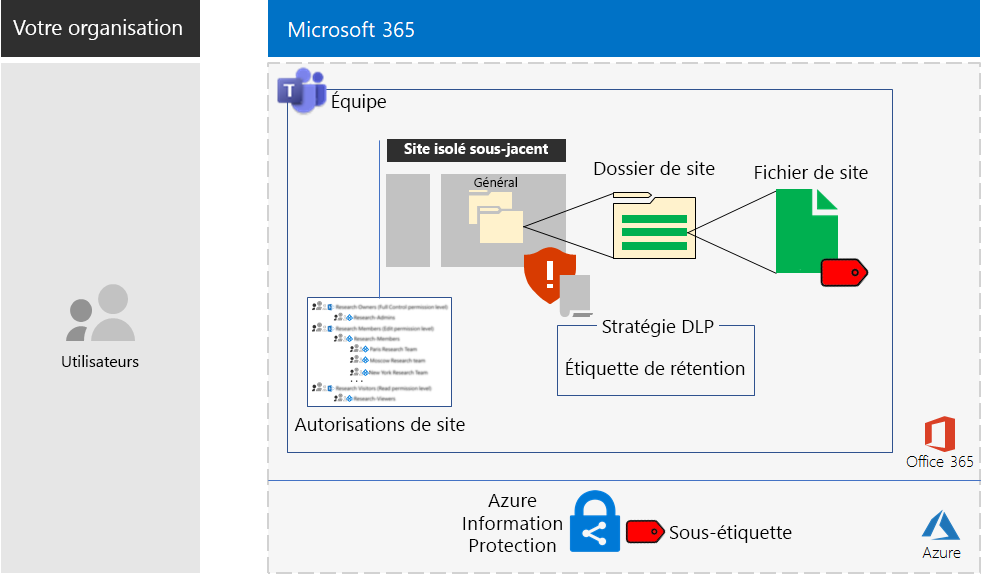

# Sites SharePoint Online et Microsoft Teams pour les données hautement réglementées

*Ce scénario s’applique à la fois aux versions E3 et E5 de Microsoft 365 Entreprise*

Microsoft 365 Entreprise comprend une suite complète de services informatiques pour que vous puissiez créer, stocker et sécuriser vos données hautement réglementées, notamment les données qui sont :

- sujettes à des réglementations régionales ;
- les plus précieuses de votre organisation comme les secrets commerciaux, les informations sur les ressources humaines ou financières et la stratégie de l’organisation.

Dans le cadre d’un scénario Microsoft 365 Entreprise basé sur le cloud qui répond à ce besoin métier, vous êtes tenu de suivre les instructions suivantes :

- Stockez les biens numériques (documents, diapositives, tableurs, etc.) dans un site d’équipe SharePoint Online ou dans l’onglet **Fichiers** d’une équipe Microsoft Teams.
- Verrouillez le site ou l’équipe pour empêcher :
   - l’accès à un ensemble spécifique de comptes d’utilisateur via l’appartenance à un groupe, ce qui inclut les personnes qui peuvent accéder au site d’équipe SharePoint Online et à quel niveau d’autorisation, et les personnes qui peuvent l’administrer ;
   - les membres du site d’octroyer l’accès à d’autres personnes ;
   - l’accès au site par les personnes non membres.
- Configurez une étiquette de rétention Office 365 pour vos équipes ou sites SharePoint Online comme moyen par défaut de définir des stratégies de rétention sur les documents de l’équipe ou du site.
- Empêchez les utilisateurs d’envoyer des fichiers à l’extérieur de l’organisation.
- Chiffrez les biens numériques les plus sensibles du site ou de l’équipe.
- Ajoutez des autorisations aux biens numériques les plus sensibles : même si les biens sont partagés en dehors du site, leur ouverture nécessite toujours les informations d’identification valides d’un compte d’utilisateur autorisé.

Le tableau suivant mappe les conditions requises de ce scénario à une fonctionnalité de Microsoft 365 Entreprise.

|||
|:-------|:-----|
| **Configuration requise** | **Fonctionnalité Microsoft 365 Entreprise** |
| Stocker les biens numériques | Équipes et sites d’équipe SharePoint Online dans Office 365 |
| Verrouiller le site | Autorisations de sites d’équipe SharePoint Online et de groupes Azure AD |
| Étiqueter les biens numériques du site | Étiquettes de rétention Office 365 |
| Bloquer les utilisateurs lors de l’envoi de fichiers à l’extérieur de l’organisation | Stratégies de protection contre la perte de données (DLP) dans Office 365 |
| Chiffrer tous les biens numériques du site | Sous-étiquettes Azure Information Protection dans Enterprise Mobility + Security (EMS) |
| Ajouter des autorisations aux biens numériques du site | Sous-étiquettes Azure Information Protection dans EMS |
|||

Voici la configuration d’un site SharePoint Online.

Ce scénario implique que vous ayez déjà déployé les éléments suivants :

- La phase [Identité](identity-infrastructure.md) et les étapes 1 et 2 de la phase [Protection des informations](infoprotect-infrastructure.md) de l’infrastructure de base. 
- [SharePoint Online](sharepoint-online-onedrive-workload.md) pour les données hautement réglementées dans des sites d’équipe SharePoint Online
- [Microsoft Teams](teams-workload.md) pour les données hautement réglementées dans des équipes Microsoft Teams

Les phases suivantes vous guident à travers toute la conception, la configuration et l’adoption des équipes et des sites SharePoint Online pour les données hautement réglementées.

Pour découvrir comment Contoso Corporation, une organisation multinationale fictive mais représentative, a conçu un site SharePoint Online pour ses équipes de recherche, consultez cet [exemple de configuration](contoso-sharepoint-online-site-for-highly-confidential-assets.md).

Dans le cadre d’une équipe dédiée aux données hautement réglementées, vous devez tout d’abord créer un site d’équipe SharePoint Online pour les données hautement réglementées. Ensuite, vous créez une équipe qui utilise le groupe Office 365 du site d’équipe SharePoint Online. Consultez la phase 2, étape 4 pour obtenir plus d’informations.

Voici la configuration pour une équipe.

## Conditions préalables pour les identités et l’accès aux appareils

Pour protéger l’accès à l’équipe ou au site SharePoint Online, vérifiez que vous avez configuré les [stratégies pour les identités et l’accès aux appareils](identity-access-policies.md) et les [stratégies d’accès à SharePoint Online recommandées](sharepoint-file-access-policies.md).

## Phase 1 : conception

Pour créer une équipe ou un site SharePoint Online pour les données hautement réglementées, vous devez d’abord en identifier l’objectif. Par exemple, le département recherche et développement d’une organisation de fabrication a besoin d’un site SharePoint Online pour stocker les spécifications de conception actuelles pour les produits existants et un emplacement pour collaborer sur de nouveaux produits. Seuls les membres du service de recherche et de développement et les cadres sélectionnés seront autorisés à accéder au site.

Cet objectif va permettre de déterminer les éléments de configuration essentiels, tels que les éléments suivants :

- L’ensemble des séries d’autorisations SharePoint Online et les groupes SharePoint
- L’ensemble des groupes d’accès, les groupes de sécurité Azure AD et leurs membres à ajouter aux groupes SharePoint
- L’étiquette de rétention Office 365 à affecter au site et l’ensemble de stratégies DLP liées à l’étiquette
- Les paramètres d’une sous-étiquette Azure Information Protection que les utilisateurs appliquent aux biens numériques hautement sensibles stockés dans le site

Une fois ces paramètres déterminés, utilisez-les pour configurer le site à la phase 2. 

### Étape 1 : site SharePoint Online isolé

La version verrouillée d’un site d’équipe SharePoint Online est appelée « site isolé ». Contrairement aux paramètres par défaut des sites d’équipe privés, les sites isolés sont configurés pour empêcher :

- l’accès à ceux qui ne sont pas membres de groupes spécifiés ;
- la demande d’accès ;
- l’octroi non autorisé de l’accès par les membres actuels des groupes spécifiés ;
- l’administration du site par les membres du groupe d’accès.

La sécurité des sites d’équipe SharePoint Online qui contiennent des biens hautement réglementés ne change pas, sauf par un administrateur SharePoint du site.

Consultez l’article [Conception d’un site d’équipe isolé SharePoint Online](https://docs.microsoft.com/office365/enterprise/design-an-isolated-sharepoint-online-team-site) pour obtenir des informations et déterminer l’ensemble des niveaux d’autorisation, les groupes SharePoint, les groupes d’accès et les membres des groupes.

### Étape 2 : étiquettes de rétention Office 365 et stratégies DLP

Lorsqu’elles sont appliquées à un site d’équipe SharePoint Online, les étiquettes de rétention Office 365 fournissent une méthode par défaut de classification de toutes les ressources numériques stockées sur le site.
 
En ce qui concerne les sites SharePoint Online pour les données hautement réglementées, vous devez déterminer les étiquettes de rétention Office 365 à utiliser.

Concernant les considérations relatives à la conception d’étiquettes Office 365, consultez la rubrique [Classification et étiquettes Office 365](https://docs.microsoft.com/office365/securitycompliance/secure-sharepoint-online-sites-and-files#office-365-retention-labels).

Pour protéger les informations sensibles et empêcher leur divulgation accidentelle ou intentionnelle, vous pouvez utiliser des stratégies DLP. Pour obtenir plus d’informations, consultez cette [vue d’ensemble](https://docs.microsoft.com/office365/securitycompliance/data-loss-prevention-policies).

En ce qui concerne les sites SharePoint Online pour les données hautement réglementées, vous devez configurer une stratégie DLP pour l’étiquette de rétention Office 365 affectée au site afin de bloquer les utilisateurs lorsqu’ils essaient de partager des ressources numériques avec des utilisateurs externes. 

### Étapes 3 : sous-étiquette Azure Information Protection

Pour chiffrer vos biens numériques les plus sensibles et leur attribuer un ensemble d’autorisations, les utilisateurs doivent appliquer une étiquette Azure Information Protection utilisant le client Azure Information Protection. Pour utiliser des étiquettes Azure Information Protection pour les sites SharePoint Online pour les données hautement réglementées, vous devez configurer une sous-étiquette Azure Information Protection dans une stratégie limitée. 

Une sous-étiquette existe sous une étiquette existante. Par exemple, vous pouvez créer une sous-étiquette Recherche et développement sous l’étiquette Hautement confidentiel. Une stratégie limitée est une stratégie qui s’applique uniquement à un sous-ensemble d’utilisateurs. Dans le cadre des sites SharePoint Online pour les données hautement réglementées, l’étendue correspond à l’ensemble des utilisateurs qui sont membres des groupes d’accès pour le site.

Les paramètres de la sous-étiquette appliquée se déplacent avec le bien. Même s’il est téléchargé et partagé en dehors du site, seuls les comptes d’utilisateurs authentifiés qui disposent des autorisations peuvent l’ouvrir.

### Résultats de conception

Vous avez déterminé les éléments suivants:

- L’ensemble de groupes SharePoint et les niveaux d’autorisation
- L’ensemble de groupes d’accès et leurs membres pour chaque niveau d’autorisation
- L’étiquette de rétention Office 365 appropriée et la stratégie DLP associée à l’étiquette
- Les paramètres de la sous-étiquette Azure Information Protection comprenant le chiffrement et les autorisations

## Phase 2 : configuration

Dans cette phase, vous prenez les paramètres déterminés à la phase 1 et les implémentez pour créer un site SharePoint Online pour les données hautement réglementées.

### Étape 1 : créer et configurer un site d’équipe isolé SharePoint Online

Suivez les instructions indiquées dans l’article [Déploiement d’un site d’équipe isolé SharePoint Online](https://docs.microsoft.com/office365/enterprise/deploy-an-isolated-sharepoint-online-team-site) pour effectuer les actions suivantes :

- Créer et remplir les groupes d’accès pour chaque niveau d’autorisation SharePoint utilisé sur le site.
- Créer et configurer le site d’équipe isolé.

### Étape 2 : configurer le site pour une étiquette de rétention Office 365

Suivez les instructions mentionnées dans [Protéger les fichiers SharePoint Online avec des étiquettes Office 365 et la protection contre la perte de données (DLP)](https://docs.microsoft.com/office365/enterprise/protect-sharepoint-online-files-with-office-365-labels-and-dlp) pour :

- Identifier ou créer l’étiquette de rétention Office 365 et l’appliquer à votre site isolé SharePoint Online.
- Créer et configurer la stratégie DLP qui empêchent les utilisateurs de partager un bien numérique de votre site SharePoint Online en dehors de l’organisation.

### Étape 3 : créer une sous-étiquette Azure Information Protection pour le site

Suivez les instructions indiquées dans l’article [Protéger les fichiers SharePoint Online avec Azure Information Protection](https://docs.microsoft.com/office365/enterprise/protect-sharepoint-online-files-with-azure-information-protection) pour effectuer les actions suivantes : 

- Créer et configurer une sous-étiquette Azure Information Protection dans une stratégie limitée.
- Déployer le client Azure Information Protection sur les ordinateurs des utilisateurs.

### Étape 4 (facultatif) : créer une équipe pour les données hautement réglementées

Si vous souhaitez une équipe pour les données hautement réglementées, vous devez d’abord créer un site SharePoint Online pour les données hautement réglementées. Lorsque vous créez le site d’équipe SharePoint Online privé initial, spécifiez un nom de groupe Office 365.

Une fois que le site SharePoint Online pour les données hautement réglementées est configuré, suivez les étapes suivantes pour le convertir en une équipe pour les données hautement réglementées :

1. Connectez-vous à Office 365.
2. Dans l’onglet **Accueil Microsoft Office**, cliquez sur **Équipes**.
3. À partir de l’onglet **Microsoft Teams**, dans le volet **Rejoindre ou créer une équipe**, cliquez sur **Créer une équipe**.
4. Dans le volet **Créer votre équipe**, cliquez sur **Créer une équipe à partir d’un groupe Office 365 existant**.
5. Dans la liste de groupes Office 365, sélectionnez le nom du groupe Office 365 correspondant au site SharePoint Online des données hautement réglementées, puis cliquez sur **Choisir l’équipe**.

L’onglet **Fichiers** de la nouvelle équipe répertorie le contenu du dossier **Général** de la zone **Documents** du site SharePoint Online correspondant. Pour afficher le reste de ressources du site SharePoint Online pour l’équipe, cliquez sur les points de suspension, puis cliquez sur **Ouvrir dans SharePoint**.

### Résultats de la configuration

Vous avez configuré les éléments suivants :

- Un site isolé SharePoint Online
- Une étiquette de rétention Office 365 affectée au site isolé SharePoint Online
- Une stratégie DLP pour l’étiquette de rétention Office 365
- Une sous-étiquette Azure Information Protection d’une stratégie limitée que les utilisateurs peuvent appliquer aux biens numériques les plus sensibles stockés dans le site, qui chiffre le bien et applique des autorisations
- Le cas échéant, une équipe pour les données hautement réglementées basée sur le site SharePoint Online

## Étape 3 : favoriser l’adoption utilisateur

Une équipe ou un site SharePoint Online pour les données hautement réglementées ne permet de protéger ces données que si elle est utilisée de manière cohérente pour l’accès aux biens numériques sensibles et leur stockage. Il s’agit de la phase la plus difficile, car elle suppose que les utilisateurs doivent modifier leurs comportements. 

Par exemple, les cadres habitués à stocker des fichiers sensibles sur des lecteurs USB ou des solutions de stockage informatiques personnelles devront désormais les stocker exclusivement sur une équipe ou un site SharePoint Online pour les données hautement réglementées.

### Étape 1 : former vos utilisateurs

Après avoir effectué votre configuration, formez l’ensemble des utilisateurs membres des groupes d’accès au site aux sujets suivants :

- Importance de l’utilisation de la nouvelle équipe ou du nouveau site pour protéger les biens précieux et prévenir les conséquences de la fuite de données hautement réglementées, telles que des conséquences juridiques, des amendes réglementaires, des ransomware ou la perte de l’avantage concurrentiel.
- Accès au site et à ses biens.
- Création de nouveaux fichiers sur le site et chargement de nouveaux fichiers stockés localement.
- Blocage du partage des fichiers en externe par la stratégie DLP.
- Utilisation du client Azure Information Protection pour étiqueter les biens numériques les plus sensibles avec la sous-étiquette configurée.
- Protection d’un bien par la sous-étiquette Azure Information Protection, même lorsqu’il a été divulgué en dehors du site ou de l’équipe.

Cette formation doit inclure des exercices pratiques pour que les utilisateurs puissent effectuer ces opérations et observer leurs résultats.

### Étape 2 : conduire des vérifications périodiques de l’utilisation et des fichiers

Au cours des semaines après la formation, l’administrateur SharePoint de l’équipe ou du site SharePoint Online peut effectuer les actions suivantes :

- Analyser l’utilisation du site ou de l’équipe et les comparer avec les attentes de l’utilisation.
- Vérifier que les fichiers hautement sensibles ont été correctement étiquetés avec la sous-étiquette Azure Information Protection.

Former à nouveau vos utilisateurs, le cas échéant.

### Résultats de l’adoption par les utilisateurs

Les biens numériques sensibles sont stockés exclusivement sur les équipes ou les sites SharePoint Online pour les données hautement réglementées, et les biens les plus sensibles portent la sous-étiquette Azure Information Protection configurée.

## Comment Contoso Corporation a déployé Microsoft 365 Entreprise

Contoso Corporation est un conglomérat de fabricants international fictif mais représentatif avec son siège à Paris en France. Découvrez comment Contoso a conçu, configuré, puis promu un [site SharePoint Online sécurisé](contoso-sharepoint-online-site-for-highly-confidential-assets.md) pour ses équipes de recherche basées à Paris, Moscou, New York, Pékin et Bangalore. 

## Voir aussi

[Guide de déploiement](deploy-microsoft-365-enterprise.md)

[Guides de laboratoire de test](m365-enterprise-test-lab-guides.md)

[Sécuriser les sites SharePoint Online dans un environnement de développement/test](https://docs.microsoft.com/office365/enterprise/secure-sharepoint-online-sites-in-a-dev-test-environment)
