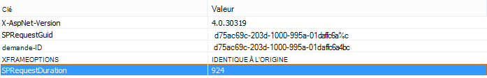
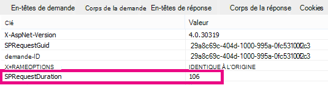

# Utilisation du composant WebPart Recherche de contenu au lieu du composant WebPart Requête de contenu pour améliorer les performances dans SharePoint Online

Cet article explique comment améliorer les performances en remplaçant le composant WebPart Requête de contenu par le composant WebPart Recherche de contenu dans SharePoint Server 2013 et SharePoint Online.
  
L’une des nouvelles fonctionnalités les plus puissantes de SharePoint Server 2013 et SharePoint Online est le composant WebPart Recherche de contenu (CSWP). Ce composant WebPart utilise l’index de recherche pour récupérer rapidement les résultats, qui sont présentés à l’utilisateur. Utilisez le composant WebPart Recherche de contenu au lieu du composant WebPart Requête de contenu (CQWP) dans vos pages pour améliorer les performances de vos utilisateurs.
  
L’utilisation d’un composant WebPart Recherche de contenu sur un composant WebPart Requête de contenu entraîne presque toujours de meilleures performances de chargement de page sur SharePoint Online. Il existe une configuration supplémentaire pour obtenir la requête appropriée, mais les récompenses sont des performances améliorées et des utilisateurs plus heureux.
  
## Comparaison du gain de performances obtenu à l’aide du composant WebPart Recherche de contenu au lieu du composant WebPart Requête de contenu

Les exemples suivants montrent les gains de performances relatifs que vous pouvez recevoir lorsque vous utilisez un composant WebPart Recherche de contenu au lieu d’un composant WebPart Requête de contenu. Les effets sont plus évidents avec une structure de site complexe et des requêtes de contenu étendues.
  
Cet exemple de site présente les caractéristiques suivantes :
  
- 8 niveaux de sous-sites.
    
- Listes utilisant un type de contenu « fruit » personnalisé.
    
- Dans le composant WebPart, la requête de contenu est large, renvoyant tous les éléments avec le type de contenu « fruit ».
    
- L’exemple utilise uniquement 50 éléments sur les 8 sites. Les effets seront encore plus prononcés pour les sites avec plus de contenu.
    
Voici une capture d’écran des résultats du composant WebPart Requête de contenu.
  

  
Dans Internet Explorer, utilisez l’onglet **Réseau** des outils de développement F12 pour examiner les détails de l’en-tête de réponse. Dans la capture d’écran suivante, la valeur de **SPRequestDuration** pour ce chargement de page est de 924 millisecondes. 
  

  
 **SPRequestDuration** indique la quantité de travail effectuée sur le serveur pour préparer la page. Le basculement de contenu par requête de composants WebPart avec contenu par composants WebPart de recherche réduit considérablement le temps nécessaire au rendu de la page. En revanche, une page avec un composant WebPart Recherche de contenu équivalent, qui retourne le même nombre de résultats, a une valeur **SPRequestDuration** de 106 millisecondes, comme illustré dans cette capture d’écran : 
  

  
## Ajout d’un composant WebPart Recherche de contenu dans SharePoint Online

L’ajout d’un composant WebPart Recherche de contenu est similaire à un composant WebPart Requête de contenu standard. Consultez la section  *« Ajouter un composant WebPart Recherche de contenu »*  dans [Configurer un composant WebPart Recherche de contenu dans SharePoint](https://support.office.com/article/Configure-a-Content-Search-Web-Part-in-SharePoint-0dc16de1-dbe4-462b-babb-bf8338c36c9a).
  
## Création de la requête de recherche appropriée pour votre composant WebPart Recherche de contenu

Une fois que vous avez ajouté un composant WebPart Recherche de contenu, vous pouvez affiner la recherche et retourner les éléments souhaités. Pour obtenir des instructions détaillées sur la procédure à suivre, consultez la section  *« Afficher le contenu en configurant une requête avancée dans un composant WebPart Recherche*  de contenu » dans [Configurer un composant WebPart Recherche de contenu dans SharePoint](https://support.office.com/article/Configure-a-Content-Search-Web-Part-in-SharePoint-0dc16de1-dbe4-462b-babb-bf8338c36c9a).
  
## Outil de création et de test de requêtes

Pour obtenir un outil permettant de générer et de tester des requêtes complexes, consultez [l’outil De requête de recherche](https://github.com/pnp/PnP-Tools/tree/master/Solutions/SharePoint.Search.QueryTool#download-the-tool).
  

