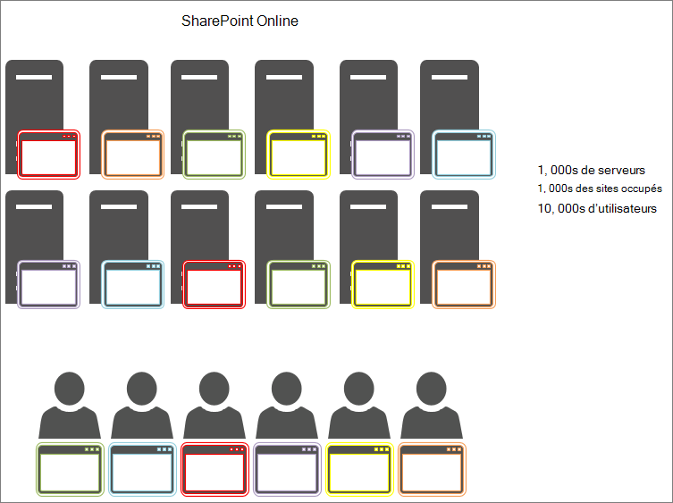

# Utilisation du cache d’objets avec SharePoint Online

Cet article explique la différence entre l’utilisation du cache d’objets dans SharePoint Server 2013 en local et SharePoint Online.
  
Il existe un impact négatif significatif de la confiance dans le cache d’objets dans SharePoint déploiement en ligne. Toute dépendance vis-à-vis du cache d’objets dans SharePoint Online réduit la fiabilité de votre page. 
  
## Fonctionnement du cache d’objets SharePoint Online et SharePoint Server 2013

Quand SharePoint Server 2013 est hébergé localement, le client dispose de serveurs web frontaux privés qui hébergent le cache d’objets. Cela signifie que le cache est dédié à un seul client et est limité uniquement par la quantité de mémoire disponible et allouée au cache d’objets. Étant donné qu’un seul client est pris en charge dans le scénario local, les serveurs web frontaux ont généralement des utilisateurs qui effectuent des demandes vers les mêmes sites à plusieurs reprises. Cela signifie que le cache est rempli rapidement et qu’il reste plein des résultats de la requête de liste et SharePoint objets que vos utilisateurs demandent régulièrement.
  

  
Par conséquent, la deuxième fois qu’un utilisateur visite une page, le temps de chargement de la page s’améliore. Après un minimum de quatre chargements de la même page, la page est mise en cache sur tous les serveurs web frontaux.
  
En revanche, dans SharePoint Online il y a beaucoup plus de serveurs, mais aussi beaucoup plus de sites. Chaque utilisateur peut se connecter à un serveur web frontal différent pour lequel le cache n’est pas rempli. Ou, peut-être le cache est-il rempli pour un serveur, mais l’utilisateur suivant de ce serveur web frontal demande une page à partir d’un autre site. Ou, même si l’utilisateur suivant demande la même page que lors de sa visite précédente, il est à charge équilibrée sur un autre serveur web frontal qui n’a pas cette page dans son cache. Dans ce dernier cas, la mise en cache n’aide pas du tout les utilisateurs.
  
Dans la figure suivante, chaque point représente une page qu’un utilisateur demande et l’emplacement où il est mis en cache. Différentes couleurs représentent différents clients qui utilisent l’infrastructure SaaS de manière partagée.
  

  
Comme vous pouvez le voir dans le diagramme, les chances qu’un utilisateur donné accède à un serveur avec la version mise en cache de sa page sont minces. En outre, en raison du débit important et du fait que les serveurs sont partagés entre de nombreux sites, le cache ne dure pas longtemps, car il n’y a que beaucoup d’espace disponible pour la mise en cache.
  
Pour toutes ces raisons, l’utilisation des utilisateurs pour obtenir des objets mis en cache n’est pas un moyen efficace de garantir une expérience utilisateur de qualité et des temps de chargement de page dans SharePoint Online.
  
## Si nous ne pouvons pas nous appuyer sur le cache d’objets pour améliorer les performances dans SharePoint Online, que pouvons-nous utiliser à la place ?

Étant donné que vous ne devez pas vous appuyer sur la mise en cache dans SharePoint Online, vous devez évaluer d’autres approches de conception pour SharePoint personnalisations qui utilisent le cache d’objets. Cela signifie utiliser des approches pour les problèmes de performances, qui ne reposent pas sur la mise en cache des objets afin de produire de bons résultats pour les utilisateurs. Ceci est décrit dans certains des autres articles de cette série et inclut :
  
- [Options de navigation pour SharePoint Online](navigation-options-for-sharepoint-online.md)
    
- [Minimisation et regroupement dans SharePoint Online](minification-and-bundling-in-sharepoint-online.md)
    
- [Utilisation du réseau de distribution de contenu Office 365 avec SharePoint Online](use-microsoft-365-cdn-with-spo.md)
    
- [Différer le chargement des images et des éléments JavaScript dans SharePoint Online](delay-loading-images-and-javascript-in-sharepoint-online.md)
    