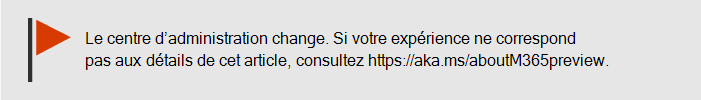
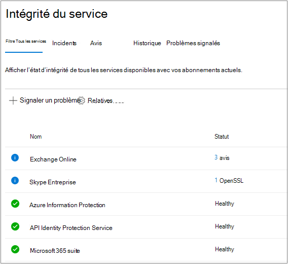
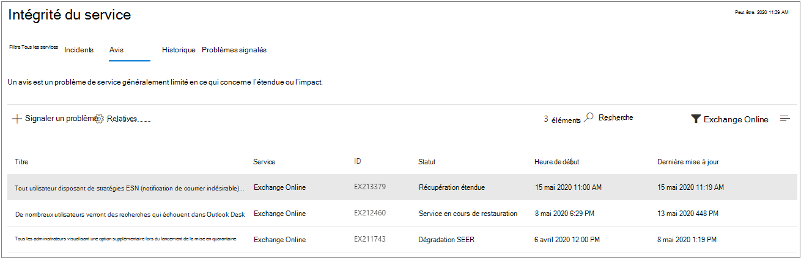
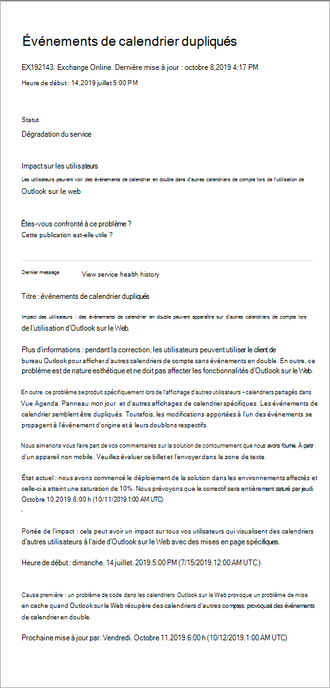
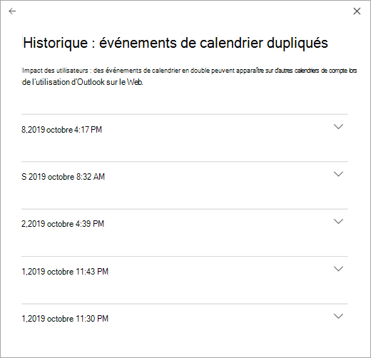

# Comment vérifier l’état du service Microsoft 365

Vous pouvez afficher l’intégrité de vos services Microsoft, y compris Office sur le Web, Yammer, Microsoft Dynamics CRM et les services Cloud de gestion des appareils mobiles, dans la page **État du service** dans le [centre d’administration 365 de Microsoft](https://go.microsoft.com/fwlink/p/?linkid=2024339). If you are experiencing problems with a cloud service, you can check the service health to determine whether this is a known issue with a resolution in progress before you call support or spend time troubleshooting.

Si vous ne parvenez pas à vous connecter au service portail de service, vous pouvez utiliser la [page État du service](https://status.office365.com) pour vérifier les problèmes connus qui vous empêchent de vous connecter à votre client.
  
### Vérifier l'état du service

1. Accédez au centre d’administration 365 de Microsoft à l’adresse [https://admin.microsoft.com](https://go.microsoft.com/fwlink/p/?linkid=2024339) , puis connectez-vous avec un compte d’administrateur.

    > [!NOTE]
    > Les personnes dotées d'un rôle d'administrateur général ou d'administrateur de service peuvent afficher l'état du service. Pour afficher l'état du service, les administrateurs Exchange, SharePoint et Skype Entreprise doivent aussi disposer d'un rôle d'administrateur portant sur ce service. Pour plus d’informations sur les rôles qui peuvent afficher l’état des services, consultez la rubrique [à propos des rôles d’administrateur](https://docs.microsoft.com/microsoft-365/admin/add-users/about-admin-roles?view=o365-worldwide#roles-available-in-the-microsoft-365-admin-center).
  
2. Si vous n’utilisez pas le nouveau centre d’administration, sur la page d' **Accueil** , sélectionnez le bouton **essayer le nouveau centre d’administration** dans le coin supérieur droit.

3. Pour afficher l’état du service, dans le centre d’administration, accédez à intégrité du service d' **intégrité**  >  **Service health**ou sélectionnez la carte d' **intégrité des services** dans le **tableau de bord d’accueil**. La carte de tableau de bord indique s’il existe un problème de service actif et des liens vers la page d’état détaillé du **service** .
  
4. Sur la page **État du service** , l’état d’intégrité de chaque service Cloud est indiqué dans un tableau.

   

L’onglet **tous les services** (affichage par défaut) affiche tous les services et leur état d’intégrité actuel. Une icône et la colonne d' **État** indiquent l’état de chaque service. 

Pour filtrer votre vue sur les services rencontrant actuellement un incident, sélectionnez l’onglet **incidents** en haut de la page. La sélection de l’onglet **conseils** affiche uniquement les services pour lesquels un avis a déjà été publié. 

L’onglet **historique** affiche l’historique des incidents et des avis qui ont été résolus.

Si vous rencontrez un problème avec un service Microsoft 365 et que vous ne l’avez pas mentionné dans la page **État du service** , nous vous le signalons en sélectionnant **signaler un problème**et achever la forme abrégée. Nous examinerons les données et rapports associés d’autres organisations pour voir l’étendue du problème et, si c’est le cas, il provenait de notre service. Si c’est le cas, nous l’ajouterons en tant que nouvel incident ou avis sur la page **État du service** , où vous pouvez suivre sa résolution. Si elle ne s’affiche pas dans la liste dans un délai de 30 minutes, contactez le support technique pour résoudre le problème.

Pour vous inscrire aux notifications par courrier électronique des nouveaux incidents affectant votre client et des changements d’État pour un incident actif, sélectionnez **Préférences**, puis cliquez sur **Envoyer les notifications d’intégrité du service dans le courrier électronique**, puis spécifiez :

- Jusqu’à deux adresses de messagerie.
- Si vous souhaitez recevoir des notifications pour les incidents ou les avis
- Services pour lesquels vous souhaitez une notification

> [!NOTE]
> Chaque administrateur peut avoir son ensemble de préférences et la limite ci-dessus de deux adresses de messagerie est par compte d’administrateur.

> [!TIP]
> Vous pouvez également utiliser l' [application d’administration 365 de Microsoft](https://go.microsoft.com/fwlink/p/?linkid=627216) sur votre appareil mobile pour afficher l’état du service, ce qui constitue un excellent moyen de rester informé des notifications de type transmission. 
  
### Afficher les détails relatifs à l'état du service publié

Dans l’affichage **tous les services** , le choix de l’état du service ouvre une vue récapitulative des avis ou des incidents.
  

Le récapitulatif de l'avis ou de l'incident fournit les informations suivantes :

- **Title** -Résumé du problème.
- **Service** : nom du service affecté.
- **ID** : identificateur numérique du problème.
- **Status** : impact de ce problème sur le service.
- **Heure de début** : heure de début du problème.
- **Dernière mise à jour** : date de la dernière mise à jour du message d’État du service. Nous postons des messages fréquents pour vous informer de la progression de l’application d’une solution.

Sélectionnez le titre du problème pour afficher la page des détails du problème, qui présente des informations supplémentaires sur le problème, notamment l' [historique](#history) de tous les messages publiés pendant que nous travaillons sur une solution.

### Traduire les détails d'état du service

Les explications relatives à l'état du service étant publiées en temps réel, elles ne sont pas traduites automatiquement dans votre langue, et les détails d'un événement de service sont uniquement disponibles en anglais. Pour traduire ces explications, procédez comme suit :
  
1. Accédez à [Translator](https://www.bing.com/translator/).

2. Sur la page **État du Service**, sélectionnez un avis ou un incident. Sous **Afficher les détails**, copiez le texte relatif au problème.

3. Dans Translator, collez le texte, puis sélectionnez **Traduire**.

### Définitions

La plupart du temps, les services s’affichent comme intègres sans autre information. Lorsqu'un service présente un problème, ce problème est identifié sous forme d'avis ou d'incident et son état actuel s'affiche.
  
> [!TIP]
> Les événements de maintenance planifiée ne s'affichent pas dans l'état du service. Le **Centre de messages** vous permet de suivre les événements de maintenance planifiée. Filtrez les messages par Planification des modifications pour connaître le moment où une modification interviendra, son effet et comment vous y préparer. Pour plus d’informations, voir le [Centre de messages dans Microsoft 365](https://support.office.com/article/38fb3333-bfcc-4340-a37b-deda509c2093) .
  
### Incidents et avis

| Icône | Description |
|:-----|:-----|
||Un service accompagné d'un avis indique que nous sommes conscients du problème qui affecte certains utilisateurs, mais que ce service est toujours disponible. Un avis propose souvent une solution de contournement du problème, qui peut intermittent ou limité en termes d'impact sur les utilisateurs.    |
||Si un service présente un incident actif, cela signifie qu'il s'agit d'un problème critique et que le service ou une de ses fonctions principales n'est pas disponible. Par exemple, les utilisateurs peuvent ne pas être en mesure d'envoyer et de recevoir des e-mails ni de se connecter. Les incidents ont un impact significatif sur les utilisateurs. En cas d'incident, nous publions des mises à jour relatives à son examen, aux efforts déployés pour y remédier, et sa résolution apparaît dans le tableau de bord d'état du service.    |

### Définitions des états

| Statut | Définition |
|:-----|:-----|
|**Examen en cours** | Nous sommes conscients d'un problème potentiel et recueillons des informations sur ce problème et son impact. |
|**Dégradation du service** | Nous avons identifié un problème susceptible d'affecter l'utilisation d'un service ou d'une fonctionnalité. Cet état peut s'afficher si un service s'avère plus lent qu'habituellement, s'il présente des interruptions intermittentes ou si une fonctionnalité est défaillante, par exemple. |
|**Interruption du service** | Cet état s'affiche si nous identifions un problème qui affecte la capacité des utilisateurs à accéder au service. Dans ce cas, le problème est significatif et peut se répéter. |
|**Service en cours de restauration** | La cause du problème a été identifiée, nous connaissons l'action corrective à appliquer et le service est en cours de restauration. |
|**Récupération étendue** | Cet état indique qu'une action corrective est en cours afin de restaurer le service pour la plupart des utilisateurs, mais qu'il faudra un certain temps pour qu'elle s'applique à tous les systèmes concernés. Cet état peut également s'afficher si nous proposons un correctif temporaire visant à réduire l'impact du problème en attendant un correctif définitif. |
|**Examen suspendu** | Cet état s'affiche si l'examen détaillé d'un problème potentiel implique plus d'informations de la part des clients afin de nous permettre de mieux l'étudier. Dans ce cas, nous vous indiquerons les données ou journaux dont nous avons besoin. |
|**Service restauré** | L'action corrective a permis de résoudre le problème sous-jacent et le service a été restauré. Pour en savoir plus, consultez les détails relatifs au problème. |
|**Faux positif** | Après une enquête détaillée, nous avons confirmé que le service est sain et qu’il fonctionne comme prévu. Aucun impact sur le service n’a été observé ou la cause de l’incident provient de l’extérieur du service. |
|**Publication du rapport post-incident** | Nous avons publié un rapport de l’incident post pour un problème spécifique qui inclut les informations de la cause première et les étapes suivantes pour éviter que le problème ne se reproduise. |

### Historique

L’état des services vous permet de consulter l’état actuel de l’intégrité et d’afficher l’historique des avis de service et des incidents qui ont affecté votre client au cours des 30 derniers jours. Pour afficher l’intégrité passée de tous les services, sélectionnez **afficher l’historique** sur la page Détails du problème.
  

  
La liste de tous les messages d'état des services publiés au cours de la période sélectionnée s'affiche comme suit :
  

  
Développez une ligne pour afficher plus d’informations sur le problème.
  
Pour plus d’informations sur notre engagement en matière de disponibilité, consultez la rubrique [opérations transparentes de Microsoft 365](https://go.microsoft.com/fwlink/?linkid=848695).

## Voir aussi

[Rapports d’activité dans le centre](https://support.office.com/article/0d6dfb17-8582-4172-a9a9-aed798150263) 
 d’administration Microsoft 365 [Préférences du centre de messages](https://docs.microsoft.com/microsoft-365/admin/manage/message-center?view=o365-worldwide#preferences11)
