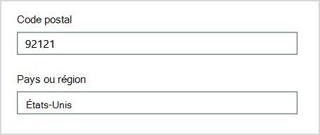
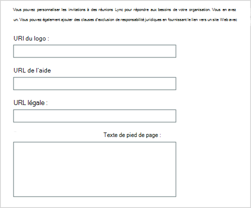
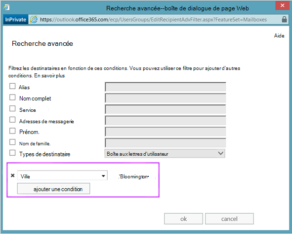

# <a name="why-you-need-to-use-powershell-for-microsoft-365"></a>Pourquoi utiliser PowerShell pour Microsoft 365

*Cet article est valable pour Microsoft 365 Entreprise et Office 365 Entreprise.*

Avec le Centre d'administration Microsoft 365, vous pouvez gérer vos comptes d’utilisateur et licences Microsoft 365. Vous pouvez également gérer vos services Microsoft 365, tels que Exchange Online, Teams et SharePoint Online. Si vous utilisez plutôt PowerShell pour gérer ces services, vous pouvez et tirer parti de l’environnement de ligne de commande et de langage de script pour la vitesse, l’automatisation et d’autres fonctionnalités.

Cet article explique comment utiliser PowerShell pour gérer Microsoft 365 pour :

- Révéler des informations supplémentaires que vous ne pouvez pas voir dans le Centre d'administration Microsoft 365

- Configurer les fonctionnalités et les paramètres possibles uniquement avec PowerShell

- Effectuer des opérations en bloc

- Filtrer les données

- Imprimer ou enregistrer des données

- Gérer entre les services

N’oubliez pas que PowerShell pour Microsoft 365 est un ensemble de modules pour Windows PowerShell, qui est un environnement de ligne de commande pour les services et plateformes Windows. Cet environnement crée un langage command-shell qui peut être étendu avec des modules supplémentaires. Il fournit un moyen d’exécuter des commandes ou des scripts simples ou complexes. Par exemple, après avoir installé les modules PowerShell pour Microsoft 365 et vous être connecté à votre abonnement Microsoft 365, vous pouvez exécuter la commande suivante pour répertorier toutes les boîtes aux lettres utilisateur pour Microsoft Exchange Online :

```powershell
Get-Mailbox
```

Vous pouvez également obtenir la liste des boîtes aux lettres à l’aide de la Centre d'administration Microsoft 365, mais il n’est pas facile de compter les éléments dans toutes les listes pour tous les sites de toutes vos applications web.

PowerShell pour Microsoft 365 est conçu pour vous aider à gérer Microsoft 365, et non à remplacer le Centre d'administration Microsoft 365. Les administrateurs doivent pouvoir utiliser PowerShell pour Microsoft 365, car certaines procédures de configuration ne peuvent être effectuées que par le biais de commandes PowerShell pour Microsoft 365. Pour ces cas, vous devez savoir comment :

- Installez les modules PowerShell pour Microsoft 365 (effectués une seule fois pour chaque ordinateur administrateur).

- Connectez-vous à votre abonnement Microsoft 365 (une fois pour chaque session PowerShell).

- Collectez les informations nécessaires pour exécuter les commandes PowerShell requises pour Microsoft 365.

- Exécutez PowerShell pour les commandes Microsoft 365.

Une fois que vous avez appris ces compétences de base, vous n’avez pas à répertorier les utilisateurs de votre boîte aux lettres à l’aide de la commande **Get-Mailbox** . Vous n’avez pas non plus besoin de comprendre comment créer une commande telle que la commande citée précédemment pour compter tous les éléments de toutes les listes pour tous les sites de toutes vos applications web. Microsoft et la communauté d’administrateurs peuvent vous aider à effectuer ces tâches en fonction des besoins.

## <a name="powershell-for-microsoft-365-can-reveal-information-that-you-cant-see-with-the-microsoft-365-admin-center"></a>PowerShell pour Microsoft 365 peut révéler des informations que vous ne pouvez pas voir avec le Centre d'administration Microsoft 365

Le Centre d'administration Microsoft 365 affiche de nombreuses informations utiles. Mais il n’affiche pas toutes les informations possibles que Microsoft 365 stocke sur les utilisateurs, les licences, les boîtes aux lettres et les sites. Voici un exemple pour *les utilisateurs et les groupes* dans le Centre d'administration Microsoft 365 :


Cette vue fournit les informations dont vous avez besoin dans de nombreux cas. Toutefois, il peut arriver que vous ayez besoin de plus d'informations. Par exemple, les licences Microsoft 365 (et les fonctionnalités Microsoft 365 disponibles pour un utilisateur) dépendent en partie de l’emplacement géographique de l’utilisateur. Les stratégies et fonctionnalités que vous pouvez étendre à un utilisateur qui vit dans le États-Unis peuvent ne pas être les mêmes que celles que vous pouvez étendre à un utilisateur en Inde ou en Belgique. Procédez comme suit dans le Centre d'administration Microsoft 365 pour déterminer l’emplacement géographique d’un utilisateur :

1. Double-cliquez sur l'élément **Nom d'affichage** de l'utilisateur.

2. Dans le volet d’affichage des propriétés de l’utilisateur, sélectionnez **les détails**.

3. Dans l’affichage des détails, sélectionnez **des détails supplémentaires**.

4. Faites défiler jusqu’à trouver l’en-tête **Pays ou région** :

     

5. Écrivez le nom d'affichage et l'emplacement de l'utilisateur sur un morceau de papier, ou copiez-le et collez-le dans le Bloc-notes.

Vous devez répéter cette procédure pour chaque utilisateur. Si vous avez de nombreux utilisateurs, ce processus peut être fastidieux. Avec PowerShell pour Microsoft 365, vous pouvez afficher ces informations pour tous vos utilisateurs à l’aide de la commande suivante :

```powershell
Get-AzureADUser | Select DisplayName, UsageLocation
```


>[!Note]
>PowerShell Core ne prend pas en charge le module Microsoft Azure Active Directory pour Windows PowerShell module et les applets de commande qui ont *Msol* dans leur nom. Vous devez exécuter ces applets de commande à partir de Windows PowerShell.
>

Voici un exemple des résultats :

```powershell
DisplayName                               UsageLocation
-----------                               -------------
Bonnie Kearney                            GB
Fabrice Canel                             BR
Brian Johnson (TAILSPIN)                  US
Anne Wallace                              US
Alex Darrow                               US
David Longmuir                            BR
```

L’interprétation de cette commande PowerShell est la suivante : obtenez tous les utilisateurs de l’abonnement Microsoft 365 actuel (**Get-AzureADUser**), mais affichez uniquement le nom et l’emplacement de chaque utilisateur (**Select DisplayName, UsageLocation**).

Étant donné que PowerShell pour Microsoft 365 prend en charge un langage d’interpréteur de commandes, vous pouvez manipuler davantage les informations obtenues par la commande **Get-AzureADUser** . Par exemple, vous souhaiterez peut-être trier ces utilisateurs en fonction de leur emplacement, en regroupant tous les utilisateurs brésiliens, tous les États-Unis utilisateurs ensemble, et ainsi de suite. Voici la commande :

```powershell
Get-AzureADUser | Select DisplayName, UsageLocation | Sort UsageLocation, DisplayName
```

Voici un exemple des résultats :

```powershell
DisplayName                                 UsageLocation
-----------                                 -------------
David Longmuir                              BR
Fabrice Canel                               BR
Bonnie Kearney                              GB
Alex Darrow                                 US
Anne Wallace                                US
Brian Johnson (TAILSPIN)                    US
```

L’interprétation de cette commande PowerShell est la suivante : obtenez tous les utilisateurs de l’abonnement Microsoft 365 actuel, mais affichez uniquement le nom et l’emplacement de chaque utilisateur et triez-les d’abord en fonction de leur emplacement, puis de leur nom (**Sort UsageLocation, DisplayName**).

Vous pouvez également utiliser un filtrage supplémentaire. Par exemple, si vous voulez uniquement voir les informations relatives aux utilisateurs basés au Brésil, utilisez cette commande :

```powershell
Get-AzureADUser | Where {$_.UsageLocation -eq "BR"} | Select DisplayName, UsageLocation
```

Voici un exemple des résultats :

```powershell
DisplayName                                           UsageLocation
-----------                                           -------------
David Longmuir                                        BR
Fabrice Canel                                         BR
```

L’interprétation de cette commande PowerShell est la suivante : obtenez tous les utilisateurs de l’abonnement Microsoft 365 actuel dont l’emplacement est Brésil (**Où {$\_. UsageLocation -eq « BR"}**), puis affiche le nom et l’emplacement de chaque utilisateur.

 **Remarque sur les grands domaines**

Si vous avez un grand domaine avec des dizaines de milliers d’utilisateurs, la tentative de certains des exemples que nous montrons dans cet article peut entraîner une limitation. En fonction de facteurs tels que la puissance de calcul et la bande passante réseau disponible, vous pouvez essayer d’en faire trop à la fois. Les grandes organisations peuvent souhaiter fractionner certaines de ces opérations PowerShell en deux commandes.

Par exemple, la commande suivante retourne tous les comptes d’utilisateur et affiche le nom et l’emplacement de chacun :

```powershell
Get-AzureADUser | Select DisplayName, UsageLocation
```

Cela fonctionne bien pour les petits domaines. Toutefois, dans une grande organisation, vous pouvez fractionner cette opération en deux commandes : une commande pour stocker les informations du compte d’utilisateur dans une variable et une autre pour afficher les informations nécessaires. Voici un exemple :

```powershell
$x = Get-AzureADUser
$x | Select DisplayName, UsageLocation
```

L’interprétation de cet ensemble de commandes PowerShell est la suivante :
1. Obtenez tous les utilisateurs de l’abonnement Microsoft 365 actuel et stockez les informations dans une variable nommée $x (**$x = Get-AzureADUser**).
1.  Afficher le contenu de la variable *$x*, mais inclure uniquement le nom et l’emplacement de chaque utilisateur (**$x | Sélectionnez DisplayName, UsageLocation**).

## <a name="microsoft-365-has-features-that-you-can-only-configure-with-powershell-for-microsoft-365"></a>Microsoft 365 dispose de fonctionnalités que vous pouvez uniquement configurer avec PowerShell pour Microsoft 365

Le Centre d'administration Microsoft 365 est destiné à fournir l’accès à des tâches administratives courantes et utiles qui s’appliquent à la plupart des environnements. En d’autres termes, le Centre d'administration Microsoft 365 a été conçu pour permettre à l’administrateur standard d’effectuer les tâches de gestion les plus courantes. Mais certaines tâches ne peuvent pas être effectuées dans le Centre d’administration.

Par exemple, le centre d’administration Skype Entreprise Online fournit quelques options pour créer des invitations à des réunions personnalisées :



Avec ces paramètres, vous pouvez ajouter une touche de personnalisation et de professionnalisme aux invitations aux réunions. Toutefois, il existe plus de paramètres de configuration de réunion que la création d’invitations de réunion personnalisées. Par défaut, les réunions autorisent :

- les utilisateurs anonymes à obtenir une entrée automatique à chaque réunion ;

- les participants à enregistrer la réunion ;

- tous les utilisateurs de votre organisation à être désignés en tant que présentateurs lorsqu’ils rejoignent la réunion.

Ces paramètres ne sont pas disponibles à partir du centre d’administration Skype Entreprise Online. Vous pouvez les contrôler à partir de PowerShell pour Microsoft 365. Voici une commande qui désactive ces trois paramètres :

```powershell
Set-CsMeetingConfiguration -AdmitAnonymousUsersByDefault $False -AllowConferenceRecording $False -DesignateAsPresenter "None"
```

> [!NOTE]
> Pour exécuter cette commande, vous devez installer le [module PowerShell en ligne Skype Entreprise](/skypeforbusiness/set-up-your-computer-for-windows-powershell/download-and-install-the-skype-for-business-online-connector).

L’interprétation de cette commande PowerShell est la suivante :

1. Dans les paramètres des nouvelles réunions Skype Entreprise Online (**Set-CsMeetingConfiguration**), désactivez l’autorisation des utilisateurs anonymes d’accéder automatiquement aux réunions (**-AdmitAnonymousUsersByDefault $False**).
2.  Désactivez la possibilité pour les participants d’enregistrer des réunions (**-AllowConferenceRecording $False**).
3. Ne désignez pas tous les utilisateurs de votre organisation comme présentateurs (**-DesignateAsPresenter « None »).**

Pour restaurer ces paramètres par défaut (activer les options), exécutez la commande suivante :

```powershell
Set-CsMeetingConfiguration -AdmitAnonymousUsersByDefault $True -AllowConferenceRecording $True -DesignateAsPresenter "Company"
```

Il existe d’autres scénarios similaires, c’est pourquoi les administrateurs doivent savoir comment exécuter PowerShell pour les commandes Microsoft 365.

## <a name="powershell-for-microsoft-365-is-great-for-bulk-operations"></a>PowerShell pour Microsoft 365 est idéal pour les opérations en bloc

Les interfaces visuelles telles que les Centre d'administration Microsoft 365 sont les plus utiles lorsque vous avez une seule opération à effectuer. Par exemple, si vous devez désactiver un compte d’utilisateur, vous pouvez utiliser le centre d’administration pour rechercher et décocher rapidement une case à cocher. Cela peut être plus facile que d’effectuer une opération similaire dans PowerShell.

Mais si vous devez changer beaucoup de choses ou certaines choses sélectionnées dans un grand ensemble d’autres choses, le Centre d'administration Microsoft 365 peut ne pas être le meilleur outil. Par exemple, supposons que vous devez modifier le préfixe sur des milliers de numéros de téléphone ou supprimer l’utilisateur spécifique *Ken Myer* de tous vos sites SharePoint Online. Comment ferais-tu ça dans le Centre d'administration Microsoft 365 ?

Pour le dernier exemple, supposons que vous avez plusieurs centaines de sites SharePoint Online, et que vous ne savez pas lesquels Ken Meyer est membre. Vous devez commencer au Centre d'administration Microsoft 365, puis effectuer cette procédure pour chaque site :

1. Sélectionnez **l’URL** du site.

2. Dans la zone **propriétés** de la collection de sites, sélectionnez le lien Adresse du site **web** pour ouvrir le site.

3. Sur le site, sélectionnez **Partager**.

4. Dans la boîte de dialogue **Partager** , sélectionnez le lien qui affiche tous les utilisateurs disposant d’autorisations sur le site :

     

5. Dans la boîte de dialogue **Partagé avec** , sélectionnez **Avancé**.

6. Faites défiler la liste des utilisateurs, recherchez et sélectionnez Ken Myer (en supposant qu’il dispose d’autorisations sur le site), puis **sélectionnez Supprimer les autorisations utilisateur**.

Cela prendrait *beaucoup de* temps pour plusieurs centaines de sites.

L’alternative consiste à exécuter la commande suivante dans PowerShell pour Microsoft 365 afin de supprimer Ken Myer de tous vos sites :

```powershell
Get-SPOSite | ForEach {Remove-SPOUser -Site $_.Url -LoginName "kenmyer@litwareinc.com"}
```

> [!NOTE]
> Cette commande nécessite l’installation du [module PowerShell SharePoint Online](/powershell/sharepoint/sharepoint-online/connect-sharepoint-online).

L’interprétation de cette commande PowerShell est la suivante : obtenez tous les sites SharePoint dans l’abonnement Microsoft 365 actuel (**Get-SPOSite**) et, pour chaque site, supprimez Ken Meyer de la liste des utilisateurs qui peuvent y accéder (**ForEach {Remove-SPOUser -Site $\_. URL -LoginName « kenmyer\@litwareinc.com"}**).

Nous demandons à Microsoft 365 de supprimer Ken Meyer de chaque site, y compris ceux auxquels il n’a pas accès. Les résultats montrent donc des erreurs pour les sites auxquels il n’a pas accès. Nous pouvons utiliser une condition supplémentaire sur cette commande pour supprimer Ken Meyer uniquement des sites qui l’ont sur leur liste de connexion. Mais les erreurs retournées ne causent aucun dommage aux sites eux-mêmes. Cette commande peut prendre quelques minutes pour s’exécuter sur des centaines de sites, plutôt que des heures de travail dans le Centre d'administration Microsoft 365.

Voici un autre exemple d’opération en bloc. Utilisez cette commande pour ajouter *Bonnie Kearney*, une nouvelle administrateur SharePoint, à tous les sites de l’organisation :

```powershell
Get-SPOSite | ForEach {Add-SPOUser -Site $_.Url -LoginName "bkearney@litwareinc.com" -Group "Members"}
```

L’interprétation de cette commande PowerShell est la suivante : obtenez tous les sites SharePoint dans l’abonnement Microsoft 365 actuel et, pour chaque site, autorisez l’accès à Bonnie Kearney en ajoutant son nom de connexion au groupe Membres du site (**ForEach {Add-SPOUser -Site $\_. URL -LoginName « bkearney\@litwareinc.com » -Group « Members"}**).

## <a name="powershell-for-microsoft-365-is-great-at-filtering-data"></a>PowerShell pour Microsoft 365 est idéal pour filtrer les données

Le Centre d'administration Microsoft 365 fournit plusieurs façons de filtrer vos données pour localiser facilement un sous-ensemble d’informations ciblé. Par exemple, Exchange facilite le filtrage sur pratiquement toutes les propriétés de la boîte aux lettres d'un utilisateur. Par exemple, voici la liste des boîtes aux lettres pour tous les utilisateurs qui vivent dans la ville de Bloomington :



Le <a href="https://go.microsoft.com/fwlink/p/?linkid=2059104" target="_blank">Centre d’administration Exchange</a> vous permet également de combiner des critères de filtre. Par exemple, vous pouvez trouver les boîtes aux lettres de toutes les personnes qui vivent à Bloomington et travaillent dans le service des finances.

Toutefois, il existe des limitations à ce que vous pouvez faire dans le centre de Administration Exchange. Par exemple, vous n’avez pas pu trouver aussi facilement les boîtes aux lettres des personnes qui vivent à Bloomington ou San Diego, *ou* les boîtes aux lettres pour toutes les personnes qui ne vivent pas à Bloomington.

Vous pouvez utiliser la commande PowerShell pour Microsoft 365 suivante pour obtenir une liste de boîtes aux lettres pour toutes les personnes qui vivent à Bloomington ou San Diego :

```powershell
Get-User | Where {$_.RecipientTypeDetails -eq "UserMailbox" -and ($_.City -eq "San Diego" -or $_.City -eq "Bloomington")} | Select DisplayName, City
```

Voici un exemple des résultats :

```powershell
DisplayName                              City
-----------                              ----
Alex Darrow                              San Diego
Bonnie Kearney                           San Diego
Julian Isla                              Bloomington
Rob Young                                Bloomington
```

L’interprétation de cette commande PowerShell est la suivante : obtenez tous les utilisateurs de l’abonnement Microsoft 365 actuel qui ont une boîte aux lettres dans la ville de San Diego ou Bloomington (**Où {$\_. RecipientTypeDetails -eq « UserMailbox » -et ($\_. Ville -eq « San Diego » -ou $\_. City -eq « Bloomington »)}**), puis affichez le nom et la ville de chacun (**Select DisplayName, City**).

Et voici la commande pour répertorier toutes les boîtes aux lettres pour les personnes qui vivent n’importe où à l’exception de Bloomington :

```powershell
Get-User | Where {$_.RecipientTypeDetails -eq "UserMailbox" -and $_.City -ne "Bloomington"} | Select DisplayName, City
```

Voici un exemple des résultats :

```powershell
DisplayName                               City
-----------                               ----
MOD Administrator                         Redmond
Alex Darrow                               San Diego
Allie Bellew                              Bellevue
Anne Wallace                              Louisville
Aziz Hassouneh                            Cairo
Belinda Newman                            Charlotte
Bonnie Kearney                            San Diego
David Longmuir                            Waukesha
Denis Dehenne                             Birmingham
Garret Vargas                             Seattle
Garth Fort                                Tulsa
Janet Schorr                              Bellevue
```

L’interprétation de cette commande PowerShell est la suivante : obtenez tous les utilisateurs de l’abonnement Microsoft 365 actuel qui n’ont pas de boîte aux lettres située dans la ville de Bloomington (**Où {$\_. RecipientTypeDetails -eq « UserMailbox » -et $\_. City -ne « Bloomington"}**), puis affichez le nom et la ville pour chacun.

### <a name="use-wildcards"></a>Utiliser des caractères génériques

Vous pouvez également utiliser des caractères génériques dans vos filtres PowerShell pour faire correspondre une partie d’un nom. Par exemple, supposons que vous recherchez un compte d’utilisateur. Tout ce que vous pouvez vous rappeler, c’est que le nom de l’utilisateur était *Anderson* ou peut-être *Henderson* ou *Jorgenson*.

Vous pouvez suivre cet utilisateur dans le Centre d'administration Microsoft 365 à l’aide de l’outil de recherche et effectuer trois recherches différentes :

- Une sur  *Anderson*

- Une sur  *Henderson*

- Une sur  *Jorgenson*

Étant donné que ces trois noms se terminent par « fils », vous pouvez indiquer à PowerShell d’afficher tous les utilisateurs dont le nom se termine par « fils ». Voici la commande :

```powershell
Get-User -Filter '{LastName -like "*son"}'
```

L’interprétation de cette commande PowerShell est la suivante : obtenez tous les utilisateurs de l’abonnement Microsoft 365 actuel, mais utilisez un filtre qui répertorie uniquement les utilisateurs dont le nom se termine par « son » (**-Filter « {LastName -like « \*son"} »).** Représente \* n’importe quel ensemble de caractères, qui sont des lettres dans le nom de l’utilisateur.

## <a name="powershell-for-microsoft-365-makes-it-easy-to-print-or-save-data"></a>PowerShell pour Microsoft 365 facilite l’impression ou l’enregistrement des données

Le Centre d'administration Microsoft 365 vous permet d’afficher des listes de données. Voici un exemple du centre d’administration Skype Entreprise Online affichant une liste d’utilisateurs qui ont été activés pour Skype Entreprise Online :


Pour enregistrer ces informations dans un fichier, vous devez les coller dans un document ou une feuille de calcul Microsoft Excel. Les deux cas peuvent nécessiter une mise en forme supplémentaire. En outre, le Centre d'administration Microsoft 365 ne permet pas d’imprimer directement la liste affichée.

Heureusement, vous pouvez utiliser PowerShell pour non seulement afficher la liste, mais aussi l’enregistrer dans un fichier qui peut être facilement importé dans Excel. Voici un exemple de commande pour enregistrer Skype Entreprise données utilisateur en ligne dans un fichier de valeurs séparées par des virgules (CSV), qui peut ensuite être facilement importé sous forme de tableau dans une feuille de calcul Excel :

```powershell
Get-CsOnlineUser | Select DisplayName, UserPrincipalName, UsageLocation | Export-Csv -Path "C:\Logs\SfBUsers.csv" -NoTypeInformation
```

Voici un exemple des résultats :


L’interprétation de cette commande PowerShell est la suivante : obtenir tous les utilisateurs Skype Entreprise Online dans l’abonnement Microsoft 365 actuel (**Get-CsOnlineUser**), obtenir uniquement le nom d’utilisateur, l’UPN et l’emplacement (**Select DisplayName, UserPrincipalName, UsageLocation**), puis enregistrer ces informations dans un fichier CSV nommé C:\\Logs\\SfBUsers.csv (**Export-Csv -Path « C:\\Logs\\SfBUsers.csv » -NoTypeInformation**).

Vous pouvez également utiliser des options pour enregistrer cette liste sous la forme d’un fichier XML ou d’une page HTML. En fait, avec des commandes PowerShell supplémentaires, vous pouvez l’enregistrer directement en tant que fichier Excel, avec n’importe quelle mise en forme personnalisée souhaitée.

Vous pouvez également envoyer la sortie d’une commande PowerShell qui affiche une liste directement à l’imprimante par défaut dans Windows. Voici un exemple de commande :

```powershell
Get-CsOnlineUser | Select DisplayName, UserPrincipalName, UsageLocation | Out-Printer
```

Le document imprimé aura l'apparence suivante :


L’interprétation de cette commande PowerShell est la suivante : obtenez tous les utilisateurs Skype Entreprise Online dans l’abonnement Microsoft 365 actuel ; obtenez uniquement le nom d’utilisateur, l’UPN et l’emplacement, puis envoyez ces informations à l’imprimante Windows par défaut (**out-printer**).

Le document imprimé a la même mise en forme simple que l’affichage dans la fenêtre de commande PowerShell. Pour obtenir une copie en dur, ajoutez simplement **| Out-Printer** jusqu’à la fin de la commande.

## <a name="powershell-for-microsoft-365-lets-you-manage-across-server-products"></a>PowerShell pour Microsoft 365 vous permet de gérer entre les produits serveur

Les composants qui composent Microsoft 365 sont conçus pour fonctionner ensemble. Par exemple, supposons que vous ajoutez un nouvel utilisateur à Microsoft 365 et que vous spécifiez des informations telles que le service et le numéro de téléphone de l’utilisateur. Ces informations seront ensuite disponibles si vous accédez aux informations de l’utilisateur dans l’un des services Microsoft 365 : Skype Entreprise Online, Exchange ou SharePoint.

Toutefois, ceci concerne les informations communes qui couvrent une suite de produits. Les informations spécifiques au produit, telles que les informations sur la boîte aux lettres Exchange d’un utilisateur, ne sont généralement pas disponibles dans la suite. Par exemple, les informations indiquant si la boîte aux lettres d’un utilisateur est activée ou non sont disponibles uniquement dans le Centre d’administration Exchange.

Supposons que vous souhaitiez établir un rapport qui présente les informations suivantes pour tous les utilisateurs :

- Nom complet de l'utilisateur

- Indique si l’utilisateur dispose d’une licence pour Microsoft 365

- Si la boîte aux lettres Exchange de l'utilisateur a été activée

- Si l'utilisateur est activé pour Skype Entreprise Online

Vous ne pouvez pas facilement produire un tel rapport dans le Centre d'administration Microsoft 365. Au lieu de cela, vous devez créer un document distinct pour stocker les informations, telles qu’une feuille de calcul Excel. Ensuite, obtenez tous les noms d’utilisateur et les informations de licence à partir du Centre d'administration Microsoft 365, obtenez les informations de boîte aux lettres du <a href="https://go.microsoft.com/fwlink/p/?linkid=2059104" target="_blank">Centre d’administration Exchange</a>, obtenez Skype Entreprise informations en ligne à partir du Skype Entreprise Online Administration  centre, puis combinez ces informations.

L’alternative consiste à utiliser un script PowerShell pour compiler le rapport pour vous.

L’exemple de script suivant est plus complexe que les commandes que vous avez vues jusqu’à présent dans cet article. Toutefois, il montre le potentiel d’utilisation de PowerShell pour créer des vues d’informations difficiles à obtenir dans le cas contraire. Voici le script pour compiler et afficher la liste dont vous avez besoin :

```powershell
$x = Get-AzureADUser

foreach ($i in $x)
    {
      $y = Get-Mailbox -Identity $i.UserPrincipalName
      $i | Add-Member -MemberType NoteProperty -Name IsMailboxEnabled -Value $y.IsMailboxEnabled

      $y = Get-CsOnlineUser -Identity $i.UserPrincipalName
      $i | Add-Member -MemberType NoteProperty -Name EnabledForSfB -Value $y.Enabled
    }

$x | Select DisplayName, IsLicensed, IsMailboxEnabled, EnabledforSfB
```

Voici un exemple des résultats :

```powershell
DisplayName             IsLicensed   IsMailboxEnabled   EnabledForSfB
-----------             ----------   ----------------   --------------
Bonnie Kearney          True         True               True
Fabrice Canel           True         True               True
Brian Johnson           False        True               False
Anne Wallace            True         True               True
Alex Darrow             True         True               True
David Longmuir          True         True               True
Katy Jordan             False        True               False
Molly Dempsey           False        True               False
```

L’interprétation de ce script PowerShell est la suivante :

1. Obtenez tous les utilisateurs de l’abonnement Microsoft 365 actuel et stockez les informations dans une variable nommée *$x* (**$x = Get-AzureADUser**).
1. Démarrez une boucle qui s’exécute sur tous les utilisateurs de la variable $x (**foreach ($i dans $x)**).
1. Définissez une variable nommée *$y* et stockez les informations de boîte aux lettres de l’utilisateur (**$y = Get-Mailbox -Identity $i.UserPrincipalName**).
1. Ajoutez une nouvelle propriété aux informations utilisateur *nommées IsMailBoxEnabled*. Définissez-la sur la valeur de la propriété IsMailBoxEnabled de la boîte aux lettres de l’utilisateur (**$i | Add-Member -MemberType NoteProperty -Name IsMailboxEnabled -Value $y.IsMailboxEnabled**).
1. Définissez une variable nommée *$y* et stockez les informations Skype Entreprise Online de l’utilisateur (**$y = Get-CsOnlineUser -Identity $i.UserPrincipalName**).
1. Ajoutez une nouvelle propriété aux informations utilisateur *nommées EnabledForSfB*. Définissez-la sur la valeur de la propriété Enabled des informations Skype Entreprise Online de l’utilisateur (**$i | Add-Member -MemberType NoteProperty -Name EnabledForSfB -Value $y.Enabled**).
1. Afficher la liste des utilisateurs, mais inclure uniquement leur nom, s’ils sont sous licence, et les deux nouvelles propriétés qui indiquent si leur boîte aux lettres est activée et s’ils sont activés pour Skype Entreprise Online (**$x | Sélectionnez DisplayName, IsLicensed, IsMailboxEnabled, EnabledforSfB**).

## <a name="see-also"></a>Voir aussi

[Prise en main de PowerShell pour Microsoft 365](getting-started-with-microsoft-365-powershell.md)

[Gérer les comptes d’utilisateurs, les licences et les groupes Microsoft 365 avec PowerShell](manage-user-accounts-and-licenses-with-microsoft-365-powershell.md)

[Utilisez Windows PowerShell pour créer des rapports dans Microsoft 365](use-windows-powershell-to-create-reports-in-microsoft-365.md)
