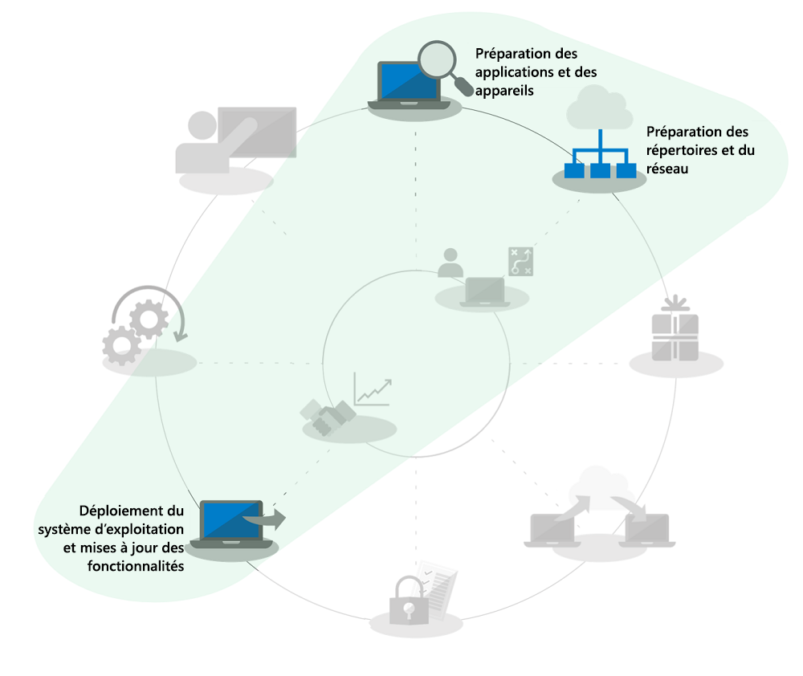
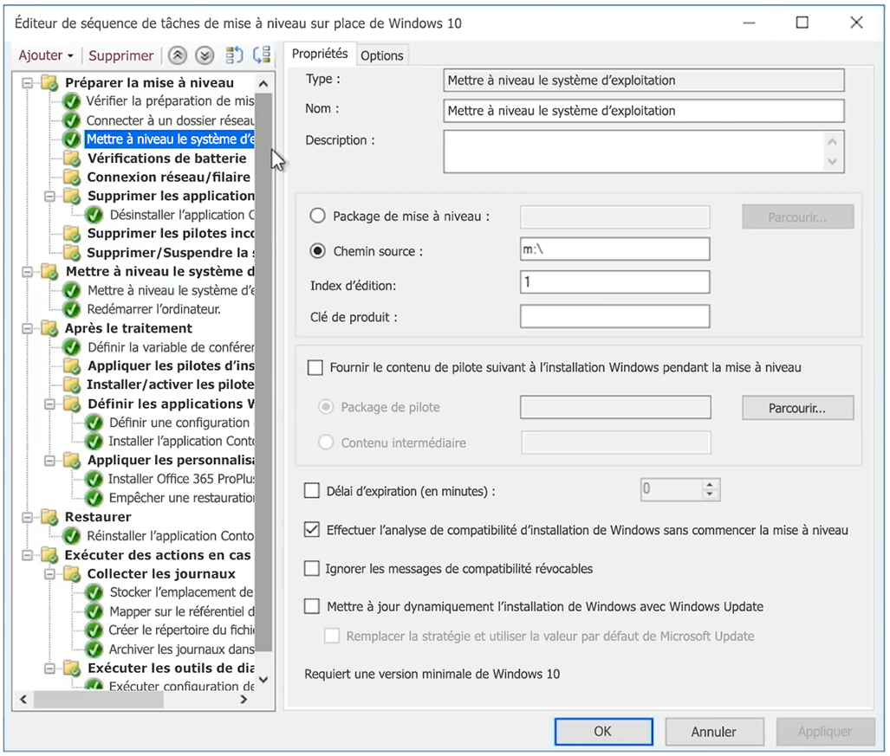

# Mises à niveau locales automatisées de Windows 7 vers Windows 10 pour de grandes entreprises

À partir du 14 janvier 2020, les mises à jour de sécurité ou la prise en charge des PC exécutant Windows 7 ne seront plus fournies. Avec quelques mois pour passer de Windows 7 vers Windows 10 et face à plusieurs options de déploiement, une question fréquente dans la communauté informatique est la suivante : «quel est le moyen le plus rapide de migrer Windows 7 vers Windows 10 ?» La réponse est d’effectuer des mises à niveau locales pour les PC existants, vous pouvez ainsi réduire le focus sur plusieurs aspects du processus de déploiement de bureau.

En utilisant les mises à niveau locales, l’étendue de plusieurs processus de déploiement de bureau se réduisent considérablement, notamment :

  - **Packaging des applications** et redistribution des applications métier requises : elles sont simplement acheminées à partir de l’environnement Windows 7.

  - **Migration de fichier**et paramètres utilisateur de base : ces derniers sont également transférés à partir de l’installation précédente lorsque le même utilisateur conserve l’appareil.

Les tâches grisées dans l’image de la roue du processus de déploiement ci-dessus ne sont pas des éléments que vous pouvez ignorer complètement, mais pour gagner du temps, nous assumons que vous transférez votre configuration de sécurité, modifiez les processus de mise à jour logicielle après le déploiement, et nous partons du principe que la formation des utilisateurs pour le composant Windows a principalement eu lieu à la maison pour vos utilisateurs, car les ordinateurs Windows achetés en privé depuis 2012 pour la plupart d’entre eux n’ont pas Windows 7 déjà installé et depuis la publication de Windows 10 en 2015, la majeure partie des systèmes d’origine Windows 7 ont également été mis à niveau vers Windows 10.

## Fiabilité de la mise à niveau locale, sécurité et évolutivité

Les mises à niveau sur place vers Windows 10 constituent une approche fiable pour déplacer un appareil existant exécutant Windows 7 ou une version ultérieure vers Windows 10, sans nécessiter de migration de fichiers ou de réinstallation d’applications. Après une mise à niveau sur place, les fichiers, paramètres et applications disponibles de l’utilisateur sont cohérents avec l’installation précédente de Windows 7. Même si vous souhaitez profiter de l’occasion pour faire le tri dans vos applications ou paramètres, comme nous nous rapprochons de la date de fin de validité de Windows 7 en janvier 2020, il n’y a plus beaucoup de temps pour chercher d’autres options. Les mises à niveau fonctionnent également lorsque vous passez d’une architecture similaire (32 bits à 32 bits ou 64 bits à 64 bits) et des éditions similaires à celles de Windows (Professionnel vers Pro ou Entreprise à Entreprise).

Par défaut, le processus de mise à niveau sauvegarde votre installation précédente de Windows dans le cadre de la mise à niveau, par conséquent, en cas d’échec de la mise à niveau ou si un appareil ou une application ne fonctionne pas correctement après la mise à niveau, l’ordinateur peut revenir à Windows 7. Les Pc mis à jour par défaut disposent de 10 jours pour vous permettre de relancer manuellement une restauration vers Windows 7 si nécessaire.

Les mises à niveau sur place peuvent être automatisées à l’aide d’outils de déploiement de système d’exploitation tels que [Microsoft Endpoint Configuration Manager](https://docs.microsoft.com/configmgr/osd/deploy-use/create-a-task-sequence-to-upgrade-an-operating-system) ou [Microsoft Deployment Toolkit](https://docs.microsoft.com/windows/deployment/upgrade/upgrade-to-windows-10-with-the-microsoft-deployment-toolkit).  Cet article souligne les approches et optimisations automatisées, ainsi que des liens vers des ressources associées pour obtenir une aide supplémentaire.

## Mise à niveau d’un petit nombre d’ordinateurs

Pour un ordinateur ou une poignée d’ordinateurs, l’approche manuelle de la mise à niveau est généralement la meilleure option par rapport aux approches plus automatisées. Vous pouvez trouver les logiciels et licences nécessaires auprès du [Microsoft Store](https://go.microsoft.com/fwlink/p/?LinkId=808282), d’autres distributeurs de logiciels ou du [Centre de gestion des licences en volume](https://www.microsoft.com/licensing/servicecenter/default.aspx) si vous avez des licences en volume. Pour obtenir une aide détaillée sur la mise à niveau d’un seul PC vers Windows 10, ainsi que sur les options de restauration après la mise à niveau, voir le [guide détaillé de la mise à niveau de Windows 7 vers Windows 10](https://docs.microsoft.com/microsoft-365/enterprise/windows-7-to-windows-10-upgrade).

## Mise à niveau de nombreux ordinateurs

Si vous gérez des dizaines ou des milliers d’ordinateurs, la meilleure option consiste à effectuer des mises à niveau sur place à l’aide de l’automatisation de la séquence des tâches avec Microsoft Endpoint Configuration Manager ou Microsoft Deployment Toolkit. Bien que le processus soit très fiable dans la plupart des situations, selon le nombre de PC que vous mettez à niveau, il est toujours bon que les tests et contrôles nécessaires soient en place afin de garantir la réussite à l’échelle.

Cela signifie que vous pouvez ignorer la disponibilité du répertoire ou les tâches associées à Azure Active Directory, à la remise et à l’emballage des applications Office et sectorielles et à la migration des fichiers utilisateur, car ces aspects sont conservés dans le cadre de la mise à niveau et la sécurité doit au minimum être transférée.  Ces zones peuvent être améliorées au fil du temps.

L’option déploiement de la mise à niveau est couverte par les [mises à jour de déploiement et de fonctionnalités de système d’exploitation](https://www.aka.ms/mdd6), et même si vous pouvez facilement créer des solutions à l’aide de scripts qui exécutent la configuration de Windows 10 de façon automatisée avec une interaction minimale ou sans intervention de l’administrateur, une séquence de tâches vous permettront de contrôler plus précisément les éléments suivants :

  - Effectuer des vérifications préalables au déploiement,

  - Gérer l’état de chiffrement de lecteur avant la mise à niveau,

  - Désinstaller les pilotes et applications problématiques connus avant la mise à niveau,

  - Installer des pilotes et applications supplémentaires après la mise à niveau,

  - Gérer l’état de chiffrement de lecteur après la mise à niveau,

  - Restaurez un ordinateur dans l’état précédent (où des applications ou pilotes non installés sont réinstallés) en cas d’échec de la mise à niveau,

  - Ainsi que tout autre élément que vous devez configurer pour atteindre l’état professionnel prêt à l’emploi

Les raisons les plus courantes de mises à niveau peuvent être incomplètes ou ne sont pas possibles dans les situations suivantes :

  - Pilotes d’appareils obsolètes

  - Chiffrement du disque tiers

  - Solutions de code de niveau inférieur, telles que les logiciels anti-programme malveillant, VPN ou la virtualisation

Les modèles de [séquence de tâches de mise à niveau](https://docs.microsoft.com/configmgr/osd/deploy-use/create-a-task-sequence-to-upgrade-an-operating-system) sont intégrés à la branche actuelle de Microsoft Endpoint Configuration Manager et sont disponibles pour plusieurs versions. Dans les versions récentes, les améliorations apportées aux technologies dans Configuration Manager ont été considérables, ce qui rend le processus encore plus efficace pour déterminer la compatibilité des appareils et des compatibilités avec Office, réduire le trafic réseau et configurer de nouveaux options telles que sauvegarde OneDrive. Regardez cette [vidéo de mécanique Microsoft](https://youtu.be/CYRnAmCD7ls) pour en savoir plus sur les mises à jour récentes apportées au déploiement de Configuration Manager OS.

Si vous n’utilisez pas Configuration Manager, vous pouvez utiliser le kit de ressources de déploiement Microsoft pour créer et exécuter des séquences de tâches de déploiement de mise à niveau.

## Mise à niveau préalable de la séquence des tâches

L'[option de mise en cache](https://docs.microsoft.com/configmgr/osd/deploy-use/create-a-task-sequence-to-upgrade-an-operating-system#configure-pre-cache-content)préalable pour la séquence de tâches de déploiement de Configuration Manager permet aux clients de télécharger le contenu du package de mise à niveau de système d’exploitation approprié avant que la séquence de tâche ne mette à niveau le système d’exploitation. Auparavant, le lancement de la séquence de tâches déclencherait le téléchargement du contenu du package. Le contenu préalable au cache vous permet également de télécharger le package de mise à niveau de système d’exploitation applicable et tous les autres contenus référencés dès qu’il reçoit le déploiement.

Séquences de tâches préalables associées aux analyses de compatibilité

Outre la possibilité de gagner du temps lors du téléchargement du package, vous pouvez préinstaller le package de mise à niveau et utiliser le programme d’installation de Windows pour évaluer si la mise à niveau sur place réussit avant d’exécuter la mise à niveau de Windows. La syntaxe de la ligne de commande suivante peut être utilisée pour effectuer une analyse de compatibilité silencieuse et déterminer si le programme d’installation de Windows évalue l’appareil comme étant prêt pour la mise à niveau.

Les journaux sont ensuite envoyés à votre chemin d’accès au serveur défini et le programme d’installation de Windows ne s’affiche pas à l’utilisateur et se ferme sans aucune intervention de l’utilisateur.

Les résultats des journaux eux-mêmes sont les suivants :

1.  Si le programme d’installation ne trouve pas de problème de compatibilité et que le PC semble répondre à toutes les exigences, il renvoie MOSETUP\_E\_COMPAT\_SCANONLY (0xC1900210)

2.  Si le programme d’installation détecte des problèmes de compatibilité pouvant être interactifs, tels que les applications incompatibles, il renverra MOSETUP\_E\_COMPAT\_INSTALLREQ\_BLOCK (0xC1900208)

3.  Si la configuration trouve que le PC n’est pas éligible pour Windows 10, il renverra MOSETUP\_E\_COMPAT\_SYSREQ\_BLOCK (0xC1900200)

4.  Si le programme d’installation trouve que l’espace disponible sur le PC n’est pas suffisant pour installer, il renvoie MOSETUP\_E\_INSTALLDISKSPACE\_BLOCK (0xC190020E)

Une fois que vous avez déployé des séquences de mise en cache préalables avec des analyses de compatibilité sur un grand nombre de PC dans une collection, vous pouvez commencer à analyser les fichiers journaux pour la préparation de l’appareil. En utilisant les résultats répertoriés ci-dessus, \#1 (0xC1900210) peut être défini comme «prêt pour le déploiement» et \# 4 (0xC190020E) peuvent être actionnés en libérant de l’espace disque. Dans ce cas, vous devez prendre en considération les éléments à supprimer ; Windows Update cleanup, corbeille et Fichiers temporaires sont des lieux de démarrage, et de nombreux cas fournissent suffisamment d’espace pour assurer la réussite de la mise à niveau. Vous pouvez exécuter l’analyse de compatibilité autant de fois que nécessaire jusqu’à ce que le PC soit disponible pour la mise à niveau sur place. Pour plus d’informations sur les options de ligne de commande du programme d’installation de Windows, voir <https://aka.ms/setupswitches>

## [Desktop Deployment Center](https://aka.ms/howtoshift)
