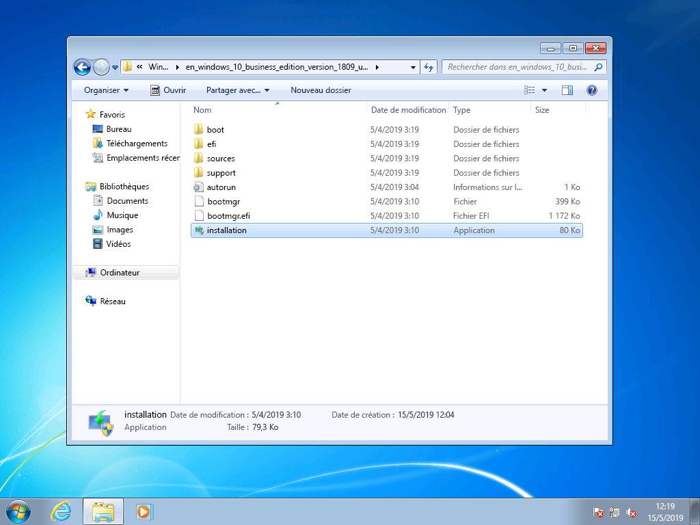
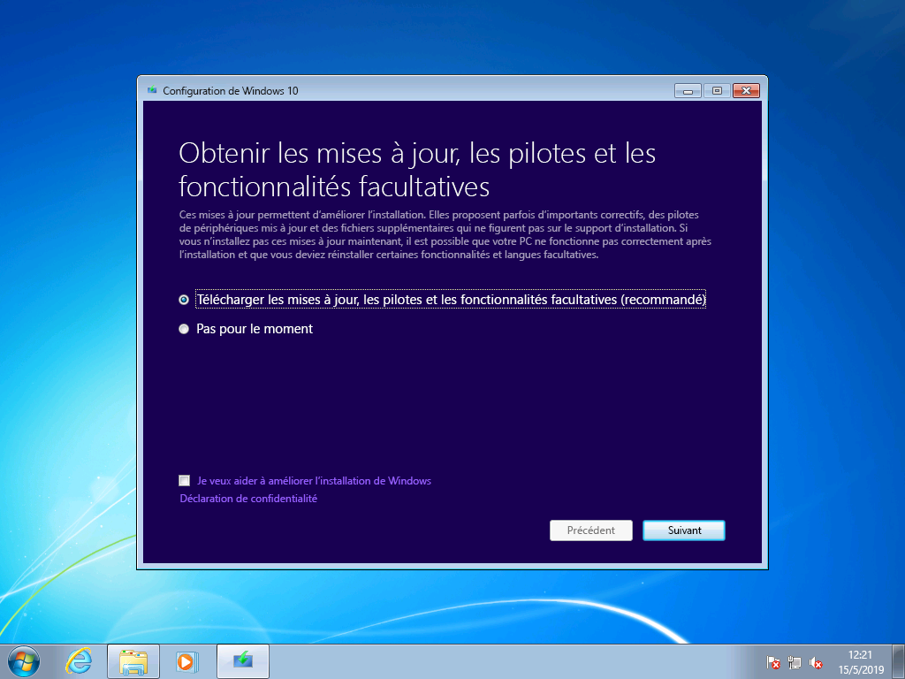
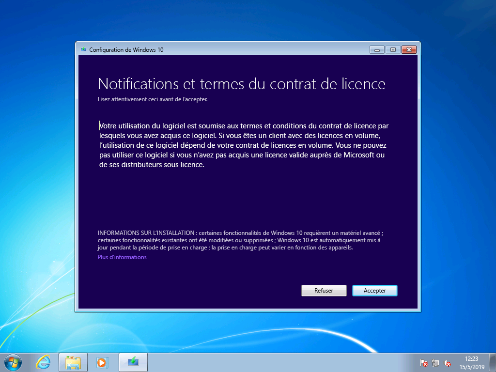
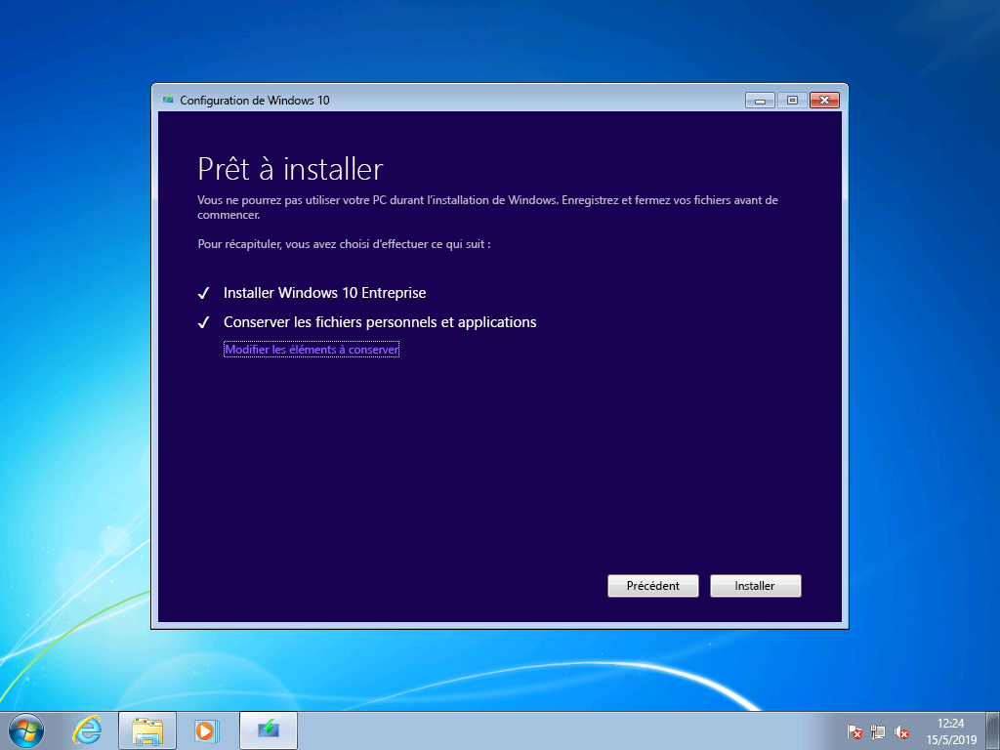

# Guide détaillé de mise à niveau manuelle de Windows 7 vers Windows 10

Cet article décrit le processus de mise à niveau manuelle d’un PC sous Windows 7 Entreprise vers Windows 10 Entreprise. Pour les autres versions de Windows 7, telles que les versions Famille et Professionnel, le processus est très similaire, mais vous avez également la possibilité de procéder à une mise à niveau directement à l’aide de l’outil de création de supports. Les mises à niveau pour toutes les versions de Windows 7 vers Windows 10 nécessitent une clé de produit valide et une version correspondante ou supérieure de Windows. Par exemple, Windows 7 Professionnel peut être mis à niveau vers Windows 10 Professionnel, mais ne peut pas être mis à niveau vers Windows 10 Famille. Windows 7 Édition Intégrale doit être mis à niveau vers Windows 10 Professionnel.

## Mises à niveau de Windows 10 à l’aide de l’outil de création de supports ou de fichiers ISO

Vous pouvez effectuer une mise à niveau vers Windows 10 directement à l’aide de [l’outil de création de supports](https://www.microsoft.com/en-us/software-download/windows10ISO) ou l’utiliser pour télécharger Windows 10 sous la forme d’un fichier ISO. Vous devez noter si votre système actuel est un système 32 ou 64 bits, quelle est la langue par défaut de votre système et la version de Windows 7 (par exemple, Famille, Professionnel ou Entreprise). Dans Windows 7, ces informations se trouvent dans la section \>Système et sécurité\> du panneau de configuration. L’outil de création de supports ne prend pas en charge Windows 10 Enterprise pour les mises à niveau, la création de médias d’installation ou le téléchargement de fichiers ISO. Windows 10 Entreprise est requis si vous effectuez une mise à niveau à partir de Windows 7 Entreprise.

> Options de l’outil de création de supports Windows 10

Lorsque vous procédez à la mise à niveau de Windows 7 Entreprise vers Windows 10 Entreprise, vous devez télécharger le fichier ISO qui correspond à votre langue et à l’architecture de votre système (32 bits ou 64 bits) à partir du [centre de gestion des licences en volume](https://www.microsoft.com/licensing/servicecenter/default.aspx).

Si vous envisagez d’effectuer la mise à niveau à l’aide d’un fichier ISO, vous devrez extraire les fichiers au sein de la plateforme ISO vers votre système de fichiers local ou vers un lecteur amovible. Vous pouvez également graver le fichier ISO sur un DVD. Vous pouvez extraire les fichiers d’installation dans la plateforme ISO à l’aide d’un PC Windows 8 ou version ultérieure et enregistrer ces fichiers sur un espace de stockage USB amovible ou utiliser une application telle que [7zip](https://www.7-zip.org/) pour extraire le contenu de votre fichier ISO dans un dossier sur votre disque local dans Windows 7.

Une fois le support d’installation disponible dans Windows 7, vous pouvez lancer la mise à niveau en exécutant setup.exe comme expliqué ci-dessous.

**Conseil important : pour une mise à niveau sur place dans laquelle les applications et vos données sont déplacées vers Windows 10, vous devez lancer le processus à partir d’une session Windows 7 en cours d’exécution. Le démarrage de l’installation de supports à partir d’un DVD ou d’un lecteur USB n’offre pas la possibilité de conserver vos applications et fichiers : le système effectue une nouvelle installation de Windows 10.**

> Fichiers extraits à partir d’une plateforme ISO Windows 10 Entreprise 32 bits

Au cours de l’installation de Windows 10, vous serez guidé dans le processus d’installation. Le premier écran offre une option permettant de télécharger les mises à jour, les pilotes ainsi que des fonctionnalités facultatives. Il est recommandé de procéder à ces téléchargements pour garantir la réussite de la mise à niveau

> Écran de configuration initiale de Windows 10

Une fois les mises à jour appliquées, le programme d’installation de Windows 10 passe à la phase suivante, la sélection d’une image. C’est là que vous devez sélectionner votre version de Windows. Ici, étant donné que le PC tourne sous Windows 7 Entreprise, vous devez sélectionner Windows 10 Entreprise.

> Écran de sélection de l’image Windows 10 Entreprise 32 bits

L’écran suivant de l’installation de Windows 10 affiche des notifications et les termes du contrat de licence applicables. Après avoir lu et bien compris les notifications et les termes du contrat, cliquez sur « Accepter » pour continuer ou sur « Refuser » pour annuler.

*Notifications et termes du contrat de licence pour Windows 10*

Le programme d’installation de Windows 10 recherche alors des mises à jour supplémentaires.

*Programme d’installation de Windows 10 recherchant des mises à jour*

Quand il a fini cette recherche, le programme d’installation de Windows 10 est prêt à procéder a l’installation. Par défaut il est configuré pour installer Windows 10 et conserver vos fichiers et applications personnels. C’est l’option recommandée. Vous pouvez cliquer sur « Modifier les éléments à conserver » pour afficher des options supplémentaires. Sinon, cliquez sur « Installer ».

*Option de mise à niveau de l’installation de Windows 10 par défaut*

Si vous sélectionnez « Modifier ce que vous voulez conserver », les options suivantes s’affichent :

« Conserver les fichiers personnels uniquement » ne transfère pas vos applications installées ni vos paramètres de Windows 7 vers Windows 10. Seuls vos fichiers et vos comptes d’utilisateur seront transférés. Les applications devront être réinstallées ultérieurement avec cette option. Utilisez cette option uniquement si vous êtes certain de pouvoir réinstaller et configurer les applications dont vous aurez besoin après l’installation de Windows. Si ce n’est pas le cas, choisissez l’option « Conserver les fichiers et applications personnels » par défaut.

« Rien » permet de supprimer vos fichiers, applications et paramètres et d’effectuer une nouvelle installation « propre » de Windows. Utilisez cette option uniquement si vous avez précédemment sauvegardé les données que vous voulez conserver et si vous pouvez réinstaller vos applications vous-même.

*Options d’installation du programme d’installation de Windows 10*

Le programme d’installation de Windows 10 recherche de nouveau les mises à jour en fonction de ce que vous avez sélectionné dans l’écran précédent.

*Programme d’installation de Windows 10 recherchant des mises à jour*

Windows 10 procède alors à l’installation, ce qui va prendre plusieurs minutes, et, si vous avez choisi de conserver vos fichiers personnels et applications, tous ces éléments se trouveront aux mêmes emplacements et vos applications seront désormais disponibles sous Windows 10.

*Progression de l’installation de Windows 10*

## 

## Récupération dans Windows 10

Une fois que Windows 10 est installé, l’option de récupération dans Windows 10 vous donne un délai de grâce de 10 jours pour revenir à Windows 7. Ceci est utile si un appareil ou une application sur votre système ne fonctionne pas correctement et que vous devez revenir à l’installation précédente de Windows 7. Après 10 jours, par défaut, Windows 10 libère l’espace utilisé par vos fichiers de récupération Windows 7 sur votre disque dur et supprime les fichiers de l’installation précédente. Windows 7 sera alors définitivement supprimé et vous ne pouvez pas le rétablir, mais vos applications et fichiers personnels sont conservés dans Windows 10.

Pour démarrer le processus pour revenir à Windows 7, accédez à la section Paramètres \> Mise à jour et sécurité \> Récupération. Dans la section Revenir à Windows 7, sélectionnez « Démarrer ».

*Options de récupération de Windows 10 »*

Windows 10 vous demande alors pourquoi vous revenez à la version précédente. Si c’est pour une raison technique, votre réponse est utile pour nous aider à résoudre le problème et assurer que d’autres utilisateurs peuvent profiter de votre expérience.

*Windows 10 demandant la raison du retour à Windows 7*

Dans de nombreux cas, il existe déjà des mises à jour de votre version de Windows 10, ce qui peut résoudre ces problèmes techniques. Nous vous recommandons de rechercher des mises à jour et, si elles existent et que vous les installez, de vérifier si ces mises à jour ont résolu le problème.

*La récupération de Windows 10 recherche des mises à jour*

Si les mises à jour ne permettent pas de résoudre les problèmes et que vous devez revenir à l’installation précédente de Windows 7, il est possible que certaines applications nécessitent une réinstallation (par exemple, toutes les applications installées pendant que le PC tournait sous Windows 10) et certains paramètres peuvent être perdus. Toutefois, tous les fichiers et documents enregistrés en local pendant l’utilisation sous Windows 10 sont préservés lorsque vous revenez à Windows 7. 

*Récupération Windows 10 : ce qu’il faut savoir*

Avant de commencer, vérifiez que vous avez sous la main les informations concernant votre compte local ou un compte de domaine et le mot de passe pour l’installation précédente de Windows 7.

*Récupération de Windows 10 en veillant à ce que vous ayez les informations d’identification de l’installation précédente*

Vous pouvez alors lancer le processus pour revenir à Windows 7. Après quelques minutes, votre PC redémarre sous Windows 7 avec la même expérience utilisateur précédant la mise à niveau vers Windows 10.

*Dernier écran du processus de récupération de Windows 10 avant de revenir à Windows 7*

## Migration vers Windows 10 sur un nouveau PC

Une autre option recommandée consiste à passer Windows 10 sur un nouvel ordinateur. Si c’est votre choix, vous pouvez transférer vos fichiers à partir de votre ancien ordinateur à l'aide de la sauvegarde [OneDrive](https://support.office.com/article/b5e918be-0fd4-4095-98da-bceed57f8e0c?ocid=MoveToWindows10),de la [sauvegarde et restauration intégrée à Windows](https://support.microsoft.com/help/4469209?ocid=MoveToWindows10), manuellement à l’aide d’un [périphérique de stockage externe](https://support.microsoft.com/fr-FR/help/4465814/windows-7-move-files-off-pc-with-an-external-storage-device?ocid=MoveToWindows10) ou avec des outils tels que [PCmover Express de Laplink](https://www.microsoft.com/en-us/windows/transfer-your-data).  Avec l’une de ces options, vous devrez réinstaller toutes les applications requises non incluses dans Windows 10. Pour en savoir plus sur les options de déplacement manuel d’un PC existant exécutant Windows 7 vers un nouveau PC avec Windows 10, voir la section [Passage à un PC Windows 10](https://support.microsoft.com/fr-FR/help/4229823?ocid=MoveToWindows10) dans le support Windows.

## [Centre de déploiement du bureau](https://aka.ms/howtoshift)