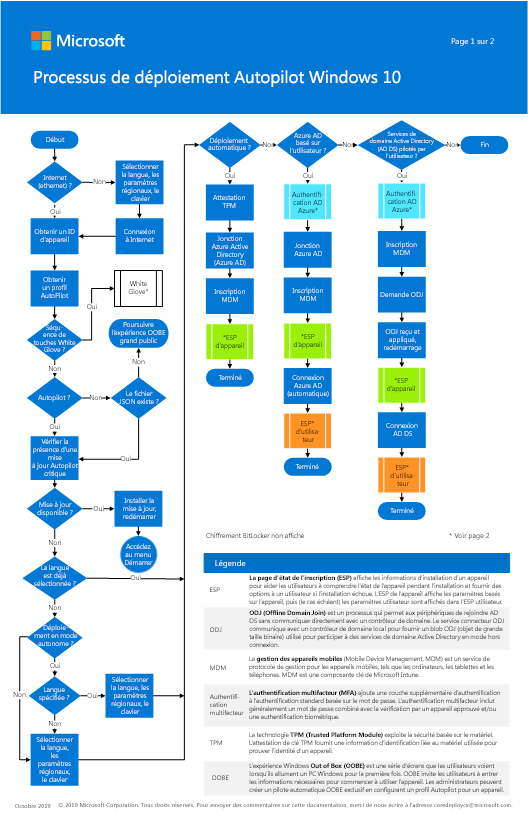

# Étape 3 : Déployer Windows 10 Entreprise pour les nouveaux appareils avec Windows Autopilot

*Cet article s'applique à la fois aux versions E3 et E5 de Microsoft 365 Entreprise*

Si vous avez de nouveaux PC Windows 10, vous pouvez utiliser Windows Autopilot pour personnaliser l’expérience clé en main (OOBE) pour votre organisation et déployer un nouveau système avec les applications et les paramètres déjà configurés. Pas d’images à déployer, pas de pilotes à injecter et aucune infrastructure à gérer. Les utilisateurs peuvent suivre le processus de déploiement de manière indépendante, sans avoir besoin de consulter leur administrateur informatique.

Vous pouvez configurer et pré-configurer de nouveaux appareils Windows 10 et les préparer à un usage productif à l’aide de Windows Autopilot. Pour en savoir plus sur Windows Autopilot, y compris les avantages et les scénarios Windows Autopilot, voir [Vue d’ensemble de Windows Autopilot](https://docs.microsoft.com/windows/deployment/windows-Autopilot/windows-10-Autopilot). Lorsque vous êtes prêt, suivez ces composants pour commencer la configuration de nouveaux appareils.

## Affiche du processus de déploiement de Windows AutoPilot

L’affiche de Windows AutoPilot est en mode Portrait (2 pages). Cliquez sur l’image ci-dessous pour afficher un fichier PDF dans votre navigateur. 

Vous pouvez également télécharger cette affiche au format [PDF](https://github.com/MicrosoftDocs/windows-itpro-docs/raw/public/windows/deployment/media/Windows10AutopilotFlowchart.pdf) ou [Visio](https://github.com/MicrosoftDocs/windows-itpro-docs/raw/public/windows/deployment/media/Windows10Autopilotflowchart.vsdx).

## Partie 1 : Lancement de Windows Autopilot Deployment
Consultez la rubrique [Vue d’ensemble de Windows Autopilot](https://docs.microsoft.com/windows/deployment/windows-Autopilot/windows-10-Autopilot) pour effectuer les actions suivantes :

1. Découvrez et remplissez les conditions préalables pour le déploiement de Windows Autopilot. Les conditions préalables sont les suivantes :
    - **Inscription de l’appareil et personnalisation OOBE**

        Pour inscrire des appareils, vous devez acquérir leur ID matériel et l’enregistrer. Nous travaillons activement avec plusieurs fournisseurs de matériel afin de leur permettre de vous fournir les informations requises, ou d’effectuer le téléchargement en votre nom. Vous avez également la possibilité de capturer ces informations vous-même à l’aide d’un script PowerShell qui génère un fichier .csv avec l’ID matériel de l’appareil.

        Une fois que les appareils sont enregistrées, il existe des options de personnalisation OOBE que vous pouvez configurer, y compris ignorer les paramètres de confidentialité et CLUF.

    - **Insertion de la marque de votre entreprise pour OOBE**

        Vous pouvez ainsi ajouter une personnalisation qui apparaîtra lors de la configuration OOBE de l’appareil.

    - **Inscription automatique de la gestion des appareils mobiles dans Microsoft Intune**
        
        L’Inscription automatique permet aux utilisateurs d’inscrire leurs appareils Windows 10 dans Intune pour la gestion des appareils lorsqu’ils connectent leurs appareils à Azure AD. Pour s’inscrire, les utilisateurs ajoutent leur compte professionnel à leurs appareils personnels ou connectent des terminaux professionnels à Azure AD. En arrière-plan, l’appareil est inscrit également pour la gestion avec Intune.

    - **Connectivité réseau à des services cloud utilisés par Windows Autopilot**

        Le programme de Déploiement Windows Autopilot utilise un nombre de services cloud pour placer vos appareils dans un état productif et ces services doivent être accessibles à partir d’appareils enregistrées comme appareils Windows Autopilot. 

    - **Les appareils doivent être préinstallées avec Windows 10 version 1703 ou une version ultérieure**

2. Découvrez et sélectionnez le programme de déploiement Windows Autopilot pour votre organisation. Vous pouvez sélectionner l’un des programmes de déploiement suivants :
    - **Application Microsoft Store pour les entreprises (Microsoft Store for Business)**
    - **Microsoft Intune**
    - **Espace partenaires**

## Partie 2 : configuration d’un appareil Windows 10 pour Microsoft 365
Avant de configurer les appareils Windows pour les utilisateurs Microsoft 365, vérifiez que tous les appareils Windows exécutent Windows 10, la version 1703 (Creators Update) ou la version ultérieure.

Une fois que tous les appareils Windows au sein de votre organisation ont été mis à niveau vers Windows 10 Creators Update ou exécutent déjà Windows 10 Creators Update, vous pouvez connecter ces appareils à Azure Active Directory de votre organisation.

### Configurer un nouvel appareil Windows 10 ou mis à niveau
Procédez comme suit pour configurer un appareil à l’aide de Windows 10 OOBE sur un nouvel appareil exécutant Windows 10 Creators Update (ou la version ultérieure) ou sur un appareil qui a été mise à niveau vers Windows 10 Creators Update (ou une version ultérieure), mais n’a pas été installé « prêt à l’emploi ».

1. Si vous n’avez pas un réseau sans fil configuré, vérifiez que vous connectez l’appareil à Internet via un câble ou une connexion Ethernet.
2. Passez en revue l’installation d’appareils Windows. Sur un appareil nouveau ou réinitialisé, l’installation commence par l’écran **Commençons par la région. Est-ce correct ?**.
3. Suivez la configuration d’appareil Windows 10 jusqu'à atteindre la page **Comment souhaitez-vous configurer ?**. Ici, sélectionnez **Configuration pour une organisation**.
4. Connectez-vous à l’aide du compte et du mot de passe utilisateur Microsoft 365. Selon le paramètre de mot de passe utilisateur, vous pouvez être invité à mettre à jour le mot de passe. 
5. Terminer la configuration d’appareil Windows 10.

Une fois que vous avez terminé, l’appareil est connecté à Azure AD de votre organisation.

### Configurer un appareil déjà « prêt à l’emploi »
Si votre appareil possède Windows 10 Creators Update (ou une version ultérieure) et a déjà effectué la configuration prédéfinie, procédez comme suit.

1. Sur le PC Windows de votre utilisateur exécutant Windows 10 version 1703 (Creators Update), sélectionnez le logo **Windows**, puis l’icône **Paramètres**.
2. Dans **Paramètres**, accédez à **Comptes**.
3. Sur la page **Vos informations**, sélectionnez **Accès professionnel ou scolaire** > **Connecter**.
4. Dans la boîte de dialogue **Configurer un compte professionnel ou scolaire**, sous **Actions alternatives**, cliquez sur **Joindre cet appareil à Azure Active Directory**.
5. Sur la page **Connexion**, entrez votre compte professionnel ou scolaire, puis sélectionnez **Suivant**.
6. Sur la page**Entrer le mot de passe**, entrez votre mot de passe, puis sélectionnez **Connecter**.
7. Sur la page **Vérifiez qu’il s’agit de la page de votre organisation**, vérifiez que les informations sont correctes et sélectionnez **Rejoindre**.
8. Sur la page**Tout est prêt !**, sélectionnez **Terminé**.

Une fois que vous avez terminé, l’appareil sera connecté à Azure AD de votre organisation.

### Vérifiez que l’appareil est connecté à Azure AD
Procédez comme suit pour vérifier l’état de synchronisation de l’appareil à Azure AD, puis commencez à utiliser votre compte Microsoft 365 sur l’appareil. 

1. Ouvrez **Paramètres**.
2. Sur la page **accès Professionnel ou scolaire**, sélectionnez la zone**Connecté à <organization name> **pour afficher les boutons **Informations** et**Déconnexion**.
3. Sélectionnez **informations** pour obtenir votre état de synchronisation.
4. Sur la page**État de synchronisation**, sélectionnez **Synchronisation** pour obtenir la version plus récente des stratégies de gestion de l’appareil mobile sur votre ordinateur.
5. Pour commencer à utiliser le compte Microsoft 365, accédez au bouton **Démarrer** de Windows, cliquez avec le bouton droit sur l’image de votre compte actuel, puis sélectionnez le compte **Switch**.
6. Connectez-vous à l’aide de l’e-mail et du mot de passe de votre organisation.

Si vous rencontrez des problèmes lors de l’utilisation de Windows 10 dans un environnement d’entreprise, vous pouvez consulter les [principales solutions Support Microsoft pour les problèmes les plus courants](https://docs.microsoft.com/windows/client-management/windows-10-support-solutions). Ces ressources incluent des articles de la Base de connaissances, des mises à jour et des articles de bibliothèque.

Comme point de contrôle intermédiaire, consultez les [critères de sortie](windows10-exit-criteria.md#crit-windows10-step3) correspondant à cette étape.

## Étape suivante

|||
|:-------|:-----|
|| [Surveillance de la conformité et de l’état du périphérique](windows10-enable-windows-analytics.md) |
