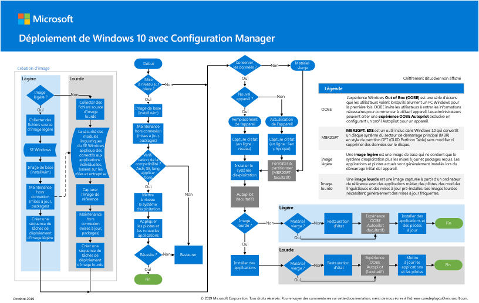

# Étape 2 : déployer Windows 10 entreprise pour les appareils existants en tant que mise à niveau sur place

*Cet article s'applique à la fois aux versions E3 et E5 de Microsoft 365 Entreprise*

Le chemin le plus simple pour mettre à niveau des PC actuellement exécutant Windows 7 ou Windows 8,1 vers Windows 10 est effectué via une mise à niveau sur place. Vous pouvez utiliser une séquence de tâches System Center Configuration Manager (gestionnaire de configuration) pour automatiser complètement le processus. 

Si des ordinateurs existants exécutent Windows 7 ou Windows 8,1, nous vous recommandons d’utiliser ce chemin d’accès si votre organisation déploie Windows 10. Cela tire parti du programme d’installation de Windows (Setup. exe) pour effectuer une mise à niveau sur place, qui conserve automatiquement toutes les données, les paramètres, les applications et les pilotes à partir de la version du système d’exploitation existant. Cela nécessite le moins d’efforts, car il n’est pas nécessaire d’utiliser une infrastructure de déploiement complexe.

Procédez comme suit pour configurer et déployer une image Windows 10 entreprise à l’aide de Configuration Manager en tant que mise à niveau sur place.

## Affiche Déploiement de Windows 10 avec System Center Configuration Manager

L’affiche du gestionnaire de configuration est une page en mode paysage (17x11). Cliquez sur l’image ci-dessous pour afficher un fichier PDF dans votre navigateur. 

Vous pouvez également télécharger cette affiche au format [PDF](https://github.com/MicrosoftDocs/windows-itpro-docs/raw/public/windows/deployment/media/Windows10DeploymentConfigManager.pdf) ou [Visio](https://github.com/MicrosoftDocs/windows-itpro-docs/raw/public/windows/deployment/media/Windows10DeploymentConfigManager.vsdx).

## Partie 1 : vérifier la disponibilité pour mettre à niveau Windows

Tout d’abord, utilisez la fonctionnalité de disponibilité de la mise à niveau de Windows Analytics pour fournir des informations et des recommandations puissantes sur les ordinateurs, les applications et les pilotes de votre organisation, sans coût supplémentaire et sans exigences d’infrastructure supplémentaires. Ce nouveau service vous guide tout au long des projets de mise à niveau et de mise à jour des fonctionnalités à l’aide d’un flux de travail Microsoft recommandé. Les données d’inventaire mises à jour vous permettent d’équilibrer les coûts et les risques dans vos projets de mise à niveau.

Voir [gérer les mises à niveau Windows avec la préparation](https://docs.microsoft.com/windows/deployment/upgrade/manage-windows-upgrades-with-upgrade-readiness) à la mise à niveau pour en savoir plus, commencer, utiliser et résoudre les problèmes de préparation à la mise à niveau.

Ensuite, suivez le guide pour utiliser System Center Configuration Manager (branche actuelle) pour mettre à niveau le système d’exploitation Windows 7 ou une version ultérieure vers Windows 10. Comme pour tout déploiement à haut risque, nous vous recommandons de sauvegarder les données utilisateur avant de poursuivre. Le stockage cloud OneDrive est prêt à être utilisé pour les utilisateurs de Microsoft 365 titulaires d’une licence et peut être utilisé pour stocker leurs fichiers en toute sécurité. Pour plus d’informations, reportez-vous à la rubrique [OneDrive Quick Start Guide](https://aka.ms/ODfBquickstartguide). Pour accéder à cette page, vous devez vous connecter en tant qu’administrateur client ou administrateur global dans un client Office 365 ou Microsoft 365.

Pour obtenir la liste des versions de gestionnaire de configuration et les versions de client Windows 10 correspondantes prises en charge, voir [prise en charge de Windows 10 pour System Center Configuration Manager](https://aka.ms/supportforwin10sccm).

**Pour vérifier la disponibilité pour la mise à niveau de Windows**

Consultez ces conditions préalables avant de commencer le déploiement de Windows 10 :

- **Éditions de Windows éligibles pour la mise à niveau** : vos appareils doivent exécuter des éditions de Windows 7 ou Windows 8,1 pouvant être mises à niveau vers Windows 10 entreprise. Pour obtenir la liste des éditions prises en charge, consultez la rubrique [Windows 10 Upgrade Paths](https://aka.ms/win10upgradepaths). 
- **Appareils pris en charge** : la plupart des ordinateurs compatibles avec Windows 8,1 sont compatibles avec Windows 10. Vous devrez peut-être installer des pilotes mis à jour dans Windows 10 pour que vos appareils fonctionnent correctement. Pour plus d’informations, voir [spécifications Windows 10](https://aka.ms/windows10specifications) .
- **Préparation du déploiement** : Assurez-vous que vous disposez des éléments suivants avant de commencer à configurer le déploiement :
    - Support d’installation de Windows 10 : le support d’installation doit se trouver sur un lecteur distinct, avec l’ISO déjà monté. Vous pouvez obtenir l’ISO auprès des [Téléchargements réservés aux abonnés MSDN](https://aka.ms/msdn-subscriber-downloads) ou à partir du centre de gestion des [licences en volume](https://aka.ms/mvlsc).
    - Sauvegarde des données utilisateur : bien que les données utilisateur soient migrées dans la mise à niveau, il est recommandé de configurer un scénario de sauvegarde. Par exemple, exportez toutes les données utilisateur vers un compte OneDrive, BitLocker vers le lecteur flash USB ou le serveur de fichiers réseau. Pour plus d’informations, consultez la rubrique [sauvegarder ou transférer des données dans Windows](https://aka.ms/backuptransferdatawindows).
- **Préparation** de l’environnement : vous utiliserez une structure de serveur Configuration Manager existante pour préparer le déploiement du système d’exploitation. En plus de la configuration de base, les configurations suivantes doivent être effectuées dans l’environnement du gestionnaire de configuration :
    1. [Étendez le schéma Active Directory](https://aka.ms/extendadschema) et [créez un conteneur de gestion du système](https://aka.ms/createsysmancontainer).
    2. Activer la découverte de forêt Active Directory et la découverte de système Active Directory. Pour plus d’informations, consultez la rubrique [configure Discovery Methods for System Center Configuration Manager](https://aka.ms/configurediscoverymethods).
    3. Créez des limites de plage IP et un groupe de limite pour l’attribution de contenu et de site. Pour plus d’informations, voir [define site Limits and Boundary Groups for System Center Configuration Manager](https://aka.ms/definesiteboundaries).
    4. Ajoutez et configurez le rôle de point de création de rapports de gestionnaire de configuration. Pour plus d’informations, consultez la rubrique [configuration de la création de rapports dans le gestionnaire de configuration](https://aka.ms/configurereporting).
    5. Créez une structure de dossiers du système de fichiers pour les packages.
    6. Créez une structure de dossiers de la console Configuration Manager pour les packages.
    7. Installez les mises à jour de System Center Configuration Manager (branche actuelle) et les autres éléments prérequis de Windows 10.

## Partie 2 : ajout d’une image du système d’exploitation Windows 10 à l’aide du gestionnaire de configuration
À présent, vous devez créer un package de mise à niveau du système d’exploitation qui contient le support d’installation complet de Windows 10. Dans les étapes suivantes, vous allez utiliser le gestionnaire de configuration pour créer un package de mise à niveau pour Windows 10 entreprise x64.

**Pour ajouter une image du système d’exploitation Windows 10 à l’aide de Configuration Manager**

1. À l’aide de la console Configuration Manager, dans l’espace de travail **bibliothèque de logiciels** , cliquez avec le bouton droit sur le nœud **packages de mise à niveau du système d’exploitation** , puis sélectionnez **Ajouter un package de mise à niveau du système d’exploitation**.
2. Sur la page **source de données** , spécifiez le chemin d’accès UNC au support Windows 10 entreprise x64, puis cliquez sur **suivant**.
3. Sur la page **général** , spécifiez **mise à niveau de Windows 10 entreprise x64**, puis cliquez sur **suivant**. 
4. Sur la page **Résumé** , sélectionnez **suivant**, puis **Fermer**. 
5. Cliquez avec le bouton droit sur le package de **mise à jour Windows 10 entreprise x64** créé, puis sélectionnez **distribuer le contenu**. 
6. Choisissez votre point de distribution.

## Partie 3 : configurer les paramètres de déploiement
Dans cette étape, vous allez configurer une séquence de tâches de mise à niveau qui contient les paramètres de la mise à niveau de Windows 10. Vous identifiez ensuite les appareils à mettre à niveau, puis déployez la séquence de tâches sur ces appareils.

### Créer une séquence de tâches
Pour créer une séquence de tâches de mise à niveau, procédez comme suit :
  
1. Dans la console Configuration Manager, dans l’espace de travail **bibliothèque de logiciels** , développez **systèmes d’exploitation**. 
2. Cliquez avec le bouton droit sur le nœud **séquences de tâches** , puis sélectionnez **créer une séquence de tâches**.
3. Dans la page **créer une nouvelle séquence de tâches** , sélectionnez **mettre à niveau un système d’exploitation à partir du package de mise à niveau**, puis cliquez sur **suivant**.
4. Sur la page informations sur la **séquence de tâches** , spécifiez la **mise à niveau de Windows 10 entreprise x64**, puis cliquez sur **suivant**.
5. Sur la page **mettre à niveau le système d’exploitation Windows** , sélectionnez **Parcourir** , puis choisissez le package de mise à niveau du **système d’exploitation Windows 10 entreprise x64**, sélectionnez **OK**, puis cliquez sur **suivant**.
6. Continuez à parcourir les autres pages de l’Assistant, puis sélectionnez **Fermer**.

### Créer une collection de périphériques
Après avoir créé la séquence de tâches de mise à niveau, vous devez créer une collection qui contient les périphériques que vous allez mettre à niveau.

> [!NOTE]
> Utilisez les paramètres suivants pour tester le déploiement sur un seul appareil. Vous pouvez utiliser des règles d’appartenance différentes pour inclure des groupes d’appareils lorsque vous êtes prêt. Pour plus d’informations, voir [comment créer des collections dans System Center Configuration Manager](https://aka.ms/sccm-create-collections).

1. Dans la console Configuration Manager, dans l’espace de travail **composants et conformité** , cliquez avec le bouton droit sur **ensembles de périphériques**, puis sélectionnez **créer une collection de périphériques**. 
2. Dans l’assistant créer une collection de périphériques, dans la page **général** , entrez les paramètres suivants, puis cliquez sur **suivant**:
    - Name : mise à niveau de Windows 10 entreprise x64
    - Limitation de la collecte : tous les systèmes
3. Sur la **page règles d’appartenance** , sélectionnez **Ajouter** > une règle de règle**directe** pour lancer l’Assistant Création d’une règle d’adhésion directe.
4. Sur la page d' **Accueil** de l’Assistant Création d’une règle d’adhésion directe, sélectionnez **suivant**.
5. Sur la page **Rechercher des ressources** , entrez les paramètres suivants, en remplaçant le texte de la **valeur** de l’espace réservé par le nom de l’appareil que vous mettez à niveau : 
    - Classe de ressource : ressource système
    - Nom de l’attribut : nom
    - Valeur : *PC0003*
6. Sur la page **Sélectionner les ressources** , sélectionnez votre appareil, puis sélectionnez **suivant**.
7. Terminez l’Assistant Création d’une règle d’adhésion directe et l’assistant créer une collection de périphériques.  
8. Passez en revue la collection de mises à niveau Windows 10 entreprise x64. Ne continuez pas tant que vous n’avez pas affiché les ordinateurs que vous avez ajoutés dans la collection.

### Créer un déploiement de système d’exploitation
Procédez comme suit pour créer un déploiement pour la séquence de tâches.

1. Dans la console Configuration Manager, dans l’espace de travail **bibliothèque de logiciels** , cliquez avec le bouton droit sur la séquence de tâches que vous avez créée au cours d’une étape précédente, puis sélectionnez **déployer**.
2. Sur la page **général** , sélectionnez la collection **mise à niveau de Windows 10 entreprise x64** , puis cliquez sur **suivant**.
3. Sur la page **contenu** , sélectionnez **suivant**.
4. Sur la page **paramètres de déploiement** , sélectionnez les paramètres suivants, puis cliquez sur **suivant**:

    > [!NOTE]
    > Pour ce déploiement de test, vous définirez l’objectif sur **disponible**, ce qui nécessite une intervention de l’utilisateur pour démarrer le déploiement. Dans un environnement de production, vous souhaiterez peut-être automatiser le déploiement à l’aide de l’objectif requis, ce qui implique la configuration d’options supplémentaires, telles que la planification lorsque le déploiement est exécuté. 

    - Action : installer
    - Objectif : disponible

5. Sur la page **planification** , acceptez les paramètres par défaut, puis cliquez sur **suivant**.
6. Sur la page **expérience utilisateur** , acceptez les paramètres par défaut, puis cliquez sur **suivant**.
7. Sur la page **alertes** , acceptez les paramètres par défaut, puis cliquez sur **suivant**.
8. Sur la page **Résumé** , sélectionnez **suivant**, puis **Fermer**.

## Partie 4 : démarrer la séquence des tâches de mise à niveau vers Windows 10
Procédez comme suit pour démarrer la séquence de tâches de mise à niveau de Windows 10 sur l’appareil que vous mettez à niveau.
 
1. Ouvrez une session sur l’ordinateur Windows et démarrez le **Centre de logiciels**.
2. Sélectionnez la séquence de tâches que vous avez créée à une étape précédente, puis sélectionnez **installer**.
3. Lorsque la séquence de tâches commence, elle lance automatiquement le processus de mise à niveau sur place en appelant le programme d’installation Windows (Setup. exe) avec les paramètres de ligne de commande nécessaires pour effectuer une mise à niveau automatisée, qui conserve toutes les données, paramètres, applications et situés.
4. Une fois la séquence de tâches terminée, l’ordinateur sera entièrement mis à niveau vers Windows 10.

Si vous rencontrez des problèmes lors de l’utilisation de Windows 10 dans un environnement d’entreprise, vous pouvez consulter les [principales solutions Support Microsoft pour les problèmes les plus courants](https://docs.microsoft.com/windows/client-management/windows-10-support-solutions). Ces ressources incluent des articles de la Base de connaissances, des mises à jour et des articles de bibliothèque.

Lors du déploiement des mises à jour au sein de votre organisation, utilisez la fonctionnalité de conformité des mises à jour de Windows Analytics pour fournir une vue holistique de la conformité de la mise à jour du système d’exploitation, de la progression du déploiement et du dépannage des problèmes pour les appareils Windows 10. Ce nouveau service utilise des données de diagnostic, notamment la progression de l’installation, la configuration de Windows Update et d’autres informations pour fournir ces informations, sans coût supplémentaire et sans exigences d’infrastructure supplémentaires. Qu’il soit utilisé avec Windows Update pour les entreprises ou d’autres outils de gestion, vous pouvez être assuré que vos appareils sont correctement mis à jour.

Consultez [surveiller les mises à jour Windows et l’antivirus Windows Defender avec la conformité des mises à jour](https://docs.microsoft.com/windows/deployment/update/update-compliance-monitor) pour en savoir plus, commencer et utiliser la conformité des mises à jour.

Comme point de contrôle intermédiaire, consultez les [critères de sortie](windows10-exit-criteria.md#crit-windows10-step2) correspondant à cette étape.

## Étape suivante

|||
|:-------|:-----|
|| [Déployer Windows 10 Entreprise pour des nouveaux appareils avec Windows Autopilot](windows10-deploy-autopilot.md) |
