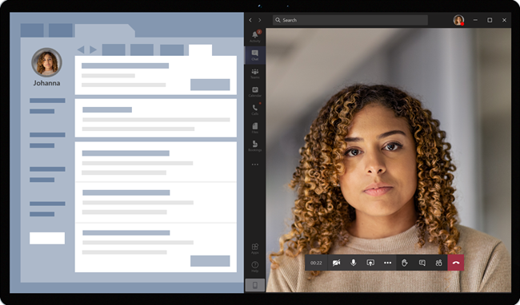

# Rendez-vous virtuels avec Teams – Intégration à Epic EHR

Le connecteur de dossiers d’intégrité électroniques (EHR) Microsoft Teams permet aux médecins de lancer facilement un rendez-vous virtuel de patients ou une consultation avec un autre fournisseur dans Microsoft Teams directement à partir du système DMI Epic. Basé sur le cloud Microsoft 365, Teams permet une collaboration et une communication simples et sécurisées avec les outils de conversation, de vidéo, de voix et de santé dans un hub unique qui prend en charge la conformité avec HIPAA, la certification HITECH, etc.

La plateforme de communication et de collaboration de Teams permet aux médecins de réduire facilement l’encombrement des systèmes fragmentés afin qu’ils puissent se concentrer sur la fourniture des meilleurs soins possibles. Avec le connecteur DSE Teams, vous pouvez :

- Lancez des rendez-vous virtuels Teams à partir de votre système DMI Epic avec un flux de travail clinique intégré.
- Permettre aux patients de rejoindre des rendez-vous virtuels Teams à partir du portail des patients ou par SMS.
- Prenez en charge d’autres scénarios, notamment les services multi-participants, les visites de groupe et les services d’interpréteur.
- Réécrivez les métadonnées dans le système DMI à propos des rendez-vous virtuels Teams à enregistrer lorsque les participants se connectent, se déconnectent et activent l’audit automatique et la conservation des enregistrements.
- Affichez les rapports de données de consommation et les informations de qualité des appels personnalisables pour les rendez-vous connectés à un DMI.

Cet article explique comment installer et configurer le connecteur DMI Teams pour qu’il s’intègre à la plateforme Epic dans votre organisation de santé. Il vous donne également une vue d’ensemble de l’expérience de rendez-vous virtuels Teams à partir du système DMI Epic.

## Avant de commencer

Avant de commencer, il y a quelques choses à faire pour préparer l’intégration.

### Se familiariser avec le processus d’intégration

Passez en revue les informations suivantes pour comprendre le processus d’intégration global.

:::image type="content" source="media/ehr-connector-epic-flow.png" alt-text="Image résumant les étapes du processus d’intégration global.":::

| &nbsp; |Demander l’accès à l’application|Activation de l’application|Configuration du connecteur|Configuration d’Epic|Tests|
|--------|---------|---------|---------|---------|---------|
| **Duration** | Environ 12 à 24 heures| Environ 24 heures | Environ 1 à 3 jours | Environ 1 à 3 jours | &nbsp; |
| **Action**| Vous [demandez l’accès à l’application Teams](#request-access-to-the-teams-app).  | Nous créons un certificat de clé publique et privée et nous les chargeons dans Epic. | Vous effectuez les étapes de configuration dans le portail de configuration du connecteur DMI.  | Vous travaillez avec votre spécialiste technique Epic pour configurer les enregistrements FDI dans Epic.| Vous effectuez des tests dans votre environnement de test. |
| **Résultat**| Nous autorisons votre organisation à effectuer des tests. | Epic synchronise le certificat de clé publique. | Vous recevez des enregistrements FDI pour la configuration Epic. | Configuration terminée. Prêt à être testé. | Validation complète des flux et décision de passer en production. |

### Demander l’accès à l’application Teams

Vous devez demander l’accès à l’application Teams.

1. Demande de téléchargement de l’application Teams sur la [Place de marché Epic App Orchard](https://apporchard.epic.com/Gallery?id=16793). Cela déclenche une demande d’Epic à l’équipe du connecteur Microsoft DMI.
1. Après avoir envoyé votre demande, envoyez un e-mail à [TeamsForHealthcare@service.microsoft.com](mailto:teamsforhealthcare@service.microsoft.com) avec le nom de votre organisation, l’ID de locataire et l’adresse e-mail de votre contact technique Epic.
1. L’équipe du connecteur Microsoft DMI répondra à votre e-mail en confirmant l’activation.

### Consultez le guide d’intégration de télésanté Epic-Microsoft Teams

Examinez le [Guide d’intégration de Microsoft Teams télémédecine](https://galaxy.epic.com/Search/GetFile?Url=1!68!100!100100357) avec votre spécialiste technique Epic. Assurez-vous que toutes les conditions préalables sont remplies.

## Configuration requise

- Un abonnement actif à Microsoft Cloud for Healthcare ou un abonnement à l’offre autonome du connecteur DMI Microsoft Teams (uniquement appliqué lors du test dans un environnement DMI de production).
- Epic version de novembre 2018 ou ultérieure.
- Les utilisateurs disposent d’une licence Microsoft 365 ou Office 365 appropriée qui inclut les réunions Teams.
- Teams est adopté et utilisé dans votre organisation de santé.
- Identifié une personne de votre organisation qui est un administrateur général Microsoft 365 ayant accès au [Centre d’administration Teams](https://admin.teams.microsoft.com).
- Vos systèmes répondent à toutes les [exigences en matière de logiciels et de navigateurs](/microsoftteams/hardware-requirements-for-the-teams-app) pour Teams.

> [!IMPORTANT]
> Assurez-vous d’effectuer les étapes de pré-intégration et que toutes les conditions préalables sont remplies avant de poursuivre l’intégration.

Les étapes d’intégration sont effectuées par les personnes suivantes de votre organisation :

- **Administrateur général de Microsoft 365** : le principal responsable de l’intégration. L’administrateur configure le connecteur, active SMS (si nécessaire) et ajoute l’analyste client Epic qui approuvera la configuration.
- **Analyste client Epic**: personne de votre organisation qui a des informations d’identification de connexion à Epic. Ils approuvent les paramètres de configuration entrés par l’administrateur et fournissent les enregistrements de configuration à Epic.

L’administrateur Microsoft 365 et l’analyste client Epic peuvent être la même personne.

## Configurer le connecteur DSE Teams

La configuration du connecteur nécessite que vous :

- [Lanciez le portail de configuration du connecteur EHR](#launch-the-ehr-connector-configuration-portal)
- [Entriez les informations de configuration](#enter-configuration-information)
- [Activiez les notifications SMS (facultatif)](#enable-sms-notifications-optional)
- [Approuver ou afficher la configuration](#approve-or-view-the-configuration)
- [Passiez en revue et acheviez la configuration](#review-and-finish-the-configuration)

### Lancer le portail de configuration du connecteur EHR

Pour commencer, votre administrateur Microsoft 365 lance le [portail de configuration du connecteur DMI](https://ehrconnector.teams.microsoft.com) et se connecte à l’aide de ses informations d’identification Microsoft 365.

Votre administrateur Microsoft 365 peut configurer une seule organisation ou plusieurs organisations pour tester l’intégration. Configurez l’URL de test et de production dans le portail de configuration. Veillez à tester l’intégration à partir de l’environnement de test Epic avant de passer en production.

> [!NOTE]
> Votre administrateur Microsoft 365 et votre analyste client Epic doivent effectuer les étapes d’intégration dans le portail de configuration. Pour connaître les étapes de configuration d’Epic, contactez le spécialiste technique Epic affecté à votre organisation.

### Entrer les informations de configuration

Ensuite, pour configurer l’intégration, votre administrateur Microsoft 365 effectue les opérations suivantes :

1. Ajoute une URL de base FHIR (Fast Health Interoperability Resources) de votre spécialiste technique Epic et spécifie l’environnement. Configurez autant d’URL de base FHIR que nécessaire, en fonction des besoins de votre organisation et des environnements que vous souhaitez tester.

    - L’URL de base FHIR est une adresse statique qui correspond au point de terminaison de l’API FHIR de votre serveur. Un exemple d’URL est `https://lamnahealthcare.com/fhir/auth/connect-ocurprd-oauth/api/FHDST`.

    - Vous pouvez configurer l’intégration pour les environnements de test et de production. Pour la configuration initiale, nous vous encourageons à configurer le connecteur à partir d’un environnement de test avant de passer en production.

1. Ajoute le nom d’utilisateur de l’analyste client Epic qui approuvera la configuration dans une étape ultérieure.

    :::image type="content" source="media/ehr-connector-epic-configure.png" alt-text="Capture d’écran de la page Configuration, montrant l’approbateur en cours d’ajout." lightbox="media/ehr-connector-epic-configure.png":::

### Activer les notifications SMS (facultatif)

> [!NOTE]
> Les notifications SMS sont actuellement disponibles uniquement dans le États-Unis. Nous travaillons à la mise à disposition de cette fonctionnalité dans d’autres régions dans les futures versions de Teams et mettrons à jour cet article le cas échéant.

Effectuez cette étape si votre organisation souhaite que Microsoft gère les notifications SMS pour vos patients. Lorsque vous activez les notifications PAR SMS, vos patients reçoivent des messages de confirmation et de rappel pour les rendez-vous planifiés.

Pour activer les notifications SMS, votre administrateur Microsoft 365 effectue les opérations suivantes :

1. Dans la page notifications SMS, cochez les deux cases de consentement pour :

    - Autoriser Microsoft à envoyer des notifications SMS aux patients au nom de votre organisation.
    - Reconnaître que vous allez vous assurer que les participants ont accepté d’envoyer et de recevoir des SMS.
    
    :::image type="content" source="media/ehr-connector-epic-sms-notifications.png" alt-text="Capture d’écran de la page de notifications SMS, montrant les cases de consentement à cocher et l’option permettant de générer un numéro de téléphone." lightbox="media/ehr-connector-epic-sms-notifications.png":::

1. Sous **Vos numéros de téléphone**, **sélectionnez Générer un nouveau numéro de téléphone** pour générer un numéro de téléphone pour votre organisation. Cela démarre le processus de demande et de génération d’un nouveau numéro de téléphone. L’exécution de ce processus peut prendre jusqu’à 2 minutes.

    Une fois le numéro de téléphone généré, il s’affiche à l’écran. Ce numéro sera utilisé pour envoyer des confirmations par SMS et des rappels à vos patients. Le numéro a été fournit, mais n’est pas encore lié à l’URL de base FHIR. C’est ce que vous allez faire à l’étape suivante.

    :::image type="content" source="media/ehr-connector-epic-phone-number.png" alt-text="Capture d’écran montrant un exemple de numéro de téléphone généré." lightbox="media/ehr-connector-epic-phone-number.png":::

    Sélectionnez **Terminé**, puis **Suivant**.

1. Pour lier le numéro de téléphone à une URL de base FHIR, sous **Numéro de téléphone** dans la section **configuration SMS** , sélectionnez le numéro. Effectuez cette opération pour chaque URL de base FHIR pour laquelle vous souhaitez activer les notifications SMS.

    :::image type="content" source="media/ehr-connector-epic-link-phone-number.png" alt-text="Capture d’écran montrant comment lier un numéro de téléphone à une URL de base FHIR." lightbox="media/ehr-connector-epic-link-phone-number.png":::

    S’il s’agit de la première fois que vous configurez le connecteur, vous verrez l’URL de base FHIR entrée à l’étape précédente. Le même numéro de téléphone peut être lié à plusieurs URL de base FHIR, ce qui signifie que les patients recevront des notifications par SMS du même numéro de téléphone pour différentes organisations et/ou services.

1. Sélectionnez **l’installation sms** en regard de chaque URL de base FHIR pour configurer les types de notifications SMS à envoyer à vos patients.

    :::image type="content" source="media/ehr-connector-epic-sms-setup.png" alt-text="Capture d’écran montrant les paramètres d’installation de SMS." lightbox="media/ehr-connector-epic-sms-setup.png":::

    - **SMS de confirmation**: des notifications sont envoyées aux patients lorsqu’un rendez-vous est planifié, mis à jour ou annulé dans le système DMI.
    - **SMS de rappel**: les notifications sont envoyées aux patients en fonction de l’intervalle de temps que vous spécifiez et de l’heure planifiée du rendez-vous.

    Cliquez sur **Enregistrer**.

1. Sélectionnez **Charger le certificat** pour charger un certificat de clé publique. Vous devez charger un certificat .cer encodé en Base64 (clé publique uniquement) pour chaque environnement.

    Un certificat de clé publique est requis pour recevoir des informations de rendez-vous pour l’envoi de notifications SMS. Le certificat est nécessaire pour vérifier que les informations entrantes proviennent d’une source valide.

    Lorsque le connecteur est utilisé pour envoyer des rappels par SMS, le numéro de téléphone du patient est envoyé par Epic dans une charge utile HL7v2 lorsque des rendez-vous sont créés dans Epic. Ces numéros sont stockés pour chaque rendez-vous dans la zone géographique de votre organisation et sont conservés jusqu’à ce que le rendez-vous ait lieu. Pour en savoir plus sur la configuration des messages HL7v2, consultez le [Guide d’intégration de télésanté Epic-Microsoft Teams](https://galaxy.epic.com/Search/GetFile?Url=1!68!100!100100357).

    Cliquez sur **Suivant**.

> [!NOTE]
> À tout moment, votre administrateur Microsoft 365 peut mettre à jour l’un des paramètres SMS. N’oubliez pas que la modification des paramètres peut entraîner l’arrêt du service SMS. Pour plus d’informations sur l’affichage des rapports SMS, consultez le [rapport Rendez-vous virtuels du connecteur MDI Teams](ehr-connector-report.md).

### Approuver ou afficher la configuration

L’analyste client Epic de votre organisation qui a été ajouté en tant qu’approbateur lance le [portail de configuration du connecteur DMI](https://ehrconnector.teams.microsoft.com) et se connecte à l’aide de ses informations d’identification Microsoft 365. Une fois la validation réussie, l’approbateur est invité à se connecter à l’aide de ses informations d’identification Epic pour valider l’organisation Epic.

> [!Note]
> Si l’administrateur Microsoft 365 et l’analyste client Epic sont identiques, vous devez toujours vous connecter à Epic pour valider votre accès. La connexion Epic est utilisée uniquement pour valider votre URL de base FHIR. Microsoft ne stocke pas les informations d’identification ni n’accède aux données DMI avec cette connexion.

:::image type="content" source="media/ehr-connector-epic-login-approve.png" alt-text="Capture d’écran de la page Approuver ou Afficher la configuration, montrant l’option Connexion et approbation." lightbox="media/ehr-connector-epic-login-approve.png":::

Une fois la connexion à Epic réussie, l’analyste client Epic **doit** approuver la configuration. Si la configuration n’est pas correcte, votre administrateur Microsoft 365 peut se connecter au portail de configuration et modifier les paramètres.

:::image type="content" source="media/ehr-connector-epic-approve.png" alt-text="Capture d’écran de la page Approuver ou afficher la configuration, montrant l’option Approuver." lightbox="media/ehr-connector-epic-approve.png":::

### Passer en revue et terminer la configuration

Lorsque les informations de configuration sont approuvées par l'administrateur Epic, les enregistrements d'intégration pour le lancement du patient et du fournisseur vous sont présentés. Les enregistrements d’intégration sont les suivants :

- Dossiers des patients et des fournisseurs
- Enregistrement SMS direct
- Enregistrement de configuration SMS
- Enregistrement de configuration de test d’appareil

Le jeton de contexte pour le test de l’appareil se trouve dans l’enregistrement d’intégration du patient. L’analyste client Epic doit fournir ces enregistrements à Epic pour terminer la configuration des rendez-vous virtuels dans Epic. Pour plus d’informations, consultez le [Guide d’intégration de télésanté Epic-Microsoft Teams](https://galaxy.epic.com/Search/GetFile?Url=1!68!100!100100357).

> [!Note]  
> À tout moment, l’analyste client Microsoft 365 ou Epic peut se connecter au portail de configuration pour afficher les enregistrements d’intégration et modifier la configuration de l’organisation, si nécessaire.

:::image type="content" source="media/ehr-connector-epic-finish.png" alt-text="Capture d’écran de la page Révision et fin, montrant les informations d’intégration." lightbox="media/ehr-connector-epic-finish.png":::

> [!Note]
> L’analyste client Epic doit terminer le processus d’approbation pour chaque URL de base FHIR configurée par l’administrateur Microsoft 365.

## Lancer des rendez-vous virtuels Teams

Après avoir effectué les étapes du connecteur DMI et la configuration Epic, votre organisation est prête à prendre en charge les rendez-vous vidéo avec Teams.

### Prérequis pour les rendez-vous virtuels

- Vos systèmes doivent répondre à toutes les [exigences en matière de logiciels et de navigateurs](/microsoftteams/hardware-requirements-for-the-teams-app) pour Teams.

- Vous avez terminé la configuration de l’intégration entre l’organisation Epic et votre organisation Microsoft 365.

### Expérience fournisseur

Les prestataires de santé de votre organisation peuvent rejoindre des rendez-vous à l’aide de Teams à partir de leurs applications de fournisseur Epic (Hyperspace, Haiku, Canto). Le bouton **Commencer la visite virtuelle** est incorporé dans le flux du fournisseur.

  

Principales fonctionnalités de l’expérience fournisseur :

- Les fournisseurs peuvent joindre des rendez-vous à l’aide de navigateurs pris en charge ou de l’application Teams.

- Les fournisseurs doivent se connecter une seule fois avec leur compte Microsoft 365 lorsqu’ils rejoignent un rendez-vous pour la première fois.

- Après la connexion unique, le fournisseur est directement dirigé vers le rendez-vous virtuel dans Teams. (Le fournisseur doit être connecté à Teams).

- Les fournisseurs peuvent voir les mises à jour en temps réel des participants qui se connectent et se déconnectent pour un rendez-vous donné. Les fournisseurs peuvent voir quand le patient est connecté à un rendez-vous.

> [!NOTE]
> Toutes les informations entrées dans la conversation de réunion nécessaires à la continuité des dossiers médicaux ou à des fins de rétention doivent être téléchargées, copiées et notifiées par le fournisseur de soins de santé. La conversation ne constitue pas un dossier médical légal ou un jeu d’enregistrements désigné. Les messages de la conversation sont stockés en fonction des paramètres créés par l’administrateur Microsoft Teams.

### Expérience patient

Le connecteur prend en charge les patients qui rejoignent des rendez-vous via un lien dans le SMS, le site web MyChart et les appareils mobiles. Au moment du rendez-vous, les patients peuvent démarrer le rendez-vous à partir de MyChart à l’aide du bouton **Commencer la visite virtuelle** ou en appuyant sur le lien dans le SMS.

  

Principales fonctionnalités de l’expérience du patient :

- Les patients peuvent rejoindre des rendez-vous à partir de [navigateurs web modernes sur le bureau et les appareils mobiles sans avoir à installer l’application Teams](browser-join.md).
- Les patients peuvent tester le matériel et la connexion de leur appareil avant de rejoindre un rendez-vous.

    :::image type="content" source="media/ehr-admin-epic-device-test.png" alt-text="Images d’un appareil mobile, montrant les fonctionnalités de test de l’appareil." lightbox="media/ehr-admin-epic-device-test.png":::
  
    Fonctionnalités de test de l’appareil :

  - Les patients peuvent tester leur haut-parleur, leur microphone, leur caméra et leur connexion.
  - Les patients peuvent effectuer un appel de test pour valider entièrement leur configuration.
  - Les résultats du test d’appareil peuvent être renvoyés au système DMI.

- Les patients peuvent rejoindre des rendez-vous d’un simple clic et sans qu’aucun autre compte ou connexion ne soit requit.

- Les patients ne sont pas tenus de créer un compte Microsoft ou de se connecter pour lancer un rendez-vous.

- Les patients sont placés dans une salle d’attente jusqu’à ce que le fournisseur les rejoigne et les admette.

- Les patients peuvent tester leur vidéo et leur microphone dans la salle d’attente avant de rejoindre le rendez-vous.

> [!Note]
> Epic, MyChart, Haiku et Canto sont des marques déposées d'Epic Systems Corporation.

## Obtenir des informations sur l’utilisation des rendez-vous virtuels

Le [rapport d’utilisation des visites virtuelles](virtual-visits-usage-report.md) dans le Centre d’administration Microsoft Teams donne aux administrateurs une vue d’ensemble de l’activité des rendez-vous virtuels Teams dans votre organisation. Le rapport présente des analyses détaillées pour les rendez-vous virtuels, y compris les réunions intégrées à la DSE Teams effectuées à partir de votre système DMI.

Vous pouvez afficher des indicateurs clés telles que le temps d’attente dans la salle d’attente et la durée du rendez-vous. Utilisez ces informations pour obtenir des insights sur les tendances d’utilisation afin de vous aider à optimiser les rendez-vous virtuels afin d’obtenir de meilleurs résultats métier.

### Confidentialité et emplacement des données

L’intégration de Teams aux systèmes DSE optimise la quantité de données utilisées et stockées pendant les flux d’intégration et de rendez-vous virtuels. La solution respecte les principes et les directives générales de Teams en matière de confidentialité et de gestion des données, décrits dans Confidentialité Teams.

Le connecteur DSE Teams ne stocke ni ne transfère les données personnelles identifiables ni les dossiers d’intégrité des patients ou des fournisseurs de soins de santé à partir du système DSE. Les seules données stockées par le connecteur DMI sont l’ID unique de l’utilisateur DMI (utilisé lors de l’installation d’une réunion Teams).

L’ID unique de l’utilisateur DMI est stocké dans l’une des trois zones géographiques décrites dans [Emplacement de stockage des données client Microsoft 365](/microsoft-365/enterprise/o365-data-locations). Toutes les conversations, enregistrements et autres données partagés dans Teams par les participants à la réunion sont stockés conformément aux stratégies de stockage existantes. Pour en savoir plus sur l’emplacement des données dans Teams, consultez [Emplacement des données dans Teams](/microsoftteams/location-of-data-in-teams).

## Articles connexes

- [Rapport d’utilisation des visites virtuelles Teams](virtual-visits-usage-report.md)
- [Rapport des rendez-vous virtuels du connecteur DMI Teams](ehr-connector-report.md)
- [Prise en main de Teams pour les organismes de santé](teams-in-hc.md)
