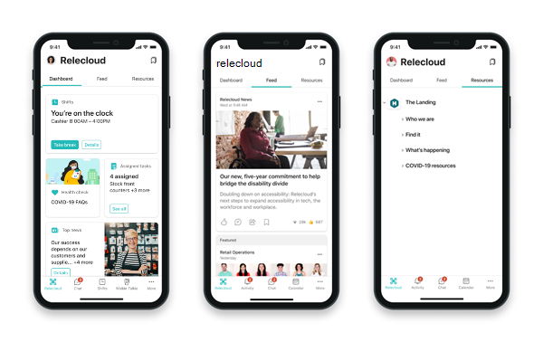

# Impliquez vos employés et concentrez-vous sur le bien-être

Développez un sentiment d’appartenance au sein de votre équipe de première ligne en vous donnant les moyens d’interagir avec l’ensemble de votre organisation.

Un sondage similaire au [rapport Pulse de l’index de tendance](https://www.microsoft.com/worklab/work-trend-index) professionnelle de Microsoft indique que de nombreux employés de première ligne :

- J’aimerais que l’on fasse plus pour soutenir leur santé mentale
- Supposons que le leadership ne hiérarchise pas la culture de création
- Croire que le stress au travail restera le même ou empirera au cours de l’année à venir

Vous pouvez aider votre équipe de première ligne à surmonter ces défis et à se sentir prise en charge dans votre organisation à l’aide de [Viva Connections](#connect-frontline-workers-to-your-broader-organization-with-viva-connections), [Yammer](#create-communities-with-yammer), [Compliment](#boost-morale-with-praise) [, SharePoint et Microsoft Stream](#support-engagement-with-sharepoint-and-microsoft-stream).

## Connecter des travailleurs de première ligne à votre organisation plus large avec Viva Connections

> [!VIDEO https://www.microsoft.com/videoplayer/embed/RE4Vpnn]

<!--  This seems more like an IW image than a frontline one. Swapping out for the video. -->

[Viva Connections](/viva/connections/viva-connections-overview) apporte la puissance de SharePoint dans Microsoft Teams, afin que vos employés de première ligne puissent facilement accéder à tout ce dont ils ont besoin en déplacement. Utilisez l’application Connexions Viva pour Microsoft Teams pour :

- Connecter des employés de première ligne et créer des opportunités pour impliquer, communiquer et collaborer
- Permettre aux employés de première ligne d’accéder facilement aux actualités et aux annonces importantes
- Autonomiser les travailleurs de première ligne autour d’une mission et d’un objectif communs
- Créer un sentiment d’appartenance et fournir des outils qui favorisent le bien-être.

### Augmenter l’engagement avec les communications

Viva Connections se compose de trois composants principaux qui peuvent être configurés et personnalisés de différentes manières pour mettre en surbrillance les outils et les ressources : le tableau de bord, le flux et les ressources, comme indiqué ci-dessous.

|Composant |Description |Fonctionnalités |
|:---------|:-----------|:------------|
|Tableau de bord |Le tableau de bord est l’ensemble d’outils numériques de votre employé et permet un accès rapide aux tâches courantes. |Hiérarchiser les cartes qui aident les travailleurs de première ligne à accomplir des tâches courantes, telles que l’horloge entrante et sortante, ou l’affichage des tâches affectées. Les cartes peuvent être ciblées sur des rôles et des régions distincts. |
|Flux |Le flux agrège le contenu de Yammer, d’actualités SharePoint et de Stream pour afficher un flux d’actualités personnalisé. |Le contenu du flux est automatiquement agrégé dans un emplacement central en fonction des sites SharePoint et des communautés Yammer qu’ils suivent. Le contenu peut être hiérarchisé pour s’afficher de manière plus visible dans le flux. Utilisez le ciblage d’audience pour afficher du contenu à des audiences spécifiques. |
|Ressources |La surface Ressources est liée à des portails SharePoint populaires et à d’autres contenus. |Les ressources sont héritées de la navigation globale dans SharePoint. Lien vers des portails SharePoint populaires tels que les avantages sociaux et les ressources de formation des RH. Les portails SharePoint modernes s'affichent dans Teams pour offrir la meilleure expérience d'affichage possible. |

Il existe plusieurs façons d’utiliser Viva Connections pour communiquer avec votre personnel. Viva Connections propose un [flux dans lequel les actualités, le contenu de Yammer et les vidéos sont agrégés et affichés](/viva/connections/viva-connections-overview#viva-connections-feed) dans une vue personnalisée en fonction des sites et des communautés suivis par la visionneuse. Le [Tableau de bord](/viva/connections/create-dashboard) peut également être utilisé pour mettre en surbrillance certaines cartes qui sont liées à des sources d’actualités importantes.

À mesure que vous hiérarchisez et alignez les scénarios à prendre en charge, réfléchissez au mode et à l’emplacement de certains outils et ressources. [En savoir plus sur les différences entre les applications de bureau et mobiles](/viva/connections/viva-connections-overview#viva-connections-mobile-and-desktop-experiences).

#### Permettre à vos travailleurs de partager leurs commentaires

La création de canaux permettant à vos employés de première ligne de partager des commentaires permet à ces équipes de se sentir engagées et d’apprécier leur voix. En outre, l’obtention de commentaires de ces équipes peut fournir des insights sur la façon dont votre organisation peut améliorer les processus.

- **Dans le tableau de bord**: utilisez une [carte de lien web](/viva/connections/create-dashboard#add-a-web-link-card) pour faciliter la liaison aux canaux de commentaires tels que les communautés [Microsoft Forms](https://support.microsoft.com/office/create-a-form-with-microsoft-forms-4ffb64cc-7d5d-402f-b82e-b1d49418fd9d) et [Yammer](https://support.microsoft.com/office/join-and-create-a-community-in-yammer-56aaf591-1fbc-4160-ba26-0c4723c23fd6). Vous pouvez également [intégrer des solutions tierces dans le tableau de bord](https://cloudpartners.transform.microsoft.com/resources/viva-app-integration).

    > [!NOTE]
    > La création d’un formulaire nécessite une licence F3 ou Entreprise. Les travailleurs disposant de licences F1 peuvent remplir des formulaires, mais ils doivent être créés par une personne disposant d’une licence F3 ou Entreprise. [En savoir plus sur les types de licences](flw-licensing-options.md) ou [Afficher la table de comparaison de licences détaillée](https://go.microsoft.com/fwlink/?linkid=2139145).

- **Dans le flux** : publier stratégiquement [un billet d’actualités SharePoint](https://support.microsoft.com/office/create-and-share-news-on-your-sharepoint-sites-495f8f1a-3bef-4045-b33a-55e5abe7aed7#:~:text=In%20SharePoint%20Online%2C%20you%20can%20add%20news%20posts,instructions%20Create%20the%20news%20post%20.%20See%20More) destiné aux employés de première ligne pour mettre en évidence les différentes façons de recueillir des commentaires et explique comment les commentaires peuvent améliorer l’expérience de travail de première ligne.
- **Dans Ressources** : lien vers les outils de commentaires afin que les employés de première ligne sachent où aller pour fournir des commentaires.

### Promouvoir la santé et le bien-être

Les travailleurs de première ligne ont besoin d’un soutien supplémentaire lorsqu’il s’agit de gérer la santé et le bien-être. Non seulement leur travail est rapide, mais ils peuvent également être physiquement et émotionnellement exigeants.

- **Sur le tableau de bord** : contrôles d’intégrité quotidiens surface, rappels de bien-être et [autres solutions tierces qui permettent aux utilisateurs de se sentir connectés et productifs](https://cloudpartners.transform.microsoft.com/resources/viva-app-integration).
- **Dans le flux** : Utilisez des [billets d’actualités SharePoint](https://support.microsoft.com/office/create-and-share-news-on-your-sharepoint-sites-495f8f1a-3bef-4045-b33a-55e5abe7aed7#:~:text=In%20SharePoint%20Online%2C%20you%20can%20add%20news%20posts,instructions%20Create%20the%20news%20post%20.%20See%20More) et [liens d’actualités vidéo](/viva/connections/video-news-links) pour mettre en évidence les ressources de bien-être et de santé. Vous pouvez utiliser le ciblage d’audience pour vous assurer que les publications atteignent les personnes les plus pertinentes.
- **Dans Ressources** : lier les ressources de bien-être et de santé à vos travailleurs peut y accéder à tout moment.

### Créer un écosystème numérique de soutien

L’autonomisation des travailleurs de première ligne avec la technologie appropriée facilite leur travail et aide votre organisation à s’adapter rapidement aux conditions de travail en constante évolution. Utilisez Viva Connections pour créer un écosystème numérique et une expérience organisée des employés.

- **Sur le tableau de bord** : utilisez [des modèles de carte adaptative](/adaptive-cards/templating/), le [concepteur de cartes](/viva/connections/create-dashboard#design-your-own-card-with-a-quick-view) et [des intégrations tierces pour créer des cartes personnalisées et des vues rapides](https://cloudpartners.transform.microsoft.com/resources/viva-app-integration) qui aident les travailleurs à accéder aux informations et à effectuer des tâches quotidiennes telles que :
    - Recherche ou sécurisation des espaces de stationnement
    - Accès aux informations sur la rémunération et les avantages sociaux
    - Demande de nouveaux uniformes et fournitures
- **Dans le flux** : [les billets d’actualités SharePoint](https://support.microsoft.com/office/create-and-share-news-on-your-sharepoint-sites-495f8f1a-3bef-4045-b33a-55e5abe7aed7#:~:text=In%20SharePoint%20Online%2C%20you%20can%20add%20news%20posts,instructions%20Create%20the%20news%20post%20.%20See%20More) et les [liens d’actualités vidéo](/viva/connections/video-news-links) vous permettent de numériser les annonces organisationnelles. Les billets d’actualités sont mis en surbrillance dans l’ensemble de l’écosystème Microsoft 365, peuvent être traduits dans différentes langues et se trouvent facilement lorsque les employés recherchent du contenu.
- **Dans Ressources** : lien vers les outils que vos équipes utilisent pour gérer le travail, tels que les [applications Teams](flw-team-collaboration.md#apps-in-teams).

### Prise en main de la planification, de la création et du lancement Viva Connections

Passez en revue Viva Connections fonctionnalités, les exigences techniques et les options de personnalisation. Ensuite, collaborez avec des parties prenantes (comme des représentants des RH et des responsables des opérations et des processus) qui peuvent représenter avec précision les besoins de votre personnel de première ligne. Faites l’inventaire des besoins les plus prioritaires et alignez-les sur les fonctionnalités Viva Connections pour créer une expérience personnalisée dans Teams. [Commencez à planifier, créer et lancer des Viva Connections pour votre organisation](/viva/connections/plan-viva-connections).

## Créer des communautés avec Yammer

Yammer est un réseau social interne qui permet aux membres de votre organisation de se connecter entre eux. Vous pouvez créer des communautés où les membres de votre organisation peuvent publier des messages et communiquer. Le fait de disposer d'une variété de communautés couvrant à la fois les équipes de première ligne et les autres équipes permet à votre personnel sur le terrain de se connecter les uns aux autres et à l'organisation dans son ensemble. Les communautés peuvent être basées sur :

- Emplacement
- Rôles, tels que les caissières ou les infirmières
- Les centres d’intérêt, tels que les activités de plein air ou la culture pop
- Groupes d’identité
- Et bien plus encore

### Héberger des événements en direct

Les membres de votre équipe de direction ou de gestion peuvent organiser des événements en direct sur Yammer où les employés peuvent s’engager et poser des questions en temps réel pendant une conversation. Vos équipes de communication et de gestion peuvent utiliser des événements en direct pour partager des annonces, héberger des événements de moral, etc.

> [!NOTE]
> Seuls les utilisateurs disposant d’une licence E3 ou E5 peuvent héberger des événements en direct, mais les utilisateurs disposant de licences F peuvent les rejoindre. [En savoir plus sur les personnes qui peuvent héberger et participer à des événements en direct dans Yammer](/yammer/manage-yammer-groups/yammer-live-events).

[En savoir plus sur Yammer](https://support.microsoft.com/office/what-is-yammer-1b0f3b3e-89ee-4b66-aac5-30def12f287c).

## Booster les performances avec Compliment

L’application Compliment dans Microsoft Teams permet aux responsables et aux employés de se féliciter mutuellement et de partager leur appréciation en envoyant des badges dans les canaux et les conversations Teams. Compliment permet aux employés à se sentir reconnus pour leurs réalisations, telles que la réalisation d’objectifs et la réalisation de tâches au-delà pour aider les clients.

[Découvrez comment gérer Compliment pour votre organisation](/microsoftteams/manage-praise-app?bc=/microsoft-365/frontline/breadcrumb/toc.json&toc=/microsoft-365/frontline/toc.json).

## Prise en charge de l’engagement avec SharePoint et Microsoft Stream

L’une des plus grandes difficultés pour les travailleurs de première ligne est de se sentir inclus dans l’ensemble de l’organisation. En enregistrant des réunions importantes dans SharePoint et en hébergeant des vidéos dans Microsoft Stream.

### Enregistrer les réunions Teams et les stocker dans SharePoint

Si votre organisation utilise déjà Microsoft Teams, vous avez peut-être enregistré certaines de vos réunions afin que les membres de l’équipe puissent rattraper les réunions qu’ils ont manquées. L’enregistrement de réunions peut également profiter à votre équipe de première ligne en lui faisant sentir qu’elle est incluse dans l’organisation. Voici quelques façons d’utiliser des réunions enregistrées pour aider les équipes de première ligne :

- Donnez-leur un accès antérieur aux annonces telles que les versions de produits et les nouvelles stratégies.
- Aidez-les à comprendre les objectifs métier plus larges de votre organisation.
- Familiarisez-les avec l’équipe de direction qui pilote les décisions qui les affectent.

[Découvrez comment enregistrer des réunions Teams et les stocker dans SharePoint](https://support.microsoft.com/office/record-a-meeting-in-teams-34dfbe7f-b07d-4a27-b4c6-de62f1348c24).

Une fois qu’une réunion est enregistrée et enregistrée dans SharePoint, votre équipe de communication d’entreprise peut [ajouter une carte dans Connexions Viva](/viva/connections/create-dashboard#create-a-dashboard-and-add-cards) pour la rendre facilement accessible à votre équipe de première ligne.

### Héberger des événements en direct et partager du contenu vidéo sur Microsoft Stream

Microsoft Stream est la propre plateforme vidéo de streaming de votre organisation. Avec Stream, tous les membres de votre organisation peuvent enregistrer et télécharger des vidéos à partager. Les moyens d’utiliser Stream pour impliquer vos employés de première ligne sont les suivants :

- Partagez des annonces telles que des versions de produits et de nouvelles stratégies afin que votre équipe de première ligne ne soit pas la dernière à le savoir.
- Les membres de l’équipe de direction peuvent se présenter et discuter de leurs objectifs afin que votre équipe de première ligne comprenne qui pilote les décisions et pourquoi.
- Les équipes de première ligne de différents emplacements peuvent créer des vidéos pour se présenter et mettre en valeur leur emplacement afin que les travailleurs de différents endroits puissent se sentir connectés.

> [!NOTE]
> Seuls les utilisateurs disposant d’une licence Entreprise peuvent héberger des événements ou publier en continu. Les utilisateurs disposant de licences F peuvent participer à des événements et afficher des vidéos.

[En savoir plus sur Microsoft Stream](https://support.microsoft.com/office/explore-stream-87a7d1e2-ef0e-44c6-88dc-74b23266cfc0).

Votre équipe de communication d’entreprise peut s’assurer que tout le monde peut facilement diffuser des vidéos [en ajoutant une carte dans Viva Connections](/viva/connections/create-dashboard#create-a-dashboard-and-add-cards).
