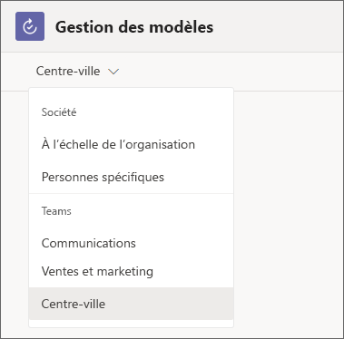

# Responsables – Démarrer avec votre équipe dans Microsoft 365 for frontline workers

Microsoft 365 for frontline workers inclut diverses fonctionnalités pour aider votre équipe à donner le meilleur d’elle-même. Voici quelques actions que vous pouvez effectuer immédiatement pour que votre équipe travaille ensemble :

|Chemin   |Description   |Applications Teams dont vous aurez besoin |
|----------|-----------|-----------|
|[Activer la communication rapide](#enable-quick-communication) |Aidez votre équipe de première ligne à rester en contact. |Conversations et Talkie-walkie |
|[Gérer les planifications, l’heure et la présence des employés en première ligne](#manage-frontline-schedules-time-and-attendance) |Configurez une planification que vous pouvez gérer dans Teams. |Shifts |
|[Gérer les éléments de travail](#manage-work-items) |Utilisez Teams et les applications Microsoft 365 pour attribuer et suivre les éléments de travail. |Tasks, Listes, Approbations et Mises à jour |
|[Faciliter les connexions et améliorer le moral](#foster-connections-and-boost-morale-with-praise) |Envoyez des compliments aux membres de votre équipe pour qu’ils se sentent appréciés. |Compliment |

Les applications qui prennent en charge ces fonctionnalités sont incluses dans Teams et la plupart sont prêtes à être utilisées immédiatement. Certains éléments doivent être ajoutés à votre équipe ou configurés avant d’être prêt à l’utiliser. En outre, la plupart de ces applications sont épinglées par défaut, ce qui signifie que les membres de votre équipe de première ligne les verront par défaut dans la barre des applications, qui est la barre située en bas des clients mobiles Teams (iOS et Android) et sur le côté du client de bureau Teams. Vous pouvez toujours ajouter des applications qui ne sont pas épinglées en fonction de vos besoins. [Découvrez comment ajouter des applications dans Teams](https://support.microsoft.com/office/add-an-app-to-microsoft-teams-b2217706-f7ed-4e64-8e96-c413afd02f77).

Cet article vous aidera à obtenir Teams pour les employés de première ligne, à configurer une équipe, puis à configurer les fonctionnalités et les applications dont vous avez besoin pour que votre équipe dispose de ces fonctionnalités.

## Obtenir Teams pour les employés de première ligne

Tout d’abord, vous devez [lancer l’expérience d’essai pour les employés en première ligne](https://support.microsoft.com/office/learn-more-about-the-frontline-trial-in-microsoft-teams-73a429fc-f211-4360-8329-704bc102ba98) à partir de l’application Tasks dans Microsoft Teams. Si vous avez déjà Microsoft 365 for frontline workers, vous pouvez ignorer cette étape et lire le reste de cet article pour découvrir comment tirer le meilleur parti de vos licences.

> [!NOTE]
> La version d’évaluation pour les employés en première ligne est basée sur la licence Microsoft 365 F3.

## Activer la communication rapide

Utilisez les outils de communication intégrés à Microsoft Teams pour permettre à vos employés de première ligne de rester en contact. Vous n’avez pas besoin d’effectuer une configuration supplémentaire pour les applications de communication ni de les utiliser dans votre équipe. Vous verrez toujours les icônes Teams, Conversations et Activité lorsque vous ouvrez Teams, sur le bureau ou sur mobile, tandis que Talkie-walkie est disponible uniquement sur mobile.

### Équipes

Vous et vos employés de première ligne pouvez créer des équipes pour aider des groupes spécifiques à rester en contact. Par exemple, vous pouvez créer une équipe Caissiers afin que tous vos caissiers puissent communiquer entre eux et partager des informations. S’il existe un changement de stratégie qui s’applique uniquement aux caissiers, vous pouvez le publier dans l’équipe Caissiers afin qu’il atteigne les personnes qui ont besoin de le voir. [Découvrez comment créer une équipe dans Teams](https://support.microsoft.com/office/set-up-groups-and-teams-a79afa20-aa01-44a3-b33d-5eaa72f6404f).

### Conversations

La conversation dans Teams permet aux membres de votre personnel de première ligne de communiquer en toute transparence sans avoir à utiliser leurs applications de messagerie personnelle. [En savoir plus sur les conversations](https://support.microsoft.com/office/first-things-to-know-about-chats-88ed0a06-6b59-43a3-8cf7-40c01f2f92f2).

### Activité

Vous pouvez @mentionner un membre de l’équipe pour attirer son attention sur une conversation. Les @Mentions envoient une notification aux utilisateurs, afin qu’ils voient le message dans Activité même s’ils l’ont manqué dans la conversation.

### Talkie-walkie

Talkie-walkie permet à vos travailleurs d’avoir des conversations en temps réel avec des travailleurs à n’importe quel endroit sans quitter leur poste. Par exemple, si un employé aide un client et a besoin d’assistance, il peut utiliser Talkie-walkie pour contacter un expert ou un responsable sans avoir à s’éloigner du client.

Talkie-walkie est pris en charge sur les appareils Android avec Google Mobile Services (GMS) et les appareils iOS.

## Gérer les planifications, l’heure et la présence en première ligne

Vous pouvez utiliser l’application Plannings pour créer et gérer des planifications. Avec Plannings, les employés peuvent demander des congés, se porter volontaires pour les shifts ouverts et demander à échanger des shifts avec des collègues. Vous pouvez également utiliser des shifts pour partager des planifications afin qu’il soit facile pour tous les membres de votre équipe de savoir quand ils travaillent. Les employés peuvent utiliser Plannings pour pointer. Pour créer une planification dans Plannings :

1. Accédez à l’application et sélectionnez **Créer un planning**.
2. Sélectionnez ensuite **Ajouter un groupe** pour organiser la planification en fonction du type de travail ou de l’emplacement. Vous pouvez avoir plusieurs groupes selon une planification unique. Par exemple, un organisme de soins de santé peut avoir un groupe pour les réceptionnistes et un autre pour les infirmières.
3. Sélectionnez les points de suspension (**...**), puis **Renommer** pour nommer le groupe.
4. Pour créer un shift pour un membre de l’équipe, sélectionnez sa ligne, puis sélectionnez **Autres options > Ajouter un shift**.

Regardez [cette vidéo](https://support.microsoft.com/office/create-a-shifts-schedule-2b94ca38-36db-4a1c-8fee-f8f0fec9a984) pour en savoir plus sur la création de planifications dans Plannings.

Si votre organisation utilise déjà un système de gestion du personnel pour la planification, votre équipe informatique peut l’intégrer à Teams pour regrouper toutes vos planifications en shifts. À l’heure actuelle, Plannings est en mesure de s’intégrer aux systèmes de gestion du personnel Blue Yonder et Reflexis. [En savoir plus sur la connexion de votre système de gestion du personnel](shifts-connectors.md).

## Gérer les éléments de travail

Vous pouvez utiliser les applications Tasks, Listes, Approbations et Mises à jour pour gérer et suivre les éléments de travail. Vous pouvez choisir d’utiliser une seule application ou plusieurs d’entre elles en fonction de vos besoins. Tout le monde peut créer et attribuer des tâches à eux-mêmes et aux membres de l’équipe.

### Tâches

Tasks est optimisé par Planificateur et vous permet de créer et d’affecter des éléments de travail pour votre équipe. Pour créer et affecter une tâche dans Tasks :

1. Ouvrez l’application Tasks.
2. Sélectionnez **+ Nouvelle liste ou plan** pour créer une liste de tâches pour votre équipe.
3. Attribuez un nom à votre plan. Sous **Créer dans**, choisissez l’équipe et le canal auquel vous souhaitez appliquer le plan de tâche. Ensuite, sélectionnez **Créer**.

    

4. Pour créer une tâche, donnez-lui un nom. Ensuite, affectez-le à un membre de l’équipe dans laquelle vous avez créé le plan. Vous pouvez également choisir une date d’échéance.

    

5. Une fois que vous avez créé et affecté la tâche, elle apparaît dans l’application Tasks pour les membres de l’équipe. Si vous n’affectez pas la tâche à une personne spécifique, elle s’affiche toujours pour l’équipe.

Tasks est optimisé par Planificateur. Regardez [cette liste de lecture](https://support.microsoft.com/office/organize-your-team-s-tasks-in-microsoft-planner-c931a8a8-0cbb-4410-b66e-ae13233135fb) pour en savoir plus sur la façon dont vous pouvez utiliser conjointement Planificateur et Tasks.

### Approbations

Approbations permet à votre équipe de soumettre des demandes d’approbation à partir de Teams. Par exemple, si l’un des membres de votre équipe souhaite offrir une remise sur une commande importante, il peut envoyer une demande d’approbation pour obtenir l’autorisation.

Vous pouvez créer des modèles pour votre équipe de première ligne qui lui permettront d’envoyer des demandes d’approbation rationalisées.

1. Dans le hub Approbations, sélectionnez **Créer ou gérer des modèles**.
2. Dans le menu, sélectionnez l’équipe à laquelle vous souhaitez appliquer le modèle.

    

3. Sélectionnez **Nouveau modèle**, puis choisissez un modèle existant dans le magasin de modèles ou créez-en un à partir de zéro pour répondre à vos besoins.
4. Choisissez à qui vous souhaitez appliquer le modèle. Choisissez **Toute l’équipe** pour que ce modèle s’applique à tous les membres de l’équipe que vous avez sélectionnée à l’étape 2.
5. Sélectionnez l’équipe dans la liste.
6. Renseignez les paramètres de base, la conception de formulaire et les paramètres de flux de travail. Sélectionnez ensuite **Aperçu**.
7. Si le modèle vous semble correct, choisissez **Publier**.
8. Les membres de votre équipe pourront désormais envoyer des demandes d’approbation à partir du modèle que vous avez créé.

[En savoir plus sur la création de modèles pour votre équipe dans Approbations](https://support.microsoft.com/office/discover-templates-in-approvals-c33ecf9f-b745-4287-b104-ac69469745e0).

### Listes

L’application Listes vous aide à suivre les informations et à organiser le travail. Vous et votre équipe pouvez créer des listes pour l’inventaire, les demandes des clients, les besoins en matière de fourniture, etc.

Vous pouvez créer une liste à partir d’un modèle en choisissant **+Nouvelle liste** dans l’application Listes. [Découvrez les modèles disponibles](https://support.microsoft.com/office/list-templates-in-microsoft-365-62f0e4cf-d55d-4f89-906f-4a34e036ded1).

Si vous avez une feuille de calcul sur laquelle vous collaborez avec votre équipe, vous pouvez la convertir en liste.

1. Dans l’application Listes, sélectionnez **+Nouvelle liste**.
2. Choisissez **À partir d’Excel** et chargez la feuille de calcul que vous souhaitez transformer en liste.
3. Vérifiez que les types de colonnes sont corrects et ajustez-les si nécessaire. Ensuite, sélectionnez **Suivant**.
4. Donnez à votre liste un nom, une couleur, une icône et un emplacement. Ensuite, choisissez **Créer**.

> [!NOTE]
> L’application Listes n’est pas épinglée par défaut, mais vous pouvez [l’ajouter à partir du magasin d’applications Teams](https://support.microsoft.com/office/add-an-app-to-microsoft-teams-b2217706-f7ed-4e64-8e96-c413afd02f77).

### Mises à jour

Mises à jour vous permet de créer, d’envoyer et d’examiner des mises à jour. Les personnes peuvent facilement voir les mises à jour, les pointages et les rapports de leurs employés à un seul endroit pour s’assurer que l’équipe est sur la bonne voie pour réussir, qu’il s’agisse de processus périodiques qui se produisent régulièrement ou de mises à jour ponctuelles qui peuvent être nécessaires à tout moment.

Vous pouvez affecter des mises à jour aux membres de votre équipe. Les membres de l’équipe peuvent également envoyer des mises à jour sans être affectés.

1. Dans l’application Mises à jour, sélectionnez **Créer et gérer des modèles**.
2. Choisissez un modèle populaire ou **Afficher plus** pour afficher toutes les options de modèle. Vous pouvez choisir un modèle ou partir de zéro.
3. Renseignez les paramètres de base et la conception du formulaire.
4. Dans les paramètres de flux de travail, choisissez à qui vous souhaitez envoyer cette mise à jour, pour qui vous voulez l’afficher, ainsi que les heures et les dates d’échéance de la mise à jour.
5. Les soumissionnaires que vous avez affectés pourront désormais voir et soumettre la mise à jour requise.

> [!NOTE]
> L’application Mises à jour n’est pas épinglée par défaut, mais vous pouvez [l’ajouter à partir du magasin d’applications Teams](https://support.microsoft.com/office/add-an-app-to-microsoft-teams-b2217706-f7ed-4e64-8e96-c413afd02f77).

## Facilitez les connexions et améliorez le moral grâce à Compliment

L’application Compliment dans Teams vous aide à exprimer votre gratitude aux membres de votre équipe. Vous pouvez envoyer des badges aux membres de l’équipe pour reconnaître leur réussite. Les membres de l’équipe peuvent s’envoyer des badges les uns aux autres. Vous pouvez également envoyer des badges dans une conversation de canal pour reconnaître un groupe de personnes. Compliment utilise des badges prédéfinis qui font ressortir des qualités positives telles que **Esprit d’équipe** et **Génial**.

1. Ouvrez une conversation ou un canal Teams. Sous l’espace où vous écrivez un message, choisissez l’icône Compliment ou sélectionnez les points de suspension (**...**) pour la trouver.
    
2. Sélectionnez un badge dans le menu déroulant **Badge**.
3. Ajoutez le nom des personnes que vous voulez ajouter et une description facultative.
4. Sélectionnez **Aperçu** pour le vérifier, puis sélectionnez **Envoyer**.

## Partager des vidéos de formation avec vos utilisateurs

Aidez votre équipe à se familiariser avec ses fonctionnalités Microsoft 365 et à les utiliser en toute confiance grâce à ces ressources de formation. Chacun de ces articles et chacune de ces vidéos ne prend que quelques minutes.

[Prise en main de Microsoft Teams](https://support.microsoft.com/office/get-started-with-microsoft-teams-b98d533f-118e-4bae-bf44-3df2470c2b12)

[Prise en main de Talkie-walkie](https://support.microsoft.com/office/get-started-with-teams-walkie-talkie-25bdc3d5-bbb2-41b7-89bf-650fae0c8e0c)

[Prise en main de Plannings](https://support.microsoft.com/office/what-is-shifts-f8efe6e4-ddb3-4d23-b81b-bb812296b821)

Plannings inclut également une fonctionnalité de pointage. [Découvrez comment pointer à l’aide de Plannings](https://support.microsoft.com/office/clock-in-and-out-with-shifts-ae7b676c-7666-46c7-9f68-85ff54acec8b)

[Prise en main de Tasks](https://support.microsoft.com/office/use-the-tasks-app-in-teams-e32639f3-2e07-4b62-9a8c-fd706c12c070)

[En savoir plus sur les approbations](https://support.microsoft.com/office/what-is-approvals-a9a01c95-e0bf-4d20-9ada-f7be3fc283d3)

[En savoir plus sur les listes](https://support.microsoft.com/office/create-a-list-from-the-lists-app-b5e0b7f8-136f-425f-a108-699586f8e8bd)

[En savoir plus sur l’expérience mobile Mises à jour](https://support.microsoft.com/office/get-started-in-updates-c03a079e-e660-42dc-817b-ca4cfd602e5a#ID0EBF=Mobile)

[Découvrez comment envoyer des compliments](https://support.microsoft.com/office/send-praise-to-people-50f26b47-565f-40fe-8642-5ca2a5ed261e)