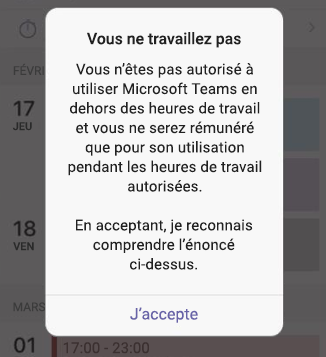

# <a name="manage-shift-based-access-for-frontline-workers-in-teams"></a>Gérer l'accès par shift dans Teams pour les travailleurs de première ligne

## <a name="overview"></a>Vue d’ensemble

[!INCLUDE [preview-feature](includes/preview-feature.md)]

La présence dans Microsoft Teams indique la disponibilité et l'état actuels de l'utilisateur à d'autres utilisateurs. La présence de travailleurs de première ligne est souvent moins prévisible que les autres employés, car leurs heures de travail ne sont généralement pas les mêmes chaque jour. En tant qu’administrateur, vous pouvez configurer Teams de manière à afficher un ensemble d’états de présence basés sur les shifts pour les travailleurs de première ligne de votre organisation afin d’indiquer quand ils sont en déplacement ou en congé.

Ces états de présence par shift exposent une &mdash; **Shift en cours**,  **Shift terminé**,  **Occupé**&mdash;sont distincts de [l’ensemble par défaut des états de présence](/microsoftteams/presence-admins) dans Teams. Avec ces deux ensembles d’états de présence, vous pouvez configurer différentes expériences pour des personnes de votre organisation en fonction de leur rôle.

Avec l’accès par shift, vous pouvez gérer l’accès à Teams lorsque les travailleurs de première ligne dont le shift est terminé. Par exemple, vous pouvez définir Teams pour afficher un message que les travailleurs de première ligne doivent accepter avant de pouvoir utiliser Teams lorsqu’ils ne font pas partie d’un shift planifié.  

## <a name="scenario"></a>Scénario

Voici un exemple sur la façon dont votre organisation peut gérer l’accès par shift.

Vous avez des travailleurs de première ligne dans votre organisation qui ne doivent être payés que pour les heures qu’ils travaillent sur un shift que leur responsable a planifié et approuvé. Ils ne doivent pas être payés pour le temps passé à travailler en dehors d’un shift planifié, ce qui inclut l’utilisation de l’application Teams. Vous configurez un message personnalisé indiquant « Votre temps sur Teams lorsque le shift est terminé ne compte pas pour les heures payables », qui s’affiche lorsque les travailleurs de première ligne tentent d’accéder à Teams lorsque le shift est terminé. S’ils choisissent d’utiliser Teams, ils cliquent sur **J’accepte** en comprenant qu’ils ne seront pas payés pour cette fois.

Vous avez également des travailleurs de l’information dans votre organisation qui sont salariés et qui ne travaillent pas par shift. Vous configurez vos travailleurs de l’information de manière à utiliser les états de présence par défaut dans Teams tout en offrant à vos travailleurs de première ligne une présence par shift.

## <a name="shift-based-presence-states"></a>États de présence par shift

Voici les états de présence par shift.

|L'application est configurée |L'utilisateur est configuré  |Informations supplémentaires  |
|---------|---------|---------|
| Shift en cours     |         |Définir automatiquement au début d’un shift         |
| Shift terminé     |         |Définir automatiquement à la fin d’un shift         |
| Occupé(e)      |  Occupé(e)         |Défini automatiquement. Peut également être défini manuellement lorsque le travailleur de première ligne travaille par shift.|

## <a name="off-shift-access-to-teams"></a>Accès hors shift à Teams

Cette fonctionnalité vous permet de gérer l’accès à Teams lorsque les travailleurs de première ligne sont hors shift. Vous pouvez définir Teams pour qu’il affiche un message aux travailleurs de première ligne s’ils accèdent à Teams hors shift. Les travailleurs de première ligne doivent cliquer sur **J’accepte** pour accepter le message avant de pouvoir utiliser Teams.

Vous pouvez utiliser le message par défaut, choisir parmi un ensemble de messages prédéfinis ou personnaliser le message pour afficher le texte souhaité. Voici le message par défaut :



Vous pouvez également définir la fréquence à laquelle le message s’affiche et définir une période de grâce entre le début du premier shift ou la fin du dernier shift et le moment où l’accès à Teams est restreint.

## <a name="manage-shift-based-access"></a>Gérer l’accès basé les équipes

En tant qu’administrateur, vous utilisez des stratégies pour contrôler la présence par shift pour les travailleurs de première ligne de votre organisation. Vous gérez ces stratégies à l’aide des applets de commande PowerShell suivantes :

- [New-CsTeamsShiftsPolicy](/powershell/module/teams/new-csteamsshiftspolicy)
- [Get-CsTeamsShiftsPolicy](/powershell/module/teams/get-csteamsshiftspolicy)
- [Set-CsTeamsShiftsPolicy](/powershell/module/teams/set-csteamsshiftspolicy)
- [Grant-CsTeamsShiftsPolicy](/powershell/module/teams/grant-csteamsshiftspolicy)
- [Remove-CsTeamsShiftsPolicy](/powershell/module/teams/remove-csteamsshiftspolicy)

Utilisez l’applet de commande New-CsTeamsShiftsPolicy pour créer une stratégie, définissez les paramètres de stratégie souhaités, puis utilisez l’applet de commande Grant-CsTeamsShiftsPolicy pour affecter la stratégie aux utilisateurs.

Voici quelques exemples. Pour plus d’informations sur chaque paramètre et paramètre de stratégie, notamment la liste des messages de shift prédéfinis parmi lesquels vous pouvez choisir, consultez [New-CsTeamsShiftsPolicy](/powershell/module/teams/new-csteamsshiftspolicy).

### <a name="example-1"></a>Exemple 1

Dans cet exemple, nous créons une stratégie nommée Message d’accès par défaut à Teams hors shift. Dans cette stratégie, la présence par shift est activée et le message par défaut s’affiche chaque fois qu’un utilisateur auquel cette stratégie est affectée accède à Teams lorsque le shift est terminé. L’utilisateur peut utiliser Teams lorsque le shift est terminé s’il accepte le message, et la période de grâce entre le début du premier shift ou la fin du dernier shift et le moment où l’accès est restreint à 10 minutes.  

```powershell
New-CsTeamsShiftsPolicy -Identity "Off Shift Teams Access Default Message" -EnableShiftPresence $true -ShiftNoticeFrequency always -ShiftNoticeMessageType DefaultMessage -AccessType UnrestrictedAccess_TeamsApp -AccessGracePeriodMinutes 10
```

> [!NOTE]
> Utilisez le paramètre **ShiftNoticeMessageType** pour définir le message que vous souhaitez afficher. Pour afficher la liste des messages prédéfinis parmi lesquels vous pouvez choisir pour ce paramètre, consultez [New-CsTeamsShiftsPolicy](/powershell/module/teams/new-csteamsshiftspolicy).

### <a name="example-2"></a>Exemple 2 

Dans cet exemple, nous créons une stratégie nommée Message personnalisé d’accès à Teams hors shift. Dans cette stratégie, la présence par shift est activée et un message personnalisé s’affiche chaque fois qu’un utilisateur auquel cette stratégie est affectée accède à Teams hors shift. L’utilisateur peut utiliser Teams hors shift s’il accepte le message, et la période de grâce entre le début du premier shift ou la fin du dernier shift et le moment où l’accès est restreint à 15 minutes.  

```powershell
New-CsTeamsShiftsPolicy -Identity "Off Shift Teams Access Custom Message" -EnableShiftPresence $true -ShiftNoticeFrequency always -ShiftNoticeMessageType CustomMessage -ShiftNoticeMessageCustom "Your time on Teams when on off shift won't count toward payable hours" -AccessType UnrestrictedAccess_TeamsApp -AccessGracePeriodMinutes 15
```

> [!NOTE]
> Utilisez le paramètre **ShiftNoticeMessageType** pour définir le message que vous souhaitez afficher. Pour en savoir plus, consultez la rubrique [New-CsTeamsShiftsPolicy](/powershell/module/teams/new-csteamsshiftspolicy).

### <a name="example-3"></a>Exemple 3

Dans cet exemple, nous créons une stratégie nommée Message1 d’accès à Teams hors shift. Dans cette stratégie, la présence par shift est activée et le message prédéfini suivant s’affiche chaque fois qu’un utilisateur auquel cette stratégie est affectée accède à Teams hors shift.

  « Votre employeur n’autorise pas ou n’approuve pas l’utilisation de son réseau, de ses applications, de ses systèmes ou de ses outils par des employés non exemptés ou horaires pendant leurs heures non travaillées. En acceptant, vous reconnaissez que votre utilisation de Teams hors shift n’est pas autorisée et que vous ne serez pas compensé. » 

L’utilisateur peut utiliser Teams hors shift s’il accepte le message, et la période de grâce entre le début du premier shift ou la fin du dernier shift et le moment où l’accès est restreint à trois minutes.  

```powershell
New-CsTeamsShiftsPolicy -Identity "Off Shift Teams Access Message1" -EnableShiftPresence $true -ShiftNoticeFrequency always -ShiftNoticeMessageType Message1 -AccessType  UnrestrictedAccess_TeamsApp -AccessGracePeriodMinutes 3
```

> [!NOTE]
> Utilisez le paramètre **ShiftNoticeMessageType** pour définir le message que vous souhaitez afficher. Pour afficher la liste des messages prédéfinis parmi lesquels vous pouvez choisir pour ce paramètre, consultez [New-CsTeamsShiftsPolicy](/powershell/module/teams/new-csteamsshiftspolicy).

### <a name="example-4"></a>Exemple 4

Dans cet exemple, nous affectons une stratégie nommée Message personnalité d’accès à Teams hors shift à un utilisateur nommé remy@contoso.com.

```powershell
Grant-CsTeamsShiftsPolicy -Identity remy@contoso.com -PolicyName "Off Shift Teams Access Custom Message"
```

## <a name="related-topics"></a>Voir aussi

- [Gérer l’application Shifts pour votre organisation dans Teams](/microsoftteams/expand-teams-across-your-org/shifts/manage-the-shifts-app-for-your-organization-in-teams?bc=/microsoft-365/frontline/breadcrumb/toc.json&toc=/microsoft-365/frontline/toc.json)
- [Présentation de Teams PowerShell](/microsoftteams/teams-powershell-overview)