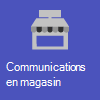
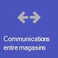
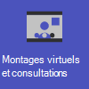
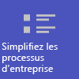
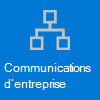
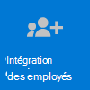

# Prise en main de Microsoft 365 pour les entreprises de vente au détail

Les environnements de vente au détail, avec leurs plannings de rotation et leurs effectifs en cours, ont des besoins très différents de ceux des autres organisations. Pour tirer le meilleur parti de votre organisation de vente au détail, choisissez d’abord quels scénarios Microsoft 365 et Microsoft Teams peuvent vous aider dans vos opérations commerciales quotidiennes, puis veillez à préparer votre environnement Teams avec les notions de base, les équipes et les applications appropriées pour prendre en charge ces scénarios.

1. [Choisissez vos scénarios](#choose-your-scenarios) à implémenter pour votre entreprise.
:::image type="content" source="media/retail-teams-scenarios.png" alt-text="Diagramme montrant les scénarios Teams pour la vente au détail." lightbox="media/retail-teams-scenarios.png":::
2. [Configurez Microsoft 365](flw-setup-microsoft-365.md) : configurez les éléments principaux de Microsoft 365, Microsoft Teams et tous les autres services dont vous avez besoin.
3. [Configurer des services et des applications](#configure-services-and-apps) : utilisez des modèles d’équipe pour configurer rapidement les équipes dont vous avez besoin, y compris les canaux et les applications dont vous avez besoin pour votre entreprise. Ajoutez d’autres applications de Microsoft si nécessaire pour prendre en charge vos scénarios.
:::image type="content" source="media/retail-teams-apps.png" alt-text="Diagramme montrant les équipes, les modèles d’équipe et les applications qui peuvent être inclus" lightbox="media/retail-teams-apps.png":::

## Choisissez vos scénarios

Microsoft 365 et Microsoft Teams offrir plusieurs fonctionnalités qui peuvent aider les entreprises de vente au détail dans leurs opérations quotidiennes et leur transformation numérique. Nous recommandons les scénarios suivants pour les organisations de vente au détail :

     

> [!NOTE]
> Ces scénarios font également partie du cloud Microsoft pour le commerce de détail. Ces scénarios vous offrent davantage de possibilités si vous utilisez également d’autres fonctionnalités de Microsoft Cloud pour la distribution, telles que Microsoft Dynamics 365. En savoir plus sur l’utilisation de cette solution qui regroupe les fonctionnalités Azure, Dynamics 365 et Microsoft 365 dans [Microsoft Cloud for Retail](/industry/retail)

### Télécharger une affiche avec des présentations de scénarios

Utilisez l’affiche suivante pour commencer à envisager ce que votre organisation peut faire avec Microsoft 365 for frontline workers.

| Élément | Description |
|:-----|:-----|
|   [PDF](https://go.microsoft.com/fwlink/?linkid=2206476) \| [Visio](https://go.microsoft.com/fwlink/?linkid=2206271)   Mise à jour de septembre 2022   |Cette affiche fournit une vue d’ensemble des scénarios que vous pouvez implémenter pour votre personnel de première ligne dans un environnement de vente au détail.|

### Présentations vidéo

Regardez la vidéo suivante pour voir comment vous pouvez aider vos associés de magasin à se connecter et à collaborer :

> [!VIDEO https://www.microsoft.com/videoplayer/embed/RWRJVw]

Regardez la vidéo suivante pour voir comment simplifier les processus métier dans les environnements de vente au détail :

> [!VIDEO https://www.microsoft.com/videoplayer/embed/RWRzfc]

### Communication et collaboration en magasin

Rassemblez les associés et la direction dans le Store pour collaborer et simplifier les opérations avec Teams et les applis Teams.

**Applications clés :** Shifts, talkie-walkie, Tâches, Approbations, Conversation, Compliment, Listes, Fichiers, Mises à jour

**Services supplémentaires :** Outlook, Viva Connections, SharePoint, Power Platform et Power Apps

Plus d’informations : [Collaboration d’équipe en première ligne](flw-team-collaboration.md)

### Communication et collaboration entre magasins

Les membres du personnel enseignant peuvent communiquer et collaborer entre plusieurs magasins dans une région ou avec leur siège social en utilisant les mêmes outils et applications que vous utilisez dans votre magasin.

**Applications clés :** Shifts, talkie-walkie, Tâches, Approbations, Conversation, Compliment, Listes, Fichiers, Mises à jour

**Services supplémentaires :** Outlook, Viva Connections, Yammer, SharePoint, Power Platform et Power Apps

Plus d’informations : [Collaboration d’équipe en première ligne](flw-team-collaboration.md)

### Ajustements et consultations virtuels

L’application Bookings dans Microsoft Teams permet aux organisations de planifier et de gérer des rendez-vous virtuels pour les associés et les clients. Utilisez-la pour planifier des rendez-vous virtuels tels que des expériences d’achat virtuel.

**Fonctionnalités et applications clés :** réunions, Bookings

Informations complémentaires : [Rendez-vous virtuels avec Microsoft Teams et l’application Bookings](bookings-virtual-visits.md)

### Simplifiez les processus d’entreprise

Vous pouvez utiliser des Teams, des Power Apps et des Power BI pour simplifier les processus d’entreprise. Par exemple, vous pouvez :

- Définissez et maintenez des plannings pour vos employés avec Plannings.
- Effectuez des inventaires et des marche-pied dans le Store avec Power Apps.
- Suivez les indicateurs de performance clés (KPIs) avec lrd rapports Power BI.

**Applications clés :** Plannings, tâches, listes, approbations

**Services supplémentaires :** Power Plaftorm avec Power Apps et Power BI

Informations complémentaires : [simplifier les processus d’entreprise](simplify-business-processes.md)

### Communications d’entreprise

L’engagement des employés contribue  beaucoup à la satisfaction de l’entreprise, à la fidélité et à la productivité au niveau de toute organisation. Découvrez comment informer et engager tout le monde à l’aide de connexions SharePoint, Teams, Yammer, Stream et Viva Connections.

**Services supplémentaires :** Viva Connections, SharePoint, Stream, Yammer

Plus d’informations : [communications d’entreprise avec les employés de première ligne](flw-corp-comms.md)

### Intégration de nouveaux employés

Faites de l’intégration de nouveaux employés une excellente expérience en favorisez un environnement de travail hybride tout-en-un dans lequel les nouveaux employés peuvent trouver des ressources importantes, rencontrer des personnes au sein de leur organisation et préparer la réussite de leur nouveau rôle.

**Applications clés :** Listes, réunions en direct

**Services supplémentaires :** Viva Learning, SharePoint et Yammer

Informations complémentaires : [Intégrer de nouveaux employés](flw-onboarding-training.md)

> [!NOTE]
> Pour toutes ces fonctionnalités, les utilisateurs doivent avoir une licence appropriée. Microsoft 365 pour les employés en ligne F1 et F3 ou Office 365 F3, Office 365 A3, A5, E3 et E5, ainsi que Microsoft 365 Business Standard, Business Premium, A3, A5, E3 et E5 sont tous pris en charge. Si vous souhaitez en savoir plus sur les licences générales de Teams, veuillez consulter la rubrique [Gérer l’accès des utilisateurs à Teams](/microsoftteams//user-access). Pour plus d’informations sur l’utilisation des Microsoft 365 pour les travailleurs de première ligne en association avec d’autres licences, consultez les [Options de licence pour les travailleurs de première ligne](flw-licensing-options.md) .

## Configurer des services et des applications

:::image type="content" source="media/retail-teams-apps.png" alt-text="Diagramme d’équipes, de modèles d’équipe et d’applications qui peuvent être inclus.":::

### Applications et services pour la vente au détail

Assurez-vous que vos employés peuvent communiquer, collaborer et fournir un service clientèle idéal avec des applications telles que Planning, Talkie-walkie, Tâches, Listes, Compliment, etc. Vous pouvez déterminer quelles applications sont disponibles pour vos utilisateurs en les activant dans le Centre d’administration Teams ou en les incluant dans un modèle d’équipe. Informations supplémentaires sur [la gestion des applis Teams](/microsoftteams/manage-apps)

Pour les environnements de vente au détail, les applis et les services suivants peuvent vous aider à transformer vos processus d’entreprise et à prendre en charge la communication :

| Applications et services Teams | Description | Gestion | Aide |
| ----- | ----- | ----- | ----- |
| Approbations | Les approbations peuvent être intégrées à la conversation pour faciliter la déconnexion. | [Gérer les approbations](/microsoftteams/approval-admin?bc=/microsoft-365/frontline/breadcrumb/toc.json&toc=/microsoft-365/frontline/toc.json) | [Utiliser les approbations](https://support.microsoft.com/office/what-is-approvals-a9a01c95-e0bf-4d20-9ada-f7be3fc283d3) |
| Conversation | Activez les conversations rapides et les vérifications entre les membres du personnel à l’aide d’outils de communication sécurisés de niveau entreprise, au lieu d’applications ou de SMS de qualité consommateur. | [Conversation, équipes, canaux et applications dans Microsoft Teams](/microsoftteams/deploy-chat-teams-channels-microsoft-teams-landing-page) | [Discuter dans Teams](https://support.microsoft.com/office/start-and-pin-chats-a864b052-5e4b-4ccf-b046-2e26f40e21b5?wt.mc_id=otc_microsoft_teams) |
| Documents | Partagez des procédures d’exploitation standard, des stratégies de magasin, des plans, etc. | [Intégration Teams et groupe SharePoint](/sharepoint/teams-connected-sites) | [Partager des fichiers](https://support.microsoft.com/office/upload-and-share-files-57b669db-678e-424e-b0a0-15d19215cb12) |
| Compliment | Reconnaissez vos collègues pour travailler en équipe avec l’appli Compliment. | [Gérer l’application Compliment](/microsoftteams/manage-praise-app?bc=/microsoft-365/frontline/breadcrumb/toc.json&toc=/microsoft-365/frontline/toc.json) | [Envoyer des Compliments aux personnes](https://support.microsoft.com/office/send-praise-to-people-50f26b47-565f-40fe-8642-5ca2a5ed261e) |
| Appareils Real Agent | Communication mains libres avec les appareils | [Microsoft Teams pour RealWear](/microsoftteams/flw-realwear?bc=/microsoft-365/frontline/breadcrumb/toc.json&toc=/microsoft-365/frontline/toc.json) | [Utiliser Microsoft Teams pour Real Grouper](https://support.microsoft.com/office/using-microsoft-teams-for-realwear-af20d232-d18c-476f-8031-843a4edccd5f) |
| Shifts | Gérez les plannings et les heures d’avance ou de fin avec Plannings. | [Gérer l’application Shifts](/microsoftteams/expand-teams-across-your-org/shifts/manage-the-shifts-app-for-your-organization-in-teams?bc=/microsoft-365/frontline/breadcrumb/toc.json&toc=/microsoft-365/frontline/toc.json) | [Utiliser Plannings](https://support.microsoft.com/office/what-is-shifts-f8efe6e4-ddb3-4d23-b81b-bb812296b821) |
| Tâches | Aidez les employés à savoir sur quoi ils doivent se concentrer lorsqu’ils ne sont pas avec des clients en leur attribuant des tâches. Les opérations peuvent utiliser [la publication de tâches](/microsoftteams/manage-tasks-app?bc=/microsoft-365/frontline/breadcrumb/toc.json&toc=/microsoft-365/frontline/toc.json#task-publishing) pour envoyer des tâches à des emplacements et effectuer le suivi de leur avancement. | [Gérer l’application Tâches](/microsoftteams/manage-tasks-app?bc=/microsoft-365/frontline/breadcrumb/toc.json&toc=/microsoft-365/frontline/toc.json) | [Utiliser les tâches](https://support.microsoft.com/office/use-the-tasks-app-in-teams-e32639f3-2e07-4b62-9a8c-fd706c12c070) |
| Mises à jour | Vérifiez les priorités récurrentes ou ponctuelles, telles que le nettoyage quotidien. Les responsables peuvent créer des modèles que les employés peuvent remplir et soumettre. | [Gérer l’application Mises à jour](/microsoftteams/manage-updates-app?bc=/microsoft-365/frontline/breadcrumb/toc.json&toc=/microsoft-365/frontline/toc.json) | [Utiliser Mises à jour](https://support.microsoft.com/office/get-started-in-updates-c03a079e-e660-42dc-817b-ca4cfd602e5a) |
| Talkie-walkie | Appuyez pour parler d’une communication rapide qui n’est pas limitée par des zones géographiques telles que les radios 2 sens standard.| [Gérer l’application Talkie Walkie](/microsoftteams/walkie-talkie?bc=/microsoft-365/frontline/breadcrumb/toc.json&toc=/microsoft-365/frontline/toc.json) | [Utiliser le Talkie-walkie](https://support.microsoft.com/office/get-started-with-teams-walkie-talkie-25bdc3d5-bbb2-41b7-89bf-650fae0c8e0c) |

| Autres applications et services de Microsoft | Description | Gestion | Aide |
| ----- | ----- | ----- | ----- |
| Réservations | Activez les ajustements et consultations virtuels. | [Rendez-vous virtuels avec Microsoft Teams et l’application Bookings](bookings-virtual-visits.md) | [Utiliser Bookings](https://support.microsoft.com/en-us/office/what-is-bookings-42d4e852-8e99-4d8f-9b70-d7fc93973cb5) |
| Power Apps et Power Platform | Intégrez les processus d’entreprise et activer les mises à jour rapides des données, telles que le stock, les numéros de vente, les rapports d’incident, etc. | [L’intégration Teams avec Microsoft Power Platform](/microsoftteams/platform/samples/teams-low-code-solutions) et [la gestion des applications Microsoft Power Platform dans le centre d’administration Microsoft Teams](/microsoftteams/manage-power-platform-apps) | -  |
| SharePoint | Lorsque vous créez une équipe, un nouveau site SharePoint est créé et connecté à l’équipe. Bon nombre des scénarios ci-dessus s’appuient sur SharePoint fonctionnalités déjà incorporées dans Teams, telles que le partage de documents pour la collaboration d’équipe. | [L’intégration Teams et le groupe SharePoint](/sharepoint/teams-connected-sites) | [Ajouter une page SharePoint, une liste ou une bibliothèque de documents sous la Teams](https://support.microsoft.com/office/add-a-sharepoint-page-list-or-document-library-as-a-tab-in-teams-131edef1-455f-4c67-a8ce-efa2ebf25f0b)|
| Viva Connections | Soit Connections crée un hub dans Teams où vos associés au vente au détail peuvent consulter un flux d’actualités personnalisé de votre organisation et un tableau de bord personnalisé avec les ressources dont ils ont besoin. | [Présentation de Viva Connections](/sharepoint/viva-connections-overview) | [Viva Connections dans Microsoft Teams](https://support.microsoft.com/office/your-intranet-is-now-in-microsoft-teams-8b4e7f76-f305-49a9-b6d2-09378476f95b) |
| Viva Learning | Fournissez des formations en cas de besoin, directement dans le flux de leur travail. | [Gérer Viva Learning](/microsoft-365/learning/) | [Utilisez Viva Learning pour organiser des expériences d’apprentissage.](https://support.microsoft.com/office/viva-learning-preview-01bfed12-c327-41e0-a68f-7fa527dcc98a) |
| Yammer | Connecter votre organisation et autoriser les communications entre services et régions avec Yammer | [Gestion de Yammer](/yammer) | [Utiliser Yammer](https://support.microsoft.com/office/what-is-yammer-1b0f3b3e-89ee-4b66-aac5-30def12f287c) |

### Modèles de vente au détail pour les équipes

Créez des équipes qui incluent un ensemble prédéfini de paramètres, de canaux, d’onglets et d’applications préinstallées pour la communication et la collaboration au sein d’un magasin individuel, avec une région, ou entre le siège social et votre personnel, où qu’ils se trouvent.

- Le modèle Organiser **un magasin de vente au détail** inclut des canaux général, de remise des plannings, de disponibilité du store et de Learning, ainsi que les applis Approbations, Tâches et Wiki.
- Le **modèle Commercial pour les gestionnaires** inclut des canaux général, des opérations et des Learning ainsi qu’un onglet Wiki.

Vous pouvez également [créer un modèle personnalisé pour](/microsoftteams/create-a-team-template) inclure les applications dont votre Store a besoin. Plus d’informations [: Commencer à utiliser les modèles d’équipe de vente au détail](/microsoftteams/get-started-with-retail-teams-templates?bc=/microsoft-365/frontline/breadcrumb/toc.json&toc=/microsoft-365/frontline/toc.json) ?

## Préparez-vous à déployer vos scénarios : identifiez les rôles et responsabilités pour les scénarios.

À présent que vous connaissez les scénarios que vous voulez implémenter et ce dont vous avez besoin pour les prendre en charge, vous pouvez rassembler votre équipe afin de pouvoir planifier, déployer et contrôler leur fonctionnement au travail dans votre organisation. Par exemple, les rôles suivants peuvent être nécessaires pour déployer ces scénarios au sein de votre organisation :

| Image | Role | Responsibilities | Service |
| ---- | ---- | ----- | ----- |
| | Administrateur informatique | Travaillez avec les gestionnaires des opérations et de la gestion de la vente au détail pour définir des scénarios et la manière dont ils fonctionneront pour l’organisation.   Configurez les paramètres du centre d’administration Teams, tels que les stratégies et les modèles, et activez les applis.   Définissez les paramètres des applis (par exemple, les paramètres Shifts globaux) pour l’organisation.   Ajoutez et octroyez une licence aux utilisateurs.  | Département informatique |
|| Operations staff | Travaillez avec les administrateurs pour définir des scénarios et déterminer les paramètres, stratégies, modèles et applications nécessaires pour Teams.   Créer des équipes régionales ou divisionnelles à partir de modèles   Définissez les tâches, les listes et les flux d’approbation pour une coordination entre les magasins situés à l’intérieur d’une région ou entre les magasins et le siège social.   Configurer une infrastructure d’apprentissage pour le personnel | Opérations centralisées |
| | Gestionnaire du Store | Travaillez avec les administrateurs et le personnel des opérations pour définir des scénarios.   Créez des équipes pour le Store à partir de modèles.   Selon vos besoins, définissez des canaux et des applis pour les équipes. Par exemple : un canal pour les transferts   Configurer des plannings de magasin dans Shifts.   Configurez des tâches, des listes, des mises à jour et des flux d’approbation spécifiques au magasin.   Configurer des tâches pédagogiques pour le personnel. | Gestion du Store |

Pour plus d’informations sur l’implémentation et l’adoption Teams, voir [Adopter Microsoft Teams](/microsoftteams/adopt-microsoft-teams-landing-page)
