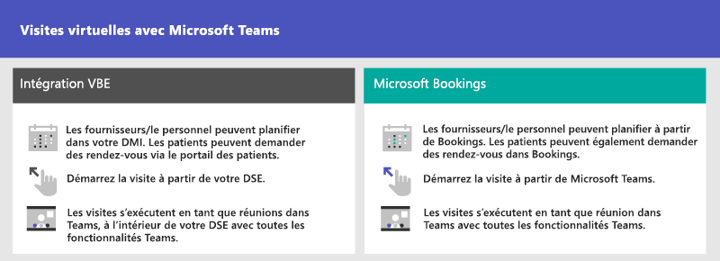
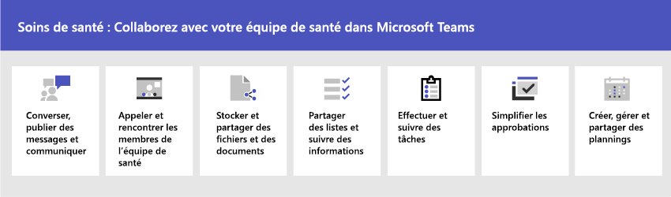

# Démarrez avec Microsoft 365 pour les organismes de santé

Microsoft 365 et Microsoft Teams offrent un certain nombre de fonctionnalités de télémédecine utiles pour les hôpitaux et d’autres organisations de soins de santé. Des fonctionnalités Teams sont en cours de développement pour aider les hôpitaux :

- Rendez-vous virtuels et intégration des dossiers médicaux électroniques
- Packages de stratégies Teams
- Messagerie sécurisée
- Modèles Teams
- Coordination et collaboration des soins

> [!NOTE]
> Cette fonctionnalité fait également partie du Cloud Microsoft pour le secteur de la santé. Apprenez-en davantage sur l’utilisation de cette solution qui regroupe les fonctionnalités d’Azure Dynamics 365 et Microsoft 365 sur [Microsoft Cloud pour le secteur de la santé](/industry/healthcare).

Regardez la vidéo suivante pour en savoir plus sur l’utilisation de la collection de soins de santé pour améliorer la collaboration des équipes de santé dans Teams.

> [!VIDEO https://www.microsoft.com/videoplayer/embed/RE4Hqan]

Pour tirer le meilleur parti de votre organisation de santé, vous devez d’abord choisir les scénarios Microsoft 365 et Microsoft Teams qui peuvent vous aider dans vos activités quotidiennes, puis vous assurer que vous préparez votre environnement Teams avec les principes de base, les équipes et les applications appropriés pour prendre en charge ces scénarios.

1. [Choisissez vos scénarios](#scenarios-for-healthcare) à implémenter.
2. [Configurer Microsoft 365](flw-setup-microsoft-365.md) : configurer les éléments principaux Microsoft 365, Microsoft Teams et tous les autres services dont vous avez besoin.
3. [Configurer des services et des applications](flw-setup-microsoft-365.md#step-5-configure-apps-for-your-scenario) : utilisez des modèles d’équipe pour configurer rapidement les équipes dont vous avez besoin, y compris les canaux et les applications dont vous avez besoin pour votre entreprise. Ajoutez d’autres applications Microsoft si nécessaire pour prendre en charge vos scénarios.

## Scénarios pour la santé

Les scénarios suivants sont disponibles pour les organismes de santé :

| Scénario | Description | Conditions requises |
| -------- | -------- | -------- |
| [Rendez-vous virtuels et intégration des dossiers médicaux électroniques](#virtual-appointments-and-electronic-healthcare-record-ehr-integration) | Planifiez, gérez et organisez des rendez-vous virtuels avec des patients. Ce scénario connecte Teams et la plateforme Cerner ou Epic pour prendre en charge les rendez-vous virtuels. | Abonnement actif au cloud Microsoft pour les services de santé ou abonnement à l’offre autonome connecteur DMI Microsoft Teams.   Les utilisateurs disposent d’une licence Microsoft 365 ou Office 365 appropriée qui inclut les réunions Teams.   Les organisations doivent avoir Cerner version novembre 2018 ou ultérieure ou Epic version novembre 2018 ou ultérieure.  Détails pour [Cerner EHR](ehr-admin-cerner.md#before-you-begin) et exigences[Epic EHR](ehr-admin-epic.md#before-you-begin) |
| [Rendez-vous virtuels avec Microsoft Teams et l’application Bookings](#virtual-appointments-and-electronic-healthcare-record-ehr-integration) | Planifiez, gérez et organisez des rendez-vous virtuels avec des patients. Ce scénario s’appuie sur Microsoft Bookings pour prendre en charge les visites virtuelles. | Microsoft Bookings doit être désactivé pour l’organisation.   Tous les utilisateurs de l’application Bookings et tous les membres du personnel participant aux réunions doivent avoir une licence qui prend en charge la planification de réunions Teams*.  [Détails sur les exigences de Bookings](/microsoftteams/bookings-app-admin#prerequisites-to-use-the-bookings-app-in-teams?bc=/microsoft-365/frontline/breadcrumb/toc.json&toc=/microsoft-365/frontline/toc.json)|
| [Coordination et collaboration avec les soins](#care-coordination-and-collaboration) | Les cliniciens et le personnel peuvent collaborer en interne sur les horaires, les documents, les tâches, etc.| Les utilisateurs doivent avoir une licence appropriée*. |

*Office 365 A3, A5, E3, E5, F1, F3, Microsoft 365 A3, A5, E3 et E5, Business Standard sont pris en charge. Si vous souhaitez en savoir plus sur les licences générales de Teams, veuillez consulter la rubrique [Gérer l’accès des utilisateurs à Teams](/microsoftteams/user-access).

Ou choisissez parmi d’autres [scénarios](flw-choose-scenarios.md) pour Microsoft 365 pour les employés de première ligne, par exemple, [Communications d’entreprise](flw-corp-comms.md) ou [bien-être et engagement](flw-wellbeing-engagement.md).

Tirez parti de ces fonctionnalités qui aident Microsoft Teams à travailler pour votre organisation de santé :

| Fonctionnalité | Description | Conditions requises |
| -------- | -------- | -------- |
| [Packages de stratégies Teams](#teams-policy-packages)| Assurez-vous que les travailleurs cliniques, les travailleurs de l'information et les appareils de la salle des patients disposent d'un accès approprié à la fonctionnalité Teams.| Les utilisateurs doivent avoir une licence appropriée*. |
| [Messagerie sécurisée](#secure-messaging) | Attirez plus rapidement l'attention sur les messages urgents et ayez la certitude que le message a été reçu et lu. | Les utilisateurs doivent avoir une licence appropriée*.  |
| [Modèles Teams](#teams-templates-for-healthcare-organizations) | Créez des équipes qui comprennent un modèle prédéfini de paramètres, de canaux et d'applications préinstallées pour la communication et la collaboration au sein d'un service, d'une unité ou d'un département, ou entre plusieurs services, unités et départements d'un hôpital. | Les utilisateurs doivent avoir une licence appropriée*.  |

### Télécharger une affiche avec des présentations de scénarios

Utilisez l’affiche suivante pour commencer à envisager ce que votre organisation peut faire avec Microsoft 365 for frontline workers.

| Élément | Description |
|:-----|:-----|
|   [PDF](https://go.microsoft.com/fwlink/?linkid=2206475) \| [Visio](https://go.microsoft.com/fwlink/?linkid=2206474)   Mise à jour de septembre 2022   |Cette affiche fournit une vue d’ensemble des scénarios que vous pouvez implémenter pour votre personnel de première ligne dans un cadre de soins de santé.|

## Rendez-vous virtuels et intégration des dossiers médicaux électroniques

Utilisez la plateforme complète de réunions Microsoft Teams pour programmer, gérer et organiser des rendez-vous virtuels avec les patients.

- Si votre organisation utilise déjà les dossiers médicaux informatisés, ou DMI, vous pouvez intégrer Microsoft Teams pour une expérience plus transparente. Le connecteur de dossier médical informatisé (DMI) de Microsoft Teams permet aux cliniciens de lancer facilement un rendez-vous virtuel avec un patient ou de consulter un autre fournisseur dans Teams, directement à partir du système DMI. Pour plus d’informations, consultez [rendez-vous virtuels avec Teams : Intégration à Cerner EHR](ehr-admin-cerner.md) et [rendez-vous virtuels avec Teams : Intégration à Epic EHR](ehr-admin-epic.md).
- Si vous n'utilisez pas un DMI pris en charge, vous pouvez utiliser Microsoft Bookings et l'application Bookings dans Teams. Pour en savoir plus, consultez [rendez-vous virtuels avec les applications Teams et Bookings](bookings-virtual-visits.md).

## Packages de stratégies Teams

Appliquer des packages de stratégie Teams pour définir ce que les différents rôles peuvent faire dans Teams. Par exemple, spécifiez des stratégies pour :

- Les travailleurs cliniques, tels que les infirmières autorisées, les infirmières responsables, les médecins et les travailleurs sociaux, afin qu'ils puissent avoir un accès complet à la conversation, aux appels, à la gestion des équipes et aux réunions.
- Les travailleurs de l’information dans votre organisation de santé, tels que le personnel d’informatique, le personnel administratif, le personnel financier et les responsables de la mise en conformité, peuvent accéder à des conversations, des appels et des réunions.
- Salles des patients, pour contrôler les paramètres des appareils de salle des patients.

Pour en savoir plus, consultez [Packages de stratégie Teams pour la santé publique](/microsoftteams/policy-packages-healthcare?bc=/microsoft-365/frontline/breadcrumb/toc.json&toc=/microsoft-365/frontline/toc.json).

## Messagerie sécurisée

La messagerie sécurisée prend en charge la collaboration au sein des équipes de santé, notamment plusieurs nouvelles fonctionnalités :

- L'expéditeur d'un message peut définir une priorité spéciale pour son message, de sorte que le destinataire soit averti à plusieurs reprises jusqu'à ce qu'il lise le message.
- L'expéditeur d'un message peut demander un accusé de lecture, ce qui lui permet d'être informé lorsqu'un message qu'il a envoyé a été lu par son destinataire.

Ensemble, ces fonctionnalités permettent d'accorder une attention plus rapide aux messages urgents et de s'assurer que le message a été reçu et lu. De nouvelles équipes de santé utilisant ces fonctionnalités peuvent être créées sur une base par patient. Ces fonctionnalités sont basées sur des stratégies et peuvent être affectées à des individus ou à des équipes entières.

Pour plus d’informations, consultez [Prise en main des stratégies de messagerie sécurisée pour les organismes de santé](messaging-policies-hc.md).

La possibilité d'avoir d'autres clients fédérés par des organismes de santé, permettant une communication inter-clients plus riche, est également liée à la messagerie sécurisée. (Consultez [Gérer les conversations et les réunions externes dans Microsoft Teams](/microsoftteams/manage-external-access)).

## Modèles Teams pour les organisations de santé

Teams inclut des modèles conçus spécifiquement pour les organisations de santé, ce qui facilite la création d’équipes permettant au personnel de communiquer et de collaborer sur les soins des patients ou les besoins opérationnels. Pour en savoir plus, consultez [Utiliser les modèles d’équipe de santé](/microsoftteams/expand-teams-across-your-org/healthcare/healthcare-templates-admin-console?bc=/microsoft-365/frontline/breadcrumb/toc.json&toc=/microsoft-365/frontline/toc.json).

## Coordination et collaboration des soins

Rassemblez votre équipe de santé pour coordonner les soins et collaborer avec Microsoft Teams.

Microsoft Teams permet aux médecins, aux cliniciens, aux infirmières et aux autres membres du personnel de collaborer efficacement grâce aux fonctions de collaboration incluses dans Microsoft Teams, telles que :

- Configurer des équipes et des canaux pour vos équipes de santé et les travailleurs de l’information. Utiliser des canaux avec des onglets pour structurer leur travail, avec l’aide des onglets dans lesquels ils peuvent épingler des sources d’informations.
- Converser, publier des messages et communiquer. Votre équipe peut avoir des conversations permanentes sur les différents patients qui ont besoin d'attention.
- Appeler et rencontrer les membres de l'équipe de santé. Configurer des réunions individuelles ou utiliser les réunions de canal pour gérer les réunions quotidiennes, à la fois grâce aux fonctionnalités audio, vidéo, de partage d’écran, d’enregistrement et de transcription Teams.
- Stocker et partager des fichiers et des documents. Votre équipe de santé fait partie d’une équipe virtualisée qui travaille et collabore sur des documents Office.

De plus, votre équipe peut utiliser des applications dans Teams pour :

- Partager des listes et suivre des informations avec l’application Listes
- Suivre et surveiller des tâches avec l’application Tâches
- Simplifier les approbations avec l’application Approbations
- Créer, gérer et partager des planifications avec l’application Plannings

### Coordonner par e-mail avec Exchange Online

Email est un outil de communication de base pour la plupart des lieux de travail. [Configurez le courrier électronique avec Exchange Online](flw-setup-microsoft-365.md#set-up-email-with-exchange-online) pour aider vos responsables et travailleurs de première ligne à coordonner avec les membres de l’équipe de soins à d’autres endroits ou planifier des réunions pour discuter des plans de soins. Les utilisateurs doivent disposer d’une licence F3 pour disposer d’une boîte aux lettres électronique.

Vous pouvez également configurer des boîtes aux lettres partagées pour autoriser les messages entrants des clients (par exemple, pour les demandes de service à la clientèle ou de planification) et avoir un groupe de travailleurs qui surveillent et envoient des e-mails à partir d’un alias de messagerie public comme info@contoso.com. Pour plus d’informations sur les boîtes aux lettres partagées, consultez [À propos des boîtes aux lettres partagées](../admin/email/about-shared-mailboxes.md) et [Ouvrir et utiliser une boîte aux lettres partagée dans Outlook](https://support.microsoft.com/office/open-and-use-a-shared-mailbox-in-outlook-d94a8e9e-21f1-4240-808b-de9c9c088afd).

### Partager des listes et suivre des informations avec l’application Listes

L’application Listes dans Teams permet aux équipes de suivre les informations et d’organiser le travail. L’application est préinstallée pour tous les utilisateurs Teams et est disponible sous la direction d’un onglet dans chaque équipe et canal. Listes peut être créée à partir de zéro, à partir de modèles prédéfinis, ou en important des données dans Excel.

Les équipes soignantes peuvent utiliser le modèle Patients pour commencer. Elles peuvent créer des listes pour suivre les besoins et l’état des patients. Les données existantes des patients sur des feuilles de calcul Excel peuvent être apportées pour créer une liste dans Teams. Ces listes peuvent être utilisées pour des scénarios tels que les rondes et la surveillance des patients pour coordonner les soins.

Par exemple, une infirmière responsable crée une liste de patients dans une équipe qui comprend tous les membres de l'équipe de santé. Pendant les rondes, l'équipe de santé accède à Teams sur ses appareils mobiles et met à jour les informations sur les patients dans la liste, que tous les membres de l'équipe peuvent consulter pour rester synchronisés. Lors des rondes, lorsque l'équipe soignante se réunit pour discuter et évaluer les principaux indicateurs de performance en matière de santé afin de s'assurer que le patient est sur le bon chemin vers sa sortie, elle peut partager ces informations à l'aide de Teams sur un grand écran. Les membres de l'équipe santé qui ne sont pas sur place peuvent participer à distance.

Voici un exemple de liste qui a été définie pour la tournée des patients.

:::image type="content" source="media/lists-patients-example.png" alt-text="Capture d’écran d’une liste d’exemples pour la tournée des patients.":::

Pour en savoir plus, consultez [Gérer l’application Listes pour votre organisation dans Teams](/microsoftteams/manage-lists-app?bc=/microsoft-365/frontline/breadcrumb/toc.json&toc=/microsoft-365/frontline/toc.json).

### Suivre et surveiller des tâches avec l’application Tâches

Utilisez [Tâches](https://support.microsoft.com/office/use-the-tasks-app-in-teams-e32639f3-2e07-4b62-9a8c-fd706c12c070) dans Teams pour effectuer le suivi de tâches pour l’ensemble de votre équipe de santé. Votre équipe de santé peut créer, attribuer et planifier des tâches, les catégoriser et mettre à jour leur état à tout moment, depuis n'importe quel appareil utilisant Teams. Les professionnels de l’informatique et les administrateurs peuvent également publier des tâches pour des équipes spécifiques de votre organisation. Par exemple, vous pouvez publier un ensemble de tâches pour de nouveaux protocoles de sécurité ou une nouvelle étape d’admission à utiliser dans un hôpital.

Pour en savoir plus, consultez [Gérer l’application Tasks pour votre organisation dans Microsoft Teams](/microsoftteams/manage-tasks-app?bc=/microsoft-365/frontline/breadcrumb/toc.json&toc=/microsoft-365/frontline/toc.json)

### Simplifier les approbations avec l’application Approbations

Utilisez [Approbations](https://support.microsoft.com/office/what-is-approvals-a9a01c95-e0bf-4d20-9ada-f7be3fc283d3) pour simplifier l’ensemble de vos demandes et processus avec votre équipe. Créez, gérez et partagez des approbations directement à partir de votre hub pour le travail d’équipe. Démarrez un flux d’approbation à partir de l’endroit où vous envoyez une conversation, dans une conversation de canal, ou à partir de l’application Approbations elle-même. Il vous suffit de sélectionner un type d’approbation, d’ajouter des détails, de joindre des fichiers et de choisir les approbations. Une fois envoyés, les approbations sont averties et peuvent examiner la demande et y agir.

Vous pouvez autoriser l’application Approbations pour votre organisation et l’ajouter à vos équipes. Pour plus d’informations, consultez [Gérer l’application Approbations](/microsoftteams/approval-admin?bc=/microsoft-365/frontline/breadcrumb/toc.json&toc=/microsoft-365/frontline/toc.json).

### Créer, gérer et partager des planifications avec l’application Plannings et l’intégration de travailleur de première ligne

Teams est intégré à l’application Plannings et à l’application travailleur de première ligne, qui peuvent être utilisées pour coordonner les fonctionnalités de personnel en équipe, etc. Par exemple, dans Plannings, les gestionnaires d'infirmières peuvent établir et coordonner les horaires de leur personnel, et les infirmières peuvent vérifier les horaires et changer d'équipe.

Pour en savoir plus, consultez [Gérer l’application Plannings pour votre organisation dans Microsoft Teams](/microsoftteams/expand-teams-across-your-org/shifts/manage-the-shifts-app-for-your-organization-in-teams?bc=/microsoft-365/frontline/breadcrumb/toc.json&toc=/microsoft-365/frontline/toc.json).

## Aidez vos collaborateurs cliniques et information à prendre en pratique Teams

De nombreuses ressources sont disponibles pour aider tous les utilisateurs de votre organisation à se familiariser avec l'utilisation de Teams :

- Visitez le [Centre d'adoption de Teams](https://adoption.microsoft.com/microsoft-teams/) pour obtenir des conseils sur le déploiement de Teams si votre organisation vient de commencer son parcours avec Teams, ou sur l'extension de Teams à d'autres secteurs de votre organisation.
- Envisagez de créer des [parcours d’apprentissage](https://adoption.microsoft.com/microsoft-365-learning-pathways/) personnalisés pour vos utilisateurs afin qu’ils couvrent uniquement les tâches qu’ils doivent effectuer.
- Obtenez de l'aide et une formation pour vos utilisateurs sur la façon d'effectuer des tâches de base dans Microsoft Teams sur le [site de support Teams](https://support.microsoft.com/teams), y compris des [vidéos de formation rapide](https://support.microsoft.com/office/microsoft-teams-video-training-4f108e54-240b-4351-8084-b1089f0d21d7). Ce site propose également des formations et des aides pour les applications Teams, notamment [Listes](https://support.microsoft.com/office/get-started-with-lists-in-teams-c971e46b-b36c-491b-9c35-efeddd0297db), [Tâches](https://support.microsoft.com/office/use-the-tasks-app-in-teams-e32639f3-2e07-4b62-9a8c-fd706c12c070), [Approbations](https://support.microsoft.com/office/what-is-approvals-a9a01c95-e0bf-4d20-9ada-f7be3fc283d3), [Bookings](https://support.microsoft.com/office/what-is-bookings-42d4e852-8e99-4d8f-9b70-d7fc93973cb5)et [Plannings](https://support.microsoft.com/office/what-is-shifts-f8efe6e4-ddb3-4d23-b81b-bb812296b821).
