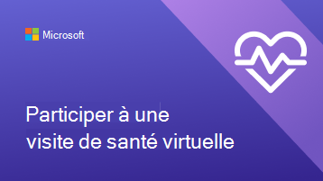
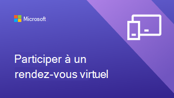

# Aider vos clients et clients à utiliser des rendez-vous virtuels planifiés avec Bookings

Maintenant que votre organisation a commencé à utiliser Microsoft Teams et l’application Bookings pour les rendez-vous virtuels, vous devez vous assurer que vos clients comprennent comment réserver ces rendez-vous et y participer.

Regardez cette vidéo pour obtenir une vue d’ensemble rapide de ce que les rendez-vous virtuels peuvent faire pour votre organisation.

> [!VIDEO https://www.microsoft.com/videoplayer/embed/RE4TQop]

## Éléments inclus dans ce kit de ressources

Ce kit de ressources est destiné à aider vos clients à participer à un rendez-vous virtuel. Vous pouvez personnaliser les ressources que nous fournissons et inclure des liens vers celles-ci dans vos communications sur les rendez-vous virtuels. Ce kit de ressources comprend les éléments suivants :

[Conseils pour votre site web](#guidance-for-your-website) :   FAQ sur les rendez-vous virtuels que vous pouvez personnaliser, puis héberger sur votre site web. Veillez à ajouter vos propres liens et toutes les informations supplémentaires dont vos clients ont besoin pour connaître vos stratégies.

[Ressources pour votre équipe](#resources-for-your-team) :   Articles et vidéos pour aider votre équipe à se familiariser avec la conduite de rendez-vous virtuels.

[Ressources pour vos clients](#resources-for-your-clients) :  
Lien vers le contenu du support technique de Microsoft, qui inclut une vidéo sur la participation à un rendez-vous virtuel. 
Infographies que vous pouvez personnaliser pour votre organisation.

## Conseils pour votre site web

Indiquez à vos clients à quoi s’attendre avec les rendez-vous virtuels en répondant aux questions courantes. Il vous suffit de modifier ces questions et réponses pour vous aligner sur vos stratégies de rendez-vous virtuels et de les coller sur votre site web.

### Informations de base sur les rendez-vous virtuels

**Qu’est-ce qu’un rendez-vous virtuel ?**

Un rendez-vous virtuel est un rendez-vous en ligne effectué sur Microsoft Teams. Vous parlerez en personne avec l’un de nos membres du personnel, comme vous le feriez pour une visite en personne.

**En quoi les rendez-vous virtuels diffèrent-ils des visites en personne ?**

Informez vos clients s’il existe des différences dans les services que vous fournissez virtuellement et en personne. Vous pouvez également décrire les différences de frais entre les rendez-vous virtuels et en personne.

**Comment se passe un rendez-vous virtuel ?**

Lorsque vous participez à partir du lien dans l’e-mail de confirmation, vous entrez dans une salle d’attente virtuelle. Une fois qu’un membre du personnel rejoint l’appel, vous entrez avec lui dans une salle virtuelle où aura lieu votre visite en face à face.

**Comment fonctionne le paiement des rendez-vous virtuels ?**

Informez vos clients si vous acceptez différents types de paiement pour les rendez-vous virtuels.

### Réservation d’un rendez-vous

**Comment prendre rendez-vous ?**

Lien vers la page de réservation de votre organisation. Indiquez à vos clients s’il existe d’autres façons de prendre des rendez-vous virtuels, par exemple par téléphone, par courrier électronique ou via les réseaux sociaux.

**Avec qui puis-je prendre rendez-vous ?**

Assurez-vous que vos clients peuvent maintenir des relations avec leurs fournisseurs préférés en partageant, le cas échéant, les membres du personnel qui travaillent exclusivement virtuellement ou en personne.

**Comment annuler ou replanifier un rendez-vous virtuel ?**

Vous pouvez créer un lien vers la stratégie d’annulation et de replanification de votre organisation ici, ou décrire les différences de stratégie entre les rendez-vous virtuels et en personne.

### Technologie

**De quel équipement ai-je besoin pour un rendez-vous virtuel ?**

Les clients peuvent rejoindre un rendez-vous virtuel à partir de n’importe quel navigateur web ou via l’application Microsoft Teams. Répertoriez ici si votre organisation a des spécifications supplémentaires, telles qu’une webcam ou un microphone de haute qualité. Si votre organisation de soins de santé dispose du dossier médical informatisé intégré dans Teams, les patients peuvent participer à des visites à partir de votre portail de santé.

**Comment rejoindre un rendez-vous virtuel ?**

Vous pouvez lier vos clients ici Participer à un rendez-vous Bookings en tant que participant (microsoft.com) pour leur montrer une vidéo détaillée et un processus pas à pas sur la façon de participer à un rendez-vous.

## Ressources pour votre équipe

Tirez le meilleur parti des rendez-vous virtuels en veillant à ce que les membres de votre personnel sachent comment les diriger. Vous pouvez partager ces articles et vidéos avec les membres de votre équipe pour les aider à mieux comprendre les rendez-vous virtuels.

- [Découvrez comment utiliser l’application Bookings dans Teams](https://support.microsoft.com/office/what-is-bookings-42d4e852-8e99-4d8f-9b70-d7fc93973cb5).
- [Découvrez comment participer à un rendez-vous Bookings](https://support.microsoft.com/office/join-a-bookings-appointment-attendees-3deb7bde-3ea3-4b41-8a06-741ad0db9fc0).
- [Menez un rendez-vous](bookings-virtual-visits.md#conduct-an-appointment).
- [Regardez une vidéo sur les rendez-vous virtuels](#help-your-clients-and-customers-use-virtual-appointments-scheduled-with-bookings).
- [Regardez une vidéo sur la gestion de la file d’attente dans les rendez-vous virtuels](https://go.microsoft.com/fwlink/?linkid=2202615).
- [Regardez une vidéo sur les fonctionnalités de salle d’attente dans les rendez-vous virtuels](https://go.microsoft.com/fwlink/?linkid=2202614).

## Ressources pour vos clients

Vous pouvez créer un lien vers cet article pour montrer à vos clients comment participer à des rendez-vous virtuels :  
[Découvrez comment rejoindre un rendez-vous virtuel](https://support.microsoft.com/office/join-a-bookings-appointment-as-an-attendee-95cea12d-2220-421f-a663-6efb20913c7f)

Téléchargez et [personnalisez](#customize-your-infographic) l’une de ces infographies sur votre site web. Elles offrent à vos clients un moyen rapide et visuellement attrayant de comprendre le fonctionnement des rendez-vous virtuels avec votre organisation.

| Graphique                | Description et liens              |
| :------------------- | -------------------: |
|  | Infographie personnalisable pour votre organisation de services financiers   [Télécharger au format PDF](//download.microsoft.com/download/8/5/7/85784cd8-6945-4fcc-a3c3-972bd88d3fef/VirtualVisit_Financial_Infographic.pdf)   [Télécharger en tant que PowerPoint](//download.microsoft.com/download/8/5/7/85784cd8-6945-4fcc-a3c3-972bd88d3fef/VirtualVisit_Financial_Infographic.pptx)
|  | Infographie personnalisable pour votre organisation de vente au détail   [Télécharger au format PDF](//download.microsoft.com/download/a/b/5/ab5c07d9-cf7a-47b3-ba54-05a8a0a2a1bd/VirtualVisit_Retail_Infographic.pdf)   [Télécharger en tant que PowerPoint](//download.microsoft.com/download/a/b/5/ab5c07d9-cf7a-47b3-ba54-05a8a0a2a1bd/VirtualVisit_Retail_Infographic.pptx) |
|  | Infographie personnalisable pour votre organisation de soins de santé   [Télécharger au format PDF](//download.microsoft.com/download/4/d/3/4d3d9c53-0304-4aea-a56a-60a16402c58f/VirtualVisit_Healthcare_Infographic.pdf)   [Télécharger en tant que PowerPoint](//download.microsoft.com/download/4/d/3/4d3d9c53-0304-4aea-a56a-60a16402c58f/VirtualVisit_Healthcare_Infographic.pptx) |
|  | Infographie personnalisable non spécifique à un secteur d’activité particulier   [Télécharger au format PDF](//download.microsoft.com/download/c/6/9/c69d3f29-a8f5-462b-a645-79119beab406/VirtualVisit_Generic_Infographic.pdf)   [Télécharger en tant que PowerPoint](//download.microsoft.com/download/c/6/9/c69d3f29-a8f5-462b-a645-79119beab406/VirtualVisit_Generic_Infographic.pptx) |

### Personnaliser votre infographie

1. Choisissez l’une des infographies prédéfinies en fonction des besoins de votre organisation :
    1. Santé
    2. Services financiers
    3. Commerce
    1. Tout secteur d’activité

2. Personnalisez l’infographie dans PowerPoint.
    1. Utilisez les couleurs et les polices préférées de votre organisation.
    2. Ajoutez le logo ou les images de marque de votre organisation.
    3. Lien vers des pages de votre site web, telles que votre page de réservation, les informations de facturation ou la page d’accueil.
    4. Ajoutez des informations supplémentaires que vos clients doivent connaître avant de participer à un rendez-vous virtuel.

3. Exportez votre infographie personnalisée au format PDF.
