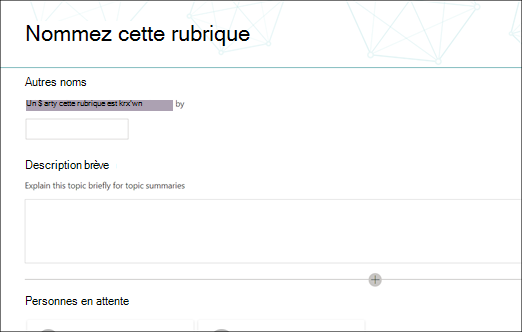
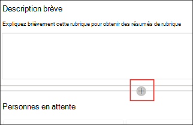

# Créer une rubrique (aperçu)

> [!Note] 
> Le contenu de cet article est pour la prévisualisation privée Project Private Preview. [En savoir plus sur le Projet cortex](https://aka.ms/projectcortex).

Dans Expériences des rubriques, vous pouvez créer une rubrique si une rubrique n’a pas été découverte via l’indexation ou si la technologie ia n’a pas trouvé suffisamment de preuves pour l’établir en tant que rubrique.

## Conditions requises

Pour créer une rubrique, vous devez :
- Avoir une licence Expériences de rubrique.
- Avoir des autorisations [**sur Qui peut créer ou modifier des rubriques**](https://docs.microsoft.com/microsoft-365/knowledge/topic-experiences-user-permissions). Les administrateurs du savoir peuvent accorder cette autorisation aux utilisateurs dans les paramètres d’autorisation de la rubrique Réseau de connaissances. 

> [!Note] 
> Les utilisateurs qui sont autorisés à gérer des rubriques dans le centre de rubriques (gestionnaires de connaissances) sont déjà autorisés à créer et modifier des rubriques.

## Pour créer une rubrique :

1. Dans la page Centre des rubriques, **sélectionnez Nouveau,** puis page **Rubrique.** Si vous n’êtes  pas en mesure de voir l’option Nouveau dans le Centre de rubriques, vous ne pouvez pas avoir les autorisations requises.

    

2. Dans la page nouvelle rubrique, vous pouvez remplir les informations sur le nouveau modèle de rubrique :

    - Dans la section **Nom de cette** rubrique, tapez le nom de la nouvelle rubrique.
    
    - Dans la section **Autres noms,** tapez des noms ou des acronymes qui sont également utilisés pour faire référence à la rubrique.
    
    - Dans la section **Description courte,** tapez une ou deux phrases de description de la rubrique. Ce texte sera utilisé pour la carte de sujet associée.
    
    - Dans la section **Personnes,** tapez les noms des experts techniques pour la rubrique. Les personnes que vous ajoutez manuellement à la rubrique s’affichent dans la page de rubrique en tant que **personnes épinglées.**
    
    - Dans la section Fichiers  **et pages,** sélectionnez Ajouter, puis sur la page suivante, vous pouvez sélectionner les fichiers OneDrive associés ou les pages SharePoint Online.
    
    - Dans la section **Sites,** sélectionnez **Ajouter.** Dans le  **volet Sites** qui s’affiche, sélectionnez les sites associés à la rubrique.

    
    
3. Si vous devez ajouter d’autres composants à la page, tels que du texte, des images, des composants Web Parts, des liens, etc., sélectionnez l’icône de zone de dessin au milieu de la page pour les localiser et les ajouter.

    

4. Lorsque vous avez terminé, **sélectionnez Publier** pour publier la page de rubrique. Les pages de rubrique publiées s’affichent dans **l’onglet Pages.**

Une fois que vous avez publié l’article, le nom de la rubrique, l’autre nom, la description et les personnes épinglées s’affichent à tous les utilisateurs sous licence qui affichent l’article. Les fichiers, les pages et les sites apparaîtront uniquement dans la page de rubrique si la visionneuse dispose des autorisations Office 365 sur l’élément. 

La nouvelle page de rubrique est composé de composants Web Parts qui sont sensibles *au réseau de connaissances.* Cela signifie qu’à mesure que l’IA collecte plus d’informations sur la rubrique, les informations de ces composants Web Parts seront mises à jour avec des suggestions pour rendre la page plus utile pour les utilisateurs.

## Voir aussi

  

