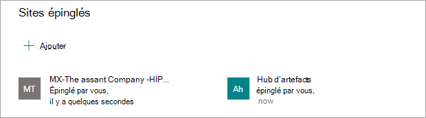
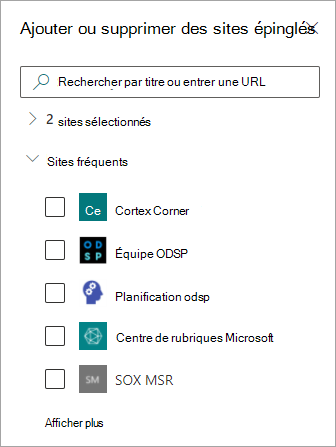
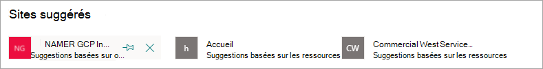

# Modifier une rubrique existante dans les rubriques microsoft 

 

> [!VIDEO https://www.microsoft.com/videoplayer/embed/RE4LA4n]  

 

Dans Rubriques de Rubriques, vous pouvez modifier une rubrique existante. Vous devrez peut-être le faire si vous souhaitez corriger ou ajouter des informations supplémentaires à une page de rubrique existante. 

> [!Note] 
> Alors que les informations d’une rubrique qui sont rassemblées par l’IA sont découpées en matière de [sécurité,](topic-experiences-security-trimming.md)la description de la rubrique et les informations de personnes que vous ajoutez manuellement lors de la modification d’une rubrique existante sont visibles pour tous les utilisateurs qui ont l’autorisation d’afficher les rubriques. 

## Conditions requises

Pour modifier une rubrique existante, vous devez :
- avoir une licence Rubriques Viva.
- Avoir des autorisations pour [créer ou modifier des rubriques.](./topic-experiences-user-permissions.md) Les administrateurs d'informations peuvent accorder cette autorisation aux utilisateurs dans les paramètres d'autorisation Rubriques Viva. 

> [!Note] 
> Les utilisateurs qui sont autorisés à gérer des rubriques dans le centre de rubriques (gestionnaires de connaissances) sont déjà autorisés à créer et modifier des rubriques.

## Comment modifier une page de rubrique

Les utilisateurs qui ont l’autorisation Qui peuvent créer ou modifier des *rubriques* en ouvrant une  page de rubrique à partir d’une rubrique mise en surbrillation, puis en sélectionnant le bouton Modifier en haut à droite de la page de rubrique. La page de rubrique peut également être ouverte à partir de la page d’accueil du centre de rubriques où vous pouvez trouver toutes les rubriques à laquelle vous êtes en relation.

      

Les gestionnaires de connaissances peuvent également modifier des rubriques directement à partir  de la page Gérer les **rubriques** en sélectionnant la rubrique, puis en sélectionnant Modifier dans la barre d’outils.

   

### Pour modifier une page de rubrique

1. Dans la page de rubrique, sélectionnez **Modifier.** Cela vous permet d’apporter des modifications à la page thématique si nécessaire.

     

2. Dans la section **Autres noms,** tapez les autres noms que la rubrique peut faire référence. 

    

3. Dans la section **Description** , tapez quelques phrases qui décrivent la rubrique. Si une description existe déjà, mettez-la à jour si nécessaire.

     

4. Dans la section **Contacts épinglés**, vous pouvez « épingler » une personne pour l’afficher comme ayant une connexion à la rubrique (par exemple, le propriétaire d’une ressource connectée). Commencez par taper son nom ou  son adresse de messagerie dans la zone Ajouter un nouvel utilisateur, puis sélectionnez l’utilisateur à ajouter dans les résultats de la recherche. Vous pouvez également les « désépiner » en sélectionnant l’icône Supprimer **de** la liste sur la carte utilisateur.
 
     

    La section **Contacts suggérés** montre les utilisateurs que l'IA pense être en rapport avec la rubrique à partir de leur connexion à des ressources sur la rubrique. Vous pouvez modifier leur état de Suggéré en Épinglé en sélectionnant l’icône en forme d’épingle sur la carte utilisateur.

   

5. Dans la section **Fichiers et pages épinglés**, vous pouvez ajouter ou « épingler » un fichier ou une page de site SharePoint associé à la rubrique.

   
 
    Pour ajouter un nouveau fichier, sélectionnez Ajouter, sélectionnez le site SharePoint à partir de vos sites fréquents ou suivis, puis sélectionnez le fichier dans la bibliothèque de documents du site.

    Vous pouvez également utiliser l'option **À partir d'un lien** pour ajouter un fichier ou une page en fournissant l'URL. 

   > [!Note] 
   > Les fichiers et les pages que vous ajoutez doivent se trouver dans le même Microsoft 365 client. Si vous souhaitez ajouter un lien vers une ressource externe dans la rubrique, vous pouvez l’ajouter via l’icône de zone de dessin à l’étape 9.

6. La section **Fichiers suggérés et pages** affiche les fichiers et les pages que l’IA suggère d’associer à la rubrique.

   

    Vous pouvez modifier un fichier ou une page suggérés en fichier ou page épinglé en sélectionnant l’icône épinglée.

7.  Dans la section **Sites épinglés,** vous pouvez ajouter ou « épingler » un site associé à la rubrique. 

    

    Pour ajouter un nouveau  site, sélectionnez Ajouter, puis recherchez le site, ou sélectionnez-le dans votre liste de sites fréquents ou récents.
    
    

8. La section **Sites suggérés** présente les sites que l’IA suggère d’associer à la rubrique. 

     

    Vous pouvez modifier un site suggéré en site épinglé en sélectionnant l’icône épinglée.

<!---

7.  The <b>Related sites</b> section shows sites that have information about the topic. 

     

    You can add a related site by selecting <b>Add</b> and then either searching for the site, or selecting it from your list of Frequent or Recent sites. 
    
     

8. The <b>Related topics</b> section shows connections that exists between topics. You can add a connection to a different topic by selecting the <b>Connect to a related topic</b> button, and then typing the name of the related topic, and selecting it from the search results. 

      

    You can then give a description of how the topics are related, and select <b>Update</b>. 

     

   The related topic you added will display as a connected topic.

     

   To remove a related topic, select the topic you want to remove, then select the <b>Remove topic</b> icon. 
 
      

   Then select <b>Remove</b>. 

     

--->

9. Vous pouvez également ajouter des éléments statiques à la page (tels que du texte, des images ou des liens) en sélectionnant l’icône de la zone de dessin, que vous trouverez sous la courte description. Si vous la sélectionnez, SharePoint boîte à outils dans laquelle vous pouvez choisir l’élément que vous souhaitez ajouter à la page.

   

10. Sélectionnez **Publier** ou **Republier** pour enregistrer vos modifications. **La publication sera** votre option disponible si la rubrique a été publiée précédemment.

