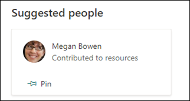

# Modifier une rubrique existante 

 

> [!VIDEO https://www.microsoft.com/videoplayer/embed/RE4LA4n]  

 

Dans Rubriques de Rubriques, vous pouvez modifier une rubrique existante. Vous devrez peut-être le faire si vous souhaitez corriger ou ajouter des informations supplémentaires à une page de rubriques existante. 

> [!Note] 
> Bien que les informations d’une rubrique recueillies par l’IA sont découpées en matière de [sécurité,](topic-experiences-security-trimming.md)notez que les informations que vous ajoutez manuellement lors de la modification d’une rubrique existante sont visibles pour tous les utilisateurs qui ont l’autorisation d’afficher des rubriques. 

## Configuration requise

Pour modifier une rubrique existante, vous devez :
- Vous avez une licence Topics.
- Avoir des autorisations [**sur Qui peut créer ou modifier des rubriques**](https://docs.microsoft.com/microsoft-365/knowledge/topic-experiences-user-permissions). Les administrateurs du savoir peuvent accorder cette autorisation aux utilisateurs dans les paramètres d’autorisations de la rubrique Rubriques. 

> [!Note] 
> Les utilisateurs qui sont autorisés à gérer des rubriques dans le centre de rubriques (gestionnaires de connaissances) sont déjà autorisés à créer et modifier des rubriques.

## Comment modifier une page de rubrique

Les utilisateurs qui ont l’autorisation Qui peut créer ou modifier des **rubriques** peuvent modifier <b></b> une rubrique en ouvrant la page de rubrique à partir d’une rubrique mise en surbrillation, puis en sélectionnant le bouton Modifier en haut à droite de la page de rubrique. La page de rubrique peut également être ouverte à partir de la page d’accueil du centre de rubriques où vous pouvez trouver toutes les rubriques à laquelle vous êtes en relation.

      

Les gestionnaires de connaissances peuvent également modifier des rubriques directement à partir <b></b> de la page Gérer les rubriques en sélectionnant la rubrique, puis en sélectionnant Modifier dans la barre d’outils.

      

### Pour modifier une page de rubrique

1. Dans la page de rubrique, sélectionnez **Modifier.** Cela vous permet d’apporter les modifications nécessaires à la page de rubrique.

       

2. Dans la section <b>Autres noms,</b> tapez tous les autres noms que la rubrique peut faire référence. 

       
3. Dans la section <b>Description,</b> tapez quelques phrases qui décrivent la rubrique. Ou si une description existe déjà, mettez-la à jour si nécessaire.

     

4. Dans la section <b>Personnes épinglées,</b> vous pouvez « épingler » une personne pour l’afficher en tant qu’expert en la matière. Commencez par taper son nom ou <b></b> son adresse de messagerie dans la zone Ajouter un nouvel utilisateur, puis sélectionnez l’utilisateur à ajouter dans les résultats de la recherche. Vous pouvez également les « désépiner » en sélectionnant l’icône Supprimer <b>de</b> la liste sur la carte utilisateur.
 
     

    La section <b>Personnes suggérées</b> montre aux utilisateurs que l’IA pense qu’il peut s’agit d’experts techniques sur cette rubrique, de leur connexion aux ressources sur cette rubrique. Vous pouvez modifier son état de Suggéré à Épinglé en sélectionnant l’icône d’épinglage sur la carte utilisateur.

    

5. Dans la section Des fichiers <b>et des pages</b> épinglés, vous pouvez ajouter ou « épingler » un fichier ou une page de site SharePoint associé à la rubrique.

    
 
    Pour ajouter un nouveau fichier, sélectionnez <b>Ajouter,</b>sélectionnez le site SharePoint à partir de vos sites fréquents ou suivis, puis sélectionnez le fichier dans la bibliothèque de documents du site.

    Vous pouvez également utiliser l’option De <b>un</b> lien pour ajouter un fichier ou une page en fournissant l’URL. 

6. La section <b>Fichiers suggérés et pages</b> affiche les fichiers et les pages que l’IA suggère d’associer à la rubrique.

    

    Vous pouvez faire un fichier ou une page suggéré à un fichier ou une page épinglé en sélectionnant l’icône épinglée.

7.  La section <b>Sites associés</b> présente les sites qui ont des informations sur la rubrique. 

     

    Vous pouvez ajouter un site <b></b> associé en sélectionnant Ajouter, puis en recherchant le site ou en le sélectionnant dans votre liste de sites fréquents ou récents. 
    
     

8. La <b>section Rubriques connexes</b> présente les connexions qui existent entre les rubriques. Vous pouvez ajouter une connexion à une <b></b> autre rubrique en sélectionnant le bouton Se connecter à une rubrique associée, puis en tapant le nom de la rubrique associée et en la sélectionnant dans les résultats de la recherche. 

      

    Vous pouvez ensuite donner une description de la façon dont les rubriques sont liées, puis sélectionner <b>Mettre à jour.</b> 

     

   La rubrique connexe que vous avez ajoutée s’affichera en tant que rubrique connectée.

     

9. Vous pouvez également ajouter des éléments statiques à la page, tels que du texte, des images ou des liens, en sélectionnant l’icône de zone de dessin, que vous trouverez sous la brève description. Sa sélection ouvre la boîte à outils SharePoint à partir de laquelle vous pouvez choisir l’élément que vous souhaitez ajouter à la page.

     

10. Sélectionnez **Publier** **ou Republier** pour enregistrer vos modifications. **La publication sera** votre option disponible si la rubrique a été publiée précédemment.

## Voir aussi

  

