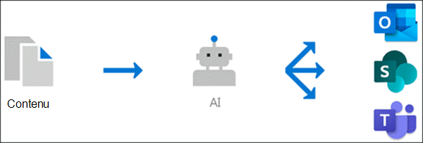

# Vue d’ensemble de la gestion des connaissances (aperçu)

> [!Note] 
> Le contenu de cet article est destiné à Project cortex privé preview. [En savoir plus sur le Projet cortex](https://aka.ms/projectcortex).

Knowledge Management utilise la technologie Microsoft AI, Microsoft 365, Delve, Search, ainsi que d’autres composants et services pour créer un réseau de connaissances dans votre environnement Microsoft 365. 

      

L’objectif est de fournir des informations aux utilisateurs dans les applications qu’ils utilisent quotidiennement, telles qu’Outlook, teams et SharePoint.

Par exemple, les utilisateurs voient des termes inconnus dans leurs courriers électroniques, leurs sites SharePoint ou dans les conversations Teams, pour lesquelles ils souhaitent en savoir plus. Knowledge Management utilise AI pour rechercher et identifier automatiquement ces **rubriques** , ainsi que pour compiler des informations les concernant, telles qu’une brève description, des experts techniques sur le sujet, ainsi que des sites, des fichiers et des pages qui y sont associés. Vous pouvez choisir de mettre à jour les informations de la rubrique selon vos besoins. Vous pouvez ensuite mettre les rubriques à la disposition des utilisateurs, ce qui signifie que, pour chaque instance de la rubrique qui apparaît dans les applications telles qu’Outlook, teams et SharePoint, le texte est mis en surbrillance. Les utilisateurs peuvent choisir la rubrique pour en savoir plus à ce sujet dans la rubrique Détails.

## Indexation des rubriques

Knowledge Management utilise la technologie Microsoft AI pour identifier les **rubriques** de votre environnement Office 365.

Une rubrique est une expression ou un terme qui est significatif ou important au sein de l’organisation. Il a une signification spécifique pour l’organisation et a des ressources qui lui sont associées, qui peuvent aider les utilisateurs à comprendre ce qu’ils sont et à trouver plus d’informations à leur sujet.

Lorsqu’une rubrique est identifiée, une **page de rubrique** est créée pour celle-ci qui contient des informations collectées par le biais de l’indexation des rubriques, telles que :

- Autres noms et/ou acronymes.
- Brève description de la rubrique.
- Utilisateurs pouvant être informé de la rubrique.
- Fichiers, pages et sites associés à la rubrique.

## Découverte de rubrique
Lorsqu’une rubrique est mentionnée dans contenu sur les actualités et pages SharePoint, elle apparaît en surbrillance. Ouvrez le résumé de la rubrique à partir de la mise en surbrillance. Ouvrez les détails de la rubrique à partir du titre du résumé. <!--(msg for Efren: not sure if I should use discovery for this; we use discovered in-product for indexing?)--> La rubrique mentionnée peut être identifiée automatiquement ou avoir été ajoutée à la page à l’aide d’une référence directe à la rubrique par l’auteur de la page.

Vous pouvez également découvrir des rubriques via Microsoft Search.

## Gestion des rubriques

La gestion des rubriques est réalisée dans le **Centre** de la rubrique de votre organisation. Le site Centre de rubrique est créé lors de l’installation et sert de centre de connaissances pour votre organisation. Elle contient une liste de toutes les rubriques découvertes dans votre environnement, ainsi que toutes les pages de rubrique créées pour ces rubriques. 

Les utilisateurs qui disposent des autorisations appropriées peuvent effectuer les opérations suivantes dans le centre de la rubrique :

- Confirmez ou rejetez des rubriques qui ont été découvertes dans votre client.
- Créez de nouvelles rubriques manuellement en fonction de vos besoins (par exemple, si vous n’avez pas suffisamment d’informations pour qu’elles soient découvertes via AI).
- Modifier des pages de rubrique existantes. 

Pour plus d’informations, voir [travailler avec une rubrique dans le Centre des rubriques](work-with-topics.md) .  

## Contrôles d’administration

Les contrôles d’administration dans le centre d’administration Microsoft 365 vous permettent de gérer votre réseau de connaissances. Ils permettent à un administrateur global ou SharePoint de Microsoft 365 de :

- Contrôlez les utilisateurs de votre organisation autorisés à voir les rubriques dans leurs applications clientes ou dans les résultats de la recherche SharePoint.
- Contrôlez les sites SharePoint qui seront analysés pour rechercher des rubriques.
- Configurez la découverte de rubrique pour exclure des termes spécifiques qui ne doivent pas être une rubrique.
- Contrôlez les utilisateurs qui peuvent confirmer ou rejeter des rubriques dans le centre de la rubrique.
- Contrôler les utilisateurs qui peuvent créer et modifier des rubriques dans le Centre des rubriques.

Pour plus d’informations, consultez [la rubrique gérer votre réseau de connaissances](manage-knowledge-network.md) . 

## & des commentaires sur les de la rubrique

AI continue de fournir des suggestions pour améliorer vos rubriques lorsque des modifications sont apportées dans votre environnement.

Les utilisateurs qui autorisent l’accès à consulter les rubriques de leur travail quotidien sont autorisés à formuler des suggestions pour les améliorer. Par exemple, si un utilisateur consulte la page de rubrique et qu’il voit des informations incorrectes ou devant être ajoutées, un lien sur la page de rubrique leur permet de modifier directement les informations. Un autre exemple, si un utilisateur affiche une mise en surbrillance sur une page d’actualités SharePoint, vous trouverez des questions qui vous demanderont si la mise en surbrillance est appropriée ou si la rubrique suggérée est appropriée pour votre organisation. Votre réponse vous aidera à déterminer ce qui est affiché sur les résumés des rubriques et dans les détails de la rubrique.

En outre, les utilisateurs disposant des autorisations appropriées peuvent baliser des éléments tels que la conversation Yammer qui concernent une rubrique, et les ajouter à une rubrique spécifique. <!--(msg for Efren: changed to Yammer, because we will not have shipped Teams yet)-->

## Voir aussi
[Configurer la gestion des connaissances](set-up-knowledge-network.md) 
[Présentation du centre de rubriques](topic-center-overview.md)
