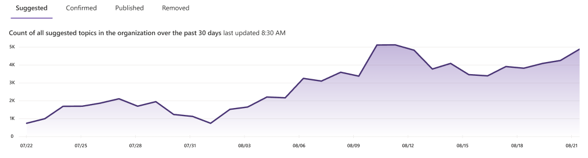

# Gérer les rubriques dans le centre de rubriques Sujets Microsoft Viva

 

> [!VIDEO https://www.microsoft.com/videoplayer/embed/RE4LxDx]  

 

Dans le centre de rubriques Rubriques, un gestionnaire de connaissances peut afficher la page Gérer les rubriques pour passer en revue les **rubriques** qui ont été identifiées aux emplacements source comme spécifié par votre administrateur de connaissances.  

     

## Étapes du sujet

Les gestionnaires de connaissances vous aident à guider les rubriques découvertes à travers les différentes étapes du cycle de vie des rubriques : **Suggéré,** **Confirmé,** Publié **et** **Supprimé.**

    

- **Suggérée** : une rubrique a été identifiée par l’IA et dispose de ressources de prise en charge, de connexions et de propriétés suffisantes. (Ils sont marqués comme **sujet suggéré dans** l’interface utilisateur.)

- **Confirmé :** rubrique qui a été découverte par l’IA et qui a été validée. La validation de rubrique se produit dans les cas suivants :

   - Un gestionnaire de connaissances confirme une rubrique. Un gestionnaire de [connaissances confirme une rubrique dans](manage-topics.md#confirmed-topics) la page Gérer les **rubriques.**

   - Plusieurs utilisateurs confirment une rubrique. Il doit y avoir un net de deux votes positifs reçus des utilisateurs qui ont voter à l’aide du mécanisme de commentaires sur la carte de sujet. Par exemple, si un utilisateur a exprimé un vote positif et un utilisateur a exprimé un vote négatif pour une rubrique particulière, vous aurez toujours besoin de deux autres votes positifs pour que la rubrique soit confirmée.
 
- **Publié**: une rubrique qui a été organisée. Des modifications manuelles ont été réalisées pour améliorer sa qualité ou ont été créées par un utilisateur.

- **Supprimé :** sujet qui a été rejeté et qui n’est plus visible pour les visiteurs. Une rubrique peut être supprimée dans n’importe quel état (suggéré, confirmé ou publié). La suppression d’un sujet se produit dans les cas suivants :

   - Un gestionnaire de connaissances supprime une rubrique. Un gestionnaire de connaissances supprime une rubrique dans la page **Gérer les rubriques.**

   - Plusieurs utilisateurs ont exprimé des votes négatifs à l’aide du mécanisme de commentaires sur la carte de sujet. Pour qu’une rubrique soit supprimée, il doit y avoir un net de deux votes négatifs reçus des utilisateurs. Par exemple, si un utilisateur a exprimé un vote négatif et un utilisateur a exprimé un vote positif pour une rubrique particulière, vous aurez besoin de deux autres votes négatifs pour que la rubrique soit supprimée.

  Lorsqu’une rubrique publiée est supprimée, la page avec les détails organisés doit être supprimée manuellement via la bibliothèque de pages du centre de rubriques.

> [!Note] 
> Dans la page Gérer **les rubriques,** chaque gestionnaire de connaissances pourra uniquement consulter les rubriques dans laquelle il a accès aux fichiers et pages sous-jacents connectés à la rubrique. Ce suppression d’autorisation sera reflété dans la liste des rubriques qui apparaissent  dans les onglets **Suggéré,** **Confirmé,** Publié et Supprimé. Le nombre de rubriques, toutefois, indique le nombre total dans l’organisation, quelles que soient les autorisations.

## Configuration requise

Pour gérer des rubriques dans le centre de rubriques, vous devez :
- avoir une licence Rubriques Viva.

- Avoir la Qui [**pouvez gérer les autorisations des rubriques.**](./topic-experiences-user-permissions.md) Les administrateurs d'informations peuvent accorder cette autorisation aux utilisateurs dans les paramètres d'autorisation Rubriques Viva. 

Vous ne pourrez pas afficher la page Gérer les rubriques dans le centre de **rubriques,** sauf si vous avez la Qui pouvez gérer **les rubriques.**

Dans le centre de rubriques, un gestionnaire de connaissances peut consulter les rubriques qui ont été identifiées aux emplacements sources que vous avez spécifiés, et peut les confirmer ou les supprimer. Un gestionnaire de connaissances peut également créer et publier de nouvelles pages de rubriques si aucune page n’a été trouvée dans la découverte de rubrique, ou modifier des pages existantes si elles doivent être mises à jour.

## Rubriques suggérées

Dans la page Gérer **les rubriques,** les rubriques qui ont été découvertes dans SharePoint emplacements sources spécifiés sont répertoriées sous **l’onglet Suggestions.** Si nécessaire, un gestionnaire de connaissances peut consulter des rubriques non confirmées et choisir de les confirmer ou de les supprimer.

    

Pour consulter une rubrique suggérée :

1. Dans la page Gérer les  **rubriques,** sélectionnez l’onglet Suggestions, puis sélectionnez la rubrique pour ouvrir la page de rubrique.

2. Dans la page de rubrique, examinez la page de rubrique, puis sélectionnez **Modifier** si vous devez apporter des modifications à la page. La publication de toutes les modifications déplace cette rubrique vers **l’onglet** Publié.

3. Après avoir passé en revue la rubrique, revenir à la page **Gérer les rubriques.** Pour la rubrique sélectionnée, vous pouvez :

   - Cochez la coche pour confirmer la rubrique.
    
   - Sélectionnez **le x** si vous souhaitez supprimer la rubrique.

    Les rubriques confirmées sont supprimées de la liste **Suggérée** et s’affichent désormais dans **la liste** confirmée.

    Les rubriques supprimées sont supprimées de la liste **Suggérée** et s’affichent désormais dans **l’onglet** Supprimé.

### Score de qualité

Un score de qualité est attribué à chaque rubrique qui apparaît dans la page **Rubriques** suggérées. Le score de qualité reflète la quantité d’informations que l’utilisateur moyen verra pour les informations sur le sujet, en gardant à l’esprit que chaque utilisateur peut voir plus ou moins d’informations en raison des autorisations qu’il peut ou non avoir sur les informations d’une rubrique. 

Le score de qualité peut aider à donner un aperçu des rubriques les plus pertinentes et peut être utile pour trouver des rubriques qui peuvent avoir besoin d’être modifiées manuellement. Par exemple, une rubrique avec un score de qualité inférieur peut être le résultat de l’SharePoint des utilisateurs sur les fichiers ou sites pertinents que l’IA a inclus dans la rubrique. Un collaborateur peut alors modifier la rubrique afin d’nclure les informations (le cas échéant), lesquelles seront ensuite consultables par tous les utilisateurs qui peuvent consulter la rubrique.

### Impressions

La **colonne Impressions** affiche le nombre de fois qu’une rubrique a été présentée aux utilisateurs finaux. Cela inclut les affichages par le biais de cartes de réponses de rubrique dans la recherche et par le biais des points forts de la rubrique. Il ne reflète pas le clic sur ces rubriques, mais le fait que la rubrique a été affichée. La **colonne Impressions** s’affiche pour les rubriques des  onglets **Suggéré,** **Confirmé,** Publié et Supprimé sur la page **Gérer les rubriques.**

## Rubriques confirmées.

Dans la page Gérer les **rubriques,** les rubriques qui ont été découvertes dans les emplacements sources de votre SharePoint spécifié et qui ont été confirmées par un gestionnaire de connaissances ou «  en nombre » confirmées par une ou plusieurs personnes (équilibrage des votes d’utilisateur négatifs par rapport aux votes d’utilisateur positifs) via le mécanisme de commentaires de carte sont répertoriées dans l’onglet Confirmé. Si nécessaire, un utilisateur autorisé à gérer des rubriques peut passer en revue les rubriques confirmées et choisir de les rejeter.

Pour passer en revue une rubrique confirmée :

1. Sous l’onglet **Confirmé**, sélectionnez la rubrique pour ouvrir la page thématique.

2. Dans la page de rubrique, examinez la page de rubrique, puis sélectionnez **Modifier** si vous devez apporter des modifications à la page.

Notez que vous pouvez toujours choisir de rejeter une rubrique confirmée. Pour ce faire, sélectionnez la  rubrique sélectionnée sous l’onglet Confirmé, puis sélectionnez **le x** si vous souhaitez rejeter la rubrique.

## Rubriques publiées

Dans la page Gérer **les rubriques,** les rubriques qui ont été découvertes dans votre SharePoint sources spécifiées sont répertoriées sous l’onglet Publié.  Les rubriques publiées ont été modifiées afin que des informations spécifiques apparaissent toujours aux personnes qui rencontrent la page. Les rubriques créées manuellement sont également répertoriées ici.

   

## Rubriques supprimées

Dans la page Gérer **les rubriques,** les rubriques qui ont été découvertes dans SharePoint emplacements sources spécifiés sont répertoriées sous **l’onglet** Supprimé. Certaines rubriques suggérées peuvent apparaître ici en fonction des votes des utilisateurs finaux sur les cartes de sujet dans le centre de rubriques.

Les rubriques supprimées peuvent être ajoutées ultérieurement en tant que rubriques consultables si nécessaire. Si vous souhaitez rajouter une rubrique supprimée en tant que rubrique consultable :

1. Sous **l’onglet Supprimé,** sélectionnez la rubrique.

2. Sélectionnez **Réviser et publier.**

   

## Tableau de bord nombre de rubriques

Ce graphique dans l’affichage Tableau de bord vous permet de voir le nombre de rubriques dans votre centre de rubriques Rubriques. Le graphique présente le nombre de rubriques par étape du cycle de vie des rubriques et indique également la tendance des nombres de rubriques au fil du temps. Les gestionnaires de connaissances peuvent surveiller visuellement la fréquence à laquelle les nouvelles rubriques sont découvertes par l’IA et la fréquence à laquelle les rubriques sont confirmées ou publiées par le gestionnaire de connaissances ou les actions de l’utilisateur.

Les gestionnaires de connaissances peuvent voir un nombre différent de rubriques représentées dans la liste des rubriques de la page Gérer les **rubriques** qu’ils ne voient dans le tableau de bord. Cela est dû au fait qu’un gestionnaire de connaissances n’a peut-être pas accès à toutes les rubriques. Le nombre présenté dans l’affichage tableau de bord est pris avant d’appliquer le contrôle d’autorisation. 

   
