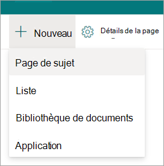
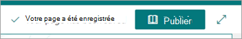
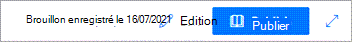

# Enregistrer une rubrique en tant que brouillon dans Sujets Microsoft Viva

Vous pouvez enregistrer en tant que brouillon une nouvelle rubrique ou une rubrique révisée sur qui vous travaillez, mais vous n’êtes pas encore prêt à publier.

## Enregistrer une nouvelle rubrique en tant que brouillon

1. Dans le centre de rubriques, **sélectionnez Page**  >  **Nouvelle rubrique.**
 
   

2. Lorsque vous modifiez la nouvelle rubrique, un brouillon est automatiquement enregistré.
  
   

3. Lorsque vous avez terminé vos modifications actuelles, mais que vous n’êtes pas prêt à publier, sélectionnez Enregistrer en tant que brouillon **pour** enregistrer vos modifications. Votre public ne verra pas les modifications sur la page tant que vous ne l’avez pas publiée. Seules les personnes autorisées à modifier des rubriques pourront voir le brouillon. 

   

4. Sélectionnez **Enregistrer** pour enregistrer vos modifications. Une fois que vous avez publié la page, le nom de la rubrique, la description de l’autre nom et les personnes épinglées s’affichent aux utilisateurs qui peuvent consulter la rubrique. Des fichiers, des pages et des sites spécifiques apparaissent uniquement sur la page de rubrique, si la visionneuse dispose d’autorisations sur la rubrique.
 
## Enregistrer une rubrique révisée en tant que brouillon

1. Ouvrez une page de rubrique pour la modifier.

2. Lorsque vous modifiez la page de rubrique, un brouillon est automatiquement enregistré.
  
   

3. Lorsque vous avez terminé vos modifications actuelles, mais que  vous n’êtes pas prêt à la publier, sélectionnez Enregistrer en tant que brouillon pour enregistrer vos modifications et fermer le mode d’édition.

   

4. Lorsque vous êtes prêt pour que les utilisateurs voient vos modifications, vous verrez un bouton Publier ou **Republier.**  

    - **La** publication est disponible lorsque le contenu de la rubrique a uniquement été découvert par l’IA et que vous êtes en train de le modifier pour la première fois. Lorsque vous publiez, les modifications que vous avez faites au nom de la rubrique, à l’autre nom, à la description ou aux personnes épinglées s’affichent pour les utilisateurs qui peuvent consulter la rubrique. Des fichiers, des pages, des sites, des noms de remplacement découverts par l’IA et des personnes spécifiques resteront visibles uniquement pour les utilisateurs qui disposent d’autorisations sur ces ressources.

    - **Republier signifie** que vous modifiez une rubrique publiée précédemment.
 
## Cycle de vie d’une page brouillon
 
1. Lorsque vous enregistrez une rubrique en tant que brouillon et fermez la page, la rubrique est cochée en tant que version mineure et devient un brouillon « partagé ». Cela signifie que toute personne ayant des autorisations de modification (ou les propriétaires de site) peut désormais voir le brouillon et le modifier.

2. Les brouillons sont automatiquement enregistrés lors de la modification.

3.  Toute personne ayant des autorisations de modification (ou les propriétaires de site) est directement prise en charge dans le brouillon enregistré lorsqu’elle ouvre la page de rubrique qui est dans un état brouillon. Un message s’affiche pour vous indiquer qu’il s’agit d’une page provisoire et que le dernier brouillon a été enregistré.
  
    

4.  Après avoir fermé le mode Édition, vous pouvez revenir aux brouillons en revenir à la page de rubrique :
    - Pour les utilisateurs :
         - À partir de la section **Rubriques confirmées** sur le site Web Rubriques
         - En recherchant une rubrique et en l’ouvrant à partir de la réponse à la rubrique

    - Pour les gestionnaires de connaissances :
         - À partir de la page **Gérer les rubriques**
         - Dans la bibliothèque Pages de sites
         - À partir d’un lien direct vers la page de rubrique
 
## Modification d’une personne à la fois

Deux personnes ne peuvent pas modifier la même page en même temps, qu’il s’agit d’un brouillon ou non. Si une personne a une page ouverte pour modification et qu’une autre personne tente de la modifier, un message indique que la page est modifiée par une autre personne.
  
   
 
Vous pouvez demander à la personne dont la page est ouverte d’être modifiée pour « publier » la page en l’enregistrer et la fermer, en rejetant les modifications ou en la publiant. Toutefois, si la page n’a aucune activité pendant 5 minutes, la session de modification s’approche automatiquement et la page est « déverrouillée », sauf si quelqu’un ferme le navigateur dans un délai de 5 minutes.

