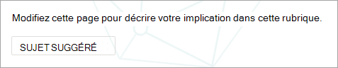
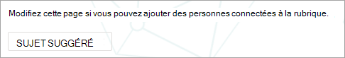

# Gérer les rubriques à grande échelle dans Sujets Microsoft Viva

Lorsque vous indexez vos sites SharePoint sites web ou toute votre organisation pour Les Rubriques, de nombreuses rubriques peuvent être générées. Lorsque cela se produit et que vous voyez des milliers de rubriques suggérées sur la page Gérer les **rubriques,** il peut être difficile de savoir par où commencer. Cet article explique comment Topics vous aide à optimiser les rubriques et les informations qui sont présentées aux utilisateurs qui recherchent des informations, même dans les grandes organisations avec un grand nombre de rubriques.

Tout d’abord, un rappel des [quatre étapes pour les rubriques](manage-topics.md#topic-stages):

- **Suggérée** : une rubrique a été identifiée par l’IA et dispose de ressources de prise en charge, de connexions et de propriétés suffisantes. (Ils sont marqués comme **sujet suggéré dans** l’interface utilisateur.)

- **Confirmé :** rubrique qui a été découverte par l’IA et qui a été validée. La validation de rubrique se produit dans les cas suivants :

   - Un gestionnaire de connaissances confirme une rubrique. Un gestionnaire de [connaissances confirme une rubrique dans](manage-topics.md#confirmed-topics) la page Gérer les **rubriques.**

   - Plusieurs utilisateurs confirment une rubrique. Il doit y avoir un net de deux votes positifs reçus des utilisateurs qui ont voter à l’aide du mécanisme de commentaires sur la carte de sujet. Par exemple, si un utilisateur a exprimé un vote positif et un utilisateur a exprimé un vote négatif pour une rubrique particulière, vous aurez toujours besoin de deux autres votes positifs pour que la rubrique soit confirmée.
 
- **Publié**: une rubrique qui a été organisée. Des modifications manuelles ont été réalisées pour améliorer sa qualité ou ont été créées par un utilisateur.

- **Supprimé :** sujet qui a été rejeté et qui n’est plus visible pour les visiteurs. Une rubrique peut être supprimée dans n’importe quel état (suggéré, confirmé ou publié). La suppression d’un sujet se produit dans les cas suivants :

   - Un gestionnaire de connaissances supprime une rubrique. Un gestionnaire de connaissances supprime une rubrique dans la page **Gérer les rubriques.**

   - Plusieurs utilisateurs ont exprimé des votes négatifs à l’aide du mécanisme de commentaires sur la carte de sujet. Pour qu’une rubrique soit supprimée, il doit y avoir un net de deux votes négatifs reçus des utilisateurs. Par exemple, si un utilisateur a exprimé un vote négatif et un utilisateur a exprimé un vote positif pour une rubrique particulière, vous aurez besoin de deux autres votes négatifs pour que la rubrique soit supprimée.

  Lorsqu’une rubrique publiée est supprimée, la page avec les détails organisés doit être supprimée manuellement via la bibliothèque de pages du centre de rubriques.

## Rôle du gestionnaire de connaissances 

Lorsque vous configurez Topics, vous ajoutez un groupe d’utilisateurs qui se voient accorder des autorisations pour voir la page Gérer les rubriques dans le centre de **rubriques.** Elle s’affiche uniquement pour ces utilisateurs qui détiennent le rôle de curation principale pour les rubriques. Ils auront accès aux données sur les rubriques et pourront voir les listes de toutes les rubriques dont ils ont accès pour passer en revue et organiser.

Les employés de ce rôle doivent avoir de larges autorisations pour afficher un large éventail de rubriques. Ou si les autorisations sont segmentées, vous pouvez sélectionner un groupe d’utilisateurs qui représentent différents secteurs de l’entreprise et qui peuvent s’organiser pour leurs propres domaines.

Lorsque vous examinez pour la première fois des rubriques dans le centre de rubriques, les rubriques suggérées sont purement définies par l’IA. Les gestionnaires de connaissances peuvent passer en revue chacun d’eux avant de déployer Topics dans une large communauté d’utilisateurs. Lorsque vous travaillez à grande échelle, cette approche est rarement pratique en raison des milliers de rubriques.

L’approche recommandée consiste à trouver un équilibre entre les rubriques les plus pertinentes ou les plus importantes pour votre ensemble initial d’utilisateurs et à vous concentrer sur la curation de ces rubriques avant le déploiement de Rubriques. Commencez à recueillir les commentaires des utilisateurs et autorisez les utilisateurs à déterminer les modèles d’utilisation et de contribution de vos utilisateurs pour informer les stratégies suggérées dans cet article.

Il est important de reconnaître que le système identifiera et affichera les rubriques publiées suggérées par l’IA et organisées par l’utilisateur à tous les utilisateurs. Toutefois, cela ne signifie pas que chaque rubrique suggérée s’affiche pour tous les utilisateurs finaux. Les paramètres de sécurité en place afficheront uniquement les rubriques accessibles à chaque employé en fonction des autorisations définies sur le contenu lui-même.

En tant que gestionnaire de connaissances ayant les autorisations d’afficher la page Gérer les **rubriques,** vous pouvez voir un plus grand nombre de rubriques répertoriées en raison de vos propres autorisations élevées, en fonction de votre rôle dans l’organisation et du niveau d’accès. Vous aurez également accès à des affichages qui vous permettent de voir les rubriques répertoriées dans un seul emplacement au lieu d’y accéder à l’aide de surlaux ou de recherche.

En outre, il y a probablement un plus petit pourcentage de rubriques qui seront visibles par la plupart des utilisateurs et un plus grand nombre de rubriques qui seront visibles beaucoup moins fréquemment en raison des autorisations. Par conséquent, il est bon de concentrer d’abord les tâches de curation sur les sujets les plus importants pour votre organisation et ceux qui sont les plus susceptibles d’être vus plus largement.

Cet article décrit quelques stratégies de curation. Ces stratégies peuvent signifier que les rubriques moins fréquentes ou moins courantes peuvent ne pas être entièrement organisées par les gestionnaires de connaissances. Toutefois, ces rubriques suggérées restent utiles et peuvent fournir des informations ou un pointeur vers une personne, ce qui permet à un employé de gagner des heures à chercher un point de départ. Il est utile d’autoriser les mises à jour de rubriques en nombre de rubriques et de fournir davantage de contenu et de couverture pour les rubriques moins courantes.

Cet article fournit des conseils et des meilleures pratiques pour aborder la gestion et la curation des sujets.

## Comprendre les rubriques suggérées

Lorsque des rubriques sont découvertes par l’IA, elles sont marquées comme sujet **suggéré,** à la fois dans la page Gérer les rubriques et dans les fiches de rubrique présentées aux **utilisateurs.** Toute rubrique qui n’a pas été marquée comme supprimée s’affiche pour les utilisateurs , y compris les rubriques confirmées, publiées et suggérées. Les rubriques des trois états sont disponibles pour les utilisateurs finaux.

Dans une carte ou une page de rubrique, nous utilisons différents signaux pour montrer comment l’IA a généré les informations. Le système utilise diverses preuves pour ajouter les ressources, principalement par le biais du contenu lui-même.

- Les étiquettes indiquent qu’une rubrique est suggérée et qu’elle a été découverte par Topics.  

   

- Les informations sur la carte indiquent d’où vient une définition en spécifiant sa source.

- Les personnes suggérées sont dérivées en agrégeant les personnes qui ont écrit ou modifié des documents avec des preuves de sujet. Si une personne écrit un document dont le titre contient un nom de sujet et que ce document possède de nombreux affichages, un seul document peut être nécessaire pour établir la personne comme étant liée. Toutefois, dans de nombreux cas, il est préférable d’avoir plus de preuves et les personnes répertoriées ont travaillé sur plusieurs documents.  

   

- Pour les fichiers et les pages affichés, le système identifie le nombre de fois que la rubrique a été mentionnée dans le document, mais la rubrique doit également être mentionnée dans un contexte spécifique qui identifie la référence à la rubrique de type spécifique (par exemple, projet ou équipe). C’est ce qui compte comme preuve pour l’IA. Le système considère également l’occurrence d’un nom de rubrique dans les titres des documents, les types de documents et d’autres fonctionnalités d’analyse (telles que les affichages).

   

   

   

Ces attributs montrent que le contenu a été ajouté par l’IA et comment l’IA a effectué cette détermination.

### Communication

Lorsque vous communiquez à vos utilisateurs à propos de Rubriques Sous, il est important de clarifier la différence entre les rubriques suggérées par l’IA et le contenu et leurs équivalents organisés.

En tant que lecteur, vous devez afficher les rubriques suggérées avec un œil plus critique. Elles ne doivent pas être perçues comme des sources faisant autorité de la réalité organisationnelle. Au lieu de cela, il s’agit d’un outil de recherche permettant d’accéder à la connaissance d’ensemble qui est présentée par le biais du contenu que vous avez accès. L’IA a découvert la rubrique et dispose de suffisamment de preuves pour vous le montrer, mais sa valeur n’a pas été confirmée par une personne.

### Contrôles de masse

Les rubriques suggérées peuvent être améliorées par la curation de la page et par le biais de commentaires sur cette rubrique.

Lorsque les utilisateurs interagissent avec une rubrique suggérée, ils peuvent se voir poser une question simple dans l’interface utilisateur. Par exemple : *cette rubrique était-elle pertinente pour la page ?* *Cette personne est-elle pertinente pour la rubrique ?* *Cette définition a-t-elle été exacte ?* En utilisant les commentaires à ces questions, la précision des rubriques peut augmenter sans qu’une personne nommée ne soit nécessaire pour organiser la page.

La page d’accueil d’un centre de rubriques est un autre emplacement où les commentaires sur les sujets suggérés sont collectés. Dans le centre de rubriques, un utilisateur peut voir les rubriques qui lui ont été associées et avoir la possibilité de confirmer cette association ou de la supprimer.

   

Lorsque vous autorisez un large éventail de rubriques, vous devez prendre en compte les facteurs suivants :

-   Les utilisateurs **voient l’option** Modifier sur les pages de rubrique et peuvent modifier les pages dans la même expérience que les autres pages SharePoint modernes.

-   Certains **composants** Web Parts de rubrique suggérée ne peuvent pas être supprimés. Le nom de la rubrique, les autres noms, la définition, les personnes suggérées et les ressources suggérées ne peuvent pas être supprimés.

-   La publication d’une rubrique suggérée ou confirmée vers la liste  Publiée de la page Gérer **les rubriques** peut prendre un certain temps.

    -   La durée d’apparition estimée d’une rubrique dans la recherche, les surlaux, les hashtags ou les annotations est de 2 heures.

    -   Le temps estimé pour qu’une rubrique apparaisse dans la liste Publiée sur la page **Rubriques gérées** n’est pas supérieur à 24 heures dans la plupart des cas.  Vous devriez les voir dans les 2 heures, mais comme il y a une synchronisation complète toutes les 24 heures, l’attente ne doit pas être plus longue que 24 heures.

-   Il est possible qu’un utilisateur laisse une rubrique publiée dans un état extrait ou de modification. Un gestionnaire de connaissances peut les voir dans la bibliothèque de pages du centre de rubriques et peut ignorer les modifications apportées par l’utilisateur pour republier la rubrique ou contacter cet utilisateur pour lui demander d’archiver la rubrique.

### La visibilité et le contenu des rubriques sont basés sur les autorisations d’un utilisateur

Lorsque vous examinez la liste des rubriques suggérées en tant que gestionnaire de connaissances, n’oubliez pas que le contenu d’une rubrique suggérée sera dynamiquement basé sur les autorisations. Le contenu suggéré et les personnes qui vous sont présentées peuvent ne pas être identiques à ceux présentés à un utilisateur ou à un autre gestionnaire de connaissances.

En fonction des autorisations d’affichage du contenu associé à une rubrique, chaque utilisateur peut voir un ensemble différent de ressources suggérées, de personnes, d’autres noms et de définition.

## Hiérarchiser les rubriques pour la curation

Vous pouvez utiliser les stratégies suivantes pour identifier les sujets qui sont susceptibles d’être importants et qui sont donc de bons candidats à la curation. 

### Taxonomies

L’utilisation de taxonomies existantes peut fournir une liste de rubriques susceptibles d’être importantes pour les utilisateurs. Par exemple, il peut s’y avoir les éléments ci-après :

-   Produits et services que votre organisation fournit

-   Teams dans votre organisation

-   Projets à haut niveau de profil

Cette approche peut également être prise à un niveau de service ou fonctionnel, avec des experts techniques qui comprennent ce domaine de votre organisation. L’objectif n’est pas qu’ils examinent une sélection ou toutes les rubriques. Au lieu de cela, ils apportent leur propre expertise de domaine pour guider la curation sélective.

### Rechercher

Les termes de recherche courants sont souvent découverts en tant que rubriques. En utilisant les [principaux rapports de](/sharepoint/view-search-usage-reports)requête dans Recherche Microsoft , vous pouvez identifier les termes de recherche les plus fréquents dans votre organisation. Si des rubriques ont été découvertes pour ces termes, elles sont de bons candidats pour la curation. Ces rubriques peuvent être présentées en tant que cartes de réponse Recherche Microsoft.

Si vous utilisez actuellement des [signets Recherche Microsoft,](/microsoftsearch/manage-bookmarks)pensez à savoir lequel d’entre eux peut être remplacé par une rubrique. Une carte de réponse de signet contient un titre, une description et une URL. Dans certains cas, une carte de sujet peut être plus utile pour un utilisateur et une carte de sujet affiche également des ressources et des personnes.

Dans l’expérience de recherche de l’utilisateur, lorsqu’un utilisateur recherche un terme tel qu’un *voyage,* les résultats de la recherche sont affichés dans l’ordre de priorité suivant dans Recherche Microsoft :

1.  Rubriques publiées ou confirmées

2.  Signets

3.  Rubriques suggérées

### Impressions et score de qualité

Le [nombre d’impressions](manage-topics.md#impressions) et [le score de qualité](manage-topics.md#quality-score) sont des mesures importantes pour comprendre le comportement d’un sujet. La valeur de ces mesures sera limitée lorsque seuls les responsables de connaissances ou les équipes de l’information ont accès à des rubriques. L’exposition de rubriques à un groupe pilote d’utilisateurs génère des données plus représentatives pour ces mesures.

Les rubriques avec un nombre d’impressions élevé sont susceptibles d’être plus fréquemment interagies. Le score de qualité de ces rubriques donne une idée de la richesse de ces rubriques. Les rubriques avec un nombre d’impressions élevé et un score de qualité faible sont de bonnes cibles pour la curation.

### Termes clés de l’architecture des informations des sites d’organisation de grande taille

Des sites portail plus importants au sein de votre organisation ont peut-être investi du temps dans l’organisation de leur architecture des informations et la navigation de leur site autour de sujets clés pour leurs unités d’entreprise, leurs gammes de produits, leurs projets majeurs, etc. L’examen de ces termes et l’identification et la organisation des rubriques de ces termes peuvent aider les utilisateurs qui recherchent des informations sur ces domaines.

### Tirer parti des bases de connaissances internes ou des sites Wiki

Si votre organisation a investi dans des bases de connaissances ou des sites Wiki, celles-ci peuvent fournir une liste de rubriques à utiliser pour vos efforts de curation initiaux. S’ils sont particulièrement grands, sélectionnez les rubriques les plus vues ou modifiées comme point de départ.

## Voir aussi

[Gérer les sujets dans le centre de rubriques](manage-topics.md)

[Vue d’ensemble du centre thématique](topic-center-overview.md)
