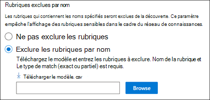
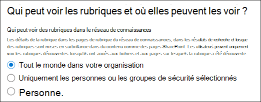
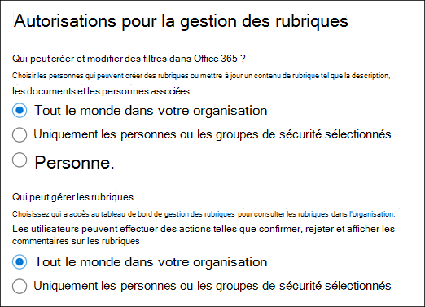
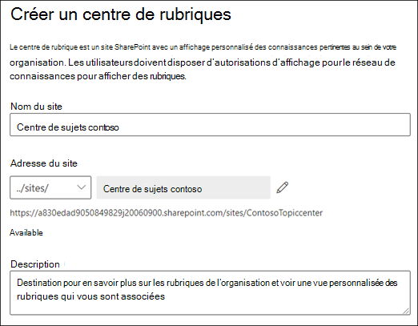
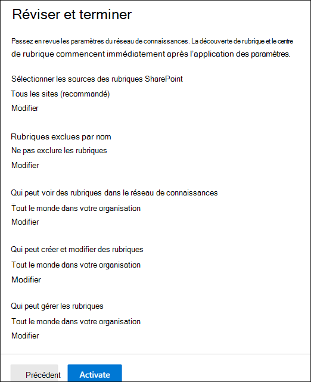

# Configurer la gestion des connaissances (aperçu)

> [!Note] 
> Le contenu de cet article est destiné à Project cortex privé preview. Pour [plus d’informations sur le projet cortex](https://aka.ms/projectcortex).

Vous pouvez utiliser le centre d’administration Microsoft 365 pour installer et configurer la [gestion des connaissances](knowledge-management-overview.md). 

> [!Important]
> Il est important de planifier la meilleure façon de configurer et de configurer la gestion des connaissances dans votre environnement. Par exemple, vous devez prendre en compte les éléments suivants :
- Les sites SharePoint que vous souhaitez analyser pour les rubriques.
- Les utilisateurs auxquels vous souhaitez faire apparaître les rubriques.
- Les utilisateurs auxquels vous souhaitez accorder des autorisations pour gérer les rubriques dans le Centre des rubriques.
- Les utilisateurs auxquels vous souhaitez accorder des autorisations pour créer ou modifier des rubriques dans le Centre des rubriques.
- Le nom que vous souhaitez donner à votre centre de sujets.

> [!Note]
> Il peut s’avérer utile de créer des groupes de sécurité pour attribuer aux utilisateurs les autorisations nécessaires pour afficher des rubriques, gérer des rubriques et créer et modifier des rubriques.

Un administrateur peut également [modifier les paramètres sélectionnés à tout moment après l’installation](manage-knowledge-network.md) via les paramètres de gestion des connaissances dans le centre d’administration 365 de Microsoft.

## Configuration requise 
Vous devez disposer d’autorisations d’administrateur général ou d’administrateur SharePoint pour pouvoir accéder au centre d’administration Microsoft 365 et configurer des tâches de connaissances organisationnelles.

## Configurer votre réseau de connaissances

La configuration de votre réseau de connaissances vous guide tout au long des étapes suivantes :

- Découverte de rubrique : sélection des sources de rubrique et des rubriques à exclure de la découverte.
- Visibilité de rubrique : sélection des personnes qui peuvent afficher les rubriques sous forme de mises en surbrillance dans les pages de recherche et de rubrique.
- Autorisations de rubrique : sélection des personnes qui peuvent créer, modifier et gérer des rubriques.
- Centre des rubriques : créez votre centre de rubriques.
- Révision : Vérifiez et appliquez vos paramètres.

Pour configurer votre réseau de connaissances :

1. Dans le centre d’administration 365 de Microsoft (admin.microsoft.com), sélectionnez **configuration**, puis affichez la section connaissances de l' **organisation** .
2. Dans la section connaissances de l' **organisation** , cliquez sur **connecter les personnes aux connaissances**. 

      

3. Sur la page **connecter des personnes au** niveau de connaissances, cliquez sur **prise en main** pour vous guider tout au long du processus de configuration. 

      

4. Sur la page **choisir comment le réseau de connaissances peut trouver des rubriques** , vous allez configurer la découverte de rubrique. Dans la section **Sélectionner les sources des rubriques SharePoint** , sélectionnez les sites SharePoint qui seront analysés en tant que sources pour vos rubriques lors de la découverte. Cela inclut les opérations suivantes : 
    a. **Tous les sites**: tous les sites SharePoint de votre client. Ceci capture les sites actuels et futurs. 
    b. **Tout, à l’exception des sites sélectionnés**: saisissez les noms des sites à exclure.  Vous pouvez également télécharger une liste de sites que vous souhaitez exclure de la découverte. Les sites créés à l’avenir seront inclus en tant que sources pour la découverte des rubriques.  
    c. **Sites sélectionnés uniquement**: saisissez les noms des sites que vous souhaitez inclure. Vous pouvez également télécharger une liste de sites. Les sites créés à l’avenir ne seront pas inclus en tant que sources pour la découverte des rubriques.  

      
   
5. Dans la section **exclure des rubriques par nom** , vous pouvez choisir d’inclure les noms des rubriques dont vous ne voulez pas dans les résultats découverts. Utilisez ce paramètre pour empêcher les rubriques sensibles d’être incluses dans le cadre du réseau de connaissances. Vos options sont les suivantes : 
    a. **Ne pas exclure les rubriques**  
    b. **Exclure les rubriques par nom**: Si vous avez des rubriques que vous ne voulez pas afficher aux utilisateurs dans le cadre du réseau de connaissances. 

      

    #### Procédure exclure des rubriques par nom    

    Si vous devez exclure des rubriques, après avoir sélectionné **exclure les rubriques par nom**, sélectionnez **Télécharger le modèle. csv**. Utilisez Excel. Modèle CSV pour inclure une liste des rubriques que vous souhaitez exclure de vos résultats de découverte.

      

    Dans le modèle CSV, entrez les informations suivantes sur les rubriques à exclure :

    - **Nom**: tapez le nom de la rubrique à exclure. Vous pouvez procéder de deux manières : 
        - Correspondance exacte : vous pouvez inclure le nom exact ou un acronyme (par exemple, *contoso* ou *ATL*). 
        - Correspondance partielle : vous pouvez exclure toutes les rubriques qui contiennent un mot spécifique.  Par exemple, *arc* exclut toutes les rubriques contenant le mot *arc* , comme un *cercle arc*, un *soudage*à l’arc de plasma ou un *arc de formation*. Notez qu’il n’exclura pas les rubriques dans lesquelles le texte est inclus dans un mot, tel que *architecture*. 
    - **Expansion (facultatif)**: Si vous souhaitez exclure un acronyme, tapez les mots de l’acronyme. 
    - **MatchType-exacte/partielle**: spécifiez si le nom que vous avez entré est un type de correspondance *exacte* ou *partielle* . 

    Une fois que vous avez terminé et enregistré votre fichier de modèle CSV, sélectionnez **Parcourir** pour le localiser et le sélectionner.
    
    Sélectionnez **Suivant**. 

6. Sur la page **qui peut voir les rubriques et où elles peuvent les afficher** , vous allez configurer la visibilité des rubriques. Dans le paramètre **qui peut voir les rubriques du paramètre de réseau de connaissances** , vous choisissez les utilisateurs qui auront accès aux détails de la rubrique, comme les rubriques en surbrillance, les fiches de rubrique, les réponses aux questions dans la recherche et les pages de rubrique. Vous pouvez sélectionner : 
    a. **Tout le monde dans votre organisation** 
    b. **Uniquement les personnes ou les groupes de sécurité sélectionnés** 
    c. **Personne** 

       

 > [!Note] 
 > Bien que ce paramètre vous permette de sélectionner un utilisateur au sein de votre organisation, seuls les utilisateurs qui disposent de licences de gestion des connaissances qui lui sont attribués pourront consulter les rubriques. 

7. Dans la page **autorisations pour la rubrique gestion des** rubriques, choisissez qui pourra créer, modifier ou gérer des rubriques. Dans la section **qui peut créer et modifier des rubriques** , vous pouvez sélectionner : 
    a. **Tout le monde dans votre organisation** 
    b. **Uniquement les personnes ou les groupes de sécurité sélectionnés** 
8. Dans la section **qui peut gérer les rubriques** , vous pouvez sélectionner : 
    a. **Tout le monde dans votre organisation** 
    b. **Personnes ou groupes de sécurité sélectionnés** 

      

    Sélectionnez **Suivant**. 
9. Sur la page **créer un centre de rubriques** , vous pouvez créer votre site Centre de rubrique dans lequel les pages de rubrique peuvent être affichées et les rubriques peuvent être gérées.  Dans la zone **nom du centre** de la rubrique, tapez un nom pour le centre de la rubrique. Vous pouvez éventuellement taper une brève description dans la zone **Description du site** .  

Sélectionnez **Suivant**. 

      

10. Sur la page **révision et fin** , vous pouvez examiner le paramètre que vous avez sélectionné et choisir d’effectuer des modifications. Si vos sélections vous conviennent, sélectionnez **activer**.

       

11. La page **activation du réseau de connaissances** s’affiche, confirmant que le système commence à analyser les sites sélectionnés pour les rubriques et la création du site Centre de connaissances. Sélectionnez **Terminé**. 

       

12. Vous serez redirigé vers la page **connecter des personnes à la page de connaissances** . À partir de cette page, vous pouvez sélectionner **gérer** pour modifier vos paramètres de configuration. 

         

> [!Note]
> Après l’installation, un administrateur peut [modifier les paramètres de gestion des connaissances sélectionnés](manage-knowledge-network.md) à tout moment en retournant sur cette page.

## Voir aussi

  

