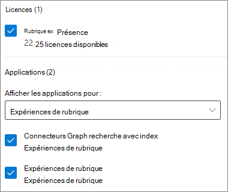
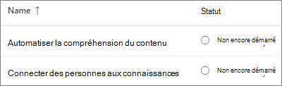
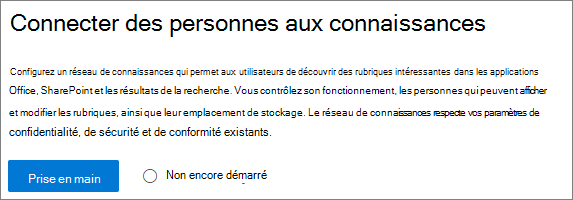
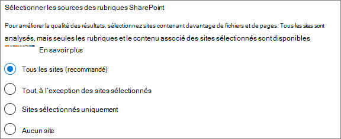
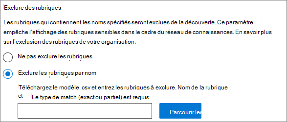
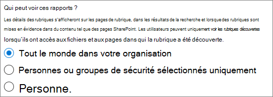
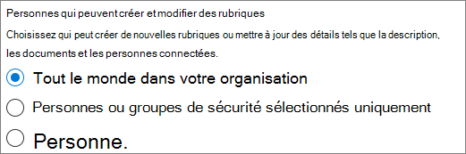
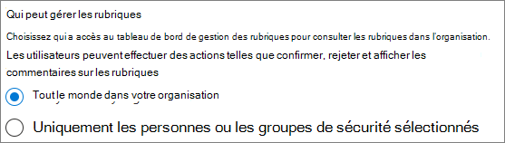
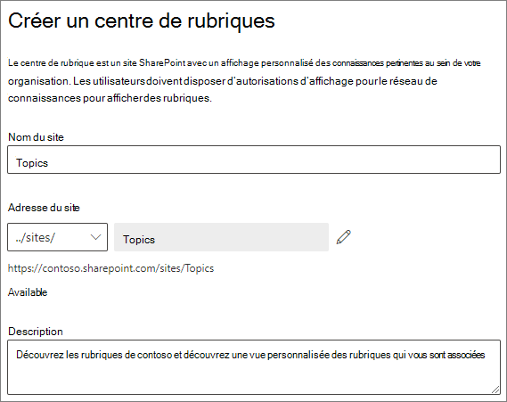
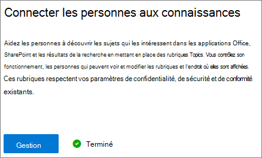

# Configurer Sujets Microsoft Viva

Vous pouvez utiliser la Centre d'administration Microsoft 365 pour configurer des [rubriques.](topic-experiences-overview.md) 

Il est important de planifier la meilleure façon de configurer des rubriques dans votre environnement. Veillez à lire [La Sujets Microsoft Viva](plan-topic-experiences.md) avant de commencer les procédures de cet article.

Vous devez être [abonné à Rubriques Et](https://www.microsoft.com/microsoft-viva/topics) être administrateur général ou administrateur SharePoint pour accéder à la Centre d'administration Microsoft 365 et configurer Rubriques.

> [!IMPORTANT]
> Si vous avez configuré SharePoint [pour](/sharepoint/control-access-from-unmanaged-devices)exiger des appareils gérés, vous devez configurer Rubriques à partir d’un appareil géré.

## Démonstration vidéo

Cette vidéo montre le processus de configuration des rubriques dans Microsoft 365.

 

> [!VIDEO https://www.microsoft.com/videoplayer/embed/RE4Li0E]  

 

## Attribuer des licences

Vous devez attribuer des licences pour les utilisateurs qui utiliseront Rubriques. Seuls les utilisateurs disposant d’une licence peuvent voir des informations sur les sujets, notamment les points forts, les cartes de rubriques, les pages de rubriques et le centre thématique. 

Pour attribuer des licences :

1. Dans le Centre d’administration Microsoft 365, sous **Utilisateurs**, cliquez sur **Utilisateurs actifs**.

2. Sélectionnez les utilisateurs que vous souhaitez obtenir une licence, puis cliquez **sur Licences et applications.**

3. Sous **Licences,** **sélectionnez Rubriques Titre.**

4. Sous **Applications,** assurez-vous **que Graph connectors search with Index (Topics)** et **Topics Topics sont** tous deux sélectionnés.

   > [!div class="mx-imgBorder"]
   > 

5. Cliquez sur **Enregistrer les modifications**.

Une fois les licences attribuées, l’accès aux rubriques peut prendre jusqu’à une heure.

## Configurer les rubriques

> [!Note]
> La première fois que la découverte de rubrique est activée, l’affichage De toutes les rubriques suggérées dans l’affichage Gérer les rubriques peut prendre jusqu’à deux semaines. La découverte de rubriques se poursuit au cours de la mise à jour ou de la mise à jour du contenu. Il est normal d’avoir des fluctuations dans le nombre de rubriques suggérées dans votre organisation, car les Rubriques Viva évaluent de nouvelles informations.

Pour configurer des rubriques
1. Dans la [Centre d'administration Microsoft 365,](https://admin.microsoft.com)sélectionnez **Installation,** puis affichez la section **Fichiers et** contenu.
2. Dans la section **Fichiers et contenu,** cliquez **Connecter personnes à connaître.**

     

3. Dans la page **Connecter personnes à la** connaissance, cliquez sur **Commencer** pour vous aider dans le processus de configuration.

     

4. Dans la page Choisir la façon dont Topics peut trouver des **rubriques,** vous allez configurer la découverte de rubriques. Dans la section **Sélectionner SharePoint sources** de rubriques, sélectionnez les sites SharePoint à analyser en tant que sources pour vos rubriques lors de la découverte. Choisissez parmi les autorisations suivantes :
    - **Tous les sites** : tous les sites SharePoint dans votre organisation. Cela inclut les sites actuels et futurs.
    - **Tous, sauf les sites sélectionnés**: tapez les noms des sites que vous souhaitez exclure.  Vous pouvez également charger une liste de sites que vous souhaitez refuser de découvrir. Les sites créés à l’avenir seront inclus en tant que sources pour la découverte de rubriques. 
    - **Seuls les sites** sélectionnés : tapez les noms des sites que vous souhaitez inclure. Vous pouvez également charger une liste de sites. Les sites créés dans le futur ne seront pas inclus comme sources pour la découverte de rubriques.
    - **Aucun site** : n’incluez aucun site SharePoint.

     
   
5. Dans la section **Exclure les rubriques par** nom, vous pouvez ajouter des noms de rubriques que vous souhaitez exclure de la découverte de rubriques. Utilisez ce paramètre pour empêcher que des informations sensibles ne figurent dans les rubriques. Les options disponibles sont les suivantes :
    - **N’excluez aucune rubrique** 
    - **Exclure les rubriques par nom**

     

    (Les gestionnaires de connaissances peuvent également exclure des rubriques dans le centre de rubriques après la découverte.)

    #### Comment exclure des rubriques par nom    

    Si vous devez exclure des rubriques, après avoir sélectionné Exclure les **rubriques** par nom, téléchargez le modèle .csv et mettez-le à jour avec la liste des rubriques que vous souhaitez exclure de vos résultats de découverte.

     

    Dans le modèle CSV, entrez les informations suivantes sur les rubriques à exclure :

    - **Nom** : tapez le nom de la rubrique à exclure. Il existe deux méthodes pour y parvenir :
        - Correspondance exacte : vous pouvez inclure le nom exact ou l’acronyme (par exemple, *Contoso* ou *ATL*).
        - Correspondance partielle : vous pouvez exclure toutes les rubriques qui ont un mot spécifique.  Par exemple, *arc exclura* toutes les rubriques avec le mot *arc* dans celui-ci, telles que le cercle *d’arc,* *l’arc de Pierre ou* *l’arc de formation*. Notez qu’il n’exclura pas les rubriques dans lesquelles le texte est inclus dans le cadre d’un mot, comme *Architecture*.
    - **Signifie (facultatif)**: si vous souhaitez exclure un acronyme, tapez les mots qu’il signifie.
    - **MatchType-Exact/Partial**: tapez si le nom que vous avez entré était un type de correspondance *exact* *ou* partiel.

    Une fois que vous avez terminé et enregistré votre fichier .csv, sélectionnez **Parcourir** pour le localiser et le sélectionner.
    
    Sélectionnez **Suivant**.

6. Sur la Qui pouvez voir les **rubriques** et où peuvent-elles les voir, vous allez configurer la visibilité des rubriques. Dans la Qui pouvez voir les paramètres des **rubriques,** vous choisissez les personnes qui auront accès aux détails des rubriques, telles que les rubriques mises en évidence, les fiches de rubrique, les réponses aux rubriques dans la recherche et les pages de rubriques. Vous pouvez sélectionner:
    - **Tous les membres de mon organisation**
    - **Personnes ou groupes de sécurité sélectionnés uniquement**
    - **Personne**

      

    > [!Note] 
    > Bien que ce paramètre vous permet de sélectionner n’importe quel utilisateur de votre organisation, seuls les utilisateurs qui ont des licences Expériences des rubriques qui leur sont attribuées pourront afficher les rubriques.

7. Dans la page **Autorisations pour la** gestion des rubriques, vous choisissez qui sera en mesure de créer, modifier ou gérer des rubriques. Dans la **section Qui créer et modifier des rubriques,** vous pouvez sélectionner :
    - **Tous les membres de mon organisation**
    - **Personnes ou groupes de sécurité sélectionnés uniquement**
    - **Personne**

     

8. Dans la **section Qui pouvez gérer les rubriques,** vous pouvez sélectionner :
    - **Tous les membres de mon organisation**
    - **Personnes ou groupes de sécurité sélectionnés uniquement**

     

    Sélectionnez **Suivant**.

9. Dans la page **Créer un** centre de rubriques, vous pouvez créer votre site de centre de rubriques dans lequel les pages de rubriques peuvent être vues et les rubriques peuvent être gérées. Dans la **zone Nom du site,** tapez un nom pour votre centre de rubriques. Vous pouvez cliquer sur l’icône de crayon si vous souhaitez modifier l’URL. Vous pourz éventuellement taper une brève description dans la **zone Description.** 

   > [!Important]
   > Vous pouvez modifier le nom du site ultérieurement, mais vous ne pouvez pas modifier l’URL une fois l’Assistant terminé.

   Sélectionnez **Suivant**.

     

10. À la page **Examiner et finaliser**, vous pouvez consulter le paramètre sélectionné, puis choisir d’apporter des modifications. Si vos sélections vous conviennent, sélectionnez **Activer**.

11. La page **Rubriques** activée s’affiche, confirmant que le système va maintenant commencer à analyser les sites sélectionnés pour les rubriques et à créer le site centre de rubriques. Sélectionnez **Terminé**.

12. Vous serez renvoyé à votre page de **Connecter de** connaissances. Dans cette page, vous pouvez sélectionner **Gérer** pour modifier vos paramètres de configuration. 

        

## Gérer les expériences de rubrique

Une fois que vous avez configuré Rubriques, vous pouvez modifier les paramètres que vous avez choisis lors de l’installation dans le [Centre d'administration Microsoft 365](https://admin.microsoft.com/AdminPortal#/featureexplorer/csi/KnowledgeManagement). Si vous souhaitez en savoir plus, veuillez consulter les références suivantes :

- [Gérer la découverte de rubriques dans Sujets Microsoft Viva](topic-experiences-discovery.md)
- [Gérer la visibilité des rubriques dans Sujets Microsoft Viva](topic-experiences-knowledge-rules.md)
- [Gérer les autorisations de rubrique dans Sujets Microsoft Viva](topic-experiences-user-permissions.md)
- [Modifier le nom du centre de rubriques dans Sujets Microsoft Viva](topic-experiences-administration.md)

## Voir aussi

[Vue d’ensemble des expériences de rubrique](topic-experiences-overview.md)
