# Utilisez SharePoint termes de taxonomie pour créer des rubriques dans Sujets Microsoft Viva

> [!Note] 
> Cette fonctionnalité est actuellement disponible uniquement pour les participants qui participent au programme Utilisateur précoce. Cette fonctionnalité sera disponible pour les utilisateurs du monde entier à une date ultérieure.

Vous pouvez utiliser SharePoint termes de taxonomie pour guider l’intelligence artificielle (IA) afin de créer des rubriques dans Rubriques. Le service SharePoint de taxonomie fournit des termes globaux qui sont disponibles pour tous les sites. Les utilisateurs peuvent créer des rubriques qui correspondent aux concepts représentés en tant que termes. 

Vous devez avoir des autorisations de modification sur les termes globaux que vous souhaitez utiliser pour effectuer ces tâches.

<!---
> [!Note]
> This feature is available only for users who are licensed for Viva Topics.
--->

## Fonctionnement

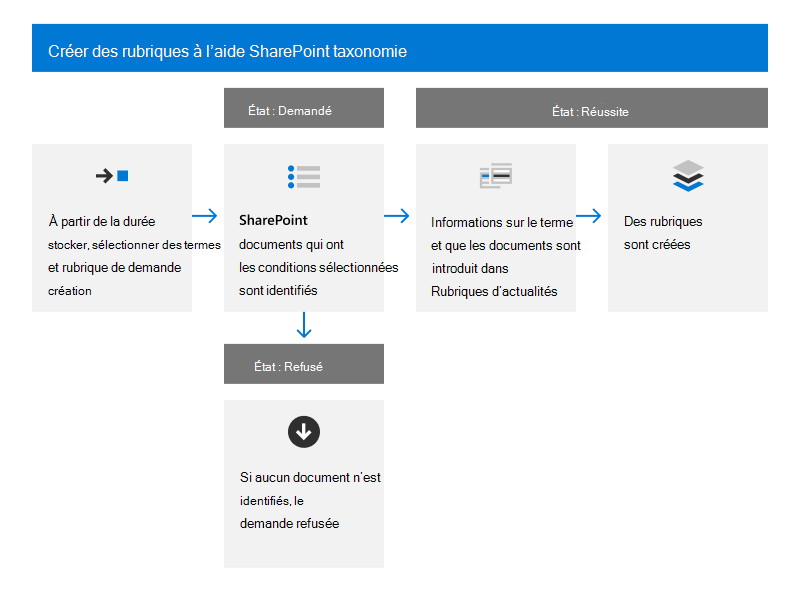

Lorsqu’une personne demande la création d’une rubrique à partir d’un terme, le service de taxonomie relaie des informations sur le terme à Rubriques Question pour la création d’une rubrique correspondante. Ces informations sont les suivantes :

- Nom (étiquette par défaut)
- Synonymes
- Description
- Fichiers marqués avec le terme

La rubrique créée utilise le nom d’origine du terme, considère que les synonymes sont les autres noms de la rubrique et utilise la description du terme pour la description de la rubrique. Les fichiers marqués avec le terme de taxonomie sont considérés comme des fichiers « suggérés » dans la rubrique. L’IA continue ensuite de découvrir du contenu supplémentaire pour la rubrique.

> [!Note]
> Pour que la création de rubrique aboutie, le terme de taxonomie doit avoir au moins un fichier marqué avec lui. Si ce n’est pas le cas, le système refuse la demande.

Une fois qu’une rubrique est créée à partir d’un terme, le terme continue d’exister dans le magasin de termes SharePoint et n’est pas affecté par la création de rubrique. Vous pourrez continuer à l’utiliser dans des listes SharePoint bibliothèques.

Si un terme est supprimé, la suppression ne supprime pas automatiquement la rubrique. Si Topics identifie le contenu lié à la rubrique qui n’est pas uniquement issu du terme et de son contenu balisé, la rubrique continue d’exister.

Si l’étiquette ou la description par défaut d’un terme change, Topics évalue les modifications et met à jour les informations de la rubrique si elle détermine que la modification est appropriée. Le contenu marqué avec le terme est également transmis périodiquement à Rubriques. S’il n’y a plus de contenu marqué avec le terme et si Topics n’a identifié aucun autre contenu associé à la rubrique, la rubrique peut être supprimée.

Les mises à jour de la rubrique n’affectent pas le terme d’origine.

## Lancer une demande de création de rubrique

Vous pouvez demander un ou plusieurs termes dans un ensemble de termes. Vous lancez la demande de création de rubrique dans le magasin de termes SharePoint moderne. Les utilisateurs qui peuvent modifier l’ensemble de termes sont autorisés à lancer la demande. Ces utilisateurs incluent les administrateurs de magasin de termes, les responsables de groupes et les collaborateurs.

### Demander un terme unique

1. Dans le SharePoint d’administration, dans le navigation de gauche, sélectionnez **Magasin de termes.**

    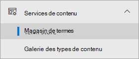 

2. Dans la page **Magasin de** termes, recherchez et sélectionnez le terme que vous souhaitez utiliser.

    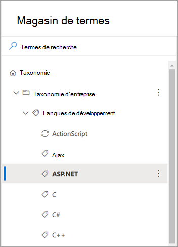

3. Dans la page de termes, sélectionnez **l’onglet Paramètres d’utilisation.**

    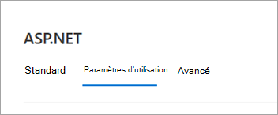

4. In the **Create topic from this term** section, select Request **topic**.

    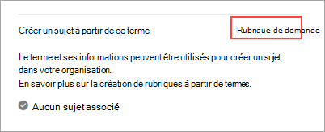

### Demander plusieurs termes dans un ensemble de termes

1. Dans le SharePoint d’administration, dans le navigation de gauche, sélectionnez **Magasin de termes.**

     

2. Dans la page **Magasin de** termes, recherchez et sélectionnez l’ensemble de termes que vous souhaitez utiliser.

    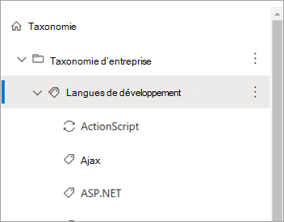

3. Dans la page de termes, sélectionnez **l’onglet Paramètres d’utilisation.**

    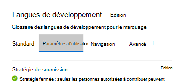

4. Dans la section **Créer des rubriques à partir de termes,** sélectionnez **Commencer.** Si vous avez déjà reçu des demandes dans le passé, l’option qui s’affiche est **Créer des termes pour la création.**

    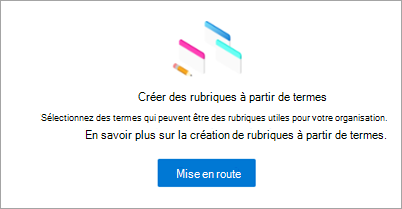

    Dans la section **Créer une rubrique à partir de termes,** sélectionnez Demander des **rubriques.**

    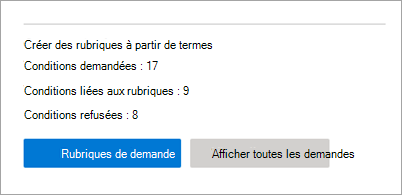

    1. Dans la page **Sélectionner des termes pour créer des rubriques,** la hiérarchie des termes au sein de cet ensemble de termes est disponible pour la sélection.

        

    2. Pour sélectionner des termes spécifiques, sélectionnez chaque terme individuellement.

    3. Vous pouvez également sélectionner tous les enfants immédiats d’un nœud dans la hiérarchie. 

5. Après avoir sélectionné les termes pour lesquels vous souhaitez créer des rubriques, sélectionnez **Envoyer.**

    Topics crée la demande et la met en file d’attente pour qu’elle soit traitée. Cette rubrique évalue les termes et leurs ressources associées et crée des rubriques ou des fusions avec des rubriques existantes. Après la demande initiale, la rubrique sera créée dans les 24 heures.

## Afficher l’état de la demande de création de rubrique

Les demandes de création de rubrique à partir d’un terme de taxonomie se classent dans l’un des trois états suivants : Demandé, Réussite ou Refusé.

- **Demandé** : indique que la demande est mise en file d’attente et que le service collecte toutes les informations de terme requises. Une nouvelle demande peut rester dans l’état Demandé pendant quelques heures avant de se déplacer vers l’un des deux états finaux.

- **Réussite** : indique que la demande a été relayée avec succès à Topics Avec toutes les informations de terme nécessaires. Topics crée la rubrique correspondante dans les prochaines 24 heures.

- **Refusée** : indique que la demande ne peut pas être traitée, car aucun fichier n’est marqué avec le terme. Il doit y avoir au moins un fichier balisé pour que la demande aboute. Si les fichiers sont marqués ultérieurement avec le terme, vous pouvez créer manuellement une nouvelle demande pour le terme.

Dans le magasin de termes, vous pouvez afficher l’état des demandes en :

- Accès à un terme individuel.
- Affichage de toutes les demandes pour un ensemble de termes spécifique.

### Afficher l’état d’un terme unique

1. Dans la page **Magasin de** termes, recherchez et sélectionnez le terme pour lequel vous souhaitez afficher l’état.

    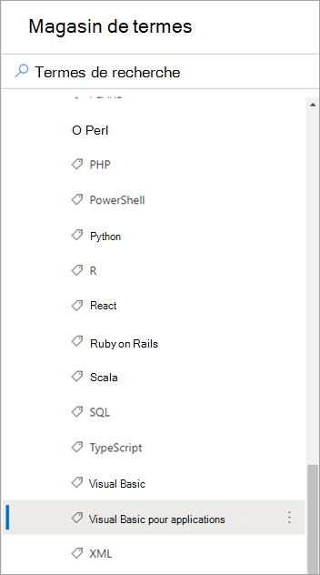

2. Dans la page de termes, sélectionnez **l’onglet Paramètres d’utilisation.**

    

3. Dans la rubrique Créer à partir de cette section **de terme,** affichez l’état de la demande.

    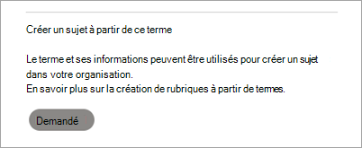

### Afficher l’état de plusieurs termes dans un ensemble de termes

1. Dans la page **Magasin de** termes, recherchez et sélectionnez l’ensemble de termes pour lequel vous souhaitez afficher l’état.

    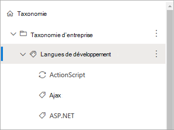

2. Dans la page de termes, sélectionnez **l’onglet Paramètres d’utilisation.**

    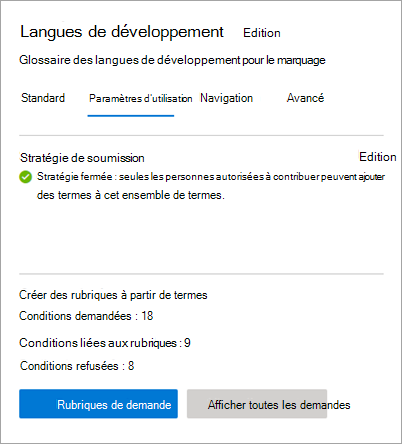

    Dans la section Créer **des rubriques** à partir de termes, vous pouvez voir le nombre total de demandes, le nombre de demandes liées à des rubriques et le nombre de demandes refusées.

3. Sélectionnez **Afficher toutes les demandes.**

4. Dans le **panneau Tous les termes demandés pour** la création de rubrique, affichez l’état des demandes de termes.

    

5. Si vous avez de nombreuses demandes, sélectionnez **Charger plus** pour continuer à charger des éléments supplémentaires.

    

6. Pour passer en revue les demandes qui sont dans un état particulier, dans la colonne **État,** sélectionnez **Filtrer par**.

    

     Sélectionnez l’état par le filtre : **Refusé,** **Réussite** ou **Demandé.**

    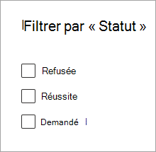

<!---

## Identify topics created from terms (feature not ready yet)

After Viva Topics processes a request and creates a topic, you can see a topic card when you hover over a term name in the list of requests for the term set.

    

Also, if you go to individual terms, and select the **Usage settings** tab, the **Create topic from this term** section shows a topic card when you hover over the name.

    

Topic pages also indicate that the taxonomy is one of the sources for the topic.

**--Insert screenshot from final UX - source string in topic page--**

--->
