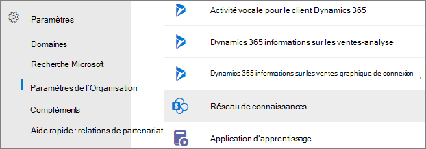
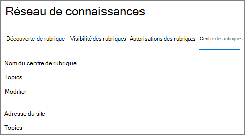
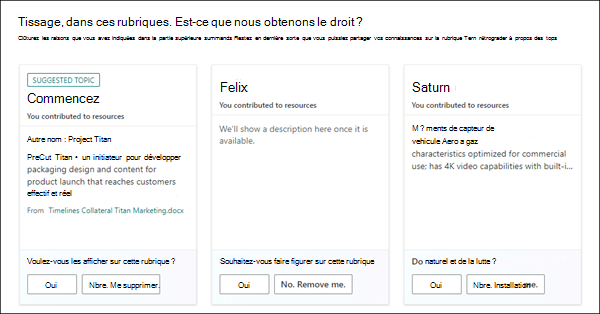
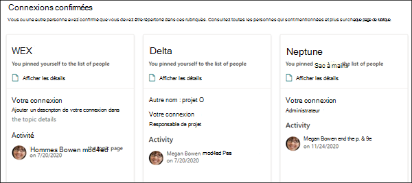

# Vue d’ensemble du centre de rubriques

Dans Rubriques microsoft, le centre de rubriques est un site SharePoint moderne qui sert de centre de connaissances pour votre organisation. Il est créé lors de la [configuration de Rubriques Dans](set-up-topic-experiences.md) le Centre d’administration Microsoft 365.

Le centre de rubriques possède une page d’accueil par défaut avec le volet Web Rubriques dans laquelle tous les utilisateurs sous licence peuvent voir les rubriques à laquelle ils ont une connexion. 

Bien que tous les utilisateurs titulaires d’une licence qui peuvent afficher des rubriques ont accès au centre de rubriques, les gestionnaires de connaissances peuvent gérer les rubriques via la page **Gérer les rubriques.** L’onglet Gérer les rubriques s’affiche uniquement pour les utilisateurs qui ont les **autorisations Gérer les** rubriques. 

## Où se trouve mon centre de rubriques

Le centre de rubriques est créé lors de la configuration de Topics. Une fois l’installation terminée, un administrateur peut trouver l’URL sur la page de gestion [du centre de rubriques.](https://docs.microsoft.com/microsoft-365/knowledge/topic-experiences-administration#to-access-topics-management-settings)

1. Dans le Centre d’administration Microsoft 365, cliquez sur **Paramètres,** puis **Paramètres de l’organisation.**
2. Sous **l’onglet Services,** cliquez sur **Expériences des rubriques.**

      

3. Sélectionnez **l’onglet Centre des** rubriques. Sous **Adresse du site** se trouve un lien vers votre centre de rubriques.

      

## Page d’accueil

 

> [!VIDEO https://www.microsoft.com/videoplayer/embed/RE4LAhZ]  

 

Dans la page d’accueil du centre de rubriques, vous pouvez voir les rubriques de votre organisation avec lesquelles vous êtes en relation.

- Connexions suggérées : vous verrez les rubriques répertoriées sous Nous vous avons **répertoriés dans ces rubriques. Avons-nous bien fait ?**. Voici des rubriques dans lesquelles votre connexion à la rubrique a été suggérée par le biais de l’IA. Par exemple, vous pouvez être l’auteur d’un fichier ou d’un site associé. Vous êtes invité à confirmer que vous devez rester répertorié en tant que personne associée pour la rubrique.

     
 
- Connexions confirmées : il s’agit des rubriques dans lesquelles vous êtes épinglé sur la page de rubrique ou vous avez confirmé une connexion suggérée à la rubrique. Les rubriques passeront de la section suggérée à la section confirmée lorsque vous confirmez une connexion suggérée.
 
     

Une fois qu’un utilisateur a confirmé sa connexion à une rubrique, il peut apporter des modifications à la page de rubrique pour organiser sa connexion. Par exemple, ils peuvent fournir plus d’informations sur leur connexion à la rubrique.

## Page Gérer les rubriques

Pour travailler dans la section Gérer les rubriques du Centre de **rubriques,** vous devez avoir les autorisations Gérer les *rubriques requises* pour le rôle de gestionnaire de connaissances. Votre administrateur peut attribuer ces autorisations aux utilisateurs lors de la configuration de la gestion des [connaissances,](set-up-topic-experiences.md)ou les nouveaux utilisateurs peuvent être [ajoutés](topic-experiences-knowledge-rules.md) par la suite par un administrateur via le Centre d’administration Microsoft 365.

Dans la page Gérer les rubriques, le tableau de bord de rubrique affiche toutes les rubriques, à qui vous avez accès, qui ont été identifiées à partir de vos emplacements source spécifiés. Chaque rubrique affiche la date à laquelle la rubrique a été découverte. Un utilisateur qui a reçu les autorisations Gérer les **rubriques** peut passer en revue les rubriques non confirmées et choisir d’utiliser :
- Confirmez la rubrique : met en évidence la rubrique pour les utilisateurs qui ont accès aux fichiers et aux pages associés à la rubrique, et leur permet de voir la carte de sujet et la page de rubrique associées.
- Publiez la rubrique : modifiez les informations de la rubrique pour améliorer la qualité de la rubrique initialement identifiée et présente la rubrique à tous les utilisateurs qui ont accès aux rubriques. 
- Rejet de la rubrique : rend la rubrique non disponible pour les utilisateurs. La rubrique est déplacée vers **l’onglet Rejeté** et peut être confirmée ultérieurement si nécessaire. 

> [!Note] 
> Pour [plus d’informations](manage-topics.md) sur la gestion des rubriques, voir Gérer les rubriques dans la page Gérer les rubriques.

## Créer ou modifier une rubrique

Si vous avez **des autorisations créer et modifier des rubriques,** vous pouvez :

- [Modifier des rubriques existantes](edit-a-topic.md): vous pouvez apporter des modifications aux pages de rubriques existantes qui ont été créées via la découverte.
- [Créez de nouvelles rubriques](create-a-topic.md): vous pouvez créer de nouvelles rubriques pour les rubriques qui n’ont pas été trouvées lors de la découverte, ou si les outils d’IA n’ont pas trouvé suffisamment de preuves pour créer une rubrique.

## Voir aussi

  

