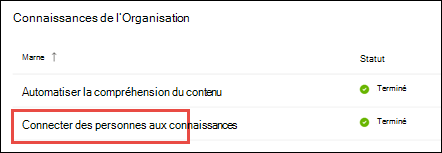

# Présentation du centre de rubriques (aperçu)

> [!Note] 
> Le contenu de cet article est destiné à Project cortex privé preview. Pour [plus d’informations sur le projet cortex](https://aka.ms/projectcortex).

Le centre de rubrique est un site SharePoint moderne qui sert de centre de connaissances pour votre organisation. Il est créé lors de la configuration de la [gestion des connaissances](set-up-knowledge-network.md) dans le centre d’administration 365 de Microsoft.

Via le Centre des rubriques, les utilisateurs disposant des autorisations appropriées peuvent effectuer les opérations suivantes :

- Confirmer ou refuser des rubriques découvertes
- Créer une page de rubrique
- Modifier une page de rubrique existante

> [!Note] 
> Vous pouvez en savoir plus sur chaque tâche dans [utilisation des rubriques dans le Centre des rubriques](work-with-topics.md).

## Où se trouve le centre de la rubrique

Votre centre de rubrique est créé lors de la configuration de la gestion des connaissances. Une fois l’installation terminée, un administrateur peut trouver l’URL dans la [page de gestion du centre de connaissances](manage-knowledge-network.md).

1. Dans le centre d’administration 365 de Microsoft, sélectionnez **configuration** dans le volet de navigation, puis, dans la section **connaissances** de l’organisation, sélectionnez **connecter des personnes aux connaissances**.

     

2. Sur la page **connecter des personnes à la connaissance** , dans la section **en un clin d’œil** , consultez l’adresse du Centre des **rubriques** pour l’URL du site.

## Autorisations d’utilisation du centre de la rubrique

Pour travailler dans le centre de la rubrique, vous devez disposer des autorisations requises. Votre administrateur peut attribuer ces autorisations aux utilisateurs lors de la configuration de la [gestion des connaissances](set-up-knowledge-network.md), ou les nouveaux utilisateurs peuvent être ajoutés par la [suite](give-user-permissions-to-the-topic-center.md) par un administrateur via le centre d’administration Microsoft 365.

Les utilisateurs du Centre des rubriques peuvent disposer de deux jeux d’autorisations :

- **Créer et modifier des rubriques**: créer des rubriques ou mettre à jour le contenu de la rubrique, comme la description, les documents et les personnes associées. Affectez cette autorisation aux experts techniques qui sont chargés de consulter les pages des rubriques.
- **Gérer les rubriques**: utilisez le tableau de bord de rubrique pour consulter les rubriques dans l’organisation. Les utilisateurs peuvent effectuer des actions telles que la confirmation et le rejet des rubriques non confirmées.

Un utilisateur peut recevoir les deux ensembles d’autorisations, ou un seul si nécessaire. 

## Consultation des rubriques dans le tableau de bord de rubrique

Le tableau de bord de rubrique affiche des rubriques qui ont été extraites de vos emplacements source spécifiés. Chaque rubrique indique la date à laquelle la rubrique a été découverte et, si des commentaires y ont été fournis. Un utilisateur qui a été affecté les autorisations **gérer les rubriques** peut consulter les rubriques non confirmées et choisir de :
- Confirmez la rubrique : met en surbrillance la rubrique pour les utilisateurs qui ont accès et leur permet de voir la page de rubrique et de rubrique associée.
- Rejeter la rubrique : rend le sujet non disponible pour les utilisateurs. La rubrique est déplacée vers l’onglet **rejeté** et peut être confirmée plus tard si nécessaire.

## Création ou modification d’une rubrique

Si vous disposez des autorisations **créer et modifier des rubriques** , vous pouvez choisir d’effectuer les actions suivantes :

- Modifier des rubriques existantes : vous pouvez apporter des modifications aux pages de rubrique existantes qui ont été créées par le biais de la découverte.
- Créer des rubriques : vous pouvez créer de nouvelles rubriques pour celles qui n’ont pas été trouvées par le biais de la découverte ou si les outils AI n’ont pas trouvé suffisamment de preuves pour créer une rubrique.

## Voir aussi

  

