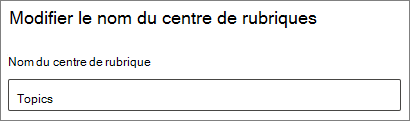

# Modifier le nom du centre de rubriques dans Rubriques microsoft

Vous pouvez modifier le nom de votre centre de rubriques dans le Centre d’administration [Microsoft 365.](https://admin.microsoft.com) Vous devez être administrateur général ou administrateur SharePoint pour effectuer ces tâches.

## Pour accéder aux paramètres de gestion des rubriques :

1. Dans le Centre d’administration Microsoft 365, cliquez sur **Paramètres,** puis **Paramètres de l’organisation.**
2. Sous **l’onglet Services,** cliquez sur **Expériences de rubrique.**

     

3. Sélectionnez **l’onglet Centre des** rubriques. Consultez les sections suivantes pour plus d’informations sur chaque paramètre.

     

##  Mettre à jour le nom de votre centre de rubriques

Pour modifier le nom du centre de rubriques

1. Sous **l’onglet Centre des** rubriques, sous **Nom du centre des** rubriques, sélectionnez **Modifier.**
2. Dans la page Modifier le  nom du centre **de** rubriques, dans la zone Nom du centre de rubriques, tapez le nouveau nom de votre centre de rubriques.
3. Sélectionnez **Enregistrer**.

      

## Voir aussi

[Gérer la découverte de rubriques dans les rubriques microsoft](topic-experiences-discovery.md)

[Gérer la visibilité des rubriques dans les rubriques microsoft](topic-experiences-knowledge-rules.md)

[Gérer les autorisations des rubriques dans les rubriques microsoft](topic-experiences-user-permissions.md)
