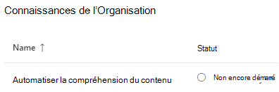
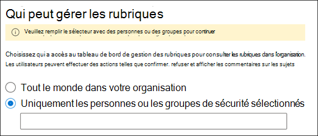
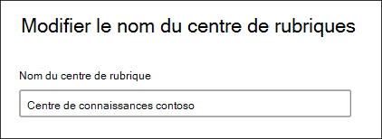

# Gérer votre réseau de gestion des connaissances (aperçu)

> [!Note] 
> Le contenu de cet article est destiné à Project cortex privé preview. [En savoir plus sur le Projet cortex](https://aka.ms/projectcortex).

Une fois que vous avez [configuré la gestion des connaissances](set-up-topic-experiences.md), un administrateur peut à tout moment apporter des modifications à vos paramètres de configuration via le centre d’administration Microsoft 365.

Par exemple, vous devrez peut-être ajuster vos paramètres pour l’un des éléments suivants :
- Ajoutez de nouvelles sources SharePoint aux rubriques de la mienne.
- Modifier les utilisateurs qui auront accès aux rubriques.
- Modifier les utilisateurs qui disposent des autorisations pour effectuer des tâches dans le Centre des rubriques.
- Modifier le nom de votre centre de rubrique

## Configuration requise 
Vous devez disposer d’autorisations d’administrateur général ou d’administrateur SharePoint pour pouvoir accéder au centre d’administration Microsoft 365 et gérer les tâches des connaissances de l’organisation.

## Pour accéder aux paramètres de gestion des connaissances :

1. Dans le centre d’administration 365 de Microsoft, sélectionnez **configuration** , puis affichez la section connaissances de l' **organisation** .
2. Dans la section connaissances de l' **organisation** , cliquez sur **connecter les personnes aux connaissances**. 

      

3. Sur la page **connecter des personnes à la page de connaissances** , sélectionnez **gérer** pour ouvrir le volet Paramètres du **réseau de connaissances** . 

      

## Modifier la façon dont le réseau Knowledge peut trouver des rubriques

Sélectionnez l’onglet **découverte de rubrique** si vous souhaitez mettre à jour vos choix pour les sources de rubrique SharePoint. Ce paramètre vous permet de sélectionner les sites SharePoint de votre client qui seront analysés et extraits de rubriques.

1. Sous l’onglet découverte de la **rubrique** , sous sélectionner les **sources des rubriques SharePoint** , sélectionnez **modifier**.
2. Sur la page **Sélectionner les sources des rubriques SharePoint** , sélectionnez les sites SharePoint qui seront analysés en tant que sources pour vos rubriques lors de la découverte. Cela inclut les opérations suivantes : 
    a. **Tous les sites** : tous les sites SharePoint de votre client. Ceci capture les sites actuels et futurs. 
    b. **Tout, à l’exception des sites sélectionnés** : saisissez les noms des sites à exclure.  Vous pouvez également télécharger une liste de sites que vous souhaitez exclure de la découverte. Les sites créés à l’avenir seront inclus en tant que sources pour la découverte de rubriques.  
    c. **Sites sélectionnés uniquement** : saisissez les noms des sites que vous souhaitez inclure. Vous pouvez également télécharger une liste de sites. Les sites créés à l’avenir ne seront pas inclus en tant que sources pour la découverte des rubriques.  

      
   
    Si vous avez un certain nombre de sites à exclure (si vous sélectionnez **tous, sauf sites sélectionnés** ) ou inclure (si vous avez sélectionné **uniquement les sites sélectionnés** ), vous pouvez choisir de télécharger un fichier CSV avec les noms de site et les URL. Vous pouvez sélectionner **Télécharger le modèle de site. csv** si vous voulez utiliser le fichier de modèle CSV.

3. Sélectionnez **Enregistrer**.

##  Modifier les personnes qui peuvent voir les rubriques de votre organisation

Sélectionnez l’onglet découverte de la **rubrique** si vous souhaitez mettre à jour les personnes de votre organisation qui peuvent voir les rubriques découvertes dans les résultats de la recherche et quand les rubriques sont mises en surbrillance dans le contenu comme les pages SharePoint.

1. Sous l’onglet **découverte de rubrique** , sous **qui peut voir les rubriques dans le réseau de connaissances** , sélectionnez **modifier**.
2. Sur la page **qui peut voir les rubriques de la page du réseau de connaissances** , vous sélectionnez les utilisateurs qui auront accès aux détails de la rubrique, comme les rubriques mises en surbrillance, les fiches de rubrique, les réponses aux questions dans la recherche et les pages de rubrique. Vous pouvez sélectionner : 
    a. **Tout le monde dans votre organisation** 
    b. **Uniquement les personnes ou les groupes de sécurité sélectionnés** 
    c. **Personne** 

       
3. Sélectionnez **Enregistrer**.  
 
> [!Note] 
> Bien que ce paramètre vous permette de sélectionner un utilisateur au sein de votre organisation, seuls les utilisateurs qui disposent de licences de gestion des connaissances qui lui sont attribués pourront consulter les rubriques.

## Modifier la personne qui dispose des autorisations pour effectuer des tâches dans le centre de la rubrique

Sélectionnez l’onglet Autorisations de la **rubrique** si vous souhaitez mettre à jour les personnes autorisées à effectuer les opérations suivantes dans la page du Centre des rubriques :

- Les utilisateurs qui peuvent créer et modifier des rubriques : créer des rubriques introuvables lors de la découverte ou modifier les détails d’une page de rubrique existante.
- Les utilisateurs qui peuvent gérer les rubriques : confirmer ou rejeter les rubriques découvertes.

Pour mettre à jour les utilisateurs disposant des autorisations permettant de créer et de modifier des rubriques :

1. Sous l’onglet **autorisations de rubrique** , sous **qui peut créer et modifier des rubriques** , sélectionnez **modifier**. 
2. Sur la page **qui peut créer et modifier des rubriques** , vous pouvez sélectionner : 
    a. **Tout le monde dans votre organisation** 
    b. **Uniquement les personnes ou les groupes de sécurité sélectionnés** 

       

3. Sélectionnez **Enregistrer**. 

Pour mettre à jour les personnes autorisées à gérer les rubriques, procédez comme suit :

1. Sous l’onglet **autorisations de rubrique** , sous **qui peut gérer les rubriques** , sélectionnez **modifier**. 
2. Sur la page **qui peut gérer les rubriques** , vous pouvez sélectionner les éléments suivants : 
    a. **Tout le monde dans votre organisation** 
    b. **Personnes ou groupes de sécurité sélectionnés** 

       

3. Sélectionnez **Enregistrer**. 

##  Mettre à jour le nom du centre de rubrique

Sélectionnez l’onglet **Centre des rubriques** si vous souhaitez mettre à jour le nom de votre centre de rubriques. 

1. Sous l’onglet **Centre des rubriques** , sous nom du centre de **rubriques** , sélectionnez **modifier**.
2. Dans la page **modifier le nom du centre de rubrique** , dans la zone Nom du centre de la **rubrique** , tapez le nouveau nom de votre centre de rubrique.
3. Sélectionnez **Enregistrer**.

       

## Voir aussi

  

