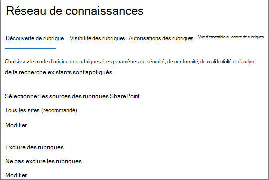
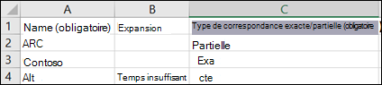

# <a name="manage-topic-discovery-in-microsoft-viva-topics"></a>Gérer la découverte de rubriques dans les rubriques microsoft

Vous pouvez gérer les paramètres de découverte de rubrique dans le [Centre d'administration Microsoft 365.](https://admin.microsoft.com) Vous devez être administrateur général ou administrateur SharePoint pour effectuer ces tâches.

## <a name="to-access-topics-management-settings"></a>Pour accéder aux paramètres de gestion des rubriques :

1. Dans le Centre d'administration Microsoft 365, cliquez sur **Paramètres,** puis **Paramètres de l'organisation.**
2. Sous **l'onglet Services,** cliquez sur **Expériences de rubrique.**

     

3. Sélectionnez **l'onglet Découverte de** rubrique. Consultez les sections suivantes pour plus d'informations sur chaque paramètre.

     

## <a name="select-sharepoint-topic-sources"></a>Sélectionner des sources de rubriques SharePoint

Vous pouvez modifier les sites SharePoint de votre organisation qui seront analyser pour des rubriques.

Si vous souhaitez inclure ou exclure une liste spécifique de sites, vous pouvez utiliser le modèle .csv suivant :

``` csv
Site name,URL
```

Si vous ajoutez des sites à l'aide du sériateur de site, ils sont ajoutés à la liste existante des sites à inclure ou à exclure. Si vous téléchargez un fichier .csv, il se charge de toute liste existante. Si vous avez précédemment inclus ou exclu des sites spécifiques, vous et téléchargez la liste en tant que fichier .csv, a apporté des modifications et chargez la nouvelle liste.

Pour choisir des sites pour la découverte de rubriques

1. Sous **l'onglet Découverte de** rubrique, sous **Sélectionner des sources de rubrique SharePoint,** sélectionnez **Modifier**.
2. Dans la page Sélectionner des sources de rubrique **SharePoint,** sélectionnez les sites SharePoint qui seront analyser en tant que sources pour vos rubriques lors de la découverte. Cela inclut les opérations suivantes :
    - **Tous les sites**: tous les sites SharePoint de votre client. Cela capture les sites actuels et futurs.
    - **Tous, sauf les sites sélectionnés**: tapez les noms des sites que vous souhaitez exclure.  Vous pouvez également charger une liste de sites que vous souhaitez refuser de découvrir. Les sites créés à l'avenir seront inclus en tant que sources de découverte de sujet. 
    - **Seuls les sites** sélectionnés : tapez les noms des sites que vous souhaitez inclure. Vous pouvez également charger une liste de sites. Les sites créés à l'avenir ne seront pas inclus en tant que sources de découverte de sujet.
    - **Aucun site**: les rubriques ne seront pas générées ou mises à jour automatiquement avec le contenu SharePoint. Les rubriques existantes restent dans le centre de rubriques.

    
   
3. Cliquez sur **Enregistrer**.

## <a name="exclude-topics-by-name"></a>Exclure des rubriques par nom

Vous pouvez exclure des rubriques de la découverte en chargeant une liste à l'aide d'un fichier .csv. Si vous avez précédemment exclu des rubriques, vous pouvez télécharger le .csv, apporter des modifications et le télécharger à nouveau.

1. Sous **l'onglet Découverte de** rubrique, sous **Exclure les rubriques,** sélectionnez **Modifier.**
2. Cliquez **sur Exclure des rubriques par nom.**
3. Si vous devez créer une liste, téléchargez le modèle .csv et ajoutez les rubriques que vous souhaitez exclure (voir Working *with the .csv template* below). Lorsque le fichier est prêt, cliquez sur **Parcourir** et téléchargez le fichier. S'il existe une liste, vous pouvez télécharger le .csv contenant la liste.
4. Cliquez sur **Enregistrer**.

    

### <a name="working-with-the-csv-template"></a>Utiliser le modèle .csv

Vous pouvez copier le modèle csv ci-dessous :

``` csv
Name (required),Expansion,MatchType- Exact/Partial (required)
```

Dans le modèle CSV, entrez les informations suivantes sur les rubriques que vous souhaitez exclure :

- **Nom**: tapez le nom de la rubrique que vous souhaitez exclure. Vous pouvez procéder de deux manières :
    - Correspondance exacte : vous pouvez exclure le nom exact ou l'acronyme (par exemple, *Contoso* ou *ATL*).
    - Correspondance partielle : vous pouvez exclure toutes les rubriques qui ont un mot spécifique.  Par exemple, *arc exclura* toutes les rubriques avec le mot *arc* dans celui-ci, telles que le cercle *d'arc,* *l'arc de Pierre ou* *l'arc de formation*. Notez qu'il n'exclura pas les rubriques dans lesquelles le texte est inclus dans le cadre d'un mot, comme *Architecture*.
- **Signifie (facultatif)**: si vous souhaitez exclure un acronyme, tapez les mots qu'il signifie.
- **MatchType-Exact/Partial**: tapez si le nom que vous avez entré était un type de correspondance *exact* *ou* partiel.

     

## <a name="see-also"></a>Voir aussi

[Gérer la visibilité des rubriques dans Microsoft 365](topic-experiences-knowledge-rules.md)

[Gérer les autorisations de rubrique dans Microsoft 365](topic-experiences-user-permissions.md)

[Modifier le nom du centre de rubriques dans Microsoft 365](topic-experiences-administration.md)
