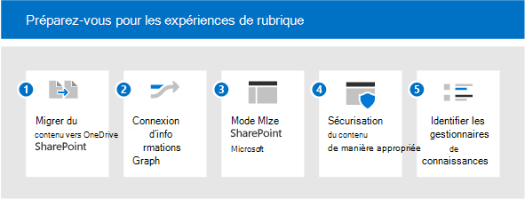

# Préparer votre environnement à la Sujets Microsoft Viva

Pour utiliser au mieux ces rubriques, vous souhaitez inclure autant de contenu que possible pour la découverte de rubriques, afin de pouvoir avoir un ensemble enrichi de rubriques pour vos utilisateurs. Mais quel contenu doit être utilisé pour la découverte de rubriques ? Comment optimiser le contenu indexé tout en restant en contrôle ? Plus le contenu est dans l’étendue, plus les informations que l’intelligence artificielle peut découvrir sont meilleures. Cet article vous explique les étapes de planification pour vous assurer que vous avez inclus le contenu approprié et que vous disposez des bonnes personnes et ressources pour faire une bonne expérience pour vos utilisateurs.

Pour planifier des rubriques De Rubriques, vous devez :

1. [Migrer le contenu vers SharePoint](#1-migrate-content-to-microsoft-365)
    - L’indexation de rubrique inclut uniquement le contenu SharePoint sites web.
      - Dans la mesure du possible, migrez du contenu précieux vers SharePoint Online à partir de sources externes.
      - Hiérarchisez les sources de contenu avec un haut potentiel de connaissances en matière de savoir-faire.
      - Mettez en évidence les avantages de Rubriques Desy pour encourager les utilisateurs à déplacer du contenu de OneDrive vers SharePoint sites.

2. [Connecter à Microsoft Graph](#2-connect-information-to-microsoft-graph)
    - À l’avenir, le contenu externe peut être introduit dans le graphique de connaissances et devenir disponible.
    - Pour le contenu qui ne peut pas être déplacé, envisagez d’utiliser Graph connecteurs pour améliorer la recherche et préparer l’inclusion future.

3. [Moderniser SharePoint pages](#3-modernize-sharepoint-pages)
    - Les cartes de rubrique ne peuvent être pointées que sur des pages modernes.
    - Identifiez les pages classiques à profil élevé qui sont des candidats à la modernisation.

4. [Sécuriser le contenu de manière appropriée](#4-secure-content-appropriately)
    - Les ressources de rubrique sont découpées en fonction des autorisations d’un utilisateur.
    - Identifiez tout contenu qui peut avoir des autorisations incorrectement larges ou restrictives :
      - Encourager les propriétaires de sites à utiliser les rapports de partage pour passer en revue les autorisations
      - Faire auditer le contenu largement partagé par les administrateurs à l’aide de la recherche
      - Encouragez les propriétaires de contenu à partager du contenu qui n’est pas sensible et qui peut avoir des avantages plus larges pour l’organisation.
    - Examinez votre configuration microsoft Graph sur les utilisateurs et le contenu :
      - L’indexation de rubrique honore la configuration en excluant le contenu de la recherche ou Delve (par exemple, NOINDEX). Vérifier si ces configurations sont toujours pertinentes.

5. [Identifier les gestionnaires de connaissances et les rubriques](#5-identify-knowledge-managers-and-topics)
    - Utilisez les taxonomies existantes pour créer manuellement des rubriques ou pour confirmer les rubriques suggérées par l’IA.
    - Identifier les experts techniques pour les sujets anticipés ou amorçages.
    - Identifiez les sites qui couvrent un grand nombre de données précieuses qui peuvent être utilisées pour l’exploration de sujet pilote.
    - Impliquer les responsables de connaissances et les communautés de pratiques.

## 1. Migrer le contenu vers Microsoft 365

Il existe plusieurs outils et services pour vous aider dans votre migration : vous pouvez obtenir une vue d’ensemble et des informations sur la migration de votre contenu vers [Microsoft 365](/sharepointmigration/migrate-to-sharepoint-online). Les outils de migration sont les suivants :

- [Gestionnaire de migration](/sharepointmigration/mm-get-started)
- [Outil de migration SharePoint (SPMT)](/sharepointmigration/introducing-the-sharepoint-migration-tool)
- [Microsoft 365 FastTrack](https://www.microsoft.com/fasttrack/microsoft-365)
- [Les outils et services de migration des partenaires](https://www.microsoft.com/solution-providers)

Ez le meilleur de votre migration :

- Migrez vers un site moderne, qui inclut Microsoft Teams. Bien que l’indexation puisse avoir lieu sur n’importe quel site SharePoint (classique ou moderne), l’affichage des rubriques aux utilisateurs via des mises en évidence et des cartes ne se produit que sur les pages modernes.
- Conservez les noms d’utilisateurs : la plupart des outils de migration vous permettent de ma cartographier les identités des utilisateurs au cours de la migration, afin que les propriétés telles que Created By ou Modified By soient conservées après la migration. Ceci est important pour les rubriques, car la authorship de fichiers est utilisée pour identifier les experts qui sont ajoutés à une page de rubrique ou à une carte. 
- Rendre les noms de compte de service descriptifs : dans certains cas, la maintenance des noms d’utilisateurs est impossible. Par exemple, si vous migrez du contenu créé par une personne qui n’est plus un employé de l’organisation. Dans ce cas, la plupart des outils de migration déplaceront un fichier comme s’il avait été créé par un compte administrateur ou un compte de service. Si cela se produit fréquemment, ce compte de service peut alors être répertorié par rapport à des rubriques en tant qu’expert. C’est là que l’attribution de noms à ce compte devient très importante. Si vous le faites descriptif, la présence de ces comptes non humains sera compréhensible par vos utilisateurs qui utilisent des rubriques.

## 2. Fournir Connecter informations à Microsoft Graph

Si vous ne pouvez pas migrer du contenu, connectez-le au microsoft Graph :

- Envisagez [d’implémenter Graph connecteurs de contenu.](/microsoftsearch/connectors-overview) À l’aide de connecteurs, le contenu externe peut être indexé dans le Graph Microsoft, où les utilisateurs peuvent ensuite le découvrir par le biais Recherche Microsoft.
- Les développements futurs apporteront des données externes dans Rubriques Topics.

## 3. Moderniser SharePoint pages

Étant donné que les fiches de rubrique et les points forts ne peuvent apparaître que sur les pages modernes, mettez à jour les pages que vous souhaitez inclure dans rubriques De classique à Moderne. Voir [Moderniser vos sites SharePoint classiques.](/sharepoint/dev/transform/modernize-classic-sites) Vous pouvez utiliser le [scanneur de modernisation SharePoint pour](/sharepoint/dev/transform/modernize-scanner) préparer vos sites classiques à la modernisation.

Si vous avez beaucoup de sites classiques, donnez la priorité aux pages de haut niveau pour les convertir en pages modernes.

## 4. Sécuriser le contenu de manière appropriée

Lorsque les utilisateurs interagissent avec une carte de sujet ou une page de rubrique, ils peuvent voir différentes ressources. Cela est dû au fait qu’ils ont accès à différents fichiers associés à la rubrique. Si vos autorisations sous-jacentes sont trop strictes, les aspects serendipitous de la découverte d’informations par le biais de rubriques pourraient être diminués. En revanche, s’ils sont trop larges, un sujet peut faire surface à un utilisateur que vous ne souhaitez pas voir.
Une bonne gestion des autorisations est essentielle ici. Et une bonne gestion des autorisations est basée sur un partenariat continu entre les administrateurs et les propriétaires de contenu. Bien qu’il puisse s’agit d’une activité continue, vous pouvez suivre certaines étapes pratiques lors de la préparation des rubriques :

- Encouragez les propriétaires de sites à examiner le partage et les autorisations.

  SharePoint propriétaires de site peuvent consulter un rapport de partage pour leur site qui affiche les détails complets de toutes les autorisations et des liens de partage configurés sur le site, voir [Rapports de partage.](/sharepoint/sharing-reports) Cette liste répertorie les utilisateurs internes et externes (invités).

  Les propriétaires de site peuvent également voir qui dispose des autorisations pour le site en allant sur les pages **Autorisations** du site et **Autorisations Paramètres** avancées.

  1. Sur votre site, choisissez **Paramètres**  >  **autorisations de site.** Vérifiez qui est répertorié sous Propriétaires du site, Membres du site, et Visiteurs du site. Recherchez les utilisateurs Invités.
  2. Sur la page **Autorisations**, choisissez **Paramètres d’autorisations avancés**. Vous pouvez vérifier les autorisations uniques et voir qui a un accès limité à tous les éléments du site.

- Auditez les groupes et les équipes Microsoft 365 pour vous assurer qu’ils sont correctement définis en tant que groupes ou équipes publics ou privés. Les nouveaux Teams et Microsoft 365 groupes sont définies sur privé par défaut, mais lors de leur première publication ont été publiques par défaut. Si vous étiez des utilisateurs précédents de ces technologies, vous voudrez peut-être passer en revue. De plus, la fonction d’une équipe évolue souvent au cours de son cycle de vie et le paramètre peut devoir être mis à jour pour refléter l’utilisation actuelle de l’équipe.
- Examiner l’utilisation de « tout le monde », « tout le monde sauf les utilisateurs externes » ou des groupes de sécurité larges. Le contenu peut être incorrectement partagé avec ces valeurs. Pour passer en revue l’utilisation de ces groupes, vous pouvez :
  - Créer un compte qui n’a pas d’appartenance à un groupe
  - Utiliser la recherche avec ce compte pour découvrir du contenu largement partagé.
  - Si du contenu inapproprié est visible pour ce compte par le biais de la recherche, vous pouvez travailler avec les propriétaires de site pour corriger la configuration des autorisations.

Outre les autorisations, vous pouvez également contrôler l’étendue de ce qui est découvrable par le biais de rubriques. Vous contrôlez toujours ce qui est indexé.

Les administrateurs peuvent configurer l’indexation dans Administration Microsoft 365 centre de gestion. Lorsque vous définissez [Topics,](set-up-topic-experiences.md)vous pouvez :

- Autoriser la découverte sur tous les sites SharePoint ou spécifier des sites à inclure ou à exclure en tant que sources de rubrique.
- Lorsque vous avez des termes sensibles, vous pouvez également exclure des rubriques par leur nom. Par exemple, si vous avez le nom d’un projet sensible, dans lequel vous ne voulez pas qu’un surlignage ou une carte apparaisse, quelles que soient les autorisations de l’utilisateur, vous pouvez exclure ce nom de projet.

Au niveau du contenu, vous pouvez également contrôler ce qui est découvrable. Toute configuration que vous avez effectuée pour exclure du contenu de la recherche sera également utilisée par la découverte de contenu. Par exemple, si vous avez exclu l’apparition d’une bibliothèque de documents spécifique dans les résultats de la recherche, cette bibliothèque de documents ne sera pas utilisée pour la découverte de rubriques.

## 5. Identifier les gestionnaires de connaissances et les rubriques

La gestion des rubriques implique trois rôles clés, y compris deux nouveaux rôles Azure Active Directory (AAD) : administrateur de connaissances et gestionnaire de connaissances :

- L’administrateur du savoir (KA) est un rôle technique, généralement au sein de l’informatique. Ce rôle permet la configuration des rubriques Dans le Centre d’administration M365, ainsi que la configuration de la découverte et de la visibilité des rubriques.
- Le Gestionnaire de connaissances (KM) travaille avec les rubriques proprement dits et supervise leur qualité et leur intégralité.
- Les contributeurs de rubriques ne sont pas basés sur un rôle AAD, mais sur les autorisations dans le Centre d’administration. Il s’agit d’experts techniques capables de organiser le contenu sur des sujets, en ajoutant des ressources et des personnes.

Selon votre organisation, vous pouvez avoir peu ou plusieurs personnes qui jouent ces rôles. Pour certaines organisations, il peut s’y avoir les mêmes personnes.

| Administrateur d’informations | Responsables d’informations | Contributeur de rubrique |
|:-------|:-------|:-------|:-------|
| Rôle AAD | Rôle AAD | SME |
| A accès au Centre d’administration | A accès au Centre d’administration | Aucun accès au Centre d’administration |
| Sets up Viva Topics | Possède la gestion et la qualité des rubriques | Contribue à des rubriques en fonction de leur expertise. |
| Garantit que les normes de sécurité et de conformité sont appliquées et qu’elles comprennent le contrat de licence.| Effectue des tâches de gestion de rubriques telles que créer, modifier, supprimer et rejeter des rubriques. Prend en charge les collaborateurs de rubrique avec leurs tâches. | Organise les informations et le contenu des pages de rubrique, y compris les personnes et les ressources épinglées à cette rubrique. |

Les sur-points et les cartes apparaissent pour les utilisateurs dans le contexte de leur travail, par exemple quand ils parcourent des pages modernes dans SharePoint. Vous contrôlez l’expérience utilisateur final pour les rubriques.

- Qui pouvez-vous voir Rubriques ? La visibilité des rubriques est configurée dans le centre Administration Microsoft 365 données. Choisissez les groupes à autoriser à consulter les rubriques :
  - Tous les membres de mon organisation. « Tout le monde » n’inclut pas les invités, il s’agit de tous les utilisateurs internes dans votre annuaire
  - Uniquement les personnes sélectionnées ou les groupes de sécurité (cette option est intéressante lorsque vous continuez à déployer Rubriques Topics, afin que vous pouvez tester avec un sous-ensemble d’utilisateurs). Si vous souhaitez que les invités visualisent les rubriques, vous devez utiliser l’option « Personnes ou groupes de sécurité sélectionnés » et leur octroyer une licence.
  - Personne.

    Pour afficher l’expérience de sujet, une licence doit être appliquée à tous les utilisateurs, même les utilisateurs invités. N’oubliez pas que les autorisations contrôlent toujours ce qui peut être vu.

- Quels Rubriques sont visibles ? Vous pouvez :
  - Afficher tous les rubriques candidates.
  - Afficher uniquement les rubriques confirmées.

Maintenant que nous avons les responsables, les experts et les utilisateurs, nous pouvons parler des sujets eux-mêmes.

- Il est pratique d’amorçage des rubriques dans votre liste de rubriques. La qualité et la quantité des rubriques sont basées sur votre contenu : elles ne seront créées en tant que rubrique que si elles sont incluses dans le contenu inclus dans l’étendue. S’il existe suffisamment d’informations et de preuves pour la rubrique, elle sera créée par l’IA. Les rubriques d’amorçage permettent au Gestionnaire de connaissances et aux experts techniques de vous aider. Combiner les connaissances humaines avec l’IA est la meilleur moyen d’avoir des rubriques de qualité. Par conséquent, s’il existe des rubriques que vous prévoyez de créer manuellement dans le centre de rubriques. Cela donnera à l’IA un signal fort de la pertinence de cette rubrique et identifiera les ressources et les personnes à associer à cette rubrique.
- Utilisez les taxonomies existantes pour faciliter la planification de votre rubrique, SharePoint ou ailleurs. Les taxonomies existantes incluent souvent des termes organisationnels, des produits, des sujets, etc. Les sources des rubriques peuvent également être des listes de projets, des signets de recherche existants, etc.