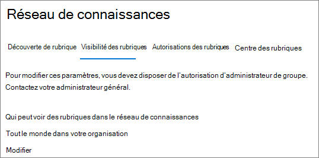

# Gestion de la visibilité des rubriques dans Microsoft 365

Vous pouvez gérer l’ensemble des utilisateurs qui peuvent voir les points forts, les fiches rubrique et le centre de rubrique dans le [Centre d’administration 365 de Microsoft](https://admin.microsoft.com). Vous devez être un administrateur général ou un administrateur SharePoint pour effectuer ces tâches.

## Pour accéder aux paramètres de gestion des rubriques :

1. Dans le centre d’administration Microsoft 365, cliquez sur **paramètres**, puis sur paramètres de l' **organisation**.
2. Sous l’onglet **services** , cliquez sur le **réseau de connaissances**.

     

3. Sélectionnez l’onglet **visibilité des rubriques** . Consultez les sections suivantes pour obtenir des informations sur chaque paramètre.

     

##  Modifier les personnes qui peuvent voir les rubriques de votre organisation

Vous pouvez modifier les utilisateurs qui peuvent voir les rubriques de votre organisation.

1. Sous l’onglet visibilité de la **rubrique** , sous **qui peut voir les rubriques dans le réseau de connaissances**, sélectionnez **modifier**.
2. Sur la page **qui peut voir les rubriques de la page du réseau de connaissances** , vous sélectionnez les utilisateurs qui auront accès aux détails de la rubrique, comme les rubriques mises en surbrillance, les fiches de rubrique, les réponses aux questions dans la recherche et les pages de rubrique. Vous pouvez sélectionner :
    - **Tout le monde dans votre organisation**
    - **Uniquement les personnes ou les groupes de sécurité sélectionnés**
    - **Personne**

     

3. Sélectionnez **Enregistrer**.  
 
> [!Note] 
> Bien que ce paramètre vous permette de sélectionner un utilisateur de votre organisation, seuls les utilisateurs disposant d’une rubrique sur laquelle des licences ont été attribuées pourront consulter les rubriques.

## Voir aussi

[Gestion de la découverte de rubrique dans Microsoft 365](topic-experiences-discovery.md)

[Gérer les autorisations de rubrique dans Microsoft 365](topic-experiences-user-permissions.md)

[Modifier le nom du centre de rubrique dans Microsoft 365](topic-experiences-administration.md)

