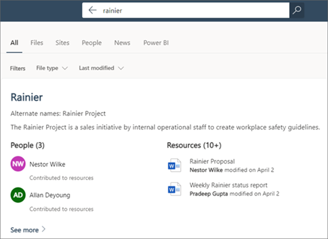

# Vue d’ensemble des rubriques de Microsoft Viva 

Rubriques utilise la technologie Microsoft AI, les Microsoft 365, Microsoft Graph, la recherche et d’autres composants et services pour apporter des connaissances à vos utilisateurs dans les applications Microsoft 365 qu’ils utilisent quotidiennement, en commençant par SharePoint pages modernes, Recherche Microsoft et Recherche dans Word, PowerPoint, Outlook et Excel.

 

> [!VIDEO https://www.microsoft.com/videoplayer/embed/RE4LhZP]  

 

Cette rubrique vous aide à résoudre un problème d’entreprise clé dans de nombreuses entreprises , en fournissant les informations aux utilisateurs lorsqu’ils en ont besoin. Par exemple, les nouveaux employés doivent apprendre rapidement un grand nombre de nouvelles informations et rencontrer des conditions dont ils ne connaissent rien lorsqu’ils lisent les informations de l’entreprise. Pour en savoir plus, l’utilisateur devra peut-être s’éloigner de ce qu’il fait et consacrer un temps précieux à la recherche de détails, tels que des informations sur ce terme, les membres de l’organisation comme experts dans le domaine, et les sites et documents liés au terme.

Rubriques Viva utilise l’IA pour rechercher et identifier automatiquement *rubriques* dans votre organisation. Il compile les informations les concernant, telles qu’une brève description, les personnes travaillant sur le sujet, ainsi que les sites, fichiers et pages qui y sont associés. Un responsable des connaissances ou un collaborateur peut choisir de mettre à jour les informations de la rubrique selon vos besoins. Les rubriques sont accessibles à vos utilisateurs. Par conséquent, pour chaque occurrence de la rubrique qui apparaît sur un site SharePoint moderne dans les actualités et pages, le texte est mis en évidence. Les utilisateurs peuvent choisir de sélectionner la rubrique pour en savoir plus à son sujet via les détails de cette rubrique. Vous pouvez également trouver des rubriques dans la Recherche SharePoint.

## Affichage des rubriques pour les utilisateurs

Les rubriques sont affichées pour les utilisateurs via :

- [Rubriques mises en surbrill SharePoint](topic-experiences-overview.md#sharepoint-highlights) pages
- Réponses de rubrique dans les [résultats de la recherche](topic-experiences-overview.md#search-results)
- Recherche dans les [applications Office](topic-experiences-overview.md#office-application-search)
- [Page d’accueil du centre](topic-experiences-overview.md#topic-center) de rubriques

### SharePoint points forts

Lorsqu’une rubrique est mentionnée dans du contenu sur des actualités et pages SharePoint, elle est mise en évidence. Vous pouvez ouvrir le résumé du sujet à partir de la mise en évidence. Ouvrez les détails de la rubrique à partir du titre du résumé pour afficher la page complète de la rubrique. La rubrique mentionnée peut être identifiée automatiquement ou a pu être référencé directement par l’auteur de la page. 

    

### Résultats de la recherche

Vous pouvez  voir une réponse à une rubrique dans les résultats de la recherche lorsque vous recherchez à partir de la page d’accueil de SharePoint, sur Office.com ou à partir d’un site SharePoint après avoir changé l’étendue de recherche pour inclure l’ensemble de l’organisation. La réponse à la rubrique apparaît dans la rubrique de la liste des résultats et vous donne un court ensemble d’informations relatives à cette rubrique. 

    

### Office d’application

Lorsque vous utilisez la recherche dans des applications Office telles que Word, PowerPoint, Outlook ou Excel( par  le biais de la zone de recherche ou en sélectionnant Rechercher dans le menu contexté), les réponses de rubrique sont affichées dans les résultats de la recherche.

   

   

### Centre de rubriques

Les utilisateurs peuvent voir les rubriques de leur organisation avec lesquelles ils ont une connexion sur la page d’accueil [du centre de rubriques.](topic-center-overview.md#home-page)

## Indexation des informations

Rubriques Viva utilise la technologie Microsoft IA pour identifier les *rubriques* dans votre environnement Microsoft 365.

Une rubrique est une expression ou un terme qui est significatif ou important du point de vue organisationnel. Il a une signification spécifique pour l’organisation et comprend des ressources liées qui peuvent aider les personnes à comprendre sa signification et à trouver des informations supplémentaires à son sujet. Il existe différents types de rubriques qui seront importants pour votre organisation. Dans un premier temps, la technologie d'IA de Microsoft se concentre sur les types suivants :

- Project
- Événement
- Organisation
- Emplacement
- Produit
- Travail créatif
- Champ d’étude

Lorsqu'une rubrique est identifiée et que l'IA détermine qu'elle contient suffisamment d'informations pour être une rubrique suggérée, une *page de rubrique* affiche les informations qui ont été recueillies par l'indexation de la rubrique, par exemple :

- Autres noms et acronymes.
- Une brève description de la rubrique.
- Contacts qui sont peut-être bien informés sur la rubrique.
- Fichiers, pages et sites associés à la rubrique.

Vos administrateurs d’informations peuvent choisir d’analyser tous les sites SharePoint dans votre client pour les sujets ou simplement en sélectionner certains.

Pour plus d’informations, voir [Découverte et curation des rubriques.](./topic-experiences-discovery-curation.md)

## Rôles

Lorsque vous utilisez Rubriques Viva dans votre environnement Microsoft 365, vos utilisateurs ont les rôles suivants :

- Visionneurs de rubriques : les utilisateurs qui peuvent voir les points forts des rubriques sur les sites modernes SharePoint auxquels ils ont au moins un accès *en lecture*, et dans la Recherche Microsoft. Ils peuvent sélectionner les points forts des rubriques pour en afficher les détails dans les pages des rubriques. Les visionneurs de rubriques peuvent fournir des commentaires sur l’utilité d’une rubrique pour eux.

- Contributeurs : utilisateurs ayant le droit de modifier des rubriques existantes ou d’en créer de nouveaux. Les administrateurs d’informations attribuent des autorisations de collaborateur aux utilisateurs via les paramètres Rubriques Viva du Centre d’administration Microsoft 365. Notez que vous pouvez également choisir de donner à tous les visionneurs de rubriques l'autorisation de modifier et de créer des rubriques afin que chacun puisse contribuer aux rubriques qu'il voit.

- Gestionnaires d’informations : utilisateurs qui guident les rubriques tout au long du cycle de vie des rubriques. Les gestionnaires de connaissances utilisent la page Gérer les **rubriques** dans le centre de rubriques pour confirmer les rubriques suggérées par l’IA, supprimer les rubriques qui ne sont plus pertinentes, ainsi que modifier des rubriques existantes ou en créer de nouvelles, et sont les seuls utilisateurs qui y ont accès. Les administrateurs d’informations attribuent des autorisations de gestionnaire d’informations aux utilisateurs via les paramètres administrateur de Rubriques Viva du Centre d’administration Microsoft 365. 

- Administrateurs du savoir : les administrateurs définissent Rubriques Et les gèrent par le biais des contrôles d’administration dans le Centre d'administration Microsoft 365. Actuellement, un administrateur général de Microsoft 365 ou SharePoint peut faire office d'administrateur d'informations.

Pour plus d’informations, voir [Rôles rubriques.](topic-experiences-roles.md)

## Gestion des rubriques

La gestion des rubriques est effectuée dans la page **Gérer les rubriques** dans le centre de *rubriques de votre organisation.* Le centre de rubriques est créé lors de l’installation et fait office de centre de connaissances pour votre organisation. 

Alors que tous les utilisateurs titulaires d’une licence peuvent voir les rubriques avec qui ils sont connectés dans le centre de rubriques, *seuls* les utilisateurs ayant des autorisations Gérer les rubriques (gestionnaires de connaissances) peuvent afficher et utiliser la page Gérer **les rubriques.**

Les responsables d’informations peuvent :

- Confirmez ou supprimez des rubriques qui ont été découverte dans votre client.
- Créez des rubriques manuellement si nécessaire (par exemple, si les informations fournies ne sont pas suffisantes pour être découvertes par l'IA).
- Modifier les pages de rubrique existantes.

Pour plus d’informations, [voir Gérer les rubriques dans le centre de rubriques.](manage-topics.md)  

## Contrôles d’administration

Les contrôles d’administration Centre d'administration Microsoft 365 vous permettent de gérer Des rubriques. Ils permettent à un administrateur général Microsoft 365 ou SharePoint de :

- Contrôler quels utilisateurs de votre organisation sont autorisés à consulter les rubriques dans les pages modernes de SharePoint ou dans les résultats de recherche SharePoint.
- Contrôler les sites SharePoint qui seront analyser pour identifier les rubriques.
- Exclure des rubriques spécifiques.
- Contrôler les utilisateurs qui peuvent gérer les rubriques dans le centre thématique.
- Contrôler les utilisateurs qui peuvent créer et modifier des rubriques.
- Contrôler les utilisateurs qui peuvent consulter les rubriques.

Pour plus d’informations sur les contrôles d’administration, voir attribuer des autorisations aux [utilisateurs,](./plan-topic-experiences.md#user-permissions)gérer la visibilité des [rubriques](./topic-experiences-knowledge-rules.md)et [gérer la découverte des rubriques.](./topic-experiences-discovery.md)

## Curation de rubrique et suggestions

L'IA s'efforcera continuellement de vous fournir des suggestions pour améliorer vos sujets au fur et à mesure que des modifications surviendront dans votre environnement. 

Les utilisateurs ayant des autorisations de modification ou de création de rubriques peuvent apporter des mises à jour aux pages des rubriques directement s’ils souhaitent apporter des corrections ou ajouter des informations supplémentaires. Ils peuvent également ajouter de nouvelles rubriques que l’IA n’a pas pu identifier. S’il existe suffisamment d’informations sur ces rubriques ajoutées manuellement et que l’IA est en mesure d’identifier ce type de rubrique, des suggestions supplémentaires de l’IA peuvent améliorer ces rubriques ajoutées manuellement.

Les utilisateurs que vous autorisez à consulter les rubriques dans le cadre de leur travail quotidien peuvent se voir demander si la rubrique leur a été utile. Le système examine ces réponses et les utilise pour améliorer la mise en évidence de la rubrique, et vous aider à déterminer ce qui est affiché sur les résumés de rubrique et les détails des rubriques.

Pour plus d’informations, voir [Découverte et curation des rubriques.](./topic-experiences-discovery-curation.md)

## Fournissez-nous des commentaires

Chez Microsoft, nous prenons très au sérieux les commentaires de nos clients. Les commentaires que vous fournissez pour Rubriques Seront utilisés pour résoudre les problèmes, corriger les bogues, améliorer les fonctionnalités existantes et en développer de nouvelles. 

Vous pouvez envoyer des commentaires à Microsoft directement à partir d’une page de rubrique et des pages Gérer **les rubriques** et Mes **rubriques.** Recherchez ce bouton dans le coin inférieur droit de la page.

   

Dans la page Envoyer des commentaires **à Microsoft,** faites-nous savoir si vous aimez quelque chose, si vous n’aimez pas quelque chose ou si vous avez une suggestion.

   

Lorsque vous envoyez des commentaires, nous vous demandons de ne pas inclure d’informations sensibles, telles que des numéros de téléphone, des adresses ou des articles hautement personnels. À la place, veuillez fournir des informations sur le problème spécifique que vous rencontrez avec Topics Ou votre expérience en général avec Topics. Cela nous aidera à maintenir votre confidentialité à mesure que nous examinerons et prenons des mesures en fonction de vos commentaires.

Merci d’avoir pris le temps de nous faire part de vos idées. Votre perspective nous aide à améliorer nos fonctionnalités existantes et à en développer de nouvelles.

## Voir aussi

[Utiliser Recherche Microsoft pour rechercher des rubriques dans Rubriques](./search.md)
