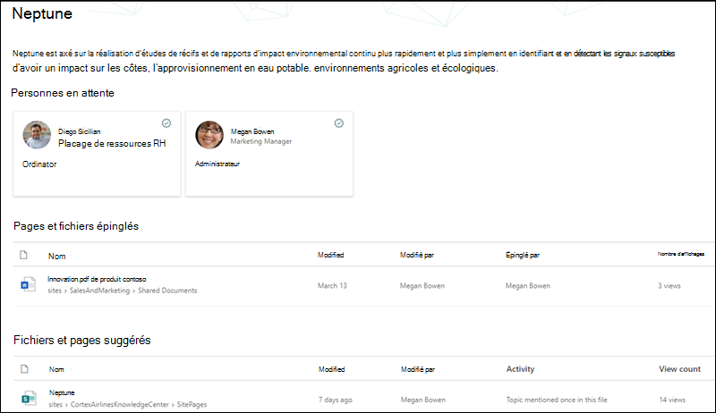
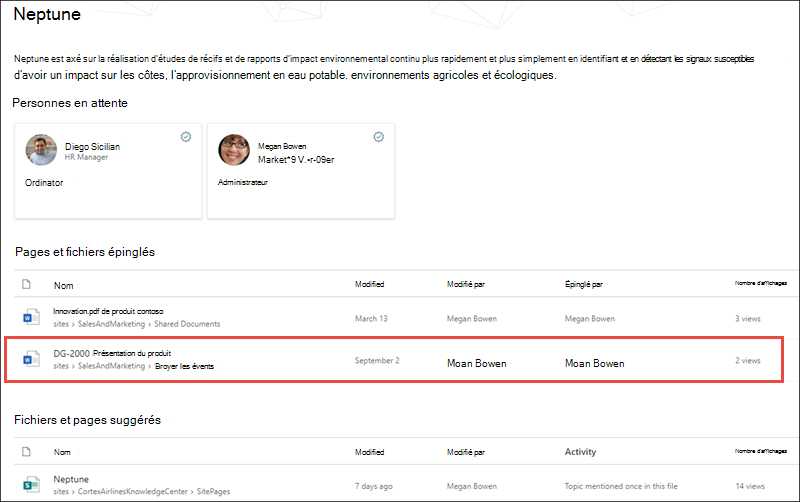

# Le trimming de sécurité dans Sujets Microsoft Viva

Les utilisateurs de rubriques Topics ne peuvent pas afficher les informations dans les rubriques que leurs autorisations Office 365 existantes les empêchent de voir. Tout ce qu'un utilisateur voit sur une page thématique (par exemple, sites SharePoint, documents, fichiers) sera une information qu'il est déjà autorisé à consulter. Rubriques Viva n’a apporté aucune modification aux autorisations existantes.

## Pourquoi deux utilisateurs peuvent avoir des vues différentes de la même rubrique

Lorsqu’une rubrique est créée via l’IA ou le traitement manuel, elle peut contenir une description de la rubrique, des autres noms, des personnes associées à la rubrique, ainsi que des sites, pages et fichiers associés à la rubrique. Lorsque ces informations sont visualées sur une page de rubrique, il est possible que deux utilisateurs qui visualisent la même rubrique ne voient pas les mêmes informations.
  
Par exemple, lorsque l’utilisateur 1 affiche la page thématique Neptune, il peut voir cet affichage de la page thématique.

   

Toutefois, lorsque l’utilisateur 2 examine la même page de rubriques, son affichage diffère de celui de l’utilisateur 1.  L’utilisateur 2 peut voir le fichier de présentation du produit *DG-2000* dans la section Des fichiers et **des pages** épinglés de la page de rubrique, qui n’apparaît pas pour l’utilisateur 1. 

   

La différence entre ce que les utilisateurs peuvent voir dans la même rubrique est que les utilisateurs peuvent ne pas avoir les autorisations Office 365 pour afficher un site ou un fichier associé.  Cette rubrique respecte les autorisations définies sur les éléments d’une rubrique et ne peut pas modifier l’accès à ces derniers. Dans notre exemple, l’utilisateur 1 n’est pas en mesure d’afficher le fichier de présentation du produit *DG-2000* dans sa page de rubriques, car l’utilisateur 1 ne Office 365 pas l’autorisation d’afficher le fichier.

Si un utilisateur ne peut pas voir suffisamment d’informations dans une rubrique pour qu’elle soit utile, la rubrique ne sera pas disponible pour l’utilisateur. Lorsque cela se produit, l’utilisateur ne voit pas la rubrique mise en surbrillvient. Un autre utilisateur ayant des autorisations pour plus d'informations dans la rubrique pour qu'elle soit utile, peut consulter la rubrique.

## Autorisations de rubrique pour les gestionnaires de connaissances et les contributeurs de rubriques

Les utilisateurs qui se voient attribuer des autorisations pour gérer des rubriques (gestionnaires de connaissances) pourront uniquement afficher les informations qu’ils sont autorisés à consulter dans les rubriques.

De même, les utilisateurs qui ont des autorisations de création et de modification de rubriques (collaborateurs de rubriques) pourront uniquement afficher les informations qu’ils sont autorisés à consulter dans les rubriques. 

## L'IA et l'information thématique conservées manuellement

Les rubriques peuvent contenir des informations générées par l’IA et des informations ajoutées ou modifiées par des collaborateurs de rubriques ou des gestionnaires de connaissances.

 - Les informations d’une rubrique ajoutée par l’IA ne sont visibles que pour les personnes ayant accès au contenu source.
 - La description de la rubrique et les informations sur les personnes qui ont été manuellement ajoutées ou modifiées par un collaborateur de rubrique ou un gestionnaire de connaissances sont visibles par tous les utilisateurs qui peuvent consulter cette rubrique.
 - Les fichiers, les pages et les sites sont visibles uniquement par les utilisateurs qui disposent d’autorisations sur le contenu source, qu’ils soient ajoutés manuellement ou ajoutés par l’IA.

Le tableau suivant décrit ce que les utilisateurs (visiteurs de rubriques, collaborateurs et gestionnaires de connaissances) peuvent voir dans une rubrique donnée en fonction de leurs autorisations.

|Élément de rubrique|Ce que voient les utilisateurs|
|:---------|:------------------|
|Nom de la rubrique|Les utilisateurs peuvent voir le nom des rubriques dans le centre de rubriques. Certaines rubriques peuvent ne pas être visibles si les utilisateurs n’ont pas d’autorisations pour le contenu source ou ont une faible pertinence pour l’utilisateur.|
|Description de la rubrique|Les descriptions générées par l’intelligence artificielle ne sont visibles que pour les utilisateurs qui ont des autorisations sur le contenu source. Les descriptions entrées ou modifiées manuellement sont visibles par tous les utilisateurs.|
|Personnes|Les contacts épinglés sont visibles par tous les utilisateurs. Les contacts suggérés ne sont visibles que pour les utilisateurs qui ont des autorisations sur le contenu source.|
|Fichiers|Les fichiers ne sont visibles que pour les utilisateurs qui ont des autorisations sur le contenu source.|
|Pages|Les pages ne sont visibles que pour les utilisateurs qui ont des autorisations sur le contenu source.|
|Sites|Les sites ne sont visibles que pour les utilisateurs qui ont des autorisations sur le contenu source.|

## Voir aussi

